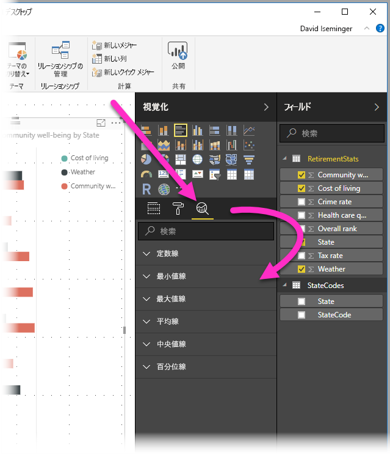
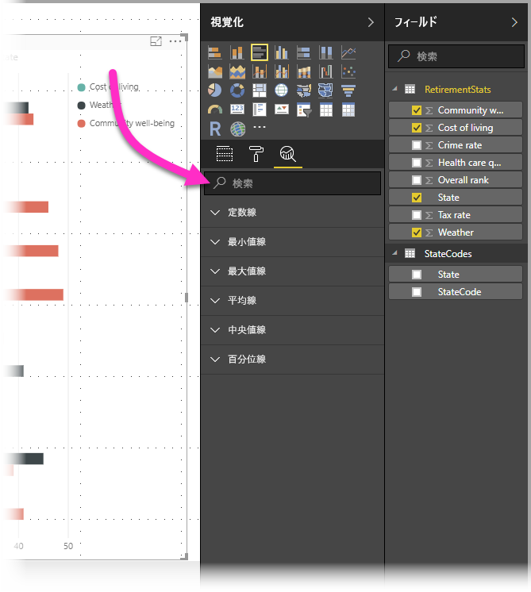
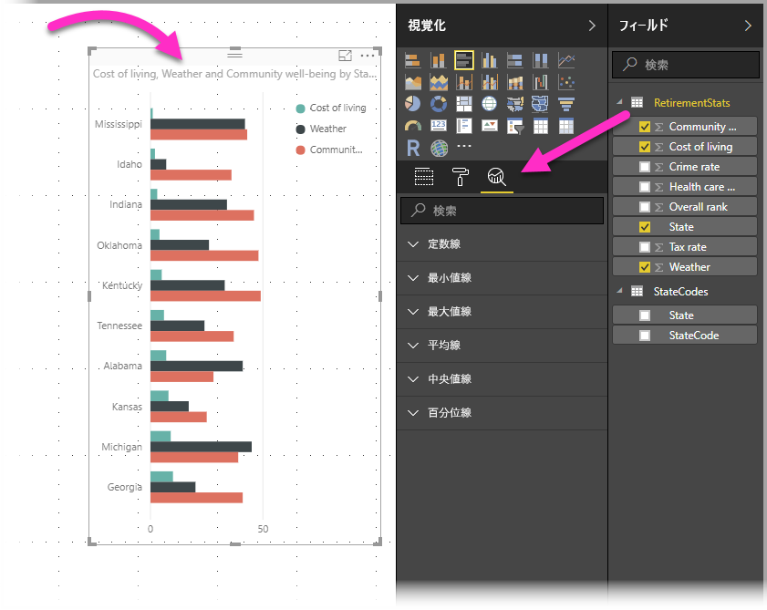
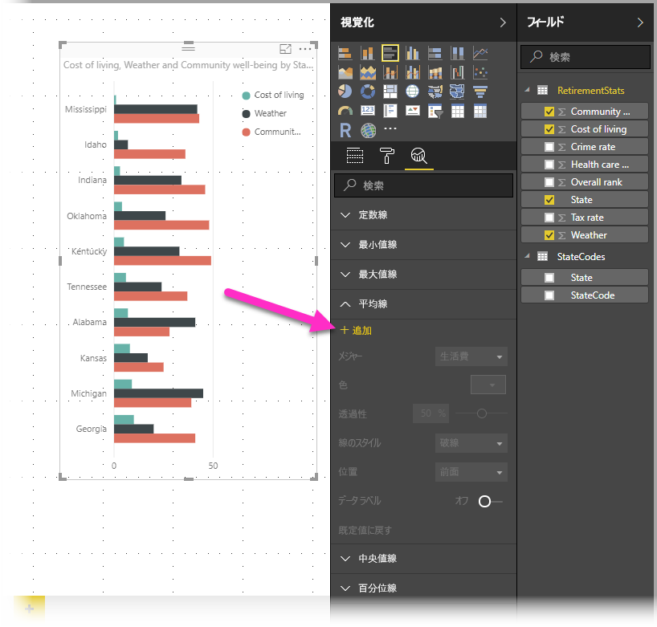
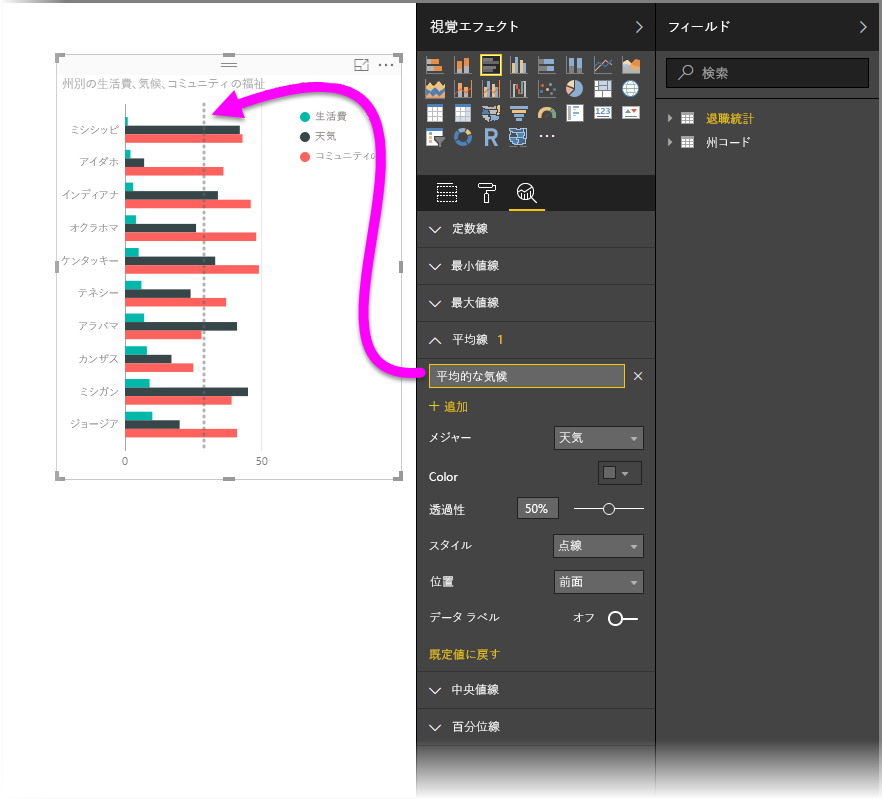
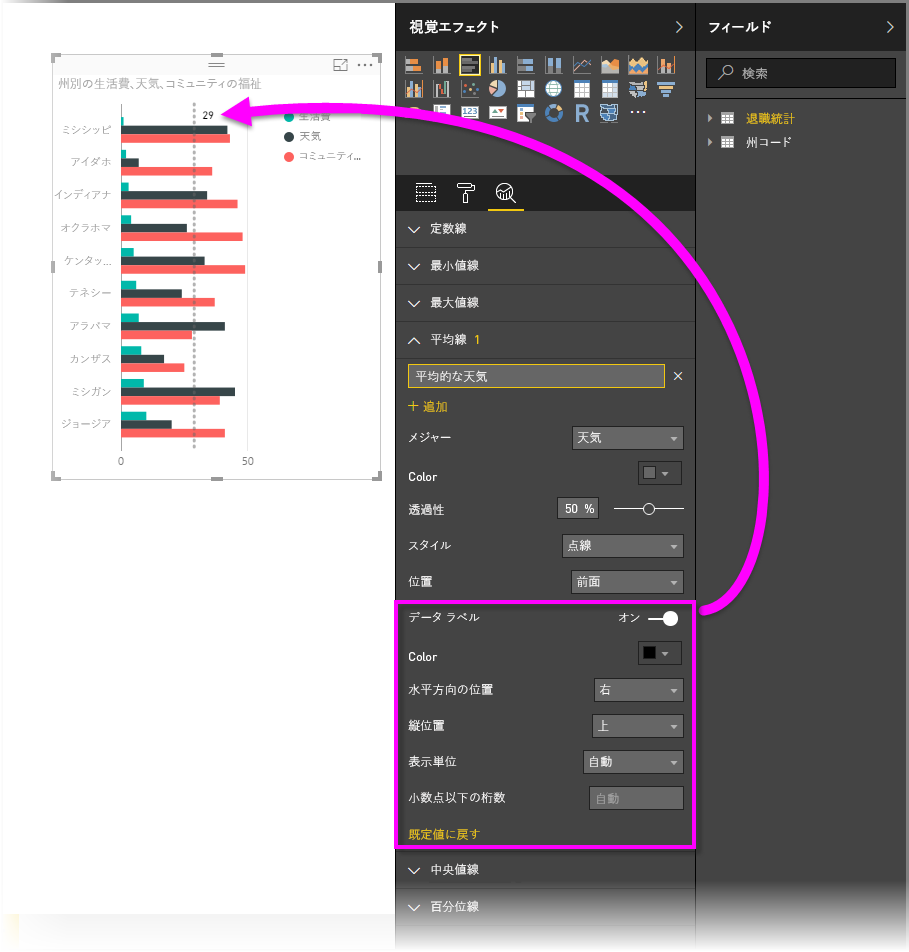
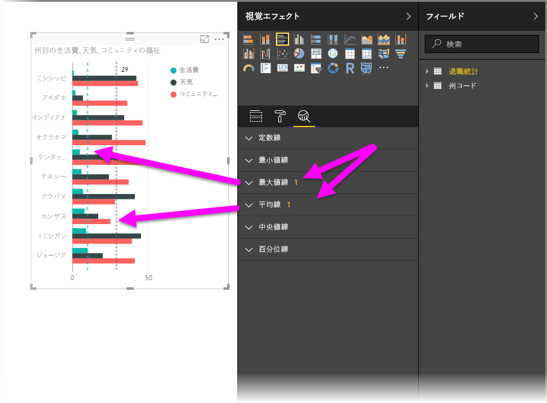
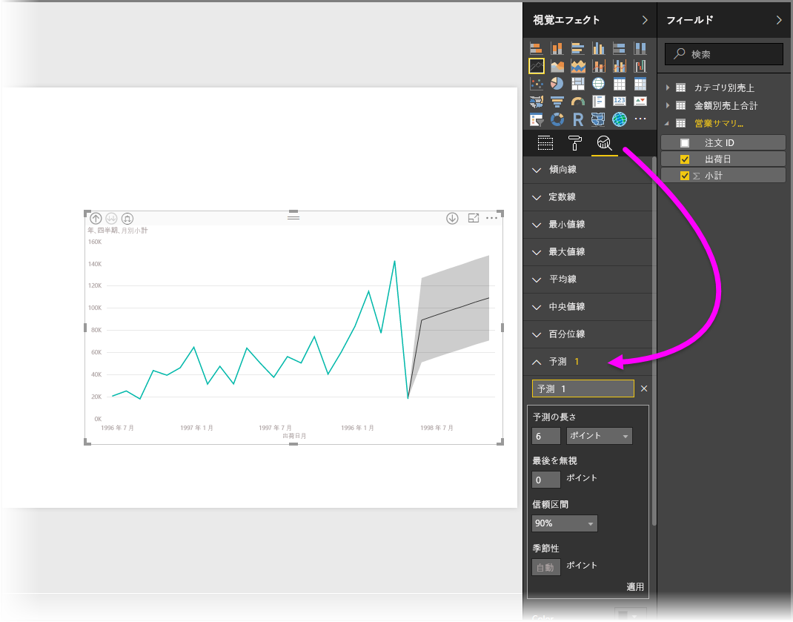

# Power BI Desktop の [分析] ウィンドウを使用する
**Power BI Desktop** の **[分析]** ウィンドウによって、動的な*参照線*をビジュアルに追加して、重要な傾向や情報に注目させることができます。 **[分析]** ウィンドウは Power BI Desktop の **[視覚化]** 領域にあります。

> [!NOTE]
> **[分析]** ウィンドウは、Power BI Desktop キャンバスでビジュアルを選択した場合にのみ表示されます。

## [分析] ウィンドウ内で検索する
**Power BI Desktop** の 2018 年 2 月リリースより (バージョン 2.55.5010.201 以降)、**[視覚化]** ウィンドウの下位セクションである **[分析]** ウィンドウ内で検索できます。 下の画像のように、**[分析]** ウィンドウが選択されると、検索ボックスが表示されます。

## [分析] ウィンドウを使用する
**[分析]** ウィンドウでは、次の種類の動的参照線を作成できます (ビジュアルの種類によっては使用できないものがあります)。

* X 軸の定数線
* Y 軸の定数線
* 最小値線
* 最大値線
* 平均線
* 中央値線
* 百分位線

次のセクションでは、**[分析]** ウィンドウと動的参照線を視覚化で使用する方法を説明します。

ビジュアルで使用可能な動的参照線を表示するには、次のようにします。

1. ビジュアルを選択または作成した後、**[視覚化]** セクションの **[分析]** アイコンを選択します。
   
   
2. 作成する線の種類の下矢印を選択して、オプションを展開します。 この例では、**[平均線]** を選択します。
   
   
3. 新しい線を作成するには、**[+ 追加]** を選択します。 テキスト ボックスをダブルクリックして名前を入力し、線の名前を指定できます。
   
   *色* 、 *透明度* 、 *スタイル* 、 *位置*  (ビジュアルのデータ要素を基準にして)、ラベルを表示するかどうかなど、線についてのあらゆる種類のオプションがあります。 重要なのは、**[メジャー]** ドロップダウンを選択することで線の基になるビジュアルの**メジャー**を選択できることです。このドロップダウンにはビジュアルのデータ要素が自動的に設定されます。 この例では、メジャーとして *Weather* を選択し、*Average Weather* というラベルを付けて、他のいくつかのオプションを次のようにカスタマイズします。
   
   
4. データ ラベルを表示する場合は、**[データ ラベル]** スライダーをオンにします。 このスライダーをオンにすると、次の図のようにデータ ラベルの他のオプションが表示されます。
   
   
5. **[分析]** ウィンドウの **[平均線]** 項目の横に数字が表示されます。 この数字は、ビジュアルで現在有効になっている動的な線の数とその種類を示します。 *Cost of Living* の **[最大値線]** を追加した場合、**[分析]** ウィンドウに **[最大値線]** 動的参照線もこのビジュアルに適用されたことが示されます。
   
   

選択したビジュアルに動的参照線を適用できない場合は (この例では **[マップ]** ビジュアル)、**[分析]** ウィンドウを選択すると次のように表示されます。

**[分析]** ウィンドウで動的参照線を作成することにより、あらゆる種類の興味深い情報に焦点を当てることができます。

動的参照線を適用できるビジュアルの拡張など、機能の拡充が予定されているので、ときどき確認してみてください。

## 予測の適用
**予測**機能を使用するには、ビジュアルを選択し、**[分析]** ウィンドウの **[予測]** セクションを展開します。 *[予測の長さ]*、*[信頼区間]* など、予測を変更するための多数の入力を指定できます。 次の図は、予測が適用された基本線ビジュアルを示していますが、想像力を働かせて (および*予測*機能を試してみて) モデルにどのように適用できるかを確認してください。

## 制限事項
動的参照線を使用できるかどうかは、使用されているビジュアルの種類によって決まります。 次の一覧では、現在各動的線を使用できるビジュアルを示します。

次のビジュアルではすべての動的線を使用できます。

* 面グラフ
* 折れ線グラフ
* 散布図
* 集合縦棒グラフ
* 集合横棒グラフ

次のビジュアルでは、 **[分析]** ウィンドウの *定数線* のみを使用できます。

* 積み上げ面グラフ
* 積み上げ横棒グラフ
* 積み上げ縦棒グラフ
* 100% 積み上げ横棒グラフ
* 100% 積み上げ縦棒グラフ

次のビジュアルでは、現在は *傾向線* のみを使用できます。

* 非積み上げ折れ線グラフ
* 集合縦棒グラフ

最後に、次のような非デカルト ビジュアルには、現在は **[分析]** ウィンドウの動的線を適用できません。

* マトリックス
* 円グラフ
* ドーナツ
* テーブル

百分位線を使用できるのは、**Power BI Desktop** でインポートされたデータを使用している場合、または **Analysis Services 2016** 以降を実行しているサーバー上のモデル、**Azure Analysis Services**、または Power BI サービス上のデータセットにライブ接続している場合のみです。 

## 次の手順
Power BI Desktop を使用すると、さまざまなことを行えます。 そのような機能について詳しくは、次のリソースをご覧ください。

* [Power BI Desktop の新機能](desktop-latest-update.md)
* [Power BI Desktop をダウンロードする](desktop-get-the-desktop.md)
* [Power BI Desktop の概要](desktop-getting-started.md)
* [Power BI Desktop でのクエリの概要](desktop-query-overview.md)
* [Power BI Desktop でのデータ型](desktop-data-types.md)
* [Power BI Desktop でのデータの整形と結合](desktop-shape-and-combine-data.md)
* [Power BI Desktop での一般的なクエリ タスク](desktop-common-query-tasks.md)    

