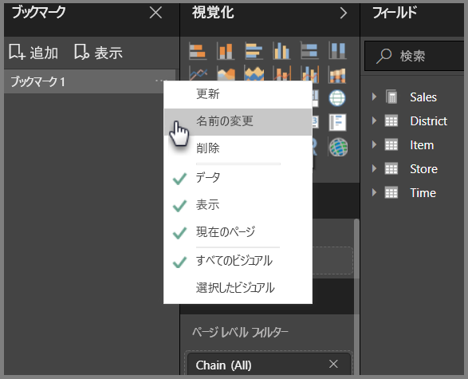
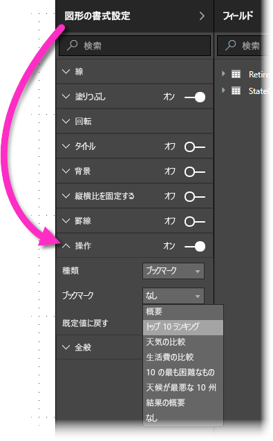

# Power BI でブックマークを使用して詳細情報を共有し、ストーリーを作成する 
Power BI の**ブックマーク**を使うと、フィルターの設定やビジュアルの状態など、レポート ページに現在構成されているビューをキャプチャし、後で保存されているブックマークを選ぶだけでその状態に戻すことができます。 

また、ブックマークのコレクションを作成して適切な順序に並べ替えた後、プレゼンテーションで各ブックマークを順番に表示することで、一連の詳細情報や、ビジュアルとレポートを使って伝えたいストーリーを強調することができます。 

ブックマークには多くの用途があります。 ブックマークを使ってレポート作成の進行状況を追跡したり (ブックマークは簡単に追加、削除、名前変更できます)、ブックマークを順番に表示する PowerPoint のようなプレゼンテーションを作成し、レポートでストーリーを伝えたりすることができます。 ブックマークに適した用途が他にもあるかもしれないので、考えてみてください。

### ブックマークのプレビューを有効にする (2018 年 3 月より前のバージョン)
Power BI Desktop の 2018 年 3 月バージョン以降では、ブックマークが一般公開されています。 

常に最新のリリースにアップグレードすることをお勧めします。 ただし、Power BI Desktop がこれより前のバージョンの場合でも、**ブックマーク**機能は **Power BI Desktop** の **2017 年 10 月**リリースから試すことができ、**Power BI サービス**でもブックマーク対応のサポートを使うことができます。 プレビュー機能を有効にするには、**[ファイル] > [オプションと設定] > [オプション] > [プレビュー機能]** の順に選び、**[ブックマーク]** のチェック ボックスをオンにします。 

![[オプション] ウィンドウでブックマークを有効にする](media/desktop-bookmarks/bookmarks_02.png)

選択を行った後、プレビュー バージョンのブックマークを有効にするには、**Power BI Desktop** を再起動する必要があります。

## ブックマークの使用
ブックマークを使うには、**[表示]** リボンを選び、**[ブックマーク ウィンドウ]** のチェック ボックスをオンにします。 

![[表示] リボンで有効にして [ブックマーク] ウィンドウを表示する。](media/desktop-bookmarks/bookmarks_03.png)

ブックマークを作成すると、次の要素がブックマークと共に保存されます。

* 現在のページ
* フィルター
* スライサー
* 並べ替え順序
* ドリルの場所
* 表示 (**[選択]** ウィンドウで指定されたオブジェクトの表示)
* 表示されているオブジェクトのフォーカスまたは **Spotlight** モード

現在、ブックマークではクロス強調表示の状態は保存されません。 

ブックマークで表示させたいようにレポート ページを構成します。 意図したとおりにレポート ページとビジュアルを配置できたら、**[ブックマーク]** ウィンドウの **[追加]** を選んでブックマークを追加します。 

**Power BI Desktop** はブックマークを作成して汎用的な名前を付けます。 ブックマークの名前の横にある省略記号を選び、表示されるメニューでアクションを選ぶことにより、ブックマークの*名前の変更*、*削除*、*更新*を簡単に行うことができます。

ブックマークを作成した後は、**[ブックマーク]** ウィンドウでブックマークをクリックするだけで表示できます。 

フィルターやスライサーなどの "*データ*" プロパティ、スポットライトとその可視性などの "*表示*" プロパティ、およびブックマークが追加されたときに表示されていたページを提供するページの変更に、各ブックマークを適用するかどうかを選択することもできます。 これらの機能は、ブックマークを使ってビジュアルの種類を変更する場合に便利です。このような場合、ユーザーがビジュアルの種類を変更したときにフィルターがリセットされないように、データ プロパティをオフにしたいことがあります。 

このような変更を行うには、前の図に示すように、ブックマークの名前の横にある省略記号を選び、*[データ]*、*[表示]*、その他のコントロールの横にあるチェックマークをオンまたはオフにします。 

## ブックマークの並べ替え
ブックマークを作成した順序が、対象ユーザーに表示したい順序と同じになっていないことがあります。 問題ありません。ブックマークの順序は簡単に変更できます。

次の図のように、**[ブックマーク]** ウィンドウでブックマークをドラッグ アンド ドロップして順序を変更するだけです。 ブックマークの間の黄色のバーは、ドラッグしたブックマークが配置される位置を示します。

次のセクションで説明するように、ブックマークの順序はブックマークの**表示**機能を使うときに重要になります。

## スライド ショーとしてのブックマーク
順番に表示したいブックマークのコレクションがあるときは、**[ブックマーク]** ウィンドウの **[表示]** を選んでスライド ショーを始めることができます。

**表示**モードのときに注意する機能がいくつかあります。

1. ブックマークの名前は、キャンバスの下部にあるブックマークのタイトル バーに表示されます。
2. ブックマークのタイトル バーにある矢印を使って、次または前のブックマークに移動できます。
3. **表示**モードを終了するには、**[ブックマーク]** ウィンドウの **[終了]** を選ぶか、ブックマークのタイトル バーにある **[X]** を選びます。 

**表示**モードのときは、**[ブックマーク]** ウィンドウの [X] をクリックしてウィンドウを閉じ、プレゼンテーション用のスペースを大きくすることができます。 また、**表示**モードでは、すべてのビジュアルは対話形式になり、他の場合の対話操作と同様に、クロス強調表示に使うことができます。 

## 表示 - [選択] ウィンドウの使用
ブックマークのリリースと合わせて、新しい **[選択]** ウィンドウも導入されました。 この **[選択]** ウィンドウでは、現在のページにあるすべてのオブジェクトの一覧が表示され、オブジェクトを選んだり、特定のオブジェクトを表示するかどうかを指定したりできます。 

![[選択] ウィンドウを有効にする](media/desktop-bookmarks/bookmarks_08.png)

**[選択]** ウィンドウを使って、オブジェクトを選ぶことができます。 また、ビジュアルの右にある目のアイコンをクリックして、オブジェクトを現在表示するかどうかを切り替えることができます。 

![[選択] ウィンドウ](media/desktop-bookmarks/bookmarks_09.png)

ブックマークを追加すると、**[選択]** ウィンドウでの設定に基づく各オブジェクトの表示状態も保存されます。 

注意すべき重要な点は、オブジェクトの表示状態に関係なく、レポート ページは引き続き**スライサー**によってフィルター処理されるということです。 そのため、スライサーの設定を変えて異なるブックマークを作成し、さまざまなブックマークを使って 1 つのレポート ページの表示を大きく変化させる (および、異なる詳細情報を強調表示する) ことができます。

## 図形と画像のブックマーク
図形や画像をブックマークにリンクすることもできます。 この機能を使うと、オブジェクトをクリックすると、そのオブジェクトに関連付けられているブックマークが表示されます。 これは、ボタンを使用する場合に特に役立ちます。詳しくは、[Power BI でのボタンの使用](desktop-buttons.md)に関する記事をご覧ください。 

ブックマークをオブジェクトに割り当てるには、オブジェクトを選び、**[図形の書式設定]** ウィンドウの **[アクション]** セクションを展開します (次の図を参照)。

**[アクション]** スライダーを **[オン]** にした後は、オブジェクトが戻るボタンか、ブックマークか、Q&A コマンドかを選ぶことができます。 ブックマークを選んだ場合は、オブジェクトのリンク先のブックマークを選ぶことができます。

オブジェクトにリンクされたブックマークではいろいろ面白いことができます。 レポート ページ上のコンテンツのビジュアル テーブルを作成したり、オブジェクトをクリックするだけで同じ情報の異なる表示 (ビジュアルの種類など) を提供したりすることができます。

編集モードのときは Ctrl キーを押しながらクリックすることで、編集モードでないときは単にオブジェクトをクリックすることで、リンクに従って移動できます。 

## ブックマーク グループ

**Power BI Desktop** の 2018 年 8 月以降では、ブックマーク グループを作成して使用できます。 ブックマーク グループは、指定したブックマークのコレクションです。これはグループとして表示して整理できます。 

ブックマーク グループを作成するには、Ctrl キーを押しながらグループ内に含めるブックマークを選択して、選択した任意のブックマークの横にある省略記号をクリックし、表示されたメニューから **[グループ]** を選択します。

**Power BI Desktop** によって、グループに "*Group 1*" という名前が自動的に付けられます。 名前をダブルクリックするだけで、必要なときにいつでも名前を変更できます。

任意のブックマーク グループでブックマーク グループの名前をクリックすると、ブックマークのグループが展開されるか、折りたたまれるだけで、ブックマーク自体が表示されることはありません。 

ブックマークの **[表示]** 機能を使用している場合、次が適用されます。

* ブックマークから **[表示]** を選択しているときに選択したブックマークがグループ内にある場合、*そのグループ内*のブックマークのみが表示中のセッションに示されます。 

* 選択したブックマークがグループではない場合、またはトップ レベル (ブックマーク グループの名前など) にある場合、すべてのグループ内のブックマークを含む、レポート全体のブックマークがすべて表示されます。 

ブックマークのグループを解除するには、グループ内の任意のブックマークを選択して、省略記号をクリックし、表示されたメニューから **[グループ解除]** を選択するだけです。 

グループから任意のブックマークで **[グループ解除]** を選択すると、グループからすべてのブックマークが除外されます (グループは削除されますが、ブックマーク自体は削除されません)。 そのため、グループから 1 つのブックマークを削除するには、そのグループから任意のメンバーの**グループ解除**を行う必要があります。ここでは、グループを削除して、(Ctrl キーを使用して各ブックマークをクリックして) 新しいグループに必要なメンバーを選択し、もう一度 **[グループ]** を選択します。 

## Spotlight を使う
ブックマークと共にリリースされたもう 1 つの機能は **Spotlight** です。 **Spotlight** を使うと、たとえば**表示**モードでブックマークを提供するときに、特定のグラフに注目させることができます。

**Spotlight** と**フォーカス** モードの違いを比較します。

1. **フォーカス**モードでは、**フォーカスモード**アイコンを選択すると、1つのビジュアルにキャンバス全体を塗りつぶすことができます。
2. **Spotlight** を使うと、1 つのビジュアルを元のサイズで強調できます。ページ上の他のすべてのビジュアルは透明に近くなります。 

上の図のビジュアルで **[フォーカス モード]** アイコンをクリックすると、ページの表示は次のようになります。

これに対し、ビジュアルの省略記号メニューで **[Spotlight]** を選ぶと、ページは次のように表示されます。

ブックマークを追加するときにどちらのモードが選択されていても、そのモード (フォーカスまたは Spotlight) がブックマークに保持されます。

## Power BI サービスでのブックマーク
ブックマークを含むレポートを **Power BI サービス**に発行すると、**Power BI サービス**でブックマークを表示および操作できます。 レポートでブックマークが使えるようになっていると、**[表示] > [選択ウィンドウ]** または **[表示] > [ブックマーク ウィンドウ]** を選んで、これらのウィンドウを表示できます。

![Power BI サービスで [ブックマーク] ウィンドウと [選択] ウィンドウを表示する](media/desktop-bookmarks/bookmarks_14.png)

**Power BI サービス**の **[ブックマーク]** ウィンドウは **Power BI Desktop** と同じように動作するので、**[表示]** を選んでスライド ショーのようにブックマークを順番に表示できます。

ブックマーク間を移動するには、黒い矢印ではなく (黒い矢印はブックマークではなくレポート ページの間を移動します)、グレーのブックマーク タイトル バーを使う必要があることに注意してください。

## 制限事項と考慮事項
このリリースの**ブックマーク**には、注意すべきいくつかの制限事項と考慮事項があります。

* ほとんどのカスタム ビジュアルは、ブックマークでうまく機能します。 ブックマークとカスタム ビジュアルで問題が発生する場合は、そのカスタム ビジュアルの作成者に連絡して、ブックマークのサポートをそのビジュアルに追加するよう依頼してください。 
* ブックマークを作成した後でレポート ページにビジュアルを追加した場合、ビジュアルは既定の状態で表示されます。 ブックマークを作成した後でページにスライサーを追加した場合も、スライサーは既定の状態で動作します。
* ブックマークを作成した後でビジュアルを移動すると、ブックマークに反映されます。 

## 次の手順
ブックマークと似た機能またはブックマークと相互作用する機能の詳細については、次の記事をご覧ください。

* [Power BI Desktop でドリルスルーを使用する](desktop-drillthrough.md)
* [フォーカス モードでダッシュボード タイルまたはレポート ビジュアルを表示する](service-focus-mode.md)

