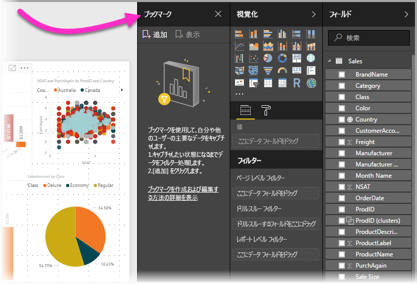
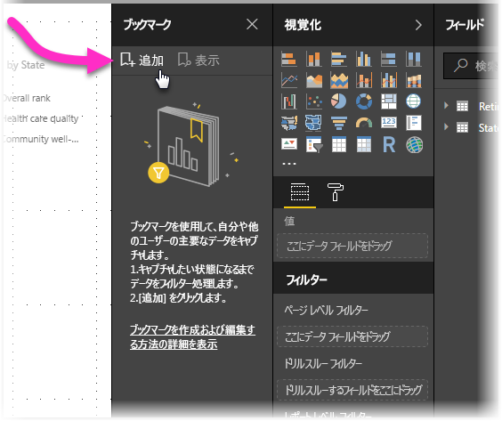
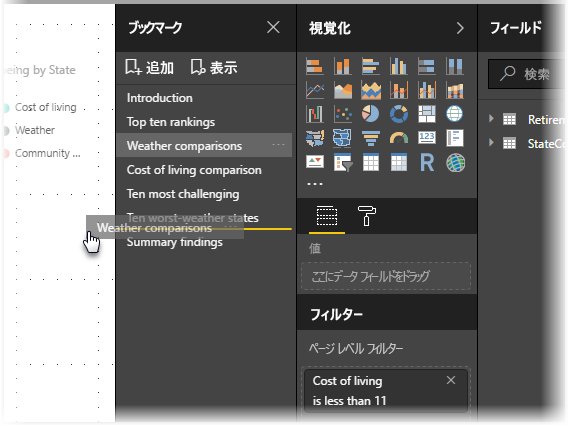
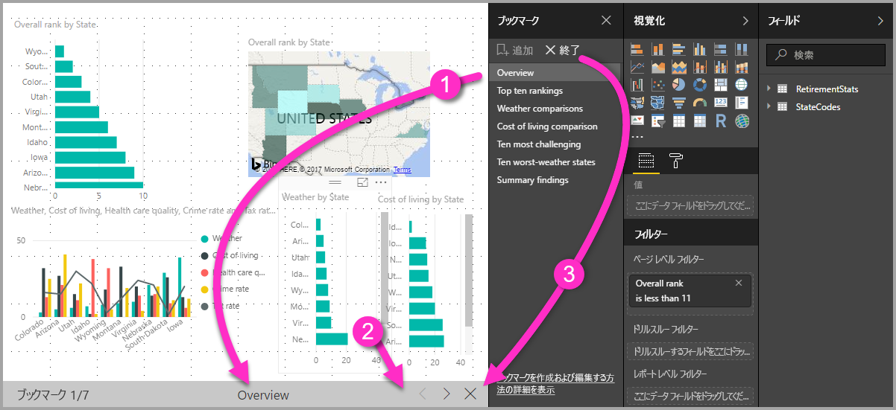
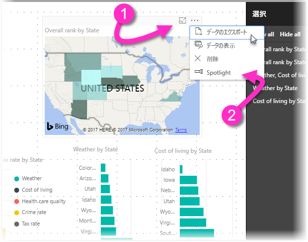
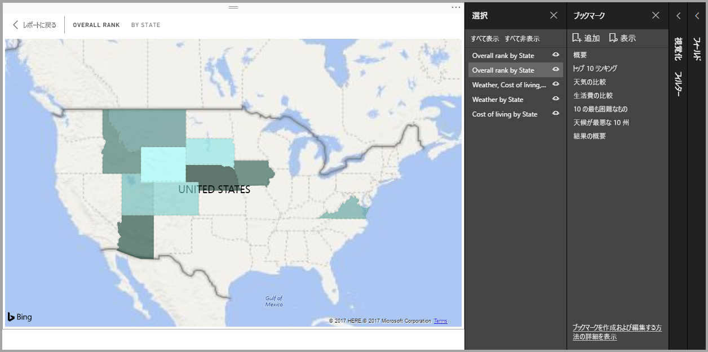

# Power BI でブックマークを使用して詳細情報を共有し、ストーリーを作成する (プレビュー)
Power BI の**ブックマーク**を使うと、フィルターの設定やビジュアルの状態など、レポート ページに現在構成されているビューをキャプチャし、後で保存されているブックマークを選ぶだけでその状態に戻すことができます。 

また、ブックマークのコレクションを作成して適切な順序に並べ替えた後、プレゼンテーションで各ブックマークを順番に表示することで、一連の詳細情報や、ビジュアルとレポートを使って伝えたいストーリーを強調することができます。 

ブックマークには多くの用途があります。 ブックマークを使ってレポート作成の進行状況を追跡したり (ブックマークは簡単に追加、削除、名前変更できます)、ブックマークを順番に表示する PowerPoint のようなプレゼンテーションを作成し、レポートでストーリーを伝えたりすることができます。 ブックマークに適した用途が他にもあるかもしれないので、考えてみてください。

### ブックマークのプレビューを有効にする
新しい**ブックマーク**機能は **Power BI Desktop** の **2017 年 10 月**リリースから試すことができ、**Power BI サービス**でもブックマーク対応のサポートを使うことができるようになります。 このプレビュー機能を有効にするには、**[ファイル] > [オプションと設定] > [オプション] > [プレビュー機能]** の順に選び、**[ブックマーク]** のチェック ボックスをオンにします。 選択を行った後、Power BI Desktop を再起動する必要があります。

![[オプション] ウィンドウでブックマークを有効にする](media/desktop-bookmarks/bookmarks_02.png)

選択を行った後、**Power BI Desktop** を再起動する必要があります。

## ブックマークの使用
ブックマークを使うには、**[表示]** リボンを選び、**[ブックマーク ウィンドウ]** のチェック ボックスをオンにします。 

![[表示] リボンで有効にして [ブックマーク] ウィンドウを表示する。](media/desktop-bookmarks/bookmarks_03.png)

ブックマークを作成すると、次の要素がブックマークと共に保存されます。

* 現在のページ
* フィルター
* スライサー
* 並べ替え順序
* ドリルの場所
* 表示 (**[選択]** ウィンドウで指定されたオブジェクトの表示)
* 表示されているオブジェクトのフォーカスまたは **Spotlight** モード

現在、ブックマークではクロス強調表示の状態は保存されません。 

ブックマークで表示させたいようにレポート ページを構成します。 意図したとおりにレポート ページとビジュアルを配置できたら、**[ブックマーク]** ウィンドウの **[追加]** を選んでブックマークを追加します。 

**Power BI Desktop** はブックマークを作成して汎用的な名前を付けます。 ブックマークの名前の横にある省略記号を選び、表示されるメニューでアクションを選ぶことにより、ブックマークの "*名前の変更*"、"*削除*"、"*更新*" を簡単に行うことができます。

ブックマークを作成した後は、**[ブックマーク]** ウィンドウでブックマークをクリックするだけで表示できます。 

## ブックマークの並べ替え
ブックマークを作成した順序が、対象ユーザーに表示したい順序と同じになっていないことがあります。 問題ありません。ブックマークの順序は簡単に変更できます。

次の図のように、**[ブックマーク]** ウィンドウでブックマークをドラッグ アンド ドロップして順序を変更するだけです。 ブックマークの間の黄色のバーは、ドラッグしたブックマークが配置される位置を示します。

次のセクションで説明するように、ブックマークの順序はブックマークの**表示**機能を使うときに重要になります。

## スライド ショーとしてのブックマーク
順番に表示したいブックマークのコレクションがあるときは、**[ブックマーク]** ウィンドウの **[表示]** を選んでスライド ショーを始めることができます。

**表示**モードのときに注意する機能がいくつかあります。

1. ブックマークの名前は、キャンバスの下部にあるブックマークのタイトル バーに表示されます。
2. ブックマークのタイトル バーにある矢印を使って、次または前のブックマークに移動できます。
3. **表示**モードを終了するには、**[ブックマーク]** ウィンドウの **[終了]** を選ぶか、ブックマークのタイトル バーにある **[X]** を選びます。 

**表示**モードのときは、**[ブックマーク]** ウィンドウの [X] をクリックしてウィンドウを閉じ、プレゼンテーション用のスペースを大きくすることができます。 また、**表示**モードでは、すべてのビジュアルは対話形式になり、他の場合の対話操作と同様に、クロス強調表示に使うことができます。 

## 表示 - [選択] ウィンドウの使用
ブックマークのリリースと合わせて、新しい **[選択]** ウィンドウも導入されました。 この **[選択]** ウィンドウでは、現在のページにあるすべてのオブジェクトの一覧が表示され、オブジェクトを選んだり、特定のオブジェクトを表示するかどうかを指定したりできます。 

![[選択] ウィンドウを有効にする](media/desktop-bookmarks/bookmarks_08.png)

**[選択]** ウィンドウを使って、オブジェクトを選ぶことができます。 また、ビジュアルの右にある目のアイコンをクリックして、オブジェクトを現在表示するかどうかを切り替えることができます。 

![[選択] ウィンドウ](media/desktop-bookmarks/bookmarks_09.png)

ブックマークを追加すると、**[選択]** ウィンドウでの設定に基づく各オブジェクトの表示状態も保存されます。 

注意すべき重要な点は、オブジェクトの表示状態に関係なく、レポート ページは引き続き**スライサー**によってフィルター処理されるということです。 そのため、スライサーの設定を変えて異なるブックマークを作成し、さまざまなブックマークを使って 1 つのレポート ページの表示を大きく変化させる (および、異なる詳細情報を強調表示する) ことができます。

## 図形と画像のブックマーク
図形や画像をブックマークにリンクすることもできます。 この機能を使うと、オブジェクトをクリックすると、そのオブジェクトに関連付けられているブックマークが表示されます。 

ブックマークをオブジェクトに割り当てるには、オブジェクトを選び、**[図形の書式設定]** ウィンドウの **[リンク]** を選びます (次の図を参照)。

**[リンク]** スライダーを **[オン]** にした後は、オブジェクトがリンクかブックマークかを選ぶことができます。 ブックマークを選んだ場合は、オブジェクトのリンク先のブックマークを選ぶことができます。

オブジェクトにリンクされたブックマークではいろいろ面白いことができます。 レポート ページ上のコンテンツのビジュアル テーブルを作成したり、オブジェクトをクリックするだけで同じ情報の異なる表示 (ビジュアルの種類など) を提供したりすることができます。

編集モードのときは Ctrl キーを押しながらクリックすることで、編集モードでないときは単にオブジェクトをクリックすることで、リンクに従って移動できます。 

## Spotlight を使う
ブックマークと共にリリースされたもう 1 つの機能は **Spotlight** です。 **Spotlight** を使うと、たとえば**表示**モードでブックマークを提供するときに、特定のグラフに注目させることができます。

**Spotlight** と**フォーカス** モードの違いを比較します。

1. **[フォーカス モード]****** アイコンを選ぶと、1 つのビジュアルをキャンバス全体に表示できます。
2. **Spotlight** を使うと、1 つのビジュアルを元のサイズで強調できます。ページ上の他のすべてのビジュアルは透明に近くなります。 

上の図のビジュアルで **[フォーカス モード]** アイコンをクリックすると、ページの表示は次のようになります。

これに対し、ビジュアルの省略記号メニューで **[Spotlight]** を選ぶと、ページは次のように表示されます。

ブックマークを追加するときにどちらのモードが選択されていても、そのモード (フォーカスまたは Spotlight) がブックマークに保持されます。

## Power BI サービスでのブックマーク
ブックマークを含むレポートを **Power BI サービス**に発行すると、**Power BI サービス**でブックマークを表示および操作できます。 **Power BI サービス**でブックマーク機能を使うことができるようにするには、各レポートでブックマークを作成してから発行する必要があります。

レポートでブックマークが使えるようになっていると、**[表示] > [選択ウィンドウ]** または **[表示] > [ブックマーク ウィンドウ]** を選んで、これらのウィンドウを表示できます。

![Power BI サービスで [ブックマーク] ウィンドウと [選択] ウィンドウを表示する](media/desktop-bookmarks/bookmarks_14.png)

**Power BI サービス**の **[ブックマーク]** ウィンドウは **Power BI Desktop** と同じように動作するので、**[表示]** を選んでスライド ショーのようにブックマークを順番に表示できます。

ブックマーク間を移動するには、黒い矢印ではなく (黒い矢印はブックマークではなくレポート ページの間を移動します)、グレーのブックマーク タイトル バーを使う必要があることに注意してください。

## 制限事項と考慮事項
このプレビュー リリースの**ブックマーク**には、注意すべきいくつかの制限事項と考慮事項があります。

* カスタム ビジュアルがフィルターの "*ソース*" である場合、カスタム ビジュアルはブックマークで動作しません。 カスタム ビジュアルを使ってページの要素をフィルター処理し (Chiclet スライサーなど)、ブックマークを使ってそのページに戻った場合、ページのフィルター処理はできますが、カスタム ビジュアルは更新されず、フィルター処理されたページは表示されません。 
* ブックマークを作成するとき、レポート ウィンドウのクロス強調表示の状態は "*保存されません*"。 
* ブックマークを作成した後でレポート ページにビジュアルを追加した場合、ビジュアルは既定の状態で表示されます。 ブックマークを作成した後でページにスライサーを追加した場合も、スライサーは既定の状態で動作します。
* ブックマークを作成した後でビジュアルを移動すると、ブックマークに反映されます。 
* **Power BI サービス**でブックマークを使用できるようにするには、サービスにレポートを発行する際に、レポートで少なくとも 1 つのブックマークを作成しておく*必要があります*。 これは、発行するレポートごとに必要です。
* ブックマークは現在プレビュー機能であるため、[**Report Server 向け Power BI Desktop**](report-server/quickstart-create-powerbi-report.md) ではまだ使用できません。

## 次の手順
ブックマークと似た機能またはブックマークと相互作用する機能の詳細については、次の記事をご覧ください。

* [Power BI Desktop でドリルスルーを使用する](desktop-drillthrough.md)
* [フォーカス モードでダッシュボード タイルまたはレポート ビジュアルを表示する](service-focus-mode.md)

