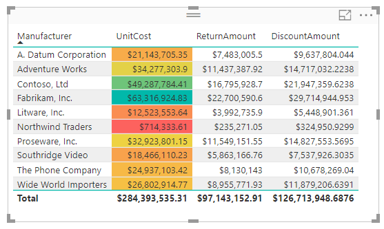

# テーブルでの条件付き書式設定 
テーブルで条件付き書式を使用するときに、グラデーションを使用するなど、セルの値または他の値やフィールドに基づいてカスタマイズされたセルの色を指定できます。 セルの値と共にデータ バーも表示できます。 

条件付き書式にアクセスするには、Power BI Desktop の **[視覚化]** ウィンドウの **[フィールド]** ウェルで、書式設定する **[値]** ウェルの値の横にある下向きの矢印を選択します (または、フィールドを右クリックします)。 条件付き書式を管理できるのは、**[フィールド]** ウェルの **[値]** 領域のフィールドだけです。

![[条件付き書式設定] メニュー](media/desktop-conditional-table-formatting/table-formatting-0-popup-menu.png)

後続のセクションで、3 つの条件付き書式オプションについて説明します。 1 つまたは複数のオプションを 1 つのテーブル列で結合できます。

> [!NOTE]
> テーブルに適用すると、条件付きで書式設定されたセルに適用されているすべてのカスタム テーブル スタイルが、条件付き書式でオーバーライドされます。

視覚化から条件付き書式を削除するには、再度フィールドを右クリックし、**[条件付き書式の削除]** を選択し、削除する書式の種類を選択します。

![[条件付き書式の削除] メニュー](media/desktop-conditional-table-formatting/table-formatting-1-remove.png)

## バックグラウンドのカラー スケール

**[条件付き書式]** を選択し、**[バックグラウンドのカラー スケール]** を選択すると、次のダイアログが表示されます。

![[バックグラウンドのカラー スケール] ダイアログ](media/desktop-conditional-table-formatting/table-formatting-1-default-dialog.png)

フィールドに **[色の基準]** を設定することで、データ モデルから色の基準とするフィールドを選択できます。 さらに、**[集計]** 値を利用し、選択したフィールドの集計の種類を指定できます。 色が付けられるフィールドは **[色の適用対象]** フィールドに指定されるので、追跡することができます。書式設定の基礎として数値を選択する限り、テキスト フィールドや日付フィールドに条件付き書式設定を適用できます。

![[色の基準] フィールド](media/desktop-conditional-table-formatting/table-formatting-1-apply-color-to.png)

所定の値範囲に個別の色値を使用するには、**[ルールに基づく色]** を選択します。 色スペクトルを使用するには、**[ルールに基づく色]** のチェックを外します。 

![[バックグラウンドのカラー スケール] ダイアログ](media/desktop-conditional-table-formatting/table-formatting-1-color-by-rules-dialog.png)

### ルールに基づく色

**[ルールに基づく色]** を選択するとき、1 つまたは複数の色範囲を入力し、そのそれぞれに決まった色を指定できます。  値範囲はそれぞれ、*[値が次の場合]* 条件で始まり、*[かつ]* 条件、色と続きます。

![[ルールに基づく色] 値範囲](media/desktop-conditional-table-formatting/table-formatting-1-color-by-rules-if-value.png)

各範囲の値入りテーブル セルには指定の色が付きます。 次の画像には 3 つのルールがあります。

![[ルールに基づく色] の例](media/desktop-conditional-table-formatting/table-formatting-1-color-by-rules.png)

サンプル テーブルは次のように表示されます。

![[ルールに基づく色] が適用されたサンプル テーブル](media/desktop-conditional-table-formatting/table-formatting-1-color-by-rules-table.png)

### 最小から最大の色分け

*[最小]* 値と *[最大]* 値とその色を構成できます。 **[左右逆方向]** ボックスをオンにした場合は、オプションの*中央*値も構成できます。

![[左右逆方向] ボタン](media/desktop-conditional-table-formatting/table-formatting-1-diverging.png)

サンプル テーブルは次のように表示されます。

## フォントのカラー スケール

**[条件付き書式]** を選択し、**[フォントのカラー スケール]** を選択すると、次のダイアログが表示されます。 このダイアログは **[バックグラウンドのカラー スケール]** ダイアログに似ていますが、セルの背景色ではなくフォントの色を変更します。

![[フォントのカラー スケール] ダイアログ](media/desktop-conditional-table-formatting/table-formatting-2-diverging.png)

サンプル テーブルは次のように表示されます。

## データ バー

**[条件付き書式]** を選択し、**[データ バー]** を選択すると、次のダイアログが表示されます。 

![[データ バー] ダイアログ](media/desktop-conditional-table-formatting/table-formatting-3-default.png)

既定では、**[バーのみを表示]** オプションは選択されていません。テーブル セルには、バーと実際の値の両方が表示されます。

**[バーのみを表示]** オプションが選択されていると、テーブル セルにはバーのみが表示されます。

