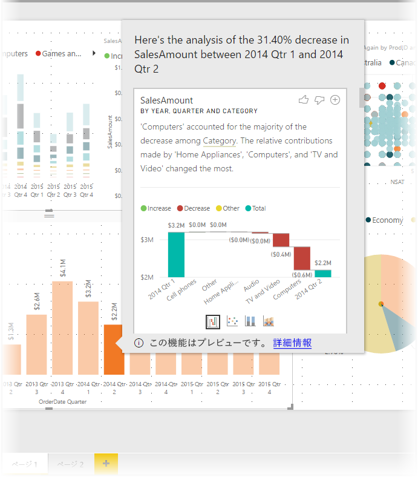
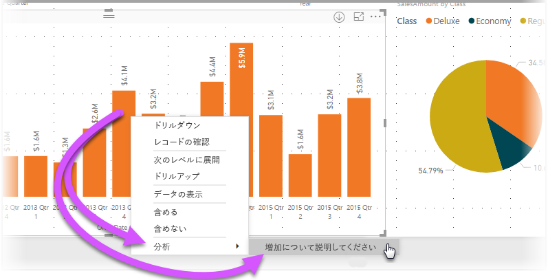

# Power BI Desktop でインサイトを使用する (プレビュー)
**Power BI Desktop** にグラフの増減を説明し、データについてすばやく洞察に満ちた自動分析を行うように指示することができます。 その場合、ユーザーはただデータ ポイントを右クリックし、**[分析]、[減少について説明してください]** (前の棒が低い場合は [増加について説明してください]) の順に選択します。これにより、使いやすいウィンドウで洞察が得られます。

インサイト機能はコンテキストに依存し、前の棒や列など、直前のデータ ポイントに基づきます。

> [!NOTE]
> この機能はプレビュー段階であり、変更される可能性があります。 2017 年 9 月バージョンの **Power BI Desktop** 以降では、インサイト機能は既定で有効になります ([プレビュー] チェック ボックスをオンにして有効にする必要はありません)。
> 
> 

## インサイトの使用
インサイトを使用するには、棒または折れ線のビジュアルでデータ ポイントを右クリックし、**[分析]、[増加について説明してください]** (または *[減少について説明してください]*。すべてのインサイトは前のデータ ポイントからの変更に基づくため) の順に選択するだけです。

その後、**Power BI Desktop** はデータに対して機械学習アルゴリズムを実行し、増減に最も影響したカテゴリを示す説明とビジュアルをウィンドウに取り込みます。 次の画像に示すように、既定では、インサイトは*ウォーターフォール* ビジュアルとして提供されます。

ウォーターフォール ビジュアルの下部にある小さいアイコンを選択すると、インサイトで散布グラフ、積み上げ縦棒グラフ、またはリボン グラフのいずれかを表示できます。

ページの上部にある*上向き親指*と*下向き親指*のアイコンを使用して、ビジュアルと機能に関するフィードバックを送ることができます。

さらに重要なのがビジュアルの上部にある **+** ボタンです。これを使用すれば、ビジュアルを手動で作成した場合と同じように、レポートに選択したビジュアルを追加できます。 その後、レポートの他のビジュアルと同じように、追加したビジュアルの書式を設定したり、調整したりすることができます。 選択したインサイト ビジュアルを追加できるのは、**Power BI Desktop** でレポートを編集する場合のみです。

インサイトは、レポートが読み取りモードの場合、または編集モードの場合に使用でき、データの分析と、レポートに簡単に追加できるビジュアルの作成の両方で使用できます。

## 考慮事項と制限事項
インサイトは前のデータ ポイント以後の変更内容に基づくため、ビジュアルで最初のデータ ポイントを選択したときは表示されません。 

**インサイト**で現在サポートされていないシナリオには、次のようなものがあります。

* 上位 N フィルター
* 含める/除外するフィルター
* メジャー フィルター
* 非加法メジャーと集計
* 値の表示方法
* フィルター対象メジャー (インサイトの散布図で使用する新しいもの)
* X 軸のカテゴリ列 (スカラーである列で並べ替えが定義されている場合を除く)。 階層を使用する場合は、アクティブな階層内のすべての列がこの条件と一致する必要があります。
* 数値以外のメジャー

さらに、次のモデルの種類とデータ ソースは現在、インサイトではサポートされていません。

* DirectQuery
* ライブ接続
* オンプレミスの Reporting Services
* 埋め込み

## 次の手順
**Power BI Desktop** と作業の開始方法の詳細については、次の記事を確認してください。

* [Power BI Desktop の概要](desktop-getting-started.md)
* [Power BI Desktop でのクエリの概要](desktop-query-overview.md)
* [Power BI Desktop のデータ ソース](desktop-data-sources.md)
* [Power BI Desktop におけるデータへの接続](desktop-connect-to-data.md)
* [Power BI Desktop でのデータの整形と結合](desktop-shape-and-combine-data.md)
* [Power BI Desktop での一般的なクエリ タスク](desktop-common-query-tasks.md)   

