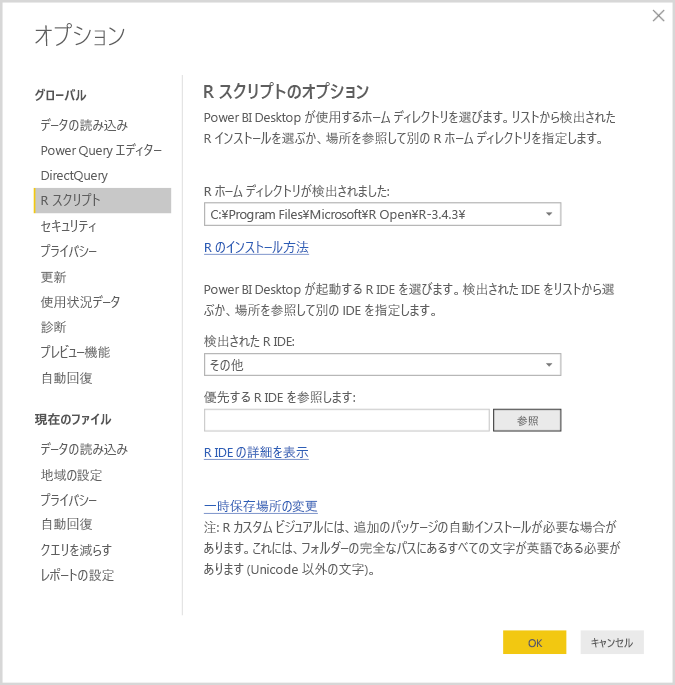
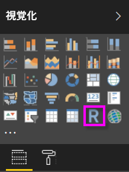
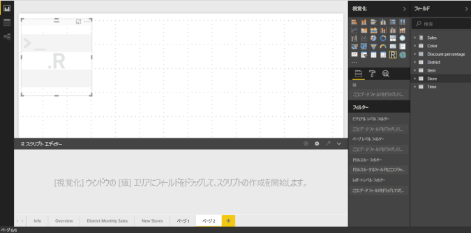
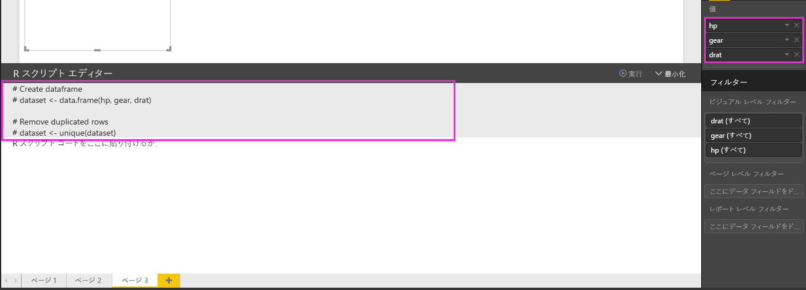
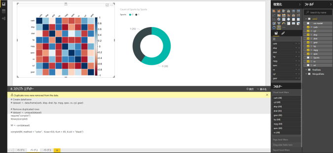
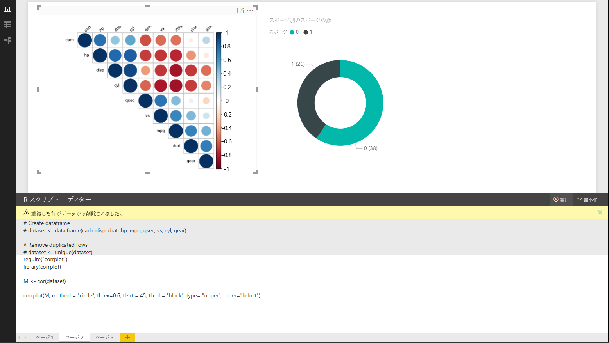
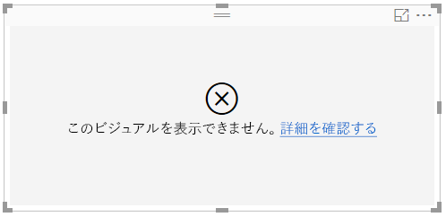

# R を使用した Power BI ビジュアルの作成
**Power BI Desktop** では、**R** を使用してデータを視覚化できます。

## R をインストールする
**Power BI Desktop** は、**R** エンジンを含んでいません。また、展開やインストールも行いません。 **Power BI Desktop** で R スクリプトを実行するには、ローカル コンピューターに **R** を別個にインストールする必要があります。 **R** はさまざまな場所から無料でダウンロードし、インストールできます。たとえば、[Revolution Open ダウンロード ページ](https://mran.revolutionanalytics.com/download/)や [CRAN Repository](https://cran.r-project.org/bin/windows/base/) があります。 **Power BI Desktop** での R スクリプトの現在のリリースでは、インストール パスで Unicode 文字と空白 (空の文字) がサポートされています。

## R ビジュアルを有効にする
R ビジュアルを有効にするには、**[ファイル]、[オプションと設定]、[オプション]** の順に選択します。次に、表示される **[オプション]** ページで、以下の画像に示すように、**[オプション]** ウィンドウの **[R スクリプト]** セクションでローカルの R インストールが指定されていることを確認します。 以下のイメージでは、R のパス ローカル インストールは **C:\Program Files\R\R-3.2.0** で、そのパスは、テキスト ボックスに明示的に指定されています。 表示されたパスが、**Power BI Desktop** で使用する正しいローカル R インストール先であることを確認します。
   
   

R のインストールを指定すると、R ビジュアルの作成を開始する準備が整います。

## Power BI Desktop で R ビジュアルを作成する
1. 次の図に示すように、**[視覚化]** ウィンドウの **[R Visual]** (R ビジュアル) アイコンを選択し、R ビジュアルを追加します。
   
   
2. レポートに R ビジュアルを追加すると、**Power BI Desktop** は以下を実行します。
   
   - プレース ホルダーの R ビジュアル イメージが、レポート キャンバスに表示されます。
   
   - **[R スクリプト エディター]** が中央ペインの下部に表示されます。
   
   
3. 次に、他の **Power BI Desktop** ビジュアルと同様に、R スクリプトで使用するフィールドを **[フィールド]** の **[値]** セクションに追加します。 R スクリプトで使用できるのは、**[フィールド]** に追加されたフィールドだけです。**Power BI Desktop の R スクリプト エディター**で R スクリプトを処理しているときも、新しいフィールドを追加したり、**[フィールド]** から不要なフィールドを削除したりできます。 **Power BI Desktop** は、追加または削除したフィールドを自動的に検出します。
   
   > [!NOTE]
   > R ビジュアルの既定の集計タイプは、*[集計しない]* です。
   > 
   > 
   
1. これで、選択したデータを使用して、プロットを作成できます。 フィールドを選択すると、 **R スクリプト エディター** は、エディター ペインの上部にあるグレー表示のセクションの選択内容に基づいてサポート R スクリプトのバインド コードを生成します。 追加のフィールドを選択または削除すると、R スクリプト エディターのサポート コードが自動的に生成されるか、必要に応じて削除されます。
   
   次のイメージに示される例では、3 つのフィールドが選択されました: HP、gear、および drat。 これらの選択の結果として、R スクリプト エディターは、次のバインド コードを生成します:
   
   * **データセット** と呼ばれるデータ フレームが作成されます
     * そのデータ フレームは、ユーザーが選択したさまざまなフィールドで構成されます
   * 既定の集計は、*[集計しない]* です
   * テーブル ビジュアルと同様、フィールドはグループ化され、重複する行は一度だけ表示されます。
   
   
   
   > [!TIP]
   > 自動グループ化を行いたくない場合や、重複を含めたすべての行を表示させたい場合があります。 その場合は、インデックス フィールドを追加し、すべての行が一意と見なされるようにしてグループ化を防止します。
   > 
   > 
   
   生成されたデータフレームは **データセット**と呼ばれ、選択された列は個々の名前でアクセスすることができます。 たとえば、R スクリプトに *dataset$gear* と書き込めば、gear フィールドにアクセスできます。 スペースや特殊文字を使うフィールドでは、単一引用符を使用します。
2. 選択したフィールドによって自動的に生成されたデータ フレームを使って、R の既定デバイスにプロットすることになる R スクリプトを書き込む準備ができました。 スクリプトが完了したら、 **R スクリプト エデイタ** のタイル バーから **[実行]** を選択します (**[実行]** はタイル バーの右側にあります)。
   
    **[実行]** を選択すると、**Power BI Desktop** は、プロットを識別し、キャンバス上にそれを示します。
   プロセスはローカルの R インストールで実行されるため、必要なパッケージがインストールされていることを確認してください。
   
   **Power BI Desktop** は、次のイベントのいずれかが発生したときにビジュアルを再度プロットします:
   
   * **[R スクリプト エディター]** タイトル バーから **[実行]** が選択された
   * データ更新、フィルター処理、または強調表示によってデータの変更が発生した

次のイメージは、相関プロット コードの例を示し、自動車の異なるタイプの属性間の相関関係をプロットします。

視覚化されたより大きなビューを取得するために、 **[R スクリプト エディター]**を最小化することができます。 **Power BI Desktop** での他のビジュアルのように、ドーナツ ビジュアル (上記の例のイメージの右側の丸いビジュアル) のスポーツカーのみを選択して相関プロットをクロスフィルター処理できます。

R スクリプトを変更してビジュアルをカスタマイズしたり、パラメーターをプロット コマンドに追加して R の機能を活用したりできます。

元のプロット コマンドは次のとおりです:

    corrplot(M, method = "color",  tl.cex=0.6, tl.srt = 45, tl.col = "black")

R スクリプトでいくつかの変更があり、コマンドは次のようになりました:

    corrplot(M, method = "circle", tl.cex=0.6, tl.srt = 45, tl.col = "black", type= "upper", order="hclust")

その結果、R ビジュアルは円をプロットし、上半分のみ考慮に入れてクラスター相関属性のマトリックスの順序を変更します。次のイメージのとおりです。

R スクリプトを実行してエラーが発生した場合、R ビジュアルはプロットされず、キャンバス上にエラー メッセージが表示されます。 エラーの詳細については、キャンバス上の R ビジュアル エラーから **[詳細を確認する]** を選択します。

> **R スクリプトのセキュリティ:** R ビジュアルは R スクリプトから作成されますが、R スクリプトにはセキュリティやプライバシーのリスクがあるコードが含まれる場合があります。 初めて R ビジュアルを表示または R ビジュアルと対話しようとすると、ユーザーに対してセキュリティ警告メッセージが表示されます。 作成者とソースを信頼する場合、または R スクリプトを確認して理解した場合にのみ、R ビジュアルを有効にします。
> 
> 

## 既知の制限事項
**Power BI Desktop** での R ビジュアルには、いくつかの制限があります。

* データ サイズの制限 – プロット作成で R ビジュアルが使用するデータは、150,000 行に制限されています。 150,000 を超える行が選択されている場合は、上位の 150,000 の行のみが使用され、メッセージがイメージに表示されます。
* 計算時間の制限 – R ビジュアル計算で実行時間が 5 分を超えると、エラーが発生します。
* リレーションシップ – 他の Power BI Desktop ビジュアルと同様、定義されたリレーションシップを持たない異なるテーブルからデータ フィールドが選択されている場合、エラーが発生します。
* R ビジュアルは、データ更新、フィルター処理、および強調表示の際に更新されます。 ただし、イメージ自体は対話型ではなく、クロス フィルター処理のソースになることはできません。
* R ビジュアルは他のビジュアルの強調表示に応答しますが、他の要素をクロス フィルター処理するために R ビジュアルの要素をクリックすることはできません。
* R の既定のディスプレイ デバイスにプロットされるプロットだけが、キャンバス上に正しく表示されます。 異なる R ディスプレイ デバイスを明示的に使用することは避けてください。
* このリリースでは、32 ビット版の Power BI Desktop は RRO インストールを自動的に識別しないので、**[オプションと設定]、[オプション]、[R スクリプト]** の順に選択して、R インストール ディレクトリへのパスを手動で入力する必要があります。

## 次の手順
Power BI での R については、次の追加情報を参照してください。

* [Power BI Desktop での R スクリプトの実行](desktop-r-scripts.md)
* [Power BI で外部 R IDE を使用する](desktop-r-ide.md)

