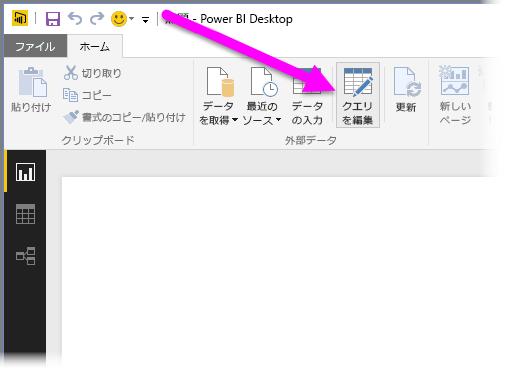
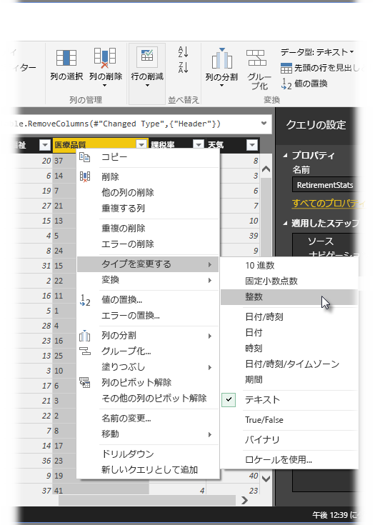
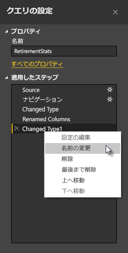
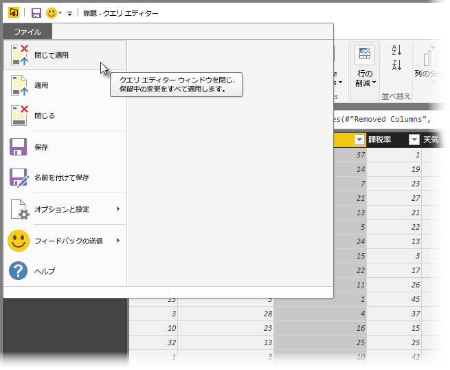
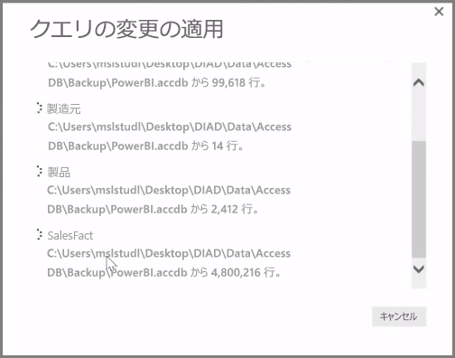

**Power BI Desktop** には、独自のモデルや視覚エフェクトに備えてデータを整形、変換するための、**クエリ エディター**という強力なツールが備わっています。 [ナビゲーター] で [編集] を選択するとクエリ エディターが起動し、データ ソースから選択したテーブルやその他のエンティティにより設定が行われます。

**クエリ エディター**は、**[ホーム]** リボンの **[クエリを編集]** ボタンを使用して、**Power BI Desktop** から直接起動できます。

整形のために準備したデータとともにクエリ エディターが読み込まれると、いくつかのセクションが表示されます。

1. リボンでは、多くのボタンがアクティブになり、クエリ内のデータを操作できます。
2. 左側のウィンドウでは、クエリが (テーブルやエンティティごとに 1 つずつ) 一覧表示され、選択、表示、および整形に使用できます。
3. 中央のウィンドウでは、選択したクエリのデータが表示され、整形に使用できます。
4. [クエリの設定] ウィンドウが表示され、クエリのプロパティと適用される手順が一覧表示されます。

中央のウィンドウで列を右クリックすると、テーブルから列を削除する、新しい名前で列を複製する、値を置換するなど、利用可能な変換方法が多数表示されます。 またこのメニューから、一般的な区切り記号でテキストの列を複数に分割することもできます。

**クエリ エディター** リボンには、列のデータ型を変更する、科学的表記法を追加する、日付から曜日などの要素を抽出するなどのツールがさらに含まれています。

変換を適用すると、**クエリ エディター**の右側にある **[クエリの設定]** ウィンドウの **[適用したステップ]** 一覧に、各ステップが表示されます。 このリストを使用して、特定の変更を元に戻す、確認する、さらにステップの名前を変更することもできます。 変換を保存するには、**[ホーム]** タブの **[閉じて適用]** を選択します。

**[閉じて適用]** を選択すると、クエリの変更がクエリ エディターに適用され、さらに Power BI Desktop にも適用されます。

高度な変換など、**クエリ エディター**でデータを変換するときに実行できるさまざまな機能があります。 次のセクションでは、これらの高度な変換についていくつか説明します。これらの高度な変換を知れば、**クエリ エディター**でのデータ変換方法の可能性が無限であることを感じられるでしょう。

