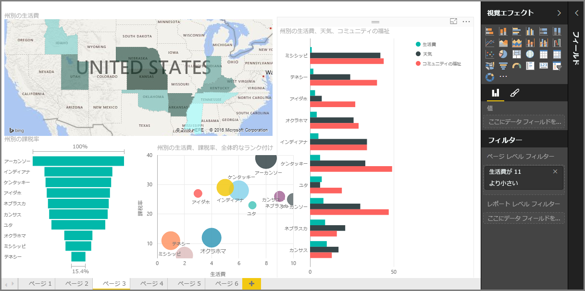

Power BI の**ガイド付き学習**コースの「**ビジュアル化**」セクションへようこそ。 Power BI が提供する数多くの視覚エフェクトに関する、楽しくて興味をそそる有意義なツアーに向けて準備します。 それだけではありません。視覚エフェクトは常に増え続けています。

もちろん、ビジュアルはすべてのビジネス インテリジェンス業務の最終結果です。 データを取得し、説得力と洞察のある方法でデータを提供し、際立った点を*表示*します。また、Power BI はさまざまな説得力のあるビジュアルを備えており、ほぼ無制限にカスタマイズできます。これは重要なセクションです。

このセクションに多くのトピックがあるように見えるかもしれませんが、心配は無用です。各トピックは簡潔で、お察しのとおりビジュアルに溢れ、簡単に学習できます。 このセクションを楽しみながら進み、これらのビジュアルを使ってどのように自分のデータを表示できるか想像することができます。

視覚エフェクトの柱である、なじみ深いシンプル ビジュアルから始め、その中身について学習します。 次に、より高度なもの、または一般的ではないもの進み、レポート作成ツールボックスに入力していきます。

ここで学べることは多くあるので、楽しんでください。

## Power BI でのビジュアルの概要
データの視覚化は Power BI のコア部分であり、このコースで以前定義したように、Power BI の基本的な構成要素です。ビジュアルの作成は、洞察を検索して共有する最も簡単な方法です。

Power BI は既定で、さまざまな視覚エフェクトが利用可能です。単純な縦棒グラフから円グラフやマップまで使用でき、滝、漏斗、ゲージなど、さらに特別なサービスを利用できます。 Power BI Desktop では、レポートを活かすことができる図形や画像など、ページ書式設定ツールを幅広く提供することもできます。

