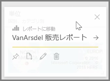
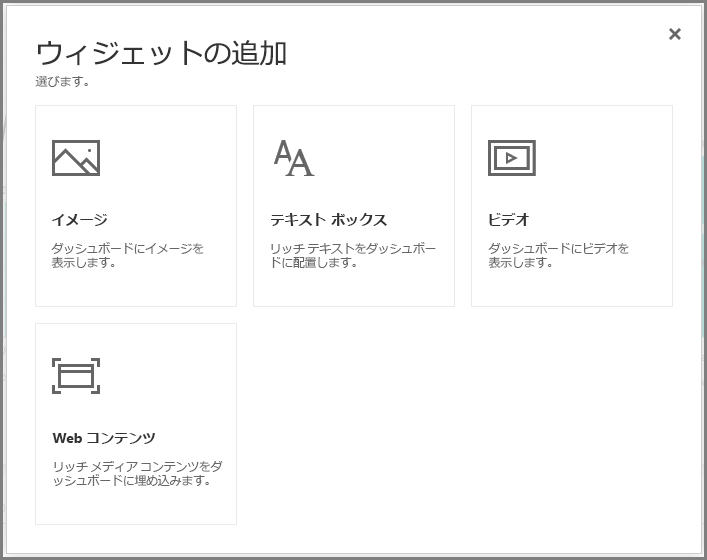

ダッシュボードを作成したら、Power BI サービスでその **タイル*を編集することで、いくつかの書式設定を変更できます。

タイルを変更するには、タイルの上にマウスを置いて省略記号 (3 つのドット数) を選択し、タイルを変更できるアイコンのコレクションを表示します。

**ペン**のアイコンを選択すると、**[タイルの詳細]** ウィンドウが開きます。 ここでタイルの **[タイトル]** や **[サブタイトル]** を変更したり、最終更新日時やカスタム リンク作成などの詳細情報を追加できます。

既定では、ダッシュボードのタイルをクリックすると、元のレポートが表示されます。 この動作を変更するには、**[タイルの詳細]** ウィンドウで **[カスタム リンクの設定]** フィールドを使用します。 この機能の一般的な用途の 1 つは、ユーザーがロゴのイメージをクリックすると組織のホーム ページに移動することです。

## ウィジェットをダッシュボードに追加する
ダッシュボードにウィジェットを追加することもできます。 **ウィジェット**は特殊なダッシュボードのタイルで、視覚エフェクトではなく、イメージ、オンライン ビデオ、テキスト ボックス、豊富な Web コンテンツなどの他の項目が含まれています。

ダッシュボードの右上隅の [ウィジェットの追加] リンクを選択すると、 **[ウィジェットの追加]** ダイアログが表示されます。

たとえば、テキスト ボックスを追加すると、 右側に **[タイルの詳細]** ウィンドウが表示されます。このウィンドウでは、ほかのタイルの詳細を編集するときに使用できるのと同様の詳細情報を編集できます。 ただし、ウィジェットには、テキスト ボックス用のリッチ テキスト エディターなど、ウィジェットのコンテンツを定義または変更するためのセクションもあります。

ウィジェットとタイルの詳細を編集する機能により、ダッシュボードをカスタマイズし、目的に合わせて自由に外観を変更できます。

