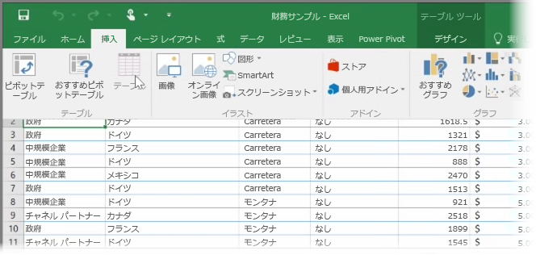

このトピックでは、簡単な**テーブル**を含む Excel ブック ファイルをローカル ドライブから Power BI にインポートする方法を最初に説明します。 次に、レポートを作成して、Power BI でそのテーブルのデータ探索を始める方法を説明します。

## データがテーブル形式のフォーマットになっていることをご確認ください。
Power BI でブックからデータをインポートするには、そのデータが**テーブルとして書式設定**されている必要があります。 これは簡単にできます。 Excel で、特定の範囲のセルをハイライト表示し、Excel リボンの **[挿入]** タブで **[テーブル]** をクリックします。

各列には適切な名前が付いていることを確認します。 こうすると、Power BI でレポートを作成する際に、必要なデータを見つけやすくなります。

## ローカル ドライブからインポート
Power BI では、保存場所に関わらず、ファイルを簡単にインポートできます。 Power BI では、**[データの取得]** > **[ファイル]** > **[ローカル ファイル]** の順に選んで、対象の Excel ファイルを選びます。

Power BI にインポート後、レポートの作成を開始できます。

もちろん、ファイルはローカル ドライブ上にある必要はありません。 ファイルが OneDrive または SharePoint チーム サイトに保存されている場合は、さらに便利です。 詳細については、以降のトピックをご覧ください。

## レポート作成の開始
ブックのデータをインポートすると、Power BI でデータセットが作成されます。 **[データセット]** の下に表示されます。 これでレポートとダッシュボードを作成して、データの探索を開始することができます。 データセットの横にある **[メニューを開く]** アイコンをクリックして、**[Explore]** をクリックします。 新しい空のレポート キャンバスが表示されます。 右側の **[フィールド]** の下にテーブルと列が表示されます。 キャンバスで新しい視覚化を作成するフィールドを選びます。

視覚エフェクトの種類は変更可能です。**[Filters]** や **[Visualizations]** のその他のプロパティを適用することもできます。

