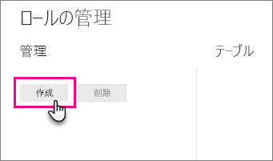

## Power BI Desktop 内でロールとルールを定義する
Power BI Desktop 内でロールとルールを定義できます。 Power BI に発行するとき、ロールの定義も発行されます。

動的セキュリティを最大限に利用する場合、プレビュー機能で DirectQuery の双方向のクロス フィルタリングを有効にする必要があります。 これにより、クロス フィルタリングが有効になり、セキュリティ フィルターが双方向で適用されます。

セキュリティ ロールは次のように定義できます。

1. Power BI Desktop レポートにデータをインポートするか、DirectQuery 接続を構成します。
   
   > [!NOTE]
   > Analysis Services ライブ接続の Power BI Desktop 内ではロールを定義できません。 Analysis Services モデル内で定義する必要があります。
   > 
   > 
2. **[モデリング]** タブを選択します。
3. **[ロールの管理]** を選択します。
   
   
4. **[作成]** を選択します。
   
   
5. ロールの名前を指定します。 
6. DAX ルールを適用するテーブルを選択します。
7. DAX 式を入力します。 この式は true か false を返すはずです。 たとえば、[Entity ID] = “Value” のようになります。
   
   > [!NOTE]
   > この式の中では *username()* を使用できます。 Power BI Desktop 内では *username()* の形式は *DOMAIN\username* になることにご注意ください。 Power BI サービス内では、ユーザーの UPN の形式になります。 また、必ずユーザー プリンシパル名の形式でユーザーを返す *userprincipalname()* を使用することもできます。
   > 
   > 
   
   
8. DAX 式を作成した後、式ボックスの上にあるチェックを選択し、式を評価できます。
   
   
9. **[保存]**を選択します。

Power BI Desktop 内のロールにユーザーを割り当てることはできません。 割り当ては Power BI サービス内で行われます。 *username()* または *userprincipalname()* DAX 関数を使用し、適切な関係を構成することで、Power BI Desktop 内で動的セキュリティを有効にできます。

