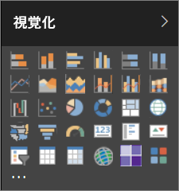
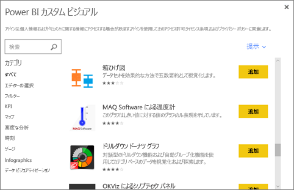
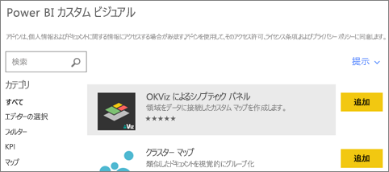
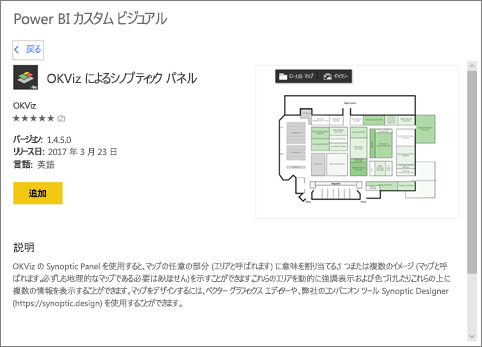
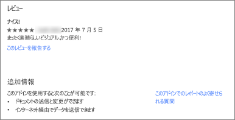
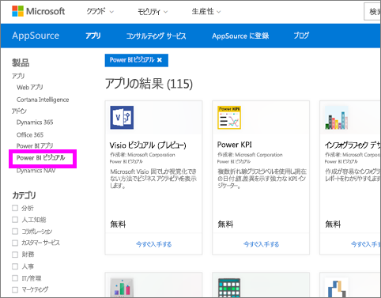
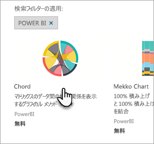

# Power BI でのカスタム ビジュアル
Power BI レポートを作成または編集するときには、さまざまな種類のビジュアルを使用できます。 このようなビジュアルは **[視覚化]** ウィンドウに表示されます。 Power BI Desktop をダウンロードしたり、Power BI サービス (app.powerbi.com) を開いたりすると、このビジュアルのセットが "事前にパッケージ化" されます。 

ただし、このビジュアルのセットに制限されるわけではなく、省略記号を選択すると、別のレポート ビジュアルのソース (*カスタム ビジュアル*) が表示されます。

カスタム ビジュアルは、コミュニティのメンバーと Microsoft によって作成されたもので、[AppSource](https://appsource.microsoft.com/marketplace/apps?product=power-bi-visuals) でホストされています。 このようなビジュアルはダウンロードして、Power BI レポートに追加することができます。 Microsoft によって承認されたすべてのこれらのカスタム ビジュアルは、Power BI に含まれている事前にパッケージ化された視覚エフェクトと同様に動作し、フィルター処理、強調表示、編集、共有などを行うことができます。 

AppSource とは 簡単に言えば、Microsoft のソフトウェアのアプリ、アドイン、拡張機能を検索できる場所です。 [AppSource](https://appsource.microsoft.com) は、Office 365、Azure、Dynamics 365、Cortana、Power BI などの製品の何百万人もの Office 365 ユーザーを、これまでより効率よく、より洞察的で美しい仕事をするのに役立つソリューションに結び付けます。

## カスタム ビジュアルの 2 つの種類

AppSource から入手できる Power BI のカスタム ビジュアルは、**承認済み**と**認定済み**の 2 つのカテゴリに分類されます。 *AppSource 承認済み*ビジュアルは、ブラウザー、レポート、ダッシュボードで実行することができます。  *Power BI 認定済み*ビジュアルは、厳格なテストに合格し、[電子メール サブスクリプション](service-report-subscribe.md)や [PowerPoint へのエクスポート](service-publish-to-powerpoint.md)などの追加のシナリオに対応しています。

認定済みカスタム ビジュアルの一覧の表示またはカスタム ビジュアルの申請については、「[Certified custom visuals](power-bi-custom-visuals-certified.md)」 (認定済みカスタム ビジュアル) をご覧ください。

独自の視覚エフェクトを作成して AppSource に追加することに興味がある Web 開発者の方は、  「[開発者ツールの概要](service-custom-visuals-getting-started-with-developer-tools.md)」を参照し、[AppSource にカスタム ビジュアルを公開する](https://appsource.microsoft.com/marketplace/apps?product=power-bi-visuals)方法を学習してください。

## Microsoft AppSource からカスタム ビジュアルをダウンロードまたはインポートする
カスタム ビジュアルをダウンロードおよびインポートする場合、Power BI と AppSource Web サイトの 2 つのオプションを使用できます。 

###    Power BI からカスタム ビジュアルをインポートする
1. [視覚化] ウィンドウの下部にある省略記号を選択します。 

    

2. ドロップダウンで **[ストアからインポート]** を選択します。

    

3. 一覧をスクロールして、インポートするビジュアルを探します。 

    

4.  各ビジュアルの詳細を確認するには、ビジュアルを強調表示して選択します。

    

5.  詳細ページでは、スクリーンショット、ビデオ、詳細な説明、その他を見ることができます。 

    

6. レビューを表示するには最下部までスクロールします。

    

7.    **[追加]** を選択して、カスタム ビジュアルをインポートします。 カスタム ビジュアルのアイコンが [視覚化] ウィンドウの下部に追加され、レポートで使用できるようになりました。

       

###    Microsoft AppSource からカスタム ビジュアルをダウンロードおよびインポートする

1. [Microsoft AppSource](https://appsource.microsoft.com) から、**[アプリ]** のタブを選択します。 

    

2. このタブから[アプリの結果ページ](https://appsource.microsoft.com/en-us/marketplace/apps)に移動し、*[Power BI apps]* を含めた各カテゴリの上位アプリを確認できます。 今はカスタム ビジュアルを検索しているので、左側のナビゲーション リストから **[Power BI visuals]** を選択して結果を絞り込みます。

    

3. AppSource に、各カスタム ビジュアルのタイルが表示されます。  各タイルにはカスタム ビジュアルのスナップショットが含まれ、簡単な説明と、ダウンロードのリンクがあります。 詳細を表示するには、タイルを選択します。 

    

4. 詳細ページでは、スクリーンショット、ビデオ、詳細な説明、その他を見ることができます。 **[今すぐ入手する]** を選択し、使用条件に同意して、カスタム ビジュアルをダウンロードします。 

    

5. カスタム ビジュアルをダウンロードするリンクを選択します。

    

    ダウンロードのページには、Power BI Desktop と Power BI サービスにカスタム ビジュアルをインポートする方法についての説明もあります。

    カスタム ビジュアルが含まれ、その機能を見ることができる、サンプル レポートをダウンロードすることもできます。

    

6. .pbiviz ファイルを保存し、Power BI を開きます。    
7. カスタム ビジュアルを追加するレポートを開き、**[視覚化]** ウィンドウの下部で省略記号を選択して、**[ファイルからインポートする]** を選択します。  

      

8. カスタム ビジュアルのファイルを選択してそのカスタム ビジュアルのアイコンを **[視覚化]** ウィンドウの下部に追加します。 これで、カスタム ビジュアルがレポートで使用できるようになりました。

    
    
##    考慮事項とトラブルシューティング

- カスタム ビジュアルをインポートすると、特定のレポートに追加されます。 ビジュアルを別のレポートで使用する場合は、そのレポートにもインポートする必要があります。 カスタム ビジュアルを含むレポートを **[名前を付けて保存]** オプションで保存すると、カスタム ビジュアルのコピーが新しいレポートと共に保存されます。

- **[視覚化]** ウィンドウが表示されない場合、レポートを編集するアクセス許可がないことを意味します。  カスタム ビジュアルは編集できるレポートにのみ追加でき、共有されているレポートには追加できません。

他にわからないことがある場合は、 [Power BI コミュニティを利用してください](http://community.powerbi.com/)。

