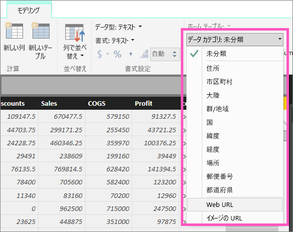

# テーブル内のハイパーリンク
このトピックでは、Power BI Desktop を使ってハイパーリンクを作成する方法を説明します。 作成した後は、Desktop または Power BI サービスを使って、レポートのテーブルとマトリックスにハイパーリンクを追加します。 

> **注**: [ダッシュボード上のタイル](service-dashboard-edit-tile.md)内および[ダッシュボード上のテキスト ボックス](service-dashboard-add-widget.md)内のハイパーリンクは、Power BI サービスを使ってその場で作成できます。 [レポートのテキスト ボックス](service-add-hyperlink-to-text-box.md)内のハイパーリンクは、Power BI サービスと Power BI Desktop を使ってその場で作成できます。
> 
> 

## Power BI Desktop を使ってテーブルまたはマトリックスにハイパーリンクを作成するには
Power BI Desktop ではテーブルやマトリックス内にハイパーリンクを作成できますが、Power BI サービスからは作成できません。 ハイパーリンクは、Power BI にブックをインポートする前に、Excel Power Pivot で作成しておくこともできます。 この後、この両方の方法について説明します。

## Power BI Desktop でテーブルまたはマトリックスのハイパーリンクを作成する
ハイパーリンクを追加する手順は、データのインポートまたはデータとの接続に DirectQuery を使用したかどうかによって異なります。 この後、この両方の場合について説明します。

### Power BI にインポートしたデータの場合
1. ハイパーリンクがデータセット内のフィールドとして存在していない場合は、Desktop を使用し、[カスタム列](desktop-common-query-tasks.md)として追加します。
2. データ ビューで、その列を選び、**[モデリング]** タブで **[データ カテゴリ]** のドロップダウンを選びます。
   
    
3. **[Web URL]** を選びます。
4. レポート ビューに切り替え、Web URL としてカテゴリ化されたフィールドを使用してテーブルまたはマトリックス作成します。 ハイパーリンクは、青色で下線付きの表示です。
   
    
5. テーブルに長い URL が表示されないようにするには、代わりにハイパーリンク アイコン  を表示することができます。 マトリックスにはアイコンを表示できないことに注意してください。
   
   * グラフを選んでアクティブにします。
   * ペイント ローラー アイコン  を選んで、[書式設定] タブを開きます。
   * **[値]** を展開し、**[URL アイコン]** を探して、**[オン]** にします。
6. (省略可能) [レポートを Desktop から Power BI サービスに発行](guided-learning/publishingandsharing.yml?tutorial-step=2)し、Power BI サービスでレポートを開きます。 ハイパーリンクは同様に機能します。

### DirectQuery を使用して接続したデータの場合
DirectQuery モードでは新しい列を作成することはできません。  ただし、データに URL が既に含まれている場合は、それらの URL をハイパーリンクに変えることができます。

1. レポート ビューで、URL が含まれるフィールドを使用してテーブルを作成します。
2. その列を選び、**[モデリング]** タブで **[データ カテゴリ]** のドロップダウンを選びます。
3. **[Web URL]** を選びます。 ハイパーリンクは、青色で下線付きの表示です。
4. (省略可能) [レポートを Desktop から Power BI サービスに発行](guided-learning/publishingandsharing.yml?tutorial-step=2)し、Power BI サービスでレポートを開きます。 ハイパーリンクは同様に機能します。

## Excel Power Pivot でテーブルまたはマトリックスのハイパーリンクを作成する
Power BI のテーブルおよびマトリックスにハイパーリンクを追加するもう 1 つの方法は、Power BI からデータセットにインポート/接続する前に、そのデータセット内でハイパーリンクを作成することです。 この例では Excel ブックを使います。

1. Excel でブックを開きます。
2. **[PowerPivot]** タブを選び、 **[管理]** を選びます。
   
   
3. PowerPivot が開いたら、**[詳細設定]** タブを選びます。
   
   
4. Power BI テーブル内でハイパーリンクに変換する URL が含まれている列に、カーソルを置きます。
   
   > **注**: URL は、**http://、https://**、**www** のいずれかで始まっている必要があります。
   > 
   > 
5. **[レポートのプロパティ]** グループで、 **[データ カテゴリ]** ドロップダウンを選び、 **[Web URL]** を選びます。 
   
   
6. Power BI サービスまたは Power BI Desktop から、このブックに接続するか、このブックをインポートします。
7. [URL] フィールドが含まれるテーブル視覚化を作成します。
   
   

## 考慮事項とトラブルシューティング
Q: カスタム URL を、テーブルまたはマトリックス内のハイパーリンクとして使用できますか。    
A: いいえ。 リンク アイコンを使用できます。 ハイパーリンク用のカスタム テキストが必要で、URL の一覧が短い場合には、代わりにテキスト ボックスを使うことができます。

## 次の手順
[Power BI レポートでの視覚化](power-bi-report-visualizations.md)

[Power BI - 基本的な概念](service-basic-concepts.md)

他にわからないことがある場合は、 [Power BI コミュニティを利用してください](http://community.powerbi.com/)。

