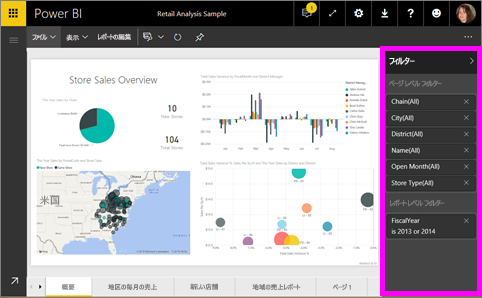
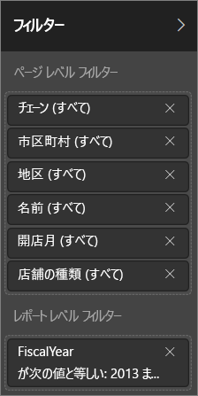
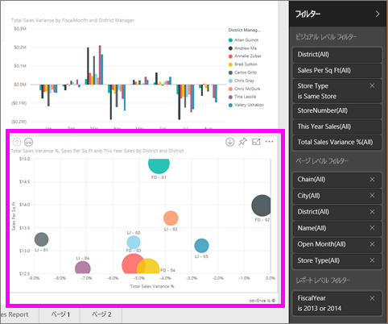
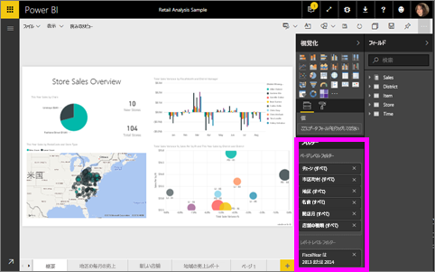

# Power BI レポートのフィルターと強調表示について
***フィルター処理***を実行すると、絞り込んだデータ以外のすべてのデータが削除されます。  ***強調表示***はフィルター処理ではありません。データが削除されることはなく、表示されるデータのサブセットが強調表示され、強調表示対象外のデータは淡色表示になります。

Power BI ではさまざまな方法でレポートをフィルター処理および強調表示できます。 すべての情報をまとめて説明すると混乱するので、次のように分けて説明します。

* フィルターと強調表示の概要 (この記事)
* [編集ビューや独自レポートでフィルターと強調表示を作成して使用する](power-bi-report-add-filter.md)方法。 レポートの編集権限がある場合、レポートでフィルターと強調表示を作成、変更、削除できます。
* [共有レポートまたはレポート読み取りビューでフィルターと強調表示を使用する](service-interact-with-a-report-in-reading-view.md)方法。 できることには限りがありますが、それでもさまざまなフィルター処理と強調表示のオプションを使用できます。  
* [編集ビューで使用できるフィルターと強調表示のコントロールの詳細なツアー](power-bi-how-to-report-filter.md)。フィルターの種類の詳細 (例: 日付と時刻、数値、テキスト) や、基本オプションと詳細オプションの違いなどです。
* フィルターと強調表示の既定の動作を理解した後は、[ページの視覚エフェクトが相互にフィルターおよび強調表示する方法を変更する方法を学習](service-reports-visual-interactions.md)してください。

> [!TIP]
> Power BI はどのようにしてデータの関連方法を認識しているのでしょうか?   Power BI は基となる[データモデル](https://support.office.com/article/Create-a-Data-Model-in-Excel-87e7a54c-87dc-488e-9410-5c75dbcb0f7b?ui=en-US&rs=en-US&ad=US)内の各種テーブルとフィールド間のリレーションシップを使用して、レポート ページ上の項目を相互に対話させます。
> 
> 

## フィルター ウィンドウを使用したレポートでのフィルターと強調表示の概要

フィルターと強調表示は、**フィルター** ウィンドウを使用して、またはレポート自体で直接選択することによって (アドホック、後述)、適用できます。 フィルター ウィンドウには、レポートで使用されているテーブルとフィールド、および適用されているフィルター (ある場合) が表示されます。 フィルターは、**ページ レベル フィルター**、**レポート レベル フィルター**、**ビジュアル レベル フィルター**に分かれます。  レポート キャンバスで視覚エフェクトを選択した場合は、ビジュアル レベル フィルターだけが表示されます。

> [!TIP]
> フィルターの横に **[All]** と表示されている場合は、フィールド全体がフィルターとして含まれることを意味します。  たとえば、次のスクリーンショットの **[Chain(All)]** は、このレポート ページにすべてのストア チェーンに関するデータが含まれることを示します。  一方、レポート レベル フィルターの **[FiscalYear is 2013 or 2014]** は、レポートに 2013 年および 2014 年の会計年度のデータのみが含まれることを示します。
> 
> 

## 読み取りビューのフィルターと編集ビューのフィルター
レポートとの対話には 2 つのモードがあります。[読み取りビュー](service-interact-with-a-report-in-reading-view.md)と[編集ビュー](service-interact-with-a-report-in-editing-view.md)です。  使用できるフィルター処理機能は、どのモードを使用しているかによって異なります。

* 編集ビューでは、レポート フィルター、ページ フィルター、ビジュアル フィルターを追加できます。 レポートを保存すると、フィルターが一緒に保存されます。 読み取りビューでレポートを表示しているユーザーは、追加したフィルターと対話できますが、変更を保存することはできません。
* 読み取りビューでは、レポートに既に存在しているページ フィルターおよびビジュアル フィルターと対話できますが、フィルターの変更を保存することはできません。

### 読み取りビューのフィルター ウィンドウ
読み取りビューでしかレポートにアクセスできない場合、フィルター ウィンドウは次のようになります。

レポートのこのページには、6 個のページ レベル フィルターと 1 個のレポート レベル フィルターがあります。

ビジュアル レベル フィルターが存在するかどうかを確認するには、ビジュアルを選択します。 次の図では、バブル チャートに 6 個のフィルターが適用されています。

読み取りビューでは、既存のフィルターを変更することによってデータを調べます。 詳細については、「[Power BI の読み取りビューでレポートと対話する](service-interact-with-a-report-in-reading-view.md)」をご覧ください。

### 編集ビューのフィルター ウィンドウ
レポートに対する所有者権限を持つユーザーが編集ビューでレポートを開くと、**フィルター**は使用可能な複数の編集ウィンドウの 1 つとして表示されます。

前の読み取りビューと同じように、レポートのこのページには 6 個のページ レベル フィルターと 1 個のレポート レベル フィルターがあります。 また、バブル チャートを選択すると、6 個のビジュアル レベル フィルターが適用されていることがわかります。

ただし、編集ビューでは、フィルターと強調表示に関してさらに多くの機能を使用できます。 最大の違いは、新しいフィルターを追加できることです。 追加およびその他の方法については、「[Power BI でのレポートへのフィルターの追加](power-bi-report-add-filter.md)」をご覧ください。

## アドホックのフィルターと強調表示
レポート キャンバスでフィールドを選択すると、ページの他の部分がフィルター処理および強調表示されます。 同じビジュアルの空いている領域を選択すると、フィルターおよび強調表示が解除されます。 この種のフィルターと強調表示はレポートと共には保存されませんが、データの影響を簡単に調べることができます。 この種のクロスフィルター処理とクロス強調表示を微調整する方法については、「[Power BI レポートでの視覚化の相互作用](service-reports-visual-interactions.md)」をご覧ください。

## 次の手順
[フィルターとの対話と強調表示 (読み取りビュー)](service-interact-with-a-report-in-reading-view.md)

[レポートへのフィルターの追加 (編集ビュー)](power-bi-report-add-filter.md)

[レポート フィルターの使用方法](power-bi-how-to-report-filter.md)

[レポートのビジュアル相互間のクロスフィルター処理とクロス強調表示を変更する方法](service-reports-visual-interactions.md)

[Power BI のレポート](service-reports.md)で詳細を確認する

他にわからないことがある場合は、 [Power BI コミュニティを利用してください](http://community.powerbi.com/)。

