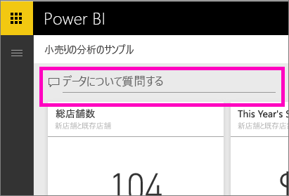
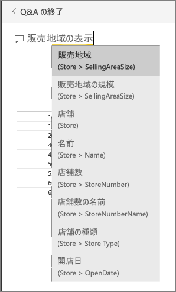
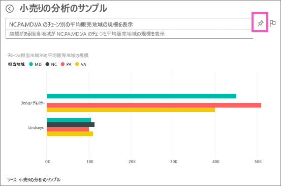
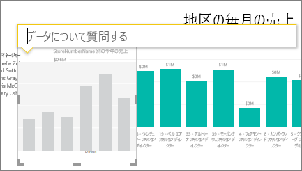
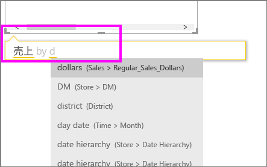
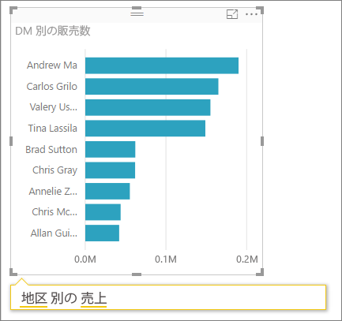
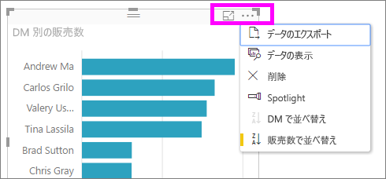

# チュートリアル: Q&A を使用して視覚エフェクトおよびレポートを作成する方法
[Q&A の概要](power-bi-q-and-a.md)に関する記事では、Power BI Q&A について紹介し、"*利用者*" (ダッシュボードとレポートの共有を受けているユーザー) と "*作成者*" (基になるレポートとデータセットを所有しているユーザー) の違いを説明しました。 このチュートリアルの前半は、主に Power BI サービスを使ってダッシュボードを利用するユーザー向けに書かれています。 後半は、Power BI サービスまたは Power BI Desktop を使ってレポートを作成するユーザーを対象にしています。 [Q&A と Power BI モバイル](mobile-apps-ios-qna.md)および [Q&A と Power BI Embedded](developer/qanda.md) については、別の記事で説明します。

Q&A は対話型で楽しく、視覚化によってさらに調べるべき点が見つかるため、たいていは 1 つの質問が多数の他の質問につながります。 Q&A を使って視覚エフェクトを作成し、それを詳しく調べて、ダッシュボードに表示する、Amanda のデモンストレーションをご覧ください。

<iframe width="560" height="315" src="https://www.youtube.com/embed/qMf7OLJfCz8?list=PL1N57mwBHtN0JFoKSR0n-tBkUJHeMP2cP" frameborder="0" allowfullscreen></iframe>

## パート 1: Power BI サービス (app.powerbi.com) のダッシュボードで Q&A を使う
ダッシュボードには 1 つ以上のデータセットからピン留めされたタイルが含まれているので、いずれかのデータセットに含まれるいずれかのデータに関して質問することができます。 ダッシュボードの作成に使われたレポートとデータセットを見るには、メニュー バーの **[関連の表示]** を選びます。

ダッシュボードの左上隅には Q&A 質問ボックスがあり、ここに自然言語を使って質問を入力します。 Q&A は、入力した用語を認識して、回答を探す場所 (データセット) を見つけ出します。 さらに、オートコンプリート、書き換え、その他のテキストや視覚による支援を使用して質問の作成を助けます。

質問を変更すると、質問に対する回答は、対話型の視覚化と更新として表示されます。

1. ダッシュボードを開き、質問ボックスにカーソルを置きます。 入力を開始する前に、Q & A で質問を作るときに役立つ情報が新しい画面に表示されます。 [基になっているデータセット](service-get-data.md)のテーブルの名前が表示され、データセットの所有者が[おすすめの質問](service-q-and-a-create-featured-questions.md)を作成している場合は完全な質問が一覧表示されることもあります。

   

   開始点として常にこれらの質問のいずれかを選び、質問を洗練し続けて、探している具体的な回答を見つけることができます。 あるいは、テーブル名を使用して、新しい質問を言葉で表すことができます。

2. データセットのオプションを選ぶか、または独自の質問を少し入力してドロップダウンから候補を選びます。

   

3. 質問を入力していくと、Q&A は回答の表示に最適な[視覚エフェクト](power-bi-visualization-types-for-reports-and-q-and-a.md)を選び、質問を変更するにつれ視覚エフェクトが動的に変化します。

   

4. 質問を入力すると、Power BI によりダッシュボードにタイルがあるデータセットを使って最善の回答が検索されます。  すべてのタイルが *datasetA*のものである場合、回答は *datasetA*から取得されます。  タイルが *datasetA* と *datasetB* のものである場合、Q&A はそれら 2 つのデータセットで最適な回答を検索します。

   > [!TIP]
   > そのため *datasetA* からのタイルが 1 つしかない場合は、それをダッシュボードから削除すると、Q&A が *datasetA* にアクセスできなくなるのでご注意ください。
   >
   >
5. 結果に満足したら、右上隅にあるピンのアイコンを選んで、[ダッシュボードに視覚エフェクトをピン留め](service-dashboard-pin-tile-from-q-and-a.md)します。 他のユーザーから共有を受けているダッシュボード、またはアプリの一部であるダッシュボードの場合は、ピン留めできません。

   

##    パート 2: Power BI サービスおよび Power BI Desktop のレポートで Q&A を使う

Q&A を使ってデータセットを探索し、レポートとダッシュボードに視覚エフェクトを追加します。 レポートは単一のデータセットに基づいており、完全に空白にすることも、ページいっぱいに視覚エフェクトを表示することもできます。 ただし、レポートが空白でも探索するデータが何もないということではありません。データセットはレポートにリンクされており、ユーザーが探索を行って視覚エフェクトを作成するのを待っているのです。  レポートの作成に使われているデータセットを確認するには、Power BI サービスの読み取りビューでレポートを開き、メニュー バーから **[関連の表示]** を選びます。

レポートで Q&A を使うには、レポートと基になっているデータセットの編集アクセス許可が必要です。 [Q&A の概要に関するトピック](power-bi-q-and-a.md)では、これを "*作成者*" のシナリオと呼んでいます。 したがって、作成者ではなく、作成者から共有を受けてレポートを "*利用*" している場合は、Q&A を使うことはできません。

1. 編集ビュー (Power BI サービス) またはレポート ビュー (Power BI Desktop) でレポートを開き、メニュー バーの **[質問する]** を選びます。

    **Desktop**    
    

    **サービス**    
    

2. Q&A 質問ボックスがレポート キャンバスに表示されます。 次の例では、別の視覚エフェクトの上に質問ボックスが表示されています。 この方法でも問題ありませんが、質問を入力する前に[レポートに空白のページを追加する](power-bi-report-add-page.md)方がよい場合があります。

    

3. 質問ボックスにカーソルを置きます。 入力を進めるにつれて、質問の作成に役立つ候補が表示されます。

   

4. 質問を入力していくと、Q&A は回答の表示に最適な[視覚エフェクト](power-bi-visualization-types-for-reports-and-q-and-a.md)を選び、質問を変更するにつれ視覚エフェクトが動的に変化します。

   

5. 好みの視覚エフェクトが表示されたら、Enter キーを押します。 視覚エフェクトをレポートと共に保存するには、**[ファイル] > [保存]** を選びます。

6. 新しい視覚エフェクトを操作します。 視覚エフェクトをどのようにして作成したかは関係ありません。どの場合でも同じ操作、書式設定、機能を利用できます。

  

  Power BI サービスで視覚エフェクトを作成した場合は、[視覚エフェクトをダッシュボードにピン留めする](service-dashboard-pin-tile-from-q-and-a.md)こともできます。

## 使用する視覚化を Q&A で指定する
Q&A では、データ自身に語らせるだけでなく、Power BI に回答の表示方法を指示することもできます。 質問の最後に "as a <visualization type>" を追加して、視覚化の種類を指定するだけです。  たとえば、「show inventory volume by plant as a map」(工場ごとの在庫量をマップとして表示する)、「show total inventory as a card」(在庫合計をカードとして表示する) などです。  自分で試してみてください。

##  考慮事項とトラブルシューティング
- ライブ接続またはゲートウェイを使ってデータセットに接続した場合は、Q&A を[そのデータセットで有効にする](service-q-and-a-direct-query.md)必要があります。

- レポートを開いていた場合、Q&A のオプションは表示されません。 Power BI サービスを使っている場合は、編集ビューでレポートを開いていることを確認します。 編集ビューを開くことができない場合は、そのレポートの編集アクセス許可がなく、その特定のレポートでは Q&A を使えないことを意味します。

## 次の手順
「[Power BI での Q&A](power-bi-q-and-a.md) 」に戻る  
[チュートリアル: 小売りの分析のサンプルで Q&A を使う](power-bi-visualization-introduction-to-q-and-a.md)   
[Q&A で質問するためのヒント](service-q-and-a-tips.md)   
[Q&A のためのブックの準備](service-prepare-data-for-q-and-a.md)  
[Q&A 用にオンプレミスのデータセットを準備する](service-q-and-a-direct-query.md)
[Q&A からダッシュボードにタイルをピン留めする](service-dashboard-pin-tile-from-q-and-a.md)
