# Esri が提供する Power BI サービスおよび Power BI Desktop の ArcGIS マップ
このチュートリアルは、ArcGIS マップを作成するユーザーの観点から書かれています。 作成者が同僚と ArcGIS マップを共有すると、その同僚はマップを表示および操作できますが、変更を保存することはできません。 ArcGIS マップの表示方法について詳しくは、「[Power BI での ArcGIS マップとの対話](power-bi-visualizations-arcgis.md)」をご覧ください。

ArcGIS マップと Power BI を組み合わせると、マッピングをマップ上のポイントの表現を越える、まったく新しいレベルに引き上げることができます。 基本マップ、場所の種類、テーマ、記号のスタイル、および参照レイヤーから選択して、すばらしい有益なマップの視覚エフェクトを作成します。 空間分析を使用してマップ上で権限のあるデータのレイヤーを組み合わせることで、より深く理解できる視覚化されたデータを伝達します。

 モバイル デバイスでは、ArcGIS マップを作成することはできませんが、表示して操作することはできます。 「[Power BI での ArcGIS マップとの対話](power-bi-visualizations-arcgis.md)」をご覧ください。

> [!TIP]
> GIS は Geographic Information Science (地理情報科学) の略です。
> 
> 

次の例では、濃い灰色のキャンバスを使用して、2016 年の平均可処分所得の人口統計レイヤーに対するヒートマップとして、地域の売上を示しています。 読み進めるとわかるように、ArcGIS マップを使用すると、強化されたマップ機能、人口統計データ、さらにより説得力のあるマップの視覚エフェクトが提供されるため、最適なストーリーを伝えることができます。

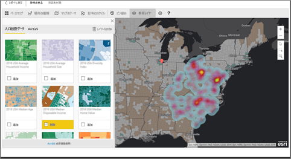

> [!TIP]
> 多くの例やユーザーの声を参照するには、[Esri のページを Power BI で](https://www.esri.com/powerbi)アクセスしてください。 その後、Esri が提供する [Power BI の ArcGIS マップの概要ページ](https://doc.arcgis.com/en/maps-for-powerbi/get-started/about-maps-for-power-bi.htm)を参照してください。

## ユーザーの同意
Power BI の ArcGIS マップは [Esri](https://www.esri.com) によって提供されます。 Power BI の ArcGIS マップのご利用の際には、Esri の使用条件およびプライバシー ポリシーが適用されます。 Power BI の ArcGIS マップ ビジュアルの使用を希望される Power BI ユーザーは、同意ダイアログを受け入れる必要があります。

**リソース**

[使用条件](https://go.microsoft.com/fwlink/?LinkID=826322)

[プライバシー ポリシー](https://go.microsoft.com/fwlink/?LinkID=826323)

[Power BI の ArcGIS マップ製品ページ](https://www.esri.com/powerbi)

 

## ArcGIS マップを有効にする
現在、ArcGIS マップは、Power BI サービス、Power BI Desktop、および Power BI モバイルで使用できます。 この記事では、サービスおよび Desktop での手順を示しています。

### ***Power BI サービス (app.powerbi.com) で*** ArcGIS マップを有効にする
このチュートリアルでは、[小売の分析のサンプル](sample-retail-analysis.md)を使用します。 **[Power BI の ArcGIS マップ]** を有効にするには、次の手順を実行します。

1. メニュー バーの右上のセクションから、歯車アイコンを選択して **[設定]** を開きます。
   
    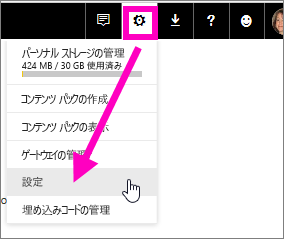
2. **[Power BI の ArcGIS マップ]** チェック ボックスをオンにします。 選択を行った後、Power BI を再起動する必要があります。
   
    
3. [編集ビュー](service-reading-view-and-editing-view.md)でレポートを開き、視覚エフェクト ウィンドウで Power BI の ArcGIS マップ アイコンを選択します。
   
    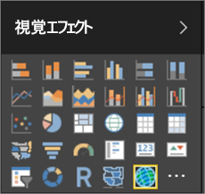
4. Power BI は空の ArcGIS マップ テンプレートをレポート キャンバスに追加します。
   
   

 

## ArcGIS マップ ビジュアルを作成する
Watch では、何種類かの ArcGIS マップ ビジュアルを作成できます。次の手順を使用して、[小売の分析のサンプル](sample-datasets.md)を使用してみてください。

<iframe width="560" height="315" src="https://www.youtube.com/embed/EKVvOZmxg9s" frameborder="0" allowfullscreen></iframe>

1. **[フィールド]** ウィンドウで、データ フィールドを **[場所]** または **[緯度]** や **[経度]** バケットにドラッグします。 この例では、**[ストア] > [市区町村]** を使用しています。
   
   > [!NOTE]
   > 選択したフィールドがマップの図形またはポイントとして最適に表示されているかどうかは、Power BI の ArcGIS マップによって自動的に検出されることに注意してください。 設定の既定値は調整することができます (下記参照)。
   > 
   > 
   
    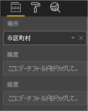
2. [視覚化] ウィンドウ  からテンプレートを選択し、視覚エフェクトを ArcGIS マップに変換します。
3. **[フィールド]** ウィンドウで、メジャーを **[サイズ]** バケットにドラッグして、データの表示方法を調整します。 この例では、**[セールス] > [Last Year Sales]** (昨年の売上高) を使用しています。
   
    

## ArcGIS マップの設定と書式設定
**Power BI の ArcGIS マップ**書式設定機能にアクセスするには、次の手順を実行します。

1. 視覚エフェクトの右上隅の省略記号を選択し、**[編集]** を選択して、追加機能にアクセスします。
   
   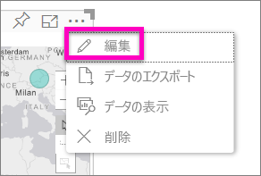
   
   使用可能な機能は、視覚エフェクトの上部に表示されます。 各機能を選択すると、詳細なオプションを示す作業ウィンドウが開きます。 
   
   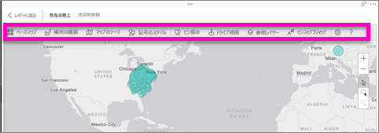
   
   > [!NOTE]
   > 設定と機能の詳細については、以下の「**詳細ドキュメント**」を参照してください。
   > 
   > 
2. レポートに戻るには、レポート キャンバスの左上隅にある **[レポートに戻る]** を選択します。

 

## 詳細なドキュメント
**Esri** は、**Power BI の ArcGIS マップ**の機能セットに関する[包括的なドキュメント](https://go.microsoft.com/fwlink/?LinkID=828772)を提供します。

## 機能の概要
### ベースマップ
キャンバス (ダーク グレー)、キャンバス (ライト グレー)、オープン ストリート マップ、ストリートという 4 つのベースマップが提供されます。  ストリートは、ArcGIS の標準的なベースマップです。

ベースマップを適用するには、作業ウィンドウで選択します。

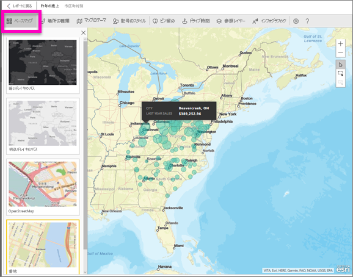

### 場所の種類
Power BI の ArgGIS マップは、マップでのデータの最適な表示方法を自動的に検出します。 ポイントまたは境界から選択します。 場所の種類のオプションを使用すれば、これらの選択を微調整できます。

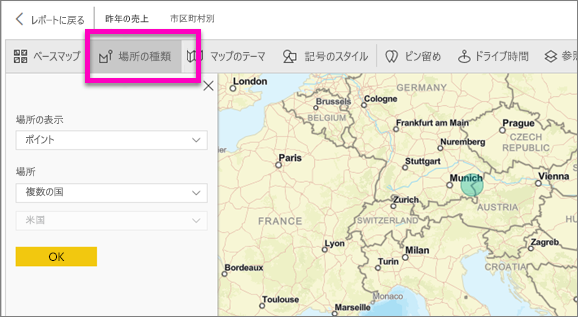

**境界**は、データに標準の地理的な値が含まれている場合にのみ機能します。 Esri は、マップに表示する図形を自動的に特定します。 標準の地理的な値には、国、都道府県、郵便番号などが含まれます。ただし、ジオコーディングの場合と同じように、Power BI は、フィールドを既定で境界にする必要があると判断しない可能性があり、データに境界が含まれない可能性があります。  

### マップのテーマ
4 つのマップ テーマが提供されます。 [場所のみ] および [サイズ] のテーマは、場所にバインドするフィールドに基づいて自動的に選択され、Power BI の [フィールド] ウィンドウの **[サイズ]** バケットに追加されます。 ここでは**サイズ**を使用しているため、**ヒート マップ**に変更しましょう。  

<table>
<tr><th>テーマ</th><th>説明</th>
<tr>
<td>場所のみ</td>
<td>[場所の種類] の設定に基づいて、マップのデータ ポイントまたは塗りつぶされた境界がプロットされます。</td>
</tr>
<tr>
<td>ヒート マップ</td>
<td>マップのデータの強度プロットがプロットされます。</td>
</tr>
<tr>
<td>サイズ</td>
<td>フィールド ウィンドウのサイズ バケット値に基づいてサイズ設定されたベースマップのデータ ポイントがプロットされます。</td>
</tr>
<tr>
<td>クラスタリング</td>
<td>マップの領域内のデータ ポイント数をプロットします。 </td>
</tr>
</table>

### 記号のスタイル
記号のスタイルを使用すれば、マップ上のデータの表示方法を微調整できます。 記号のスタイルは、選択された場所の種類とマップのテーマに基づき、コンテキストに依存します。 次の例では、**サイズ**に設定された場所の種類と、透過性、スタイル、サイズに対するいくつかの調整を示します。

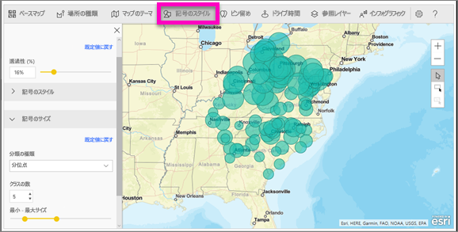

### ピン留め
ピン留めを追加することで、マップ上のポイントに注意を促します。  

1. **[Pins]** (ピン留め) タブを選択します。
2. 検索ボックスにキーワード (住所、場所、対象の地点など) を入力し、ドロップダウン リストから選びます。 記号がマップに表示され、マップでは場所が自動的に拡大されます。 検索結果は、ピン ウィンドウに場所カードとして保存されます。 最大 10 個の場所カードを保存することができます。
   
   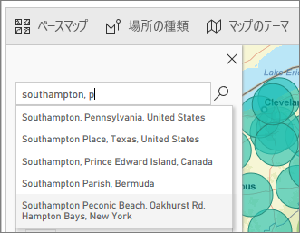
3. Power BI でその場所にピン留めが追加され、ユーザーがピン留めの色を変更できます。
   
   
4. ピン留めを追加および削除します。
   
   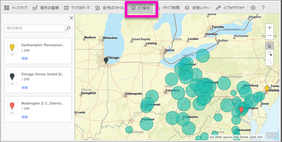

### ドライブ時間
ドライブ時間ウィンドウでは、場所を選択して、指定した半径またはドライブ時間の範囲内にある他のマップ機能を確認できます。  
    

1. **[Drive time]** タブを選び、単一選択ツールまたは複数選択ツールを選びます。 Washington D.C. を指すピンを 1 つ選びます。
    
   
   > [!TIP]
   > マップを拡大した方が場所を簡単に選択できます ([+] アイコンを使用)。
   > 
   > 
2. たとえば、Washington D.C. を訪れ数日間滞在する予定があるため、 車の移動に適した距離内の店を調べることにします。 検索領域を **[半径]** に変更し、距離を **50** マイルに設定して、[OK] を選択します。    
   
    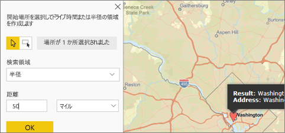
3. 半径は紫色で示されます。 場所を選択して詳細を表示します。 必要に応じて、色やアウトラインを変更して半径の書式を設定します。
   
    

### 参照レイヤー
#### 参照レイヤー - 人口統計
Power BI の ArcGIS マップでは、Power BI からのデータのコンテキスト化に役立つ人口統計レイヤーを選択できます。

1. **[参照レイヤー]** タブを選択し、**[人口統計]** を選択します。
2. リストされるレイヤーにはそれぞれチェック ボックスがあります。 チェックマークを追加して、マップにそのレイヤーを追加します。  この例では、平均世帯年収を追加しました。 
   
    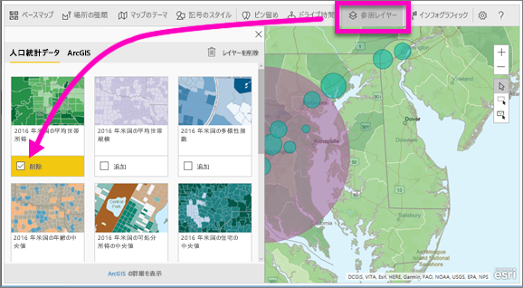
3. 各レイヤーも対話型です。 バブルの上にマウスを置いて詳細を表示する場合と同じように、マップの網掛け部分をクリックして詳細を表示することができます。 
   
    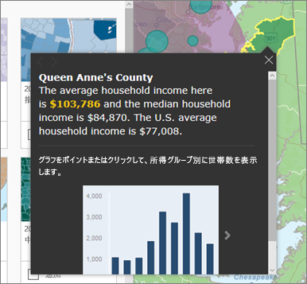

#### 参照レイヤー - ArcGIS
ArcGIS Online で、組織はパブリック Web マップを発行することができます。 さらに、Esri は Living Atlas を通じて選別された Web マップ セットを提供します。 [ArcGIS] タブでは、すべてのパブリック Web マップまたは Living Atlas マップを検索し、参照レイヤーとしてマップに追加することができます。

1. **[参照レイヤー]** タブを選択し、**[ArcGIS]** を選択します。
2. 検索語句を入力し、マップ レイヤーを選択します。 この例では、米国の下院選挙区を選択しました。
   
    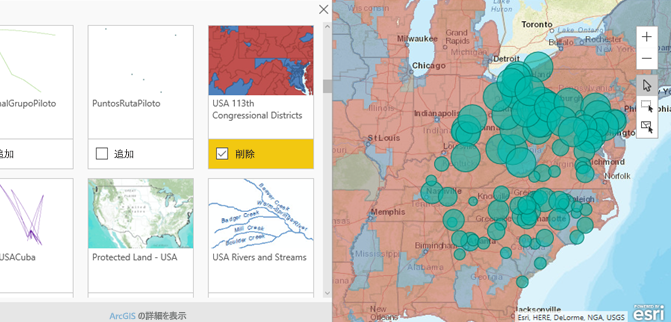
3. 詳細を表示するには、網掛け部分を選択して *[Select from reference layer]* (参照レイヤーから選択) を開きます。この場合、参照レイヤーの選択ツールを使用して、参照レイヤーの境界またはオブジェクトを選択します。

 

## データ ポイントを選択する
Power BI の ArcGIS マップでは 3 つの選択モードを使用できます。

選択モードを変更するには、次のように切り替えます。

 個々のデータ ポイントを選択します。

 マップに四角形を描画し、含まれるデータ ポイントを選択します。

 参照レイヤー内で境界または多角形を使用して、含まれるデータ ポイントを選択することができます。

> [!NOTE]
> 一度に最大 250 のデータ ポイントを選ぶことができます。
> 
> 

 

## ヘルプの表示
**Esri** は、**Power BI の ArcGIS マップ**の機能セットに関する[包括的なドキュメント](https://go.microsoft.com/fwlink/?LinkID=828772)を提供します。

[**Power BI の ArcGIS マップ**](https://go.microsoft.com/fwlink/?LinkID=828771)に関する Power BI コミュニティ スレッドで、質問、最新情報の検索、問題の報告、および回答の検索を行うことができます。

改善の提案がある場合は、[Power BI のアイデア リスト](https://ideas.powerbi.com)に送信してください。

 

## 組織内での Power BI の ArcGIS マップの使用を管理する
Power BI では、ユーザー、テナント管理者、および IT 管理者は Power BI の ArcGIS マップを使用するかどうかを管理することができます。

**ユーザー オプション** ユーザーが、Power BI Desktop の **[オプション]** のセキュリティ タブで無効にすることで、Power BI の ArcGIS マップの使用を停止できます。 無効になると、ArcGIS マップは既定では読み込まれなくなります。

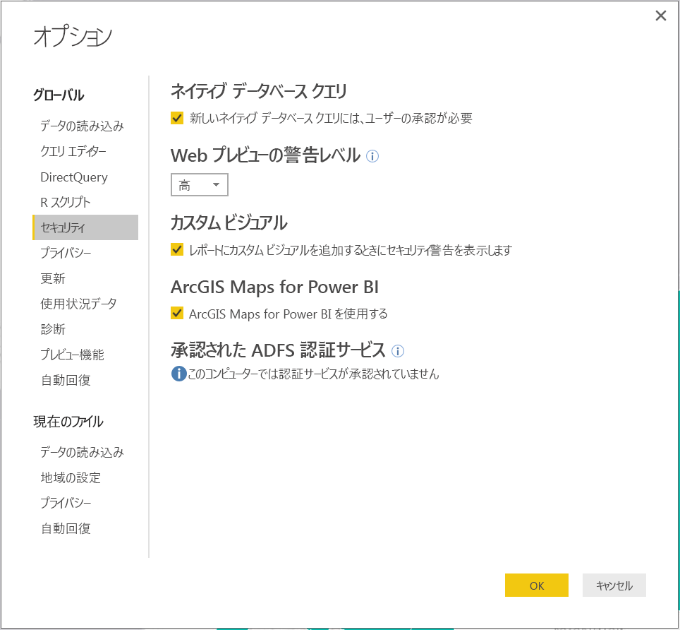

ユーザーは、Power BI サービスのユーザー設定の ArcGIS Maps for Power BI タブで無効にすることにより、ArcGIS Maps for Power BI の使用を停止できます。 無効になると、ArcGIS マップは既定では読み込まれなくなります。

**テナント管理オプション** PowerBI.com では、テナント管理者は、Power BI の ArcGIS マップを無効にすることですべてのテナント ユーザーが使用できないようにすることができます。 この場合、Power BI の視覚エフェクト ウィンドウに Power BI の ArcGIS マップ アイコンが表示されなくなります。

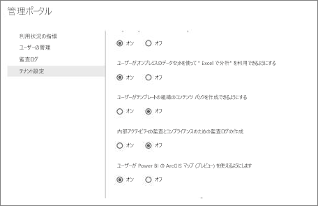

**IT 管理者オプション** Power BI Desktop では、組織に配置されているコンピューター全体で Power BI の ArcGIS マップを無効にするための**グループ ポリシー**の使用がサポートされます。

<table>
<tr><th>属性</th><th>値</th>
</tr>
<tr>
<td>キー</td>
<td>Software\Policies\Microsoft\Power BI Desktop\</td>
</tr>
<tr>
<td>valueName</td>
<td>EnableArcGISMaps</td>
</tr>
</table>

値が 1 (10 進数) の場合は、Power BI の ArcGIS マップが有効になります。

値が 0 (10 進数) の場合は、Power BI の ArcGIS マップが無効になります。

## 考慮事項と制限事項
ArcGIS Maps for Power BI は、次のサービスとアプリケーションで使うことができます。

<table>
<tr><th>サービス/アプリ</th><th>使用できるかどうか</th></tr>
<tr>
<td>Power BI Desktop</td>
<td>はい</td>
</tr>
<tr>
<td>Power BI サービス (PowerBI.com)</td>
<td>はい</td>
</tr>
<tr>
<td>Power BI モバイル アプリケーション</td>
<td>はい</td>
</tr>
<tr>
<td>Power BI Publish to Web</td>
<td>いいえ</td>
</tr>
<tr>
<td>Power BI Embedded</td>
<td>いいえ</td>
</tr>
<tr>
<td>Power BI サービスの埋め込み (PowerBI.com)</td>
<td>いいえ</td>
</tr>
</table>

ArcGIS Maps for Power BI を使うことができないサービスまたはアプリケーションでは、視覚エフェクトが Power BI のロゴを含む空のビジュアルとして表示されます。

住所をジオコード化すると、最初の 1500 個の住所だけがジオコード化されます。 場所の名前または国のジオコード化は、1500 個の住所制限の対象には含まれません。

 

**Power BI の ArcGIS マップを使用する場合、料金はかかりますか。**

すべての Power BI ユーザーは追加コストなしで ArcGIS Map for Power BI を使うことができます。 これは **Esri** によって提供されるコンポーネントであり、ご利用の際には、この記事の前述のとおり、**Esri** が示す使用条件およびプライバシー ポリシーが適用されます。

**キャッシュに空きがないというエラー メッセージが Power BI Desktop で表示されます**

これは対処中のバグです。  解決するまで、キャッシュを削除するには C:\Users\\AppData\Local\Microsoft\Power BI Desktop\CEF にあるファイルを削除してから、Power BI を再起動してみてください。

**Power BI の ArcGIS マップで Esri シェープファイルはサポートされますか。**

Power BI の ArcGIS マップは、国/地域、都道府県、郵便番号などの標準的な境界を自動的に検出します。 独自の図形を指定する必要がある場合は、[Power BI Desktop のマップのシェイプ (プレビュー)](desktop-shape-map.md) を使用して指定できます。

**オフラインで自分の ArcGIS マップを表示できますか。**

いいえ、Power BI でマップを表示するには、ネットワーク接続が必要です。

**Power BI から ArcGIS Online アカウントに接続することはできますか。**

まだできません。 [このアイデアに投票](https://ideas.powerbi.com/forums/265200-power-bi-ideas/suggestions/9154765-arcgis-geodatabases)していただければ、この機能への取り組みを開始したときに電子メールをお送りします。  

## 次の手順
[他のユーザーから共有された ArcGIS マップとの対話](power-bi-visualizations-arcgis.md)

[Power BI の ArcGIS マップの可用性を発表するブログの投稿](https://powerbi.microsoft.com/blog/announcing-arcgis-maps-for-power-bi-by-esri-preview/)

他にわからないことがある場合は、 [Power BI コミュニティで質問してみてください](http://community.powerbi.com/)。

