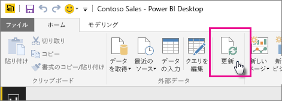
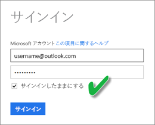

# OneDrive または SharePoint Online に格納されているデータセットを更新する
OneDrive または SharePoint Online から Power BI サービスへのファイルのインポートは、**Power BI Desktop** で実行している作業と Power BI サービスとの同期を確実に維持するための優れた方法です。

## OneDrive または SharePoint Online に Power BI Desktop ファイルを保存することの利点
**Power BI Desktop** ファイルを OneDrive または SharePoint Online に保存すると、ファイルのモデルに読み込んだすべてのデータがデータセットにインポートされ、ファイルに作成されたすべてのレポートが Power BI サービスの**レポート**に読み込まれます。 OneDrive または SharePoint Online のファイルに新しいメジャーの追加、列名の変更、視覚エフェクトの編集といった変更を行ってファイルを保存すると、その内容が通常は 1 時間以内に Power BI サービスでも更新されます。

[ホーム] リボンの [更新] を選択して、1 回限りの手動更新を Power BI Desktop で実行することができます。 ここで [更新] を選択すると、*ファイルの*モデル内のデータが、元のデータ ソースの更新されたデータで更新されます。 このような更新はすべて Power BI Desktop アプリケーション自体から発生しているため、Power BI の手動またはスケジュールされた更新とは異なります。この違いを理解することが重要です。

OneDrive または SharePoint Online から Power BI Desktop ファイルをインポートすると、データとモデルに関するその他の情報が Power BI のデータセットに読み込まれます。 Power BI サービス (Power BI Desktop ではない) では、データセットは Power BI サービスのレポートの基準となるため、Power BI でデータセットを更新する必要があります。 データ ソースは外部であるため、**[今すぐ更新]** を使用してデータセットを手動で更新するか、または **[更新のスケジュール設定]** を使用して更新スケジュールを設定することができます。

データセットを更新すると、Power BI は OneDrive または SharePoint Online のファイルに接続して更新されたデータのクエリを実行しません。 Power BI はデータセットの情報を使用してデータ ソースに直接接続し、更新されたデータのクエリを実行してから、データセットに読み込みます。 データセットのこの更新データは、OneDrive または SharePoint Online 上のファイルに再度同期されることはありません。

## サポートされている機能
Power BI では、[データの取得]/[クエリ エディター] を使って次のいずれかのデータ ソースに接続してデータを読み込んでいるローカル ドライブがある場合、そのローカル ドライブからインポートされた Power BI Desktop ファイルから作成したデータセットについては、[今すぐ更新] と [更新のスケジュール設定] をサポートしています。

### Power BI Gateway - Personal
* Power BI Desktop の [データの取得] および [クエリ エディター] に表示されるすべてのオンライン データ ソース。
* Hadoop ファイル (HDFS) と Microsoft Exchange を除く、Power BI Desktop の [データの取得] および [クエリ エディター] に表示されるすべてのオンプレミスのデータ ソース。

<!-- Refresh Data sources-->
[!INCLUDE [refresh-datasources](./includes/refresh-datasources.md)]

> [!NOTE]
> Power BI からオンプレミスのデータ ソースに接続し、そのデータセットを更新するには、ゲートウェイをインストールして実行する必要があります。
> 
> 

## OneDrive と OneDrive for Business。 違いは何ですか?
個人用の OneDrive と OneDrive for Business の両方がある場合は、Power BI にインポートするすべてのファイルを OneDrive for Business に保存することをおすすめします。 これは、サインインのために 2 種類のアカウントを使用する可能性があるためです。

Power BI へのサインインに使用するアカウントが OneDrive for Business へのサインインに使用するアカウントと同じであることが多いため、Power BI での OneDrive for Business への接続は通常シームレスです。 ただし、個人用の OneDrive では、ほとんどの場合異なる [Microsoft アカウント](http://www.microsoft.com/account/default.aspx)を使用してサインインします。

Microsoft アカウントにサインインしたら、必ず [サインアウトしない] を選択してください。 これで、Power BI が Power BI Desktop のファイルに行ったすべての変更を Power BI のデータセットに同期できるようになります。  
    

Microsoft アカウントの資格情報が変更されている可能性があるために Power BI のデータセットまたはレポートと同期できない OneDrive のファイルに変更を行う場合は、そのファイルに接続して、個人用の OneDrive から再度インポートする必要があります。

## 更新のスケジュール方法
更新スケジュールを設定する際、Power BI はデータセットの接続情報と資格情報を使用して直接データ ソースに接続し、データの更新がないかを問い合わせ、更新されたデータをデータセットに読み込みます。 Power BI サービスのデータセットに基づくレポートおよびダッシュボードのすべての視覚エフェクトも更新されます。

更新のスケジュールを設定する方法について詳しくは、「[スケジュールされた更新の構成](refresh-scheduled-refresh.md)」をご覧ください。

## 問題が発生した場合
問題が生じた場合は通常、Power BI がデータ ソースにサインインできないか、データセットがオンプレミスのデータ ソースに接続している場合にゲートウェイがオフラインになっているためです。 Power BI がデータ ソースにサインインできることを確認してください。 データ ソースへのサインインに使用するパスワードが変更された場合、または Power BI がデータ ソースからサインアウトした場合は、必ず [データ ソースの資格情報] で再度データ ソースへのサインインを試行してください。

OneDrive 上の Power BI Desktop ファイルに変更を行って保存しても、その内容が 1 時間以内に Power BI に反映されない場合、Power BI が OneDrive に接続できていない可能性があります。 OneDrive 上のファイルにもう一度接続してみてください。 サインインを求められた場合は、必ず [サインアウトしない] を選択します。 Power BI が OneDrive に接続してファイルと同期できなかったため、もう一度ファイルをインポートする必要があります。

**[更新が失敗したらメールで通知する]** はオンのままにしてください。 スケジュールの更新が失敗した場合、すぐに通知されます。

## トラブルシューティング
期待どおりにデータが更新されないことがあります。 通常、これはゲートウェイに関係する問題です。 ツールと既知の問題については、ゲートウェイに関するトラブルシューティングの記事を参照してください。

[オンプレミス データ ゲートウェイのトラブルシューティング](service-gateway-onprem-tshoot.md)

[Power BI Gateway - Personal のトラブルシューティング](service-admin-troubleshooting-power-bi-personal-gateway.md)

他にわからないことがある場合は、 [Power BI コミュニティで質問してみてください](http://community.powerbi.com/)。

