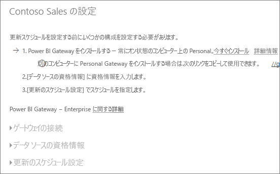
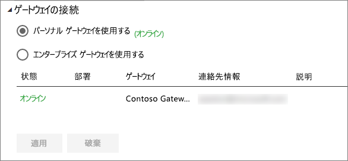
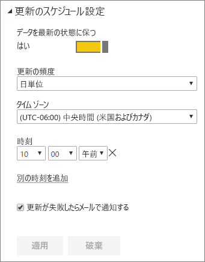

# スケジュールされた更新の構成

>[!NOTE]
>2 か月間操作が行われなかった場合、データセットに対するスケジュールされた更新は一時停止されます。 詳しくは、下記の「[*更新のスケジュール設定*](#schedule-refresh)」セクションをご覧ください。"
> 
> 

[今すぐ更新] と [更新のスケジュール設定] を使用したスケジュールされた更新をデータセットがサポートしている場合、更新を正常に行うために重要な要件と設定がいくつかあります。 **ゲートウェイの接続**、**データ ソースの資格情報**、**更新のスケジュール設定**です。 それぞれを詳しく見てみましょう。

ここでは、[Power BI Gateway – Personal](service-gateway-personal-mode.md) と [オンプレミス データ ゲートウェイ](service-gateway-onprem.md)の両方で使用可能なオプションを説明します。

次の操作を行うと、スケジュールを更新する画面に移動できます。

1. **[データセット]** の下で一覧表示されたデータセットの横にある**省略記号 (...)** を選択します。
2. **[更新のスケジュール設定]** を選択します。
   
    

## ゲートウェイの接続
パーソナル ゲートウェイまたはエンタープライズ ゲートウェイのどちらをオンラインにして使用できるようにしているかによって、ここに表示されるオプションが変わります。

使用できるゲートウェイがない場合は、**[ゲートウェイ設定]** が無効になっています。 パーソナル ゲートウェイをインストールする方法を示すメッセージも表示されます。

パーソナル ゲートウェイを構成している場合は、オンラインになっていると、パーソナル ゲートウェイを選択できます。 使用できない場合は、パーソナル ゲートウェイはオフラインとして表示されます。

エンタープライズ ゲートウェイが使用できる場合は、エンタープライズ ゲートウェイも選択できます。 任意のゲートウェイ用に構成されたデータ ソースの [ユーザー] タブにアカウントが表示されている場合は、使用可能なエンタープライズ ゲートウェイのみ表示されます。

## データ ソースの資格情報
### Power BI Gateway - Personal
パーソナル ゲートウェイを使用してデータを更新している場合は、バックエンド データ ソースへの接続に使用する資格情報を指定する必要があります。 オンライン サービスからコンテンツ パックに接続した場合は、接続用に入力した資格情報は、スケジュールされた更新に引き継がれます。

必要なのは、このデータセットで更新を初めて使用するときにデータ ソースにサインインすることだけです。 入力した後は、資格情報はデータセットに保持されます。

> [!NOTE]
> 一部の認証方法では、データ ソースへのサインインに使用するパスワードの有効期限が切れた場合、またはパスワードが変更された場合は、[データ ソースの資格情報] でもデータ ソースのパスワードを変更する必要があります。
> 
> 

問題が生じた場合、問題は Windows にサインインしてサービスを開始できなかったためにゲートウェイがオフラインであること、または Power BI が更新されたデータに対してクエリを実行するためにデータ ソースにサインインできなかったことのいずれかに関係しています。 更新に失敗した場合は、データセットの設定を確認します。 ゲートウェイ サービスがオフラインの場合、[ゲートウェイの状態] にエラーが表示されています。 Power BI がデータ ソースにサインインできない場合、データ ソースの資格情報でエラーが表示されます。

### オンプレミス データ ゲートウェイ
オンプレミス データ ゲートウェイを使用してデータを更新している場合は、ゲートウェイの管理者によってデータ ソースに定義されているとおりに資格情報を指定する必要はありません。

> [!NOTE]
> データ更新のためにオンプレミスの SharePoint に接続するとき、Power BI は "*匿名*"、"*基本*"、および "*Windows (NTLM/Kerberos)*" の認証メカニズムのみをサポートします。 オンプレミスの SharePoint データ ソースのデータ更新では、Power BI は "*ADFS*" または "*フォーム ベース認証*" のメカニズムをサポートしません。
> 
> 

## 更新のスケジュール設定
スケジュールされた更新のセクションでは、データセットを更新する頻度と時間帯を定義します。 一部のデータ ソースには、構成の対象となるゲートウェイは不要です。 その他のデータ ソースには、ゲートウェイが必要となります。

設定を構成するには、**[データを常に最新の状態に保つ]** スライダーを **[はい]** に設定する必要があります。

> [!NOTE]
> Power BI サービスでは、スケジュールされた更新時間の **15 分**以内にデータの更新を開始することを目標にしています。
> 
> 

> [!NOTE]
> 2 か月間操作が行われなかった場合、データセットに対するスケジュールされた更新は一時停止されます。 データセットに基づいて作成されたダッシュボードまたはレポートにアクセスするユーザーがいない場合、そのデータセットは非アクティブと見なされます。 その時点で、スケジュールされた更新が一時停止されており、データセットの更新スケジュールが**無効**と表示されることを示すメールが、データセットの所有者に送られます。 データセットに基づいて作成されたダッシュボードまたはレポートに再度アクセスするだけで、スケジュールされた更新は再開されます。"
> 
> 

## サポートされている機能
スケジュールされた更新のために、さまざまなゲートウェイに応じて一定のデータセットがサポートされています。 ここでは、使用できるデータセットを理解するうえで参考になる情報を紹介します。

### Power BI Gateway - Personal
**Power BI Desktop**

* Power BI Desktop の [データの取得] および [クエリ エディター] に表示されるすべてのオンライン データ ソース。
* Hadoop ファイル (HDFS) と Microsoft Exchange を除く、Power BI Desktop の [データの取得] および [クエリ エディター] に表示されるすべてのオンプレミスのデータ ソース。

**Excel**

> [!NOTE]
> Excel 2016 以降では、Power Query はリボンの [データ] セクションで、[データの取得と変換] のところに表示されます。
> 
> 

* Power Query に表示されるすべてのオンライン データ ソース
* Hadoop ファイル (HDFS) と Microsoft Exchange を除く、Power Query に表示されるすべてのオンプレミスのデータ ソース
* Power Pivot に表示されるすべてのオンライン データ ソース\*
* Hadoop ファイル (HDFS) と Microsoft Exchange を除く、Power Pivot に表示されるすべてのオンプレミスのデータ ソース

<!-- Refresh Data sources-->
[!INCLUDE [refresh-datasources](./includes/refresh-datasources.md)]

## トラブルシューティング
期待どおりにデータが更新されないことがあります。 通常、これはゲートウェイに関係する問題です。 ツールと既知の問題については、ゲートウェイに関するトラブルシューティングの記事を参照してください。

[オンプレミス データ ゲートウェイのトラブルシューティング](service-gateway-onprem-tshoot.md)

[Power BI Gateway - Personal のトラブルシューティング](service-admin-troubleshooting-power-bi-personal-gateway.md)

## 次の手順
[Power BI でのデータの更新](refresh-data.md)  
[Power BI Gateway - Personal](service-gateway-personal-mode.md)  
[オンプレミス データ ゲートウェイ](service-gateway-onprem.md)  
[オンプレミス データ ゲートウェイのトラブルシューティング](service-gateway-onprem-tshoot.md)  
[Power BI Gateway - Personal のトラブルシューティング](service-admin-troubleshooting-power-bi-personal-gateway.md)  

他にわからないことがある場合は、 [Power BI コミュニティで質問してみてください](http://community.powerbi.com/)。

