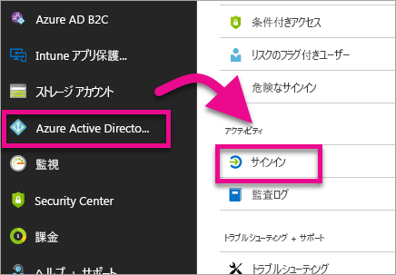
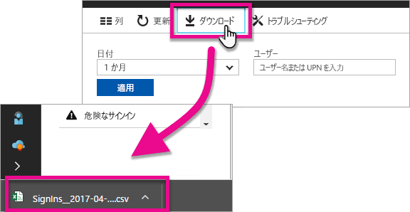

# サインインした Power BI ユーザーを見つける
テナント管理者が Power BI にサインインしたユーザーを確認するには、Azure Active Directory アクセスと使用状況レポートを使用して、ユーザーを表示します。

<iframe width="640" height="360" src="https://www.youtube.com/embed/1AVgh9w9VM8?showinfo=0" frameborder="0" allowfullscreen></iframe>

[新規](https://docs.microsoft.com/azure/active-directory/active-directory-reporting-activity-sign-ins)および[クラシック](https://docs.microsoft.com/azure/active-directory/active-directory-view-access-usage-reports) Azure Active Directory (Azure AD) ポータルのアクティビティ レポートにアクセスできます。 上のビデオでは例としてクラシック ポータルを使用していますが、この記事では、新しいポータルに焦点を当てて説明します。

> [!NOTE]
> このアクティビティ レポートには Power BI (無料) ユーザーと Pro ユーザーの両方が含まれていますが、ユーザーのライセンスではユーザーは特定されません。
> 
> 

## 要件
サインイン アクティビティ レポートを表示するための要件を次に示します。

* グローバル管理者、セキュリティ管理者、またはセキュリティ リーダーのロールが付与されたユーザーが、データにアクセスできます。
* すべてのユーザー (管理者以外) が、独自のサインインでアクセスできます。
* すべてのサインイン アクティビティ レポートを表示するには、テナントに Azure AD Premium ライセンスが関連付けられている必要があります。

## Azure ポータルを使用してサインインを表示する
Azure AD ポータルを使用して、サインイン アクティビティを表示できます。

1. **Azure ポータル**を参照し、**[Azure Active Directory]** を選択します。
2. **[アクティビティ]** の **[サインイン]** を選択します。
   
    
3. **[Microsoft Power BI]** または **[Power BI Gateway]** のいずれかを選択して、アプリケーションをフィルター処理し、**[適用]** を選択します。
   
    **Microsoft Power BI** は、サービス関連のサインイン アクティビティを対象としています。一方、**Power BI Gateway** は、オンプレミス データ ゲートウェイを対象とした特定のサインインです。
   
    

## データをエクスポートする
サインイン データをエクスポートするオプションは 2 つあります。 これを行うには、csv ファイルをダウンロードするか、PowerShell を使用します。

### csv のダウンロード
アクティビティ画面で、ツールバーの **[ダウンロード]** を選択できます。 これにより、フィルター処理されているデータの csv ファイルがダウンロードされます。

### PowerShell
PowerShell を使用して、サインイン データをエクスポートできます。 Azure AD ドキュメント内で[サンプル](https://docs.microsoft.com/azure/active-directory/active-directory-reporting-api-sign-in-activity-samples#powershell-script)を使用できます。

> [!NOTE]
> PowerShell サンプルを動作させるには、必ず [Azure AD レポート API にアクセスするための前提条件](https://docs.microsoft.com/en-us/azure/active-directory/active-directory-reporting-api-prerequisites)に従う必要があります。
> 
> 

## データのリテンション期間
サインイン関連のデータは、最大 30 日間使用できます。 詳しくは、「[Azure Active Directory レポートの保持ポリシー](https://docs.microsoft.com/azure/active-directory/active-directory-reporting-retention)」を参照してください。

## 次の手順
[Azure Active Directory ポータルのサインイン アクティビティ レポート (新しいポータル)](https://docs.microsoft.com/azure/active-directory/active-directory-reporting-activity-sign-ins)  
[アクセスおよび使用状況レポートの表示 (クラシック ポータル)](https://docs.microsoft.com/azure/active-directory/active-directory-view-access-usage-reports#view-or-download-a-report)  
[サインイン サンプルの PowerShell スクリプト](https://docs.microsoft.com/azure/active-directory/active-directory-reporting-api-sign-in-activity-samples#powershell-script)  
[Azure Active Directory レポートの保持ポリシー](https://docs.microsoft.com/azure/active-directory/active-directory-reporting-retention)  
[組織内での監査の使用](service-admin-auditing.md)  
[Extended Pro Trial のアクティブ化](service-extended-pro-trial.md)

他にわからないことがある場合は、 [Power BI コミュニティで質問してみてください](https://community.powerbi.com/)。

