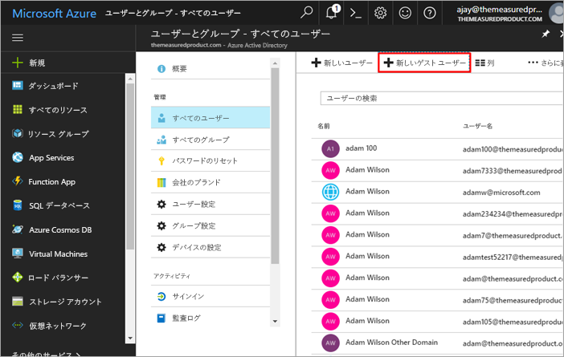
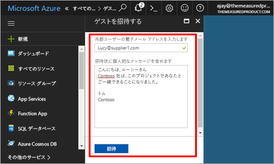
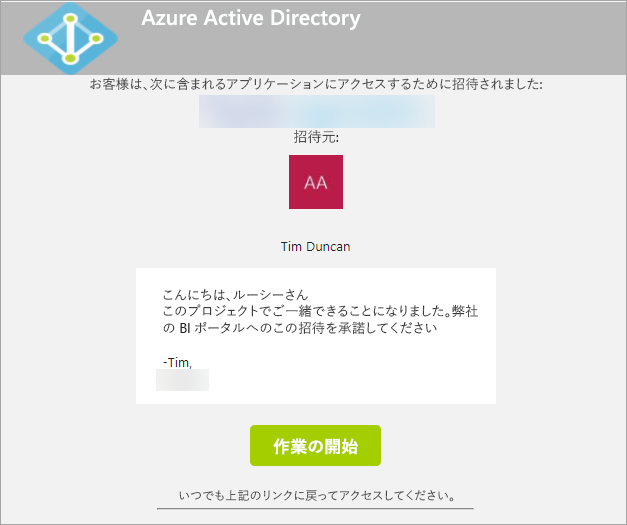
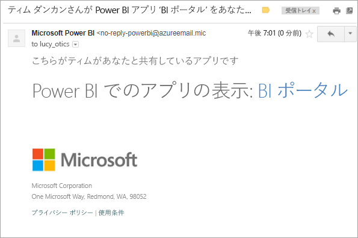
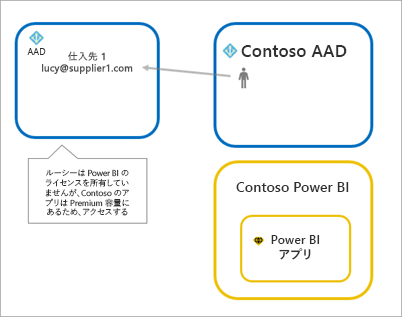
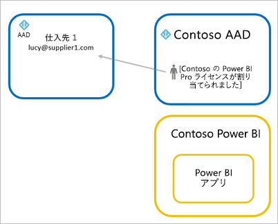

# Azure AD B2B で外部ゲスト ユーザーに Power BI コンテンツを配布する

Power BI と Azure Active Directory Business-to-Business(Azure AD B2B) との統合により、内部データに対する制御を引き続き維持しながら、組織外のゲスト ユーザーに Power BI コンテンツを安全に配布できるようになりました。

> [!VIDEO https://www.youtube.com/embed/xxQWEQ1NnlY]

> [!NOTE]
> 現在、この機能は Power BI モバイル アプリでは使用できません。 モバイル デバイスでは、ブラウザーで Azure AD B2B を使用して共有されている Power BI コンテンツを表示できます。 

## ゲスト ユーザーを招待する

Power BI テナントにゲスト ユーザーを招待するには、計画的な招待とアドホック招待という 2 つの方法があります。 招待状は、組織に初めて外部ユーザーを招待する場合にのみ必要です。

### 計画的な招待

計画的な招待は、Azure AD の Microsoft Azure Portal または PowerShell を使用して行います。 この方法は、招待する必要のあるユーザーがわかっている場合に使用します。 

**Azure AD Portal でゲスト ユーザーを作成するには、テナント管理者であることが必要です。**

1. [Azure Portal](https://portal.azure.com) に移動し、**[Azure Active Directory]** を選択します。

2. **[ユーザーとグループ]** > **[すべてのユーザー]** > **[新しいゲスト ユーザー]** の順に移動します。

    

3. **メール アドレス**と**個人的なメッセージ**を入力します。

    

4. **[招待]** を選びます。

複数のゲスト ユーザーを招待するには、PowerShell を使用します。 詳細については、「[Azure Active Directory B2B コラボレーション コードと PowerShell サンプル](https://docs.microsoft.com/azure/active-directory/active-directory-b2b-code-samples)」を参照してください。

ゲスト ユーザーは、受信した招待メール内で **[開始]** を選択する必要があります。 その操作により、ゲスト ユーザーはテナントに追加されます。

### アドホック招待

招待を随時実行するには、アプリを発行するときに該当するアプリのアクセス リストに外部ユーザーを追加します。

ゲスト ユーザーには、アプリがそのゲスト ユーザーと共有されたことを示す電子メールが届きます。

ゲスト ユーザーは、自分の所属する組織の電子メール アドレスでサインインする必要があります。 サインイン後、ゲスト ユーザーは招待を受け入れるよう求められます。 サインイン後、ゲスト ユーザーはアプリのコンテンツにリダイレクトされます。 アプリに戻るには、リンクをブックマークするか、電子メールを保存します。

## ライセンス

ゲスト ユーザーは、共有されているアプリを表示するために、適切なライセンスが必要になります。 それを実現するために、次の 3 つのオプションがあります。

### Power BI Premium を使用する

Power BI Premium 容量にアプリ ワークスペースを割り当てると、ゲスト ユーザーは Power BI Pro ライセンスなしでアプリを使用できるようになります。 Power BI Premium では、高いリフレッシュ レート、専用の容量、大規模なモデル サイズなど他の機能をアプリで活用することもできます。

### ゲスト ユーザーに Power BI Pro ライセンスを割り当てる

テナント内で Power BI Pro ライセンスをゲスト ユーザーに割り当てると、そのターゲット ユーザーはコンテンツを表示できるようになります。

> [!NOTE]
> テナントからの Power BI Pro ライセンスがゲスト ユーザーに適用されるのは、ゲスト ユーザーがテナント内のコンテンツにアクセスする場合にのみです。

### ゲスト ユーザーが独自の Power BI Pro ライセンスを使用する

ゲスト ユーザーは、そのテナント内で Power BI Pro ライセンスに既に割り当てられています。

## 制限事項

* 外部の B2B ゲストは、コンテンツのみの消費量に制限されます。 外部の B2B ゲストは、アプリ、ダッシュボード、レポートの表示、データのエクスポート、ダッシュボードとレポートの電子メール サブスクリプションの作成ができます。 ワークスペースにアクセスしたり、独自のコンテンツを公開することはできません。
* 現在、この機能は Power BI モバイル アプリでは使用できません。 モバイル デバイスでは、ブラウザーで Azure AD B2B を使用して共有されている Power BI コンテンツを表示できます。
* ソブリン クラウド (政府機関) 内では、Power BI でゲスト ユーザーの使用はサポートされません。

## 次の手順

行レベルのセキュリティのしくみなど、詳細については、[ホワイト ペーパー](https://aka.ms/powerbi-b2b-whitepaper)を参照してください。

Azure Active Directory B2B の詳細については、「[Azure AD B2B コラボレーションとは](https://docs.microsoft.com/azure/active-directory/active-directory-b2b-what-is-azure-ad-b2b)」を参照してください。