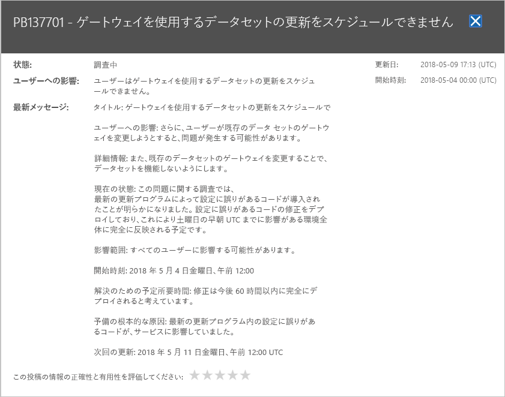

# Office 365 で Power BI サービスの正常性を追跡する

Office 365 管理センターでは Power BI 管理者のための重要なツールが提供されており、その中にはサービスの正常性に関する現在および過去の情報が含まれます。 この情報にアクセスするには、Power BI サービス管理者または Office 365 全体管理者のどちらかのロールを割り当てられている必要があります。 ロールについて詳しくは、「[Power BI に関連する管理者ロール](service-admin-administering-power-bi-in-your-organization.md#administrator-roles-related-to-power-bi)」をご覧ください。

1. [Office 365 管理センター](https://portal.office.com/adminportal)にサインインします。

2. **[サービス正常性]** タイルを選びます。

    ![[サービス正常性] タイル](media/service-admin-health/service-health-tile.png)

3. 現在の一覧で **[N アドバイザリ]** または **[N インシデント]** を選んで、結果を確認します。 次の図では、3 件のアクティブなアドバイザリのうちの 1 つが示されています。

    

4. 詳しい情報を見るには、項目の **[詳細の表示]** を選びます。 次の図では、最新の状態の更新など、追加の詳細が表示されています。

    

    下にスクロールして他の情報を確認し、完了したらウィンドウを閉じます。

5. すべてのサービスの履歴情報を表示するには、メイン リストの右上で **[履歴の表示]** を選びます。 次に、**[過去 7 日間]** または **[過去 30 日間]** を選びます。 現在のサービス正常性に戻るには、**[現在の状態の表示]** を選びます。