# Power BI Premium および Power BI Embedded の容量を管理する
コンテンツ用の専用リソースを提供する Power BI Premium および Power BI Embedded の容量を管理する方法について説明します。

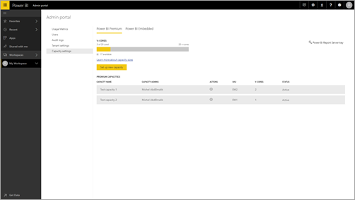

容量は、Power BI Premium および Power BI Embedded プランに関係します。

## 容量とは
容量は、ユーザー専用に予約されたリソースのセットです。 容量を持つことで、組織全体のユーザーにライセンスを購入しなくても、これらのユーザーに対してダッシュボード、レポート、データセットを公開できます。 容量でホストされているコンテンツに信頼性の高い、一貫性のあるパフォーマンスも保証されます。

容量はエンド ユーザーに対してすべて透過的です。 エンド ユーザーは通常どおりに Power BI またはアプリケーションを使い続けます。 コンテンツの一部 (またはすべて) が専用容量でホストされていることを認識する必要はありません。 ユーザーに対しては、すべてが以前とまったく同じに機能します。

[!INCLUDE [powerbi-premium-illustration](./includes/powerbi-premium-illustration.md)]

詳しくは、「[Power BI Premium - what is it?](service-premium.md)」 (Power BI Premium とは) を参照してください。

## 容量を購入する
専用容量を利用するには、Office 365 管理センター内で Power BI Premium のサブスクリプションを購入するか、Microsoft Azure Portal 内に Power BI Embedded リソースを作成する必要があります。 詳しくは、以下のトピックをご覧ください。

* **Power BI Premium:** [Power BI Premium の購入方法](service-admin-premium-purchase.md)
* **Power BI Embedded:** [Azure Portal での Power BI Embedded 容量の作成](https://docs.microsoft.com/en-us/azure/power-bi-embedded/create-capacity)

Power BI Premium の SKU を購入すると、テナントは、実行している容量で使うために、対応する数の仮想コアを受け取ります。 たとえば、Power BI Premium P3 SKU を購入すると、32 個の仮想コアがテナントに提供されます。

> [!NOTE]
> サブスクリプションの終了後、30 日間はフル アクセスが可能ですが、その後はコンテンツが共有の容量に戻ります。 1 GB を超えるモデルは正規の共有ライセンスではサポートされません。
>

## 容量管理者
> [!NOTE]
> Power BI Embedded 容量の容量管理者は、Microsoft Azure Portal 内で定義します。
>
>

容量の容量管理者として割り当てられたユーザーは、容量とその管理機能を完全に制御できます。 Power BI 管理ポータルでは、さらに容量管理者を追加したり (Power BI Premium のみ)、ユーザーに容量割り当てのアクセス許可を付与したりできます。 容量にワークスペースを一括して割り当て、容量の使用状況の指標を表示できます。

容量にはそれぞれ独自の管理者がいます。 1 つの容量に容量管理者を定義しても、組織内のすべての容量へのアクセス権をその管理者に与えることにはなりません。 既定では、容量管理者がアクセスできない Power BI 管理領域があります (利用状況の指標、監査ログ、テナント設定など)。 また、容量管理者には、新しい容量の設定または既存容量の SKU の変更を行うアクセス許可はありません。 これらの項目にアクセスできるのは、グローバル管理者または Power BI サービス管理者だけです。

すべての Office 365 グローバル管理者と Power BI 管理者は、自動的に、Power BI Premium 容量と Power BI Embedded 容量両方の容量管理者になります。

## 容量の管理
Office 365 で容量ノードを購入した後は、新しい容量を設定する必要があります。 これは [Power BI 管理ポータル](service-admin-portal.md)から行います。 管理ポータルには、**[容量の設定]** というセクションがあります。 ここで組織の Power BI Premium 容量を管理します。

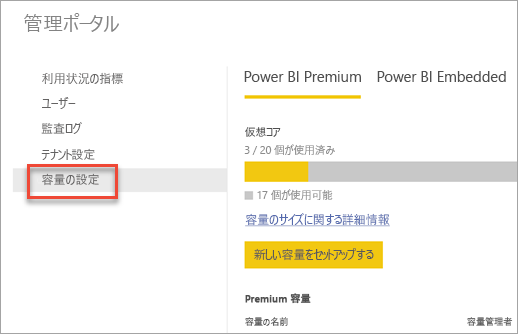

**[容量の設定]** を選ぶと、容量管理画面 (既定では Power BI Premium のもの) に移動します。

### 新しい容量の設定 (Power BI Premium)
仮想コアの数は、使われている量と、容量の作成に利用できる量を反映します。 組織で使うことができる仮想コアの数は、購入した Premium SKU に基づきます。 たとえば、P3 と P2 を購入すると、48 個のコア (P3 から 32 個、P2 から 16 個) を利用できます。

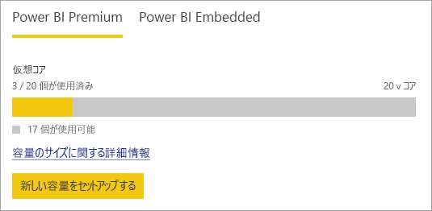

利用可能な仮想コアがある場合は、次の手順で新しい容量をセットアップします。

1. **[新しい容量をセットアップする]** を選択します。
2. 容量に**名前**を付けます。
3. この容量に容量管理者を定義します。

    容量管理者は、Power BI 管理者または Office 365 グローバル管理者である必要はありません。詳しくは、[Power BI Premium の容量管理者](#capacity-admins)を参照してください。
4. 容量のサイズを選びます。 指定できるオプションは、利用可能な仮想コアの数によって異なります。 利用可能な数より多いオプションは選ぶことができません。

    
5. **[セットアップ]** を選択します。

    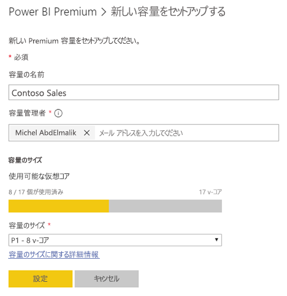

容量管理者、および Power BI 管理者と Office 365 グローバル管理者は、管理ポータル内に一覧表示される容量を確認できます。

### 容量の設定
Premium 容量管理の画面で、[アクション] の下の**歯車アイコン (設定)** を選択します。 これにより、名前を変更したり容量を削除したりできます。 ここには、サービス管理者、容量の SKU/サイズ、容量がある地域も示されます。

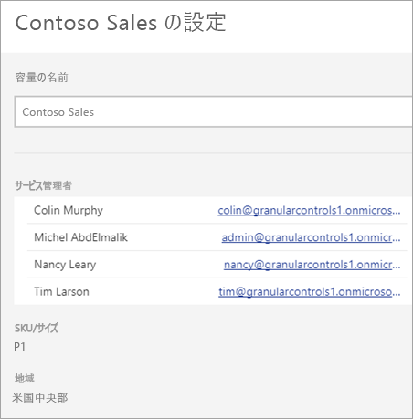

> [!NOTE]
> Power BI Embedded の容量の設定は、Microsoft Azure Portal で管理します。
>
>

### 容量サイズの変更 (Power BI Premium)
Power BI 管理者および Office 365 グローバル管理者は、**[容量サイズを変更します]** を選んで Power BI Premium の容量サイズを変更します。 Power BI 管理者または Office 365 グローバル管理者ではない容量管理者は、これを行うことはできません。

**[容量サイズを変更します]** 画面では、利用可能なリソースがある場合は、容量サイズのアップグレードまたはダウングレードを行うことができます。 管理者は、必要な数の仮想コアがある限り、ノードの作成、サイズ変更、削除を自由に行うことができます。

P SKU を EM SKU にダウングレードすることはできません。 無効なオプションをポイントすると説明が表示されます。

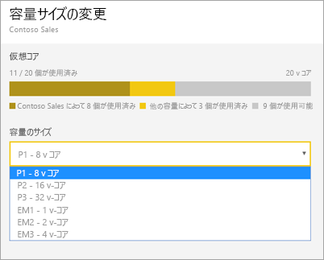

### 容量の割り当て
容量を管理するには、容量の名前を選びます。 これにより容量管理の画面に移動します。

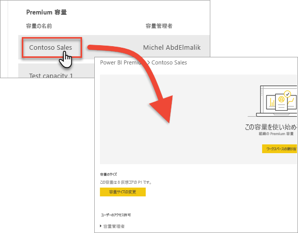

容量にワークスペースが割り当てられていない場合は、メッセージが表示されて**ワークスペースを割り当てる**ことができます。

#### ユーザーのアクセス許可
Power BI Premium 容量用に追加の**容量管理者**を割り当てることができます。 また、ユーザーに**容量割り当てアクセス許可**を割り当てることもできます。 割り当てのアクセス許可を持つユーザーがそのワークスペースの管理者である場合は、容量にアプリ ワークスペースを割り当てることができます。 また、個人の*マイ ワークスペース*を容量に割り当てることもできます。 割り当てのアクセス許可を持つユーザーには、管理ポータルへのアクセス権はありません。

> [!NOTE]
> Power BI Embedded 容量の場合、容量管理者は Microsoft Azure Portal で定義します。
>
>

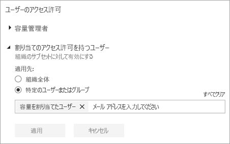

## 使用状況測定 (Power BI Premium)
各容量について、CPU、メモリ使用量、メモリ スラッシング、直接クエリの使用状況測定を見ることができます。 ユーザーが容量で良好なパフォーマンスを得られるよう、これらのメトリックを監視することをお勧めします。

> [!NOTE]
> Power BI Embedded の容量の使用状況は、Azure Portal で監視します。

| 指標 | 説明 |
| --- | --- |
| CPU |CPU 使用率が 80% を超えた回数です。 |
| メモリ スラッシング |バックエンド コアのメモリ負荷を表します。 具体的には、これは、複数のデータセットの使用によるメモリ負荷により、データセットがメモリから締め出された回数のメトリックです。 |
| メモリ使用量 |平均メモリ使用量です (ギガバイト (GB) 単位)。 |
| DQ/秒 | 直接クエリとライブ接続の数が上限の 80% を超えた回数です。     * DirectQuery の合計数と 1 秒あたりのライブ接続クエリの数を制限しています。  * 制限は、P1 で 30/秒、P2 で 60/秒、 P3 で 120/秒です。   * 直接クエリとライブ接続クエリの数は、上記のスロットルに追加されます。 たとえば、15 の DirectQueries と 1 秒あたり 15 のライブ接続がある場合、スロットルに達しています。  * これはオンプレミスおよびクラウドの接続にも等しく適用されます。 |

メトリックは、過去 1 週間の使用状況を反映します。  メトリックをさらに詳細に見たい場合は、概要タイルのいずれかをクリックします。  Premium 容量の各メトリックの詳細グラフが表示されます。  これらのグラフは、過去 1 週間について 1 時間ごとに集計され、Premium 容量で特定のパフォーマンス関連イベントが発生した可能性があるときを特定するのに役立ちます。  

いずれかのメトリックの基になっているデータを、csv ファイルにエクスポートすることもできます。  エクスポートすると、過去 1 週間の詳細情報を 3 分間隔で見ることができます。

## 容量にワークスペースを割り当てる
容量にワークスペースを割り当てるには、いくつかの方法があります。

### 管理ポータルでの容量管理
容量管理者、および Power BI 管理者と Office 365 グローバル管理者は、管理ポータルの Premium 容量管理セクション内でワークスペースを一括で割り当てることができます。 容量を管理するときに、**[ワークスペース]** セクションが表示され、ここでワークスペースを割り当てることができます。

1. **[ワークスペースの割り当て]** を選択します。 これは複数の場所に表示され、すべてが同じタスクを実行します。
2. **組織全体のワークスペース**または**ユーザーごとの特定のワークスペース**のいずれかを選択します。

   | 選択 | 説明 |
   | --- | --- |
   | **組織全体のワークスペース** |組織全体のワークスペースを Premium 容量に割り当てると、組織内のすべてのアプリ ワークスペースとマイワークスペースがこの Premium 容量に割り当てられます。 さらに、現在および将来のすべてのユーザーに、この容量に再割り当てされた個々のワークスペースに対するアクセス許可が与えられます。 |
   | **ユーザーごとの特定のワークスペース** |ユーザーまたはグループごとのワークスペースを割り当てると、これらのユーザーが所有するすべてのワークスペース (ユーザーの個人用ワークスペースを含む) が Premium 容量に割り当てられます。 これらのユーザーには、ワークスペースの割り当てアクセス許可が自動的に与えられます。 これには、別の容量に既に割り当てられているワークスペースが含まれます。 |
3. **[適用]** を選びます。

このオプションでは、特定のワークスペースを容量に割り当てることはできません。

### アプリ ワークスペースの設定
アプリ ワークスペースをそのワークスペースの設定から Premium 容量に割り当てることもできます。 アプリ ワークスペースを Premium 容量に割り当てるには、次の操作を行います。

ワークスペースを容量に移動するには、そのワークスペースの管理者権限とその容量に対する容量の割り当てアクセス許可が必要です。 ワークスペース管理者は、Premium 容量からワークスペースをいつでも削除できることに注意してください。

1. アプリ ワークスペースを編集するには、**省略記号 (...)**、**[ワークスペースの編集]** を選択します。

    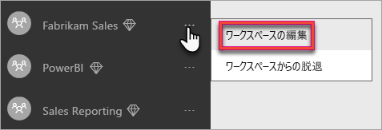
2. **[ワークスペースの編集]** で、**[詳細]** を展開します。
3. いずれかの容量に対して容量の割り当てアクセス許可が付与されている場合は、このワークスペースに対して **[Premium]** をオンにすることができます。
4. このアプリ ワークスペースを割り当てる容量を選択します。

    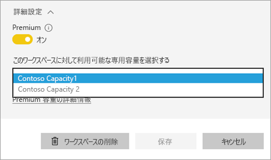
5. **[保存]** を選択します。

保存すると、ワークスペース、およびそのすべてのコンテンツが Premium 容量に移動されます。エンド ユーザーのエクスペリエンスが中断されることはありません。

## ユーザーに表示される Premium
ほとんどの場合、ユーザーが Premium 容量を使用しているかを認識する必要はありません。 ユーザーのダッシュボードとレポートは機能します。 視覚的ヒントとして、Premium 容量内のワークスペースの横にひし形のアイコンが表示されます。

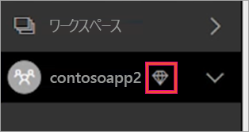

## Power BI Report Server のプロダクト キー
Power BI 管理者ポータルの **[容量の設定]** タブでは、Power BI Report Server のプロダクト キーにアクセスできます。 これが可能なのは、グローバル管理者、または Power BI サービス管理者ロールが割り当てられているユーザーのみで、Power BI Premium SKU を購入している場合だけです。

![[容量の設定] の Power BI Report Server キー](media/service-admin-premium-manage/pbirs-product-key.png)

**[Power BI Report Server キー]** を選択すると、プロダクト キーを含むダイアログが表示されます。 これをコピーして、インストールで使用することができます。

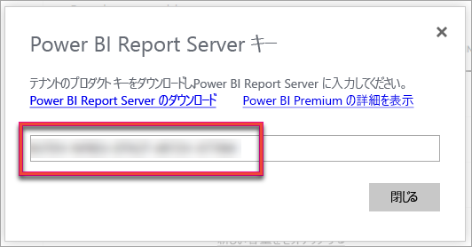

詳細については、「[Power BI Report Server のインストール](report-server/install-report-server.md)」を参照してください。

## 次の手順
Premium 容量にワークスペースを割り当てるときに、発行されたアプリを無料ユーザーと共有します。 詳細については、「[Power BI でのアプリの作成および配布](service-create-distribute-apps.md)」を参照してください。

他にわからないことがある場合は、 [Power BI コミュニティで質問してみてください](http://community.powerbi.com/)。
