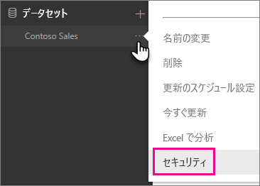
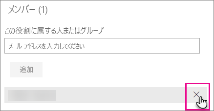
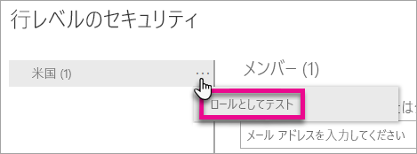
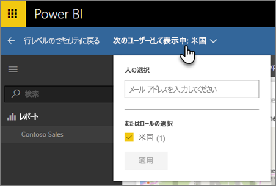

# Power BI での行レベルのセキュリティ (RLS)
<iframe width="560" height="315" src="https://www.youtube.com/embed/67fK0GoVQ80?showinfo=0" frameborder="0" allowfullscreen></iframe>

Power BI で行レベル セキュリティ (RLS) を使用すると、特定のユーザーのデータ アクセスを制限できます。 フィルターは、行レベルでデータを制限します。 役割内でフィルターを定義できます。

Power BI Desktop で Power BI にインポートされたデータ モデルの RLS を構成できます。 SQL Server などの DirectQuery を使用しているデータセットに RLS を構成することもできます。 これまで、RLS を実装できるのは、Power BI の外部にあるオンプレミスの Analysis Services モデル内だけでした。 Analysis Services のライブ接続では、オンプレミスのモデルに行レベルのセキュリティを構成します。 このセキュリティ オプションは、ライブ接続データセットには表示されません。

[!INCLUDE [include-short-name](./includes/rls-desktop-define-roles.md)]

[!INCLUDE [include-short-name](./includes/rls-desktop-view-as-roles.md)]

## モデルのセキュリティの管理
データ モデルのセキュリティを管理するには、次の操作を行います。

1. データセットの**省略記号 [...]** を選択します。
2. **[セキュリティ]** を選択します。
   
   

移動先の RLS ページで、Power BI Desktop で作成した役割にメンバーを追加できます。 [セキュリティ] は、データセットの所有者のみに表示されます。 データセットがグループ内にある場合、セキュリティ オプションは、グループの管理者だけに表示されます。 

Power BI Desktop 内でのみ、役割を作成または変更できます。

## メンバーの操作
### メンバーの追加
役割にメンバーを追加するには、追加するユーザー、セキュリティ グループ、または配布リストのメール アドレスまたは名前を入力します。 このメンバーは、組織内に存在する必要があります。 Power BI 内に作成したグループは追加できません。

役割名または [メンバー] の横のかっこ内の数字は、その役割に属しているメンバーの数を示します。

### メンバーの削除
メンバーを削除するには、メンバー名の横の [X] を選択します。 

## Power BI サービス内でのロールの検証
役割をテストすることで、定義した役割が正しく動作することを検証することができます。 

1. 役割の横にある**省略記号 (...)** を選択します。
2. **[ロールとしてデータをテスト]** を選択します。

この役割で使用できるレポートが表示されます。 このビューにはダッシュ ボードは表示されません。 上部の青色のバーの中に、適用される内容が表示されます。

**[Now viewing as (次の表示)]** を選択することで、その他の役割、または役割の組み合わせをテストすることができます。

特定のユーザーとしてデータを表示できます。または、役割の組み合わせを選択してそれらの動作を検証できます。 

通常の表示に戻るには、**[行レベルのセキュリティに戻る]** を選択します。

[!INCLUDE [include-short-name](./includes/rls-usernames.md)]

## Power BI での RLS とアプリ ワークスペースの使用
Power BI サービス内のアプリ ワークスペースに Power BI Desktop レポートを発行した場合、役割は読み取り専用のメンバーに適用されます。 メンバーはアプリ ワークスペース設定内の Power BI コンテンツだけを表示できることを示す必要があります。

> [!WARNING]
> メンバーが編集アクセス許可を持つようにアプリ ワークスペースを構成している場合、RLS の役割は適用されません。 ユーザーはすべてのデータを確認できます。
> 
> 

[!INCLUDE [include-short-name](./includes/rls-limitations.md)]

[!INCLUDE [include-short-name](./includes/rls-faq.md)]

## 次の手順
[Power BI Desktop での行レベルのセキュリティ (RLS)](desktop-rls.md)  

他にわからないことがある場合は、 [Power BI コミュニティで質問してみてください](http://community.powerbi.com/)。

