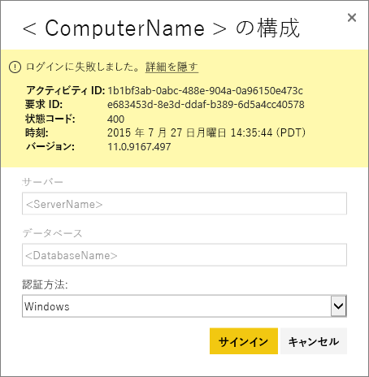
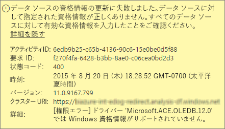
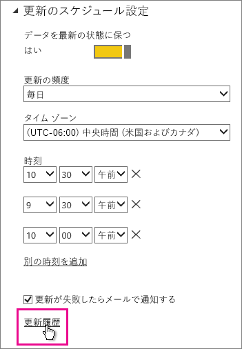
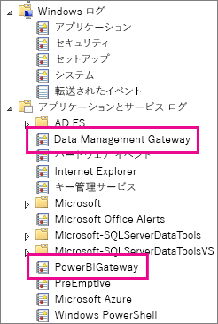
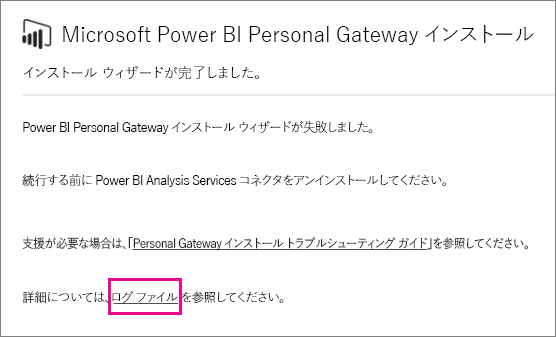
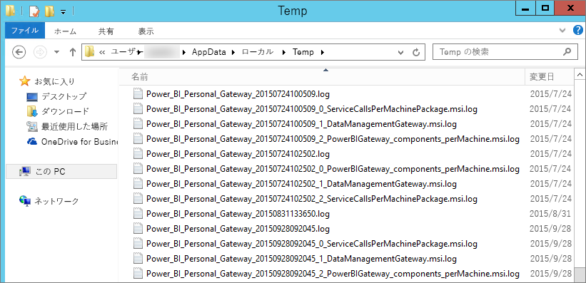

# Power BI Gateway - Personal のトラブルシューティング
以下では、Power BI Gateway - Personal を使用する際に発生する一般的な問題について説明します。

> [!NOTE]
> 個人用のゲートウェイの現在のバージョンは、**オンプレミス データ ゲートウェイ (個人用)** です。 このバージョンを使用する場合は、現在インストールしているバージョンを更新してください。
> 
> 

## 最新のバージョンに更新する
多くの問題は、ゲートウェイのバージョンが期限切れになると発生します。  常に最新のバージョンを使用することは一般に適切な方法です。  ゲートウェイを 1 か月以上更新していない場合は、ゲートウェイの最新バージョンのインストールを検討して問題が再発するかどうかを確認することをお勧めします。

## インストール
**Personal Gateway は 64 ビット** - 使用しているコンピューターが 32 ビットである場合は、Personal Gateway をインストールできません。 オペレーティング システムは 64 ビットである必要があります。 64 ビット バージョンの Windows をインストールするか、64 ビットのコンピューターに Personal Gateway をインストールする必要があります。

**ユーザーがコンピューターのローカル管理者であるにもかかわらずパーソナル ゲートウェイのサービスとしてのインストールに失敗した** - ユーザーが、コンピューターのローカル管理者グループのメンバーであるものの、グループ ポリシーで対象ユーザー名をサービスとしてログオンすることが許可されていない場合、インストールが失敗する可能性があります。  当面は、グループ ポリシーで、ユーザーがサービスとしてログオンすることを許可してください。 この問題の修正に取り組んでいます。 [詳細情報](https://technet.microsoft.com/library/cc739424.aspx)

**操作がタイムアウトした** - これは、パーソナル ゲートウェイをインストールしているコンピューター (物理マシンまたは仮想マシン) に搭載されているのが単一コア プロセッサである場合に一般的なことです。 すべてのアプリケーションを閉じ、不要なプロセスすべてをオフにしてもう一度インストールしてください。

**パーソナル ゲートウェイと同じコンピューターに、Data Management Gateway または Analysis Services Connector をインストールできない** - Analysis Services Connector または Data Management Gateway が既にインストールされている場合は、コネクタまたはゲートウェイをまずアンインストールしてから、パーソナル ゲートウェイをインストールする必要があります。

> [!NOTE]
> インストール中に問題が発生した場合は、セットアップ ログに問題の解決に役立つ情報が記録されている可能性があります。 詳しくは、「[Setup Logs (セットアップ ログ)](#SetupLogs)」をご覧ください。
> 
> 

 **プロキシの構成** お使いの環境でプロキシを使用する必要がある場合は、パーソナル ゲートウェイの構成で問題が発生する可能性があります。 プロキシの構成方法の詳細については、「[Power BI Gateway のプロキシ設定を構成する](service-gateway-proxy.md)」を参照してください。

## 更新のスケジュール設定
**エラー: The credential stored in the cloud is missing. (クラウドに格納されている資格情報がありません。)**

スケジュールされている更新がある場合にパーソナル ゲートウェイをアンインストールしてから再インストールすると、\<データセット\> の [設定] にこのエラーが表示されることがあります。 パーソナル ゲートウェイをアンインストールすると、更新用に構成されているデータセットのデータ ソース資格情報が、Power BI サービスから削除されます。

**解決方法:** Power BI で、データセットの [設定の更新] に移動します。 [データ ソースの管理] で、エラーがあるいずれかのデータ ソースに関して [資格情報の編集] をクリックし、もう一度、そのデータ ソースにサインインします。

**エラー: データセットに提供されている資格情報が無効です。続行するには、[更新] または [データ ソースの設定] ダイアログ ボックスで資格情報を更新してください。**

**解決策**: 資格情報についてのメッセージが表示される場合、次の原因が考えられます。

* データ ソースへのサインインに使用しているユーザー名とパスワードが最新のものであることを確認します。 Power BI で、対象データ セットの [設定の更新] に移動します。 [データ ソースの管理] にある [資格情報の編集] をクリックし、データ ソースの資格情報を更新します。
* クラウド ソースとオンプレミス ソースの間のマッシュアップを単一のクエリで実現しようとすると、いずれかのソースが認証に OAuth を使用している場合、パーソナル ゲートウェイでの更新に失敗します。 この一例として、CRM Online とローカル SQL Server の間のマッシュアップが挙げられます。 CRM Online で OAuth が必要なため、これは失敗します。
  
  これは既知の問題であり、現在調査中です。 この問題を回避するには、クラウド ソースとオンプレミス ソースに対して個別のクエリを指定し、マージまたは追加を実行するクエリを使用して、それらを結合します。

**エラー: Unsupported data source. (サポートされていないデータ ソースです。)**

**解決策:** [更新のスケジュール設定] でサポートされていないデータ ソースであることを示すメッセージが表示される場合、次のことを意味する可能性があります。 

* 現在、このデータ ソースは Power BI での更新がサポートされていません。 
* Excel ブックにワークシート データのみが含まれ、データ モデルが含まれていません。 現在 Power BI で更新がサポートされているのは、アップロードされた Excel ブックにデータ モデルが含まれている場合だけです。 Excel で Power Query を使用してデータをインポートする場合には、データ モデルにデータをロードするオプションを必ず選択してください。 これにより、データ モデルにデータがインポートされます。 

**エラー: [データを結合できません] &lt;query part&gt;/&lt;…&gt;/&lt;…&gt; が、同時に使用できないプライバシー レベルの複数のデータ ソースにアクセスしています。このデータの組み合わせを再構築してください。**

**解決策**: このエラーは、プライバシー レベルの制限と、使用しているデータ ソースの種類によって発生します。

**エラー: データ ソース エラー: 値 "\[Table\]" を型 Table に変換できません。**

**解決策**: このエラーは、プライバシー レベルの制限と、使用しているデータ ソースの種類によって発生します。

**エラー: There is not enough space for this row. (この行に十分な領域がありません。)**

このエラーは、1 つのサイズが 4 MB を超える行がある場合に発生します。 データ ソースから行を特定し、その行をフィルターで除外するか、その行のサイズを減らす必要があります。

## データ ソース
**データ プロバイダーがない** – パーソナル ゲートウェイは 64 ビット専用です。 つまり、パーソナル ゲートウェイのインストール先コンピューターに、64 ビット バージョンのデータ プロバイダーをインストールする必要があります。 たとえば、データセット内のデータ ソースが Microsoft Access の場合は、パーソナル ゲートウェイがインストールされているのと同じコンピューターに 64 ビットの ACE プロバイダーをインストールする必要があります。  

>[!NOTE]
>32 ビット Excel の場合には、同じコンピューターに 64 ビット ACE プロバイダーをインストールすることはできません。

**Access データベースで Windows 認証がサポートされない** - 現在 Power BI がサポートしているのは Access データベースの匿名認証のみです。 Access データベースで Windows 認証を有効にするように取り組んでいるところです。

**データ ソースの資格情報を入力するときにサインイン エラーが発生する** - データ ソースに Windows 資格情報を入力するとこの種のエラーが表示される場合には、パーソナル ゲートウェイが古いバージョンである可能性があります。 [最新バージョンの Power BI Gateway - Personal をインストール](https://powerbi.microsoft.com/gateway/)してください。

  

**エラー: ACE OLEDB を使用して、データ ソースに対して Windows 認証を選択するときに、サインイン エラーが発生する** - ACE OLEDB プロバイダーを使用して、データ ソースのデータ ソース資格情報を入力するときに、次のエラーが発生することがあります。

現在、Power BI では ACE OLEDB プロバイダーを使用したデータ ソースに対する Windows 認証はサポートされていません。

**解決策:** このエラーを回避するには、匿名認証を選択できます。 従来の ACE OLEDB プロバイダーでは、匿名の資格情報と Windows 資格情報は同じです。

## タイルの更新
ダッシュボード タイルの更新時にエラーが発生する場合は、次の記事を参照してください。

[タイルのエラーのトラブルシューティング](refresh-troubleshooting-tile-errors.md)

## トラブルシューティングするためのツール
### 更新履歴
発生したエラーを確認するために**更新履歴**が役に立つことがあり、サポート依頼を作成する必要がある場合は有用なデータを提供します。 スケジュールされた更新のほか、オンデマンドの更新も表示できます。 **更新履歴**を取得する方法を次に示します。

1. Power BI ナビゲーション ウィンドウの **[データセット]** で、データセットを選択してから、&gt;[メニューを開く] &gt; **[更新のスケジュール設定]** を選択します。
   
2. **[設定]**&gt; **[更新のスケジュール設定]** で、**[更新履歴]** を選択します。  
   
   
   

### イベント ログ
情報を提供するいくつかのイベント ログがあります。 最初の 2 つのイベントである **Data Management Gateway** と **PowerBIGateway**は、コンピューター上の管理者に対して表示されます。  管理者ではないユーザーが Personal Gateway を使用している場合は、 **アプリケーション** ログ内にログ エントリが表示されます。

**Data Management Gateway** と **PowerBIGateway** ログは、 **アプリケーションとサービス ログ**の下に表示されます。

### Fiddler のトレース
[Fiddler](http://www.telerik.com/fiddler) は、HTTP トラフィックを監視する Telerik 提供の無償ツールです。  クライアント コンピューターから Power BI サービスによるやり取りを確認できます。 これにより、エラーとその他の関連する情報が表示される場合があります。

### セットアップ ログ
**Personal Gateway** のインストールに失敗した場合、セットアップ ログを表示するためのリンクが表示されます。 これにより、障害の詳しい情報が表示される場合があります。 これは Windows のインストール ログで、MSI ログとも呼ばれます。 これらのログは非常に複雑で、読み解くのが困難です。 通常は下部にエラーが示されますが、エラーの原因を特定するのは簡単ではありません。 見ているものが別のログのエラーの結果であることも、ログの上の部分に含まれているエラーの結果であることもあります。

また、**Temp フォルダー** (%temp%) に移動して、**Power\_BI\_** で始まるファイルを検索することもできます。

> [!NOTE]
> %temp% に移動すると、temp のサブフォルダーに移動する場合があります。**Power\_BI\_** ファイルは、temp ディレクトリのルート内にあります。  1 レベルまたは 2 レベル上に移動する必要がある場合があります。
> 
> 

## 次の手順
[Power BI Gateway のプロキシ設定を構成する](service-gateway-proxy.md)  
[データ更新](refresh-data.md)  
[Power BI Gateway - Personal](personal-gateway.md)  
[タイルのエラーのトラブルシューティング](refresh-troubleshooting-tile-errors.md)  
[オンプレミス データ ゲートウェイのトラブルシューティング](service-gateway-onprem-tshoot.md)  
他にわからないことがある場合は、 [Power BI コミュニティを利用してください](http://community.powerbi.com/)。

