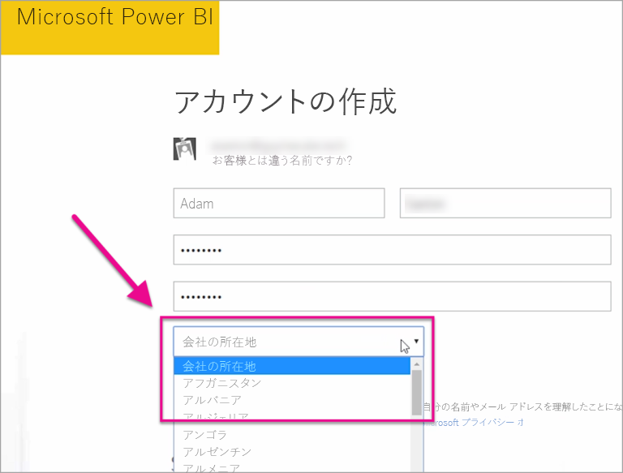

# Power BI テナントの場所
<iframe width="560" height="315" src="https://www.youtube.com/embed/0fOxaHJPvdM?showinfo=0" frameborder="0" allowfullscreen></iframe>

Power BI テナントが配置される場所およびその場所を選択する方法について説明します。 サービスを使用するときに影響する可能性があるので、これを理解しておくこと重要です。

## Power BI テナントの場所を確認する方法
テナントの場所は次の方法で確認できます。

1. **[?]** ( Power BI サービス) を選択します。
2. **[About Power BI]** (Power BI のバージョン情報) を選択します。
3. **[データの保存先]** の隣の値を確認します。 これがテナントの場所です。

## データ領域を選択する方法
データ領域は、テナントを最初に作成するときに選択した国に基づいています。 この情報は共有されるので、これは Power BI だけでなく Office 365 のサインアップにも適用されます。 新しいテナントの場合、サインアップ時に国のドロップダウンが表示されます。

この選択により、データの格納場所が決まります。 Power BI では、この選択に最も近いデータ領域が使用されます。

> [!WARNING]
> この選択は変更できません。
> 
> 

他にわからないことがある場合は、 [Power BI コミュニティを利用してください](http://community.powerbi.com/)。

