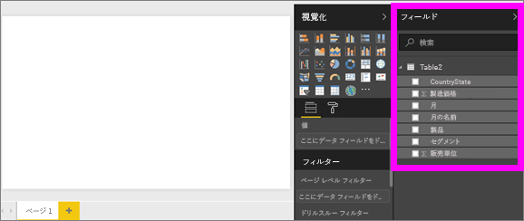
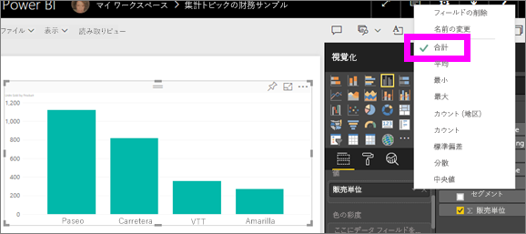
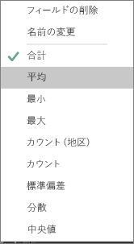
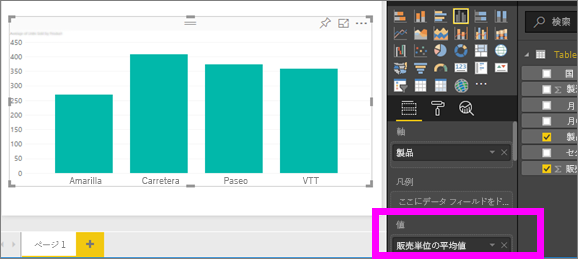
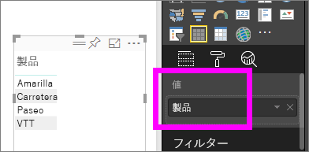
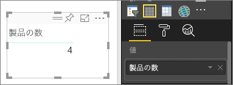
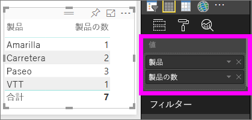

# Power BI の視覚エフェクトでの集計
## 集計とは
データの値を数学的に結合したい場合があります。 数学的演算には、合計、平均、最大、カウントなどがあります。データの値を結合することを、*集計*といいます。 その数学的演算の結果は "*集計値*" です。 

Power BI サービスと Power BI Desktop は、視覚エフェクトを作成する際にデータを集計する場合があります。 多くの場合、必要なのは集計のみですが、別の方法で値を集計する場合もあります。  たとえば、合計と平均について考えてみます。 視覚エフェクトで使用されている集計を管理して変更する方法はいくつかあります。

まず、データの*型* を見てましょう。データの型によって、データの集計方法と、集計できるかどうかを判別します。

## データの型
ほとんどのデータセットには複数のデータ型があります。 最も基本的なレベルでは、データは数値であるか、存在しません。 数値データは、合計、平均、カウント、最小、差異などを使用して集計できます。 テキスト データ (多くの場合、*カテゴリ* データと呼ばれる) でも集計できます。 (**値**や**ツールチップ**のような数値のみのバケットに配置して) カテゴリ別フィールドを集計しようとすると、Power BI は各カテゴリの発生または別個の発生をカウントします。 日付のような特別な種類のデータには独自の集計オプションがいくつか (最も早い、最終、最初、最後) あります。 

例を以下に示します。
- **販売数**と**製造価格**は、数値データを含む列です。
-  **セグメント**、**国**、**製品**、**月**、**月名**にはカテゴリ データが含まれます。

   

Power BI で視覚エフェクトを作成する場合、一部のカテゴリ別フィールドで数値フィールドが集計されます (既定値は*合計* です)。  たとえば、"***製品別*** 販売数"、"***月別*** 販売数"、"***セグメント別*** 製造価格" です。 いくつかの数値フィールドは**メジャー**と呼ばれます。 Power BI レポート エディターではメジャーを簡単に識別できます。メジャーは、フィールド リストに ∑ シンボルと共に表示されます。 詳しくは、「[レポート エディター...紹介を見る](service-the-report-editor-take-a-tour.md)」をご覧ください。

## 集計が思い通りに動作しないのはなぜですか?
Power BI サービスの集計は、使い方がわかりにくいことがあります。数値フィールドがあるとき、集計を変更できないのでしょうか。 それとも、年度のようなフィールドがあるとき、集計せず、発生数だけを数えたいのでしょうか。

ほとんどの場合、問題の原因は、データセットにおけるフィールドの定義方法にあります。 フィールドがテキストとして定義されている可能性があります。その場合、合計や平均を求めることができません。 残念ながら、[フィールドの分類方法を変更できるのはデータセットのオーナーだけです](desktop-measures.md)。 したがって、データセットに対する所有者アクセス許可がある場合は、Desktop またはデータセットの作成に使用したプログラム (Excel など) で、この問題を解決することができます。 それ以外の場合は、支援を得るためにデータセットの所有者に連絡する必要があります。  

解決方法として、この記事の終わりに「**考慮事項とトラブルシューティング**」という特別なセクションを用意しています。  そこで回答が見つからない場合、[Power BI コミュニティ フォーラム](http://community.powerbi.com)にご質問をご投稿ください。Power BI チームが直接回答いたします。

## 数値フィールドの集計方法の変更
製品別に販売数を合計するグラフを、平均を算出するグラフに変更してみましょう。 

1. カテゴリとメジャーを使用するグラフを作成します。 この例では、製品別販売数を使用します。  既定では、Power BI は、製品 (軸ウェルのカテゴリ) ごとに販売数 (値ウェルのメジャー) を合計するグラフを作成します。

   

2. [視覚化] ウィンドウで、メジャーを右クリックして、必要な集計の種類を選択します。 この例では、[平均] を選択します。 必要な集計が表示されない場合は、後述の「考慮事項とトラブルシューティング」を参照してください。  
   
   
   
   > [!NOTE]
   > ドロップダウンで使用できるオプションは、1) 選んだフィールドと、2) そのフィールドがデータセットの所有者によって分類された方法によって異なります。
   > 
3. これで視覚エフェクトでは平均別の集計が使用されます。

   

##    データの集計方法

フィールド集計に使用できる可能性のあるオプションの一部を次に示します。

* **集計しない**。 このオプションを選択すると、そのフィールド内の各値が個別に扱われ、集計されません。 これは多くの場合、合計しない数値 ID 列がある場合に使用します。
* **合計**。 このオプションを選択すると、そのフィールド内のすべての値が加算されます。
* **平均**。 値の算術平均が算出されます。
* **最小**。 最小値が示されます。
* **最大**。 最大値が示されます。
* **カウント (空白なし)**。 このオプションを選択すると、そのフィールド内の空白以外の値の数がカウントされます。
* **カウント (個別)** このオプションを選択すると、そのフィールド内の個別の値の数がカウントされます。
* **標準偏差**
* **分散**。
* **中央値**。  中央値を示します。 これは、上と下に同数の項目がある値です。  中央値が 2 つある場合、Power BI はそれらの平均値を求めます。

たとえば、次のようなデータがあるとします。

| 国 | 量 |
|:--- |:--- |
| 米国 |100 |
| 英国 |150 |
| カナダ |100 |
| ドイツ |125 |
| フランス | |
| 日本 |125 |
| オーストラリア |150 |

結果は次のようになります。

* **集計しない**: それぞれの値が個別に表示される
* **合計**: 750
* **平均**: 125
* **最大**: 150
* **最小**: 100
* **Count (Not Blanks)** (データの個数 (空白以外)): 6
* **データの個数 (個別)** : 4
* **標準偏差** : 20.4124145...
* **分散** : 416.666...
* **中央値** : 125

## カテゴリ (テキスト) フィールドを使用して集計を作成する
数値以外のフィールドを集計することもできます。 たとえば、製品名フィールドがある場合は、それを値として追加してから、**[カウント]**、**[個別のカウント]**、**[最初]**、または **[最後]** に設定します。 

1. この例では、**Product** フィールドを値ウェルにドラッグしています。 通常、値ウェルは数値フィールドに使用されます。 Power BI は、これがテキスト フィールドであると認識し、集計を **[集計しない]** に設定して、単一列テーブルを表示します。
   
   
2. 集計を既定の **[集計しない]** から **[カウント (個別)]** に変更すると、Power BI は異なる製品の数をカウントします。 この例では、4 となります。
   
   
3. 集計を **[カウント]** に変更すると、Power BI は合計数をカウントします。 この例では、**Product** に 7 個のエントリがあります。 
   
   

4. 同じフィールド (この例では、**Product**) を値ウェルにドラッグし、既定の集計の **[集計しない]** のままにすると、Power BI は製品別にカウントを分類します。

   

## 考慮事項とトラブルシューティング
質問:  **[集計しない]** オプションが表示されないのはなぜですか?

回答: 選択しているフィールドが、Excel または [Power BI Desktop](desktop-measures.md) で作成された計算メジャーまたは詳細メジャーである可能性があります。 それぞれの計算メジャーには、独自のハードコーディングされた式があります。 使用中の集計を変更することはできません。  たとえば、それが合計である場合、使用できるのは合計のみとなります。 フィールドの一覧では、*計算メジャー* が計算機記号と共に表示されます。

質問:  フィールドは**数値**ですが、選択肢が **[カウント]** と **[個別のカウント]** だけなのはなぜですか?

回答 1:  考えられる説明としては、データセットの所有者が意図せず、あるいは意図的にフィールドを数値として分類*していません*。 たとえば、データセットに**年**フィールドがある場合、**年**フィールドは合計や平均化ではなくカウントされる (たとえば、1974 年に生まれた人の数) ことの方が多いため、データセットの所有者がテキストとして分類している可能性があります。 オーナーであれば、Power BI Desktop でデータセットを開き、**[モデリング]** タブでデータ型を変更できます。  

回答 2: フィールドに計算機アイコンが付いている場合、そのフィールドは*計算メジャー* です。計算メジャーには独自のハードコーディングされた式があり、データセットの所有者のみが変更できます。 使用される計算は平均や合計のような単純な集計の場合もあれば、"親カテゴリに対する貢献の割合" や "年度開始から現在までの合計" のような複雑なものになる場合もあります。 Power BI では、結果の合計または平均は求められず、代わりに (ハード コーディングされた式を利用して) データ ポイントごとに再計算が行われます。

回答 3:  別の可能性としては、フィールドが*バケット* に配置されています。その場合、カテゴリ値のみが許可されます。  選択肢は、カウントと個別のカウントだけになります。

回答 4:  3 つ目の可能性としては、軸に対してフィールドを使用しています。 たとえば、Power BI では、棒グラフの軸で、個別の値ごとに棒が 1 本表示されます。フィールド値はまったく集計されません。 

>[!NOTE]
>このルールの例外は散布図です。X 軸と Y 軸に集計値が*要求されます*。

質問:  散布図がありますが、フィールドで集計*したくありません*。  どうすれば集計しないようにできますか?

回答:  フィールドを X 軸バケットまたは Y 軸バケットではなく**詳細**バケットに追加してください。

質問:  視覚エフェクトに数値フィールドを追加すると、ほとんどは初期設定で合計になりますが、平均、カウント、またはその他の集計になるものもあります。  既定の集計が常に同じではないのはなぜですか?

回答:  データセット オーナーは、フィールドごとに既定の集計を設定できます。 データセット オーナーであれば、Power BI Desktop の **[モデリング]** タブで既定の集計を変更できます。

質問:  私はデータセット オーナーです。フィールドが絶対に集計されないようにしたいのですが。

回答:  Power BI Desktop の **[モデリング]** タブで、**[データ型]** を **[テキスト]** に設定します。

質問:  ドロップダウンの選択肢に **[集計しない]** が表示されません。

回答:  フィールドを削除し、もう一度追加してみてください。

他にわからないことがある場合は、 [Power BI コミュニティを利用してください](http://community.powerbi.com/)。

