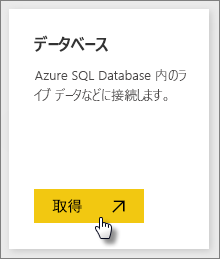
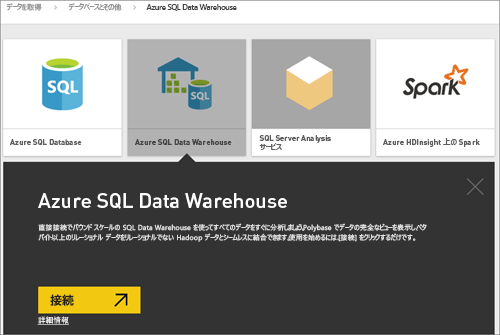
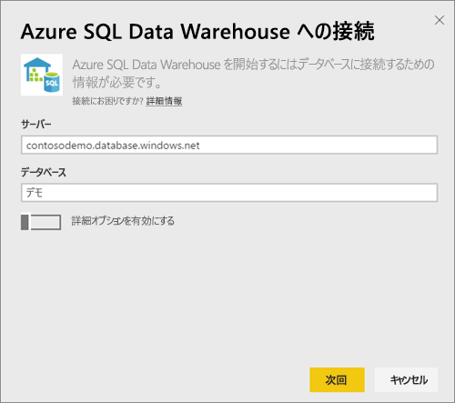
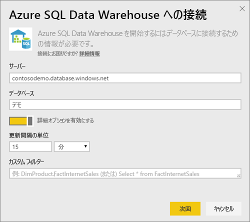
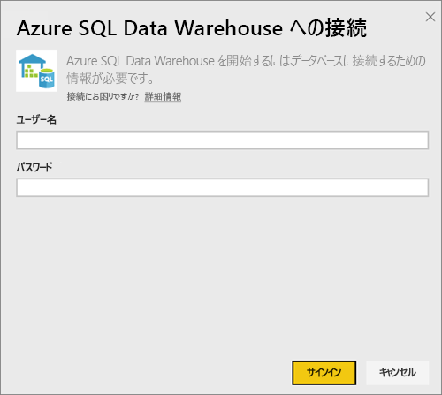
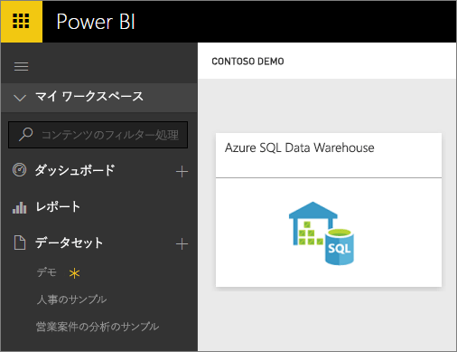
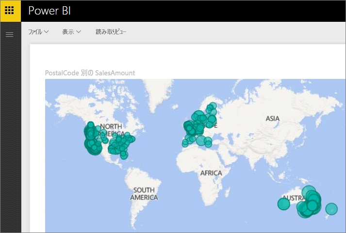
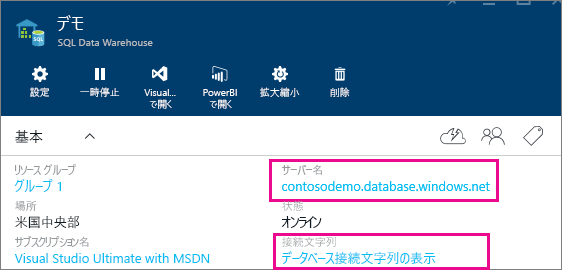

# Azure SQL Data Warehouse と DirectQuery
Azure SQL Data Warehouse と DirectQuery を使用すると、Azure SQL Data Warehouse に既に含まれているデータとメトリックに基づいて動的なレポートを作成できます。 DirectQuery を使用すると、データを探索するときにクエリが Azure SQL Data Warehouse に送り返されます。 これを SQL Data Warehouse のスケールと組み合わせることで、ユーザーはテラバイトのデータに対し、分単位で動的なレポートを作成することができます。 さらに、 **[Power BI で開く]** ボタンを使用すると、ユーザーは手動で情報を指定しなくても、Power BI を SQL Data Warehouse に直接接続することができます。

SQL Data Warehouse コネクタを使用する場合:

* 接続するときに、完全修飾のサーバー名を指定します (詳細については後述します)。
* サーバーのファイアウォール ルールが「Azure サービスに対するアクセスを許可」するように構成されていることを確認してください。
* 列の選択、フィルターの追加など、どの操作によってもクエリが直接データ ウェアハウスに対して行われます。
* タイルは、約 15 分ごとに更新するように設定されているため、更新をスケジュール設定する必要はありません。  この動作は、接続するときに [詳細] 設定で調整できます。
* DirectQuery データセットの Q&A は使用できません。
* スキーマ変更は自動選択されません。

これらの制限および注意事項については、エクスペリエンスの向上に伴い変更される可能性があります。 接続するための手順の詳細を以下に示します。

## [Power BI で開く] ボタンの使用
SQL Data Warehouse と Power BI の間で移動する最も簡単な方法は、Azure プレビュー ポータルの **[Power BI で開く]** ボタンを使用することです。 このボタンを使用すると、Power BI で新しいダッシュボードの作成をシームレスに開始できるようになります。

1. 開始するには、Azure プレビュー ポータルの SQL Data Warehouse のインスタンスに移動します。 この時点では、SQL Data Warehouse は Azure プレビュー ポータルにのみ表示されることに注意してください。
2. **[Power BI で開く]** ボタンをクリックする
   
    
3. 自動的にサインインできない場合、または Power BI アカウントがない場合は、サインインする必要があります。
4. SQL Data Warehouse からの情報があらかじめ入力されている、SQL Data Warehouse 接続ページに移動します。 資格情報を入力し、接続をクリックして接続を作成します。

## Power BI 経由で接続する
SQL Data Warehouse は、Power BI の [データの取得] ページにも表示されます。 

1. 左側のナビゲーション ウィンドウの下部にある **[データの取得]** を選択します。  
   
    
2. **[データベース]** で **[取得]** を選択します。
   
    
3. **[SQL Data Warehouse**]、\>**[接続] の順に選択します**。
   
    
4. 接続するために必要な情報を入力します。 以下の **[検索パラメーター]** セクションは、このデータが Azure Portal のどこに配置されているかを示します。
   
    
   
    
   
    
   
   > [!NOTE]
   > ユーザー名は Azure SQL Data Warehouse インスタンスで定義されているユーザーになります。
   > 
   > 
5. アスタリスクで示される、新しいタイルまたは新しく作成されたデータセットを選択すると、データセットの詳細を表示します。 このデータセットは、データベースと同じ名前になります。
   
    
6. すべてのテーブルと列を調べることができます。 列を選択すると、クエリがソースに送り返されて、ビジュアルが動的に作成されます。 フィルターもクエリに変換され、データ ウェアハウスに戻されます。 これらのビジュアルは、新しいレポートに保存したり、ダッシュボードに戻してピン留めしたりできます。
   
    

## パラメーターの値の見つけ方
完全修飾サーバー名とデータベース名は、Azure プレビュー ポータルで確認できます。 この時点では、SQL Data Warehouse は Azure プレビュー ポータルにのみ表示されることに注意してください。

> [!NOTE]
> Power BI テナントが Azure SQL Data Warehouse と同じリージョン内にある場合、送信料は発生しません。 Power BI テナントが置かれている場所を確認するには、[こちらの手順](https://docs.microsoft.com/power-bi/service-admin-where-is-my-tenant-located)を使用してください。
>

## 次の手順
[Power BI の概要](service-get-started.md)  
[Power BI のデータの取得](service-get-data.md)  
[Azure SQL Data Warehouse](https://azure.microsoft.com/documentation/services/sql-data-warehouse/)  

他にわからないことがある場合は、 [Power BI コミュニティを利用してください](http://community.powerbi.com/)。