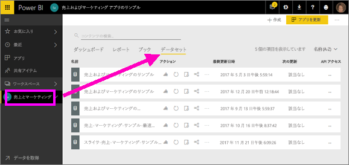
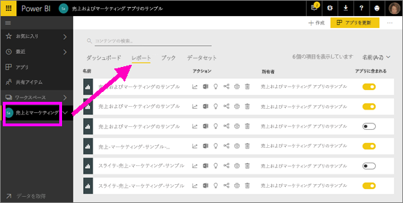

# Power BI - Power BI サービスの基本的な概念

この記事は、読者は既に [Power BI サービスにサインアップ](service-self-service-signup-for-power-bi.md)し、[いくつかデータを追加](service-get-data.md)してあることを想定して書かれています。

Power BI サービスを開くと、"***ダッシュボード***" が表示されます。 ダッシュボードは、Power BI サービスが Power BI Desktop と異なる点です。

Power BI サービス UI の主な機能は次のとおりです。

1. ナビゲーション ウィンドウ (左ナビゲーション)
2. キャンバス (ここでは、タイルを含むダッシュボード)
3. Q&A 質問ボックス
4. アイコン ボタン (ヘルプとフィードバックを含みます)
5. ダッシュボード タイトル (ナビゲーション パス、階層リンクとも呼ばれます)
6. Office 365 アプリ起動ツール
7. Power BI ホーム ボタン
8. ラベルの付いたアイコン ボタン

これらについては後に詳しく説明しますが、まずいくつかの Power BI の概念を確認します。

または、この記事を読み進む前にまず次のビデオを見ていただいてもかまいません。  このビデオを見ると、Power BI サービスの基本的な概念と概要を理解できます。

<iframe width="560" height="315" src="https://www.youtube.com/embed/B2vd4MQrz4M" frameborder="0" allowfullscreen></iframe>

## Power BI の概念
Power BI の 4 つの主要な構成要素は、"***ダッシュボード***"、"***レポート***"、"***ブック***"、"***データセット***" です。 これらはすべて、"***ワークスペース***" にまとめられています。 4 つの構成要素について詳しく説明する前に、ワークスペースを理解しておくことが重要なので、最初にワークスペースについて説明します。 

## ワークスペース
ワークスペースは、Power BI のダッシュボード、レポート、ブック、データセットのコンテナーです。 ワークスペースには、"*マイ ワークスペース*" とアプリ ワークスペースの 2 種類があります。 ところで、"*アプリ*" とは何でしょうか。 Power BI の "*アプリ*" とは、組織に主要な指標を提供するために作成されたダッシュボードとレポートの集まりです。 アプリは対話型ですが、編集することはできません。 

- "*マイ ワークスペース*" は、ワークスペースのコンテンツを使う Power BI ユーザー向けの個人用ワークスペースです。 ユーザーは自分のマイ ワークスペースにのみアクセスできます。 コンテンツを共有するにはいくつかの方法があります。アプリ ワークスペースを作成し、コンテンツを "*アプリ*" にバンドルして、組織内の他のユーザーがそれを使用できるようにすることができます。または、アプリ ワークスペースを作成し、同僚にそのワークスペースへのアクセス権を付与して、共有および共同作業できるようにすることができます。     
-  "*アプリ ワークスペース*" は、同僚とコンテンツを共同作業および共有するために使われます。 組織向けアプリを作成、公開、管理する場でもあります。 Power BI アプリを構成するコンテンツのステージング領域およびコンテナーと考えることができます。 アプリ ワークスペースに同僚を追加して、ダッシュボード、レポート、ブック、データセットの共同作業を行うことができます。 アプリ ワークスペースのすべてのメンバーには Power BI Pro のライセンスが必要ですが、アプリ コンシューマー (アプリにアクセスできる同僚) には Pro のライセンスは必要ありません。  

詳しくは、目次の「**作業の共有**」セクションの「[ダッシュボードとレポートを共同作業および共有する方法](service-how-to-collaborate-distribute-dashboards-reports.md)」以降をご覧ください。

次に、Power BI の構成要素について説明します。 ダッシュボードやレポートは、データがないと使用できません (空のダッシュボードや空のレポートを設けることもできますが、データが取り込まれるまでは利用価値がありません)。そのため、**データセット**から始めましょう。

## データセット
*データセット* は、*インポート先*または*接続先*となるデータのコレクションです。 Power BI を使うと、あらゆる種類のデータセットに接続してインポートし、すべてを 1 か所にまとめることができます。  

データセットは "*ワークスペース*" と関連付けられており、1 つのデータセットが多くのワークスペースの一部になることができます。 ワークスペースを開くと、関連付けられているデータセットが **[データセット]** タブに一覧表示されます。表示されている各データセットは、データの 1 つのソースを表します。たとえば、OneDrive の Excel ブック、オンプレミスの SSAS 表形式データセット、Salesforce データセットなどです。 多くのさまざまなデータ ソースがサポートされており、頻繁に新しいデータソースが追加されていきます。 [Power BI で使用できるデータセットの種類の一覧を参照してください](service-get-data.md)。

次の例は、"Sales and marketing" アプリ ワークスペースを選んで、**[データセット]** タブをクリックしたものです。

**1 つの** データセットを...

* 1 つのワークスペースまたは多くのワークスペースで繰り返し使うことができます。
* 多くのさまざまなレポートで使用できます。
* その 1 つのデータセットからの視覚エフェクトを、多くのさまざまなダッシュボードで表示できます。
  
  

[データセットに接続したりデータセットをインポートしたり](service-get-data.md)するには、**[データの取得]** (左ナビゲーションの一番下) を選ぶか、**[+ 作成] > [データセット]** (右上隅) を選びます。 手順に従って、特定のソースに接続するかソースをインポートして、アクティブなワークスペースにデータセットを追加します。 新しいデータセットは、黄色のアスタリスクで示されます。 Power BI で行う作業によって、基になるデータセットが変更されることはありません。

ユーザーが["***アプリ ワークスペース***" に属している](service-collaborate-power-bi-workspace.md)場合は、他のワークスペース メンバーが追加したデータセットも利用できます。

データセットの更新、名前変更、探索、削除を行うことができます。 データセットを使ってレポートを最初から作成するか、[クイック インサイト](service-insights.md)を実行します。  データセットを既に使っているレポートとダッシュボードを確認するには、**[関連の表示]** を選びます。 データセットを調べるには、そのデータセットを選択します。 実際の操作としては、レポート エディターでデータセットを開き、そこでデータの掘り下げと視覚エフェクトの作成を開始します。 それでは、次のトピック「レポート」に進みましょう。

### 詳細情報
* [Power BI Premium とは](service-premium.md)
* [Power BI のデータの取得](service-get-data.md)
* [Power BI 用のサンプル データセット](sample-datasets.md)

## レポート
Power BI レポートは、1 ページまたは複数ページの視覚エフェクト (折れ線グラフ、円グラフ、ツリーマップその他多くのチャートやグラフ) です。 視覚エフェクトは***ビジュアル***とも呼ばれます。 レポートのすべての視覚エフェクトは 1 つのデータセットから取得されます。 レポートは、Power BI でゼロから作成することも、共同作業者から共有されたダッシュボードと共にインポートすることもできます。または、Excel、Power BI Desktop、データベース、SaaS アプリケーション、[アプリ](service-get-data.md)からのデータセットに接続するときに作成することもできます。  たとえば、Power View シートを含む Excel ブックに接続するとき、Power BI はそのシートに基づくレポートを作成します。 SaaS アプリケーションに接続すると、Power BI は構築済みのレポートをインポートします。

レポートを表示して操作するための 2 つのモード ([読み取りビューと編集ビュー](service-reading-view-and-editing-view.md)) があります。  レポートの作成者、共同所有者、アクセス許可を付与されたユーザーのみがそのレポートの***編集ビュー***のすべての探索、設計、構築、共有機能へのアクセス権を持ちます。 それらの人物がレポートを共有した相手のみ、***読み取りビュー***を使用してレポートを探索および操作できます。   

ワークスペースを開くと、関連付けられているレポートが **[レポート]** タブに一覧表示されます。リストされている各レポートは、基になるただ 1 つのデータセットに基づく、視覚エフェクトの 1 つ以上のページを表します。 レポートを開くには、単にそれを選択します。 

アプリを開くと、ダッシュボードが表示されます。  基になるレポートにアクセスするには、レポートからピン留めされたダッシュボードのタイルを選びます (詳しくは後で説明)。 すべてのタイルがレポートからピン留めされているわけではないので、レポートを探すにはタイルをいくつかクリックすることが必要な場合があることに注意してください。 

既定では、レポートは読み取りビューで開きます。  編集ビューで開くには、**[レポートの編集]** を選びます (必要なアクセス許可がある場合)。 

次の例は、"Sales and marketing" アプリ ワークスペースを選んで、**[レポート]** タブをクリックしたものです。

**1 つの** レポートを...

* 1 つのワークスペースに含めることができます。
* そのワークスペース内の複数のダッシュボードに関連付けることができます (その 1 つのレポートから固定されたタイルが、複数のダッシュボードに表示されることがあります)。
* 1 つのデータセットのデータを使用して作成できます。 (稀な例外として、Power BI Desktop は複数のデータセットを組み合わせて 1 つのレポートにしてから、そのレポートを Power BI にインポートすることができます)。
  
  

### 詳細情報
* [Power BI サービスおよび Power BI Desktop のレポート](service-reports.md)
* [Power BI モバイル アプリのレポート](mobile-reports-in-the-mobile-apps.md)

## ダッシュボード
"*ダッシュボード*" は、**Power BI サービス**を使って自分で作成する場合と、同僚が作成したものを **Power BI サービス**で共有してもらう場合があります。 これは 0 または 1 つ以上のタイルとウィジェットを含む単一のキャンバスです。 レポートまたは [Q&A](power-bi-q-and-a.md) からピン留めされた各タイルには、データセットのデータから作成され、ダッシュボードに固定された単一の[視覚エフェクト](power-bi-report-visualizations.md)が表示されます。 レポート ページ全体をダッシュボードに 1 つのタイルとしてピン留めすることもできます。 ダッシュボードにタイルを追加する方法は多数ありますが、多すぎるためこの概要トピックでは紹介できません。 詳しくは、「[Power BI のダッシュボードのタイル](service-dashboard-tiles.md)」をご覧ください。 

なぜダッシュボードを作成しますか。  理由の一部は以下のとおりです。

* 意思決定に必要なすべての情報をひとめで確認できるようにするため
* 業務に関する最も重要な情報を監視するため
* すべての同僚が、同じ情報を表示および使用して、同じ考えを持てるようにするため
* ビジネス、製品、ビジネス単位、またはマーケティング キャンペーンの正常性を監視するため
* 大きなダッシュボードの個人ビューを作成して、自分の関心のあるメトリックスをそこに表示するため

ワークスペースを開くと、関連付けられているダッシュボードが **[ダッシュボード]** タブに一覧表示されます。ダッシュボードを開くには、単にそれを選びます。 アプリを開くと、ダッシュボードが表示されます。  各ダッシュボードは、基になるデータセットの一部のサブセットのカスタマイズしたビューを表します。  ダッシュボードを所有している場合は、基になるデータセットとレポートの編集アクセス権限もあります。  他のユーザーからダッシュボードを共有されている場合、ダッシュボードおよび基になっているレポートを操作することはできますが、変更を保存することはできません。

ユーザーまたは同僚が[ダッシュボードを共有する](service-share-dashboards.md)には、さまざまな方法があります。 ダッシュボードを共有するには Power BI Pro が必要であり、共有ダッシュボードを表示するときも必要になる場合があります。

> [!NOTE]
> 固定とタイルの詳細は、「タイルのあるダッシュボード」という見出しの下に表示されます。
> 

**1 つの** ダッシュボードに...

* 1 つのワークスペースが関連付けられます。
* 多くの異なるデータセットの視覚エフェクトを表示できます。
* 多くの異なるレポートの視覚エフェクトを表示できます。
* 他のツール (Excel など) からピン留めされた視覚エフェクトを表示できます。
  
  

### 詳細情報
* [新しい空のダッシュボードを作成して、データを取得する](service-dashboard-create.md)。
* [ダッシュボードを複製する](service-dashboard-copy.md) 
* [ダッシュボードの Phone ビューを作成する](service-create-dashboard-mobile-phone-view.md)

## ブック
ブックは特別な種類のデータセットです。 上記の「**データセット**」セクションを読まれていれば、ブックについて知っておく必要のあることは既にほぼ理解されています。 ただし、Power BI によって Excel ブックが**データセット**として分類される場合と**ブック**として分類される場合がある理由が気になるかもしれません。 

Excel ファイルで **[データの取得]** を使うときは、ファイルを "*インポート*" する、またはファイルに "*接続*" するオプションがあります。 [接続] を選ぶと、ブックは Excel Online に存在する場合と同じように Power BI に表示されます。 ただし、Excel Online とは異なり、ワークシートの要素をダッシュボードにピン留めするのに役立ついくつかの優れた機能を利用できます。

Power BI ではブックを編集できません。 しかし、変更を加える必要がある場合は、[編集] をクリックして、Excel Online でブックを編集するかまたは自分のコンピューターの Excel で開くかを選択できます。 ブックに加えたすべての変更は、OneDrive 上のブックに保存されます。

### 詳細情報
* [Excel ブック ファイルからデータを取得する](service-excel-workbook-files.md)
* [Excel から Power BI に発行する](service-publish-from-excel.md)

## マイ ワークスペース
ここまで、ワークスペースと構成要素について説明してきました。 次に、Power BI インターフェイスの別の部分について説明し、Power BI サービスのランディング ページを構成する要素を見ていきます。

### 1.**ナビゲーション ウィンドウ** (左ナビゲーション)
ワークスペースを探したり、Power BI の構成要素 (ダッシュボード、レポート、ブック、データセット) の間を移動したりするには、ナビゲーション ウィンドウを使います。  

  

* [データセット、レポート、ダッシュボードを Power BI に追加する](service-get-data.md)には、**[データの取得]** を選びます。
* このアイコン  を使用して、ナビゲーションバーを展開したり折りたたみます。
* お気に入りのコンテンツを開いたり管理したりするには、**[お気に入り]** を選びます。
* 最近アクセスしたコンテンツを表示して開くには、**[最近]** を選びます。
* アプリを表示したり、開いたり、削除したりするには、**[アプリ]** を選びます。
* 同僚からコンテンツを共有されている場合、 そのコンテンツを並べ替えて必要なものを探すには、**[自分と共有]** を選びます。
* ワークスペースを表示して開くには、**[ワークスペース]** を選びます。

1 回のクリックで

* アイコンまたは見出しをクリックすると、コンテンツ ビューで開きます
* 右矢印 (>) をクリックすると、[お気に入り]、[最近]、[ワークスペース] のポップアップ メニューが開きます。 
* シェブロン アイコン () をクリックすると、**[マイ ワークスペース]** にダッシュボード、レポート、ブック、データセットのスクロール可能な一覧が表示されます。
* データセットを探索します

### 2.**キャンバス** 
ダッシュボードを開いたので、キャンバス領域には視覚エフェクトのタイルが表示されています。 たとえばレポート エディターを開いた場合は、レポート ページがキャンバス領域に表示されます。 

ダッシュボードは、[タイル](service-dashboard-tiles.md)で構成されます。  タイルは、レポートの編集ビュー、Q&A、他のダッシュボードで作成され、Excel、SSRS などからピン留めできます。 [ウィジェット](service-dashboard-add-widget.md)と呼ばれる特別な種類のタイルがダッシュボードに直接追加されます。 ダッシュボードに表示されるタイルは、レポートの作成者/所有者によってそこに配置されています。  ダッシュボードにタイルを追加する動作は、 *ピン留め*と呼ばれます。

詳しくは、前の「**ダッシュボード**」をご覧ください。

### 3.**Q&A 質問ボックス**
データを探索する方法の 1 つは、質問をして、Power BI Q&A から視覚エフェクトの形式で回答を受け取ることです。 Q&A を使って、ダッシュボードまたはレポートにコンテンツを追加できます。

Q&A は、ダッシュボードに接続されたデータセットで回答を検索します。  接続されたデータセットとは、ダッシュボードに 1 つ以上のタイルが固定されているものです。

Q&A では、質問の入力を開始するとすぐに Q&A ページが表示されます。 入力中に Q&A は言い直し、オートコンプリート、候補表示などの方法により、正しく質問して最適な回答を得られるように支援します。 求めている視覚エフェクト (回答) を得ることができたら、それをダッシュボードにピン留めします。 詳しくは、「[Power BI での Q&A](power-bi-q-and-a.md)」をご覧ください。

### 4.**アイコンのボタン** 
右上隅のアイコンは、設定、通知、ダウンロード、ヘルプの表示、Power BI チームへのフィードバックの送信を行うためのリソースです。 ダッシュボードを**全画面表示**モードで開くには、二重矢印を選びます。  

### 5.**ダッシュボード タイトル** (ナビゲーション パス、階層リンクとも呼ばれます)
アクティブになっているワークスペースやダッシュボードがわかりにくい場合があるため、Power BI ではナビゲーション パスが作成されます。  この例では、ワークスペース (マイ ワークスペース) とダッシュボードのタイトル (Retail Analysis Sample) が表示されています。  レポートが開かれている場合は、レポートの名前がナビゲーション パスの末尾に追加されます。  パスの各セクションは、アクティブなハイパーリンクになっています。  

ダッシュボードのタイトルの後にある [C] というアイコンに注意してください。 このダッシュボードには、"confidential (機密)" の[データ分類タグ](service-data-classification.md)が設定されています。 タグは、データの秘密度とセキュリティ レベルを示します。 管理者がデータの分類を有効にしている場合、すべてのダッシュボードに既定のタグが設定されます。 ダッシュボードの所有者は、ダッシュボードの適切なセキュリティ レベルと一致するようにタグを変更する必要があります。

### 6.**Office 365 アプリ起動ツール**
アプリ起動ツールを使うと、すべての Office 365 アプリを 1 回のクリックで簡単に利用できます。 アプリ起動ツールからは、メール、ドキュメント、予定表などをすばやく起動できます。 

### 7.**Power BI ホーム**
これを選ぶと、[おすすめのダッシュボード](service-dashboard-featured.md)が設定されている場合はそれが開き、設定されていない場合は最後に表示したダッシュボードが開きます。

   

### 8.**ラベルの付いたアイコン ボタン**
画面のこの領域には、コンテンツ (この場合はダッシュボード) を操作するための他のオプションが表示されます。  ラベルの付いたアイコン以外にも、省略記号を選ぶと、ダッシュボードの複製、印刷、更新などのオプションが開きます。

   

## 次の手順
[Power BI の概要](service-get-started.md)  
[ナビゲーション: Power BI サービス内の移動](service-the-new-power-bi-experience.md)
[Power BI ビデオ](videos.md)  
[レポート エディター...紹介を見る](service-the-report-editor-take-a-tour.md)

他にわからないことがある場合は、 [Power BI コミュニティで質問してみてください](http://community.powerbi.com/)。

