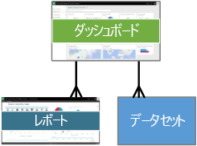
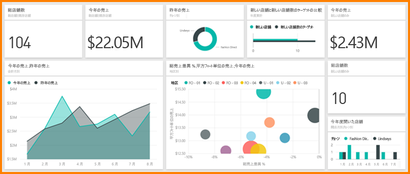

# Power BI - Power BI サービスの基本的な概念
<!-- Shared newnav Include -->
[!INCLUDE [newnavbydefault](./includes/newnavbydefault.md)]

この記事は、読者は既に [Power BI にサインアップ](service-self-service-signup-for-power-bi.md)し、[いくつかデータを追加](service-get-data.md)してあることを想定して書かれています。

Power BI サービスを開くと、"***ダッシュボード***" が表示されます。 ダッシュボードは、Power BI サービスが Power BI Desktop と異なる点です。

Power BI サービス UI の主な機能は次のとおりです。

1. ナビゲーション バー
2. タイルのあるダッシュボード
3. Q&A 質問ボックス
4. ヘルプとフィードバックのボタン
5. ダッシュボードのタイトル
6. Office 365 アプリ起動ツール
7. Power BI のホーム ボタン
8. その他のダッシュ ボードの操作

これらについては後に詳しく説明しますが、まずいくつかの Power BI の概念を確認します。

または、この記事を読み進む前にまず次のビデオを見ていただいてもかまいません。  このビデオを見ると、Power BI サービスの基本的な概念と概要を理解できます。

<iframe width="560" height="315" src="https://www.youtube.com/embed/B2vd4MQrz4M" frameborder="0" allowfullscreen></iframe>

## Power BI の概念
Power BI の 3 つの主要な構成要素は、***ダッシュボード***、***レポート***、***データセット***です。 ダッシュボードやレポートは、データがないと使用できません (空のダッシュボードや空のレポートを設けることもできますが、データが取り込まれるまでは利用価値がありません)。そのため、**データセット**から始めましょう。

## データセット
*データセット* は、*インポート先*または*接続先*となるデータのコレクションです。 Power BI を使うと、あらゆる種類のデータセットに接続してインポートし、すべてを 1 か所にまとめることができます。  

ナビゲーション バーで、接続済みまたはインポート済みのデータセットは、**[データセット]** の見出しの下に一覧表示されます。 表示されている各データセットは、データの 1 つのソースを表します。たとえば、OneDrive の Excel ブック、オンプレミスの SSAS 表形式データセット、Salesforce データセットなどです。 多くのさまざまなデータ ソースがサポートされており、頻繁に新しいデータソースが追加されていきます。 [Power BI で使用できるデータセットの種類の一覧を参照してください](service-get-data.md)。

**1 つの** データセットを...

* 何度も使用できます。
* 多くのさまざまなレポートで使用できます。
* その 1 つのデータセットからの視覚エフェクトを、多くのさまざまなダッシュボードで表示できます。
  
  

[データセットに接続したりデータセットをインポートしたり](service-get-data.md)するには、**[データの取得]** (ナビゲーション バーの一番下) を選ぶか、プラス記号アイコン (**[データセット]** 見出しの横) を選びます。 手順に従って、特定のソースに接続するかソースをインポートし、ワークスペースにデータセットを追加します。 新しいデータセットは、左側のナビゲーション バーに一覧表示され、黄色のアスタリスクで示されます。 Power BI で行う作業によって、基になるデータセットが変更されることはありません。

ユーザーが["***アプリ ワークスペース***" に属している](service-collaborate-power-bi-workspace.md)場合は、他のワークスペース メンバーが追加したデータセットも利用できます。

データセットは、更新、名前を変更、探索、レポート作成に使用、削除することができます。 データセットを調べるには、そのデータセットを選択します。 実際の操作としては、レポート エディターでデータセットを開き、そこでデータの掘り下げと視覚エフェクトの作成を開始します。 それでは、次のトピック「レポート」に進みましょう。

### さらに調べる:
* [Power BI Premium とは](service-premium.md)
* [Power BI のデータの取得](service-get-data.md)
* [Power BI のデータセットとコンテンツ パックのサンプル](sample-datasets.md)

## レポート
Power BI レポートは、1 ページまたは複数ページの視覚エフェクト (折れ線グラフ、円グラフ、ツリーマップその他多くのチャートやグラフ) です。 視覚エフェクトは***ビジュアル***とも呼ばれます。 レポートのすべての視覚エフェクトは 1 つのデータセットから取得されます。 レポートは、Power BI でゼロから作成することも、共同作業者から共有されたダッシュボードと共にインポートすることもできます。または、Excel、Power BI デスクトップ、データベース、SaaS アプリケーションからのデータセット、および[コンテンツ パック](service-organizational-content-pack-introduction.md)に接続するときに作成することもできます。  たとえば、Power View シートを含む Excel ブックに接続するとき、Power BI はそのシートに基づくレポートを作成します。 SaaS アプリケーションに接続すると、Power BI は構築済みのレポートをインポートします。

レポートを表示して操作するための 2 つのモードがあります。[読み取りビュー](service-report-open-in-reading-view.md)と[編集ビュー](service-interact-with-a-report-in-editing-view.md)です。  レポートの作成者、共同所有者、アクセス許可を付与されたユーザーのみがそのレポートの***編集ビュー***のすべての探索、設計、構築、共有機能へのアクセス権を持ちます。 それらの人物がレポートを共有した相手のみ、***読み取りビュー***を使用してレポートを探索および操作できます。   

ナビゲーション ウィンドウでは、レポートは **[レポート]** の見出しの下に一覧表示されます。 リストされている各レポートは、基になる 1 つのデータセットに基づいた、視覚エフェクトの 1 つのページを表します。 レポートを開くには、単にそれを選択します。 既定では、読み取りビューでレポートが開きます。  編集ビューで開くには、**[レポートの編集]** を選ぶだけです (必要なアクセス許可がある場合)。  共有ダッシュボードにレポートがある場合、ナビゲーション バーにはレポートが一覧表示されません。 代わりに、ダッシュ ボードのタイルを選択して共有ダッシュ ボードから直接共有レポートを開きます (詳細については後で説明します)。

**1 つの** レポートを...

* 複数のダッシュボードに関連付けることができます (その 1 つのレポートから固定されたタイルが、複数のダッシュボードに表示されることがあります)。
* 1 つのデータセットのデータを使用して作成できます。 (稀な例外として、Power BI Desktop は複数のデータセットを組み合わせて 1 つのレポートにしてから、そのレポートを Power BI にインポートすることができます)。
  
  

## ダッシュボード
*ダッシュボード* は、自分で作成したり、または同僚が作成したものを共有してもらったりすることができます。 これは 0 または 1 つ以上のタイルとウィジェットを含む単一のキャンバスです。 各タイルには、データセットのデータから作成され、ダッシュボードに固定された単一の[視覚エフェクト](power-bi-report-visualizations.md)が表示されます。 ダッシュボードにタイルを追加する方法は多数ありますが、多すぎるためこの概要トピックでは紹介できません。 詳しくは、「[Power BI のダッシュボードのタイル](service-dashboard-tiles.md)」をご覧ください。 

ナビゲーション バーで、「ユーザーの」ダッシュボードは **[ダッシュボード]** 見出しの下にリストされます。 「ユーザーの」とは、アクセス権限を持っているという意味であり、作成者でなくてもかまいません。 各ダッシュボードは、基になるデータセットの一部のサブセットのカスタマイズしたビューを表します。  ダッシュボードを所有している場合は、基になるデータセットへのアクセス権限を持っている必要があり、それらは **[データセット]**の下のナビゲーション バーに表示されます。  ダッシュボードが共有されている場合は、隣に共有アイコンが表示されます。ナビゲーションバーに基になるデータセットが表示されるかどうかは、共有方法によって異なります。

> [!NOTE]
> 固定とタイルの詳細は、「タイルのあるダッシュボード」という見出しの下に表示されます。
> 
> 

**1 つの** ダッシュボードに...

* 多くの異なるデータセットの視覚エフェクトを表示できます。
* 多くの異なるレポートの視覚エフェクトを表示できます。
* 他のツール (Excel など) からピン留めされた視覚エフェクトを表示できます。
  
  

### さらに調べる:
**ダッシュボードを[ゼロから作成](service-dashboard-create.md)**することができます。つまり、新しい空のダッシュボードを作成して、データを取り入れることができます。 

**自分や同僚は、ダッシュボードを作成して[共有](service-share-dashboards.md)**できます。招待を承諾すると、共有のダッシュボード (および関連付けられているレポートとデータセット) がナビゲーションバーに追加されます。 Power BI Pro は、ダッシュボードの共有、および共有ダッシュボードの表示の両方に必要です。

**ダッシュボードは、データセットと共にインポートされることや、データセットに接続する際に作成されることもあります**。 たとえば、Salesforce の **[ データの取得 ]** ウィザードは、データセットからダッシュボードやレポートを作成するかどうかをたずねます。 

**なぜダッシュボードを作成しますか。**  理由の一部は以下のとおりです。

* 意思決定に必要なすべての情報をひとめで確認できるようにするため
* 業務に関する最も重要な情報を監視するため
* すべての同僚が、同じ情報を表示および使用して、同じ考えを持てるようにするため
* ビジネス、製品、ビジネス単位、またはマーケティング キャンペーンの正常性を監視するため
* 大きなダッシュボードの個人ビューを作成して、自分の関心のあるメトリックスをそこに表示するため

## マイワークスペース
Power BI ダッシュボードとワークスペースに戻りました。 Power BI サービスのランディング ページを構成する要素を詳しく見ていきます。

### 1.**ナビゲーション バー** (navbar)
ナビゲーション バーを使用して、Power BI の構成要素 (ダッシュボード、レポート、データセット) 間を移動します。  

  

* [データセット、レポート、ダッシュボードを Power BI に追加する](service-get-data.md)には、**[データの取得]** を選びます。
* このアイコン  を使用して、ナビゲーションバーを展開したり折りたたみます。
* ナビゲーター バーで特定のアイテムを見つけるには、 **[検索]** を使用します。
* 正符号アイコン  をクリックして、新しいダッシュボードを作成したり、新しいデータセットを取得したりします。
* リストされる **ダッシュボード、レポート、** および **データセット** 」を使用できます。  共有ダッシュボードは読み取り専用で、アイコン  が表示されます。
* ダッシュボード、レポート、データセットの名前は、基になるデータセット ファイルの名前と通常一致します。ただし、[それらの名前を変更する](service-rename.md)こともできます。
* ダッシュボード、レポート、またはデータセットを右クリックして、状況依存のメニューを表示します。 
  
  

1 回のクリックで

* 見出しを折りたたむか、展開します
* ダッシュボードを表示します
* レポートを読み取りビューで開きます
* データセットを探索します

### 2.**タイルのあるダッシュボード**
ダッシュボードは、[タイル](service-dashboard-tiles.md)で構成されます。  タイルは、レポートの編集ビュー、Q&A、他のダッシュボードで作成され、Excel、SSRS などからピン留めできます。 [ウィジェット](service-dashboard-add-widget.md)と呼ばれる特別な種類のタイルがダッシュボードに直接追加されます。 ダッシュボードに表示されるタイルは、レポートの作成者/所有者によってそこに配置されています。  ダッシュボードにタイルを追加する動作は、 *ピン留め*と呼ばれます。

詳しくは、前の「**ダッシュボード**」をご覧ください。

### 3.**Q&A 質問ボックス**
データを探索する方法の 1 つは、質問をして、Power BI Q&A から視覚エフェクトの形式で回答を受け取ることです。 Q&A を使用してレポートにコンテンツを追加することはできません。ダッシュボードにタイルの形式でコンテンツを追加することしかできません。

Q&A は、ダッシュボードに接続されたデータセットで回答を検索します。  接続されたデータセットとは、ダッシュボードに 1 つ以上のタイルが固定されているものです。

Q&A では、質問の入力を開始するとすぐに Q&A ページが表示されます。 入力中に Q&A は言い直し、オートコンプリート、候補表示などの方法により、正しく質問して最適な回答を得られるように支援します。 求めている視覚エフェクト (回答) を得ることができたら、それをダッシュボードにピン留めします。 詳しくは、「[Power BI での Q&A](service-q-and-a.md)」をご覧ください。

### 4.**全画面表示、通知、設定、ダウンロード、ヘルプ、およびフィードバック**
右上隅のアイコンは、設定、通知、ダウンロード、ヘルプの表示、Power BI チームへのフィードバックの送信を行うためのリソースです。 ダッシュボードを**全画面表示**モードで開くには、二重矢印を選びます。  

### 5.**ダッシュボードのタイトル** (どのダッシュボードがアクティブか)
アクティブなダッシュボードを判別することは、常に簡単であるとは限りません。  ダッシュボードのタイトルは、ダッシュボード ビュー ページ、Q&A ページ、レポートの編集ビューとレポートの読み取りビューに表示されました。さらにデータセットを開くときにもタイトルが表示されます。   

### 6.**Office 365 アプリ起動ツール**
アプリ起動ツールは、Office 365 アプリを使用するために設計されています。

### 7.**Power BI ホーム**
選択すると、最後に表示したダッシュボードに戻ります。

   

### 8.**オプション**
ワークスペースのこのエリアには、ダッシュボードを操作するアイコンが含まれます。  **[タイルの追加]**、**[お気に入り]**、**[共有]** 以外にも、省略記号を選ぶとダッシュボードの複製、印刷、更新などのオプションが開きます。

   

## 次の手順
[Power BI の概要](service-get-started.md)  
[Power BI のビデオ](videos.md)  
[Power BI Premium とは](service-premium.md)

他にわからないことがある場合は、 [Power BI コミュニティで質問してみてください](http://community.powerbi.com/)。

