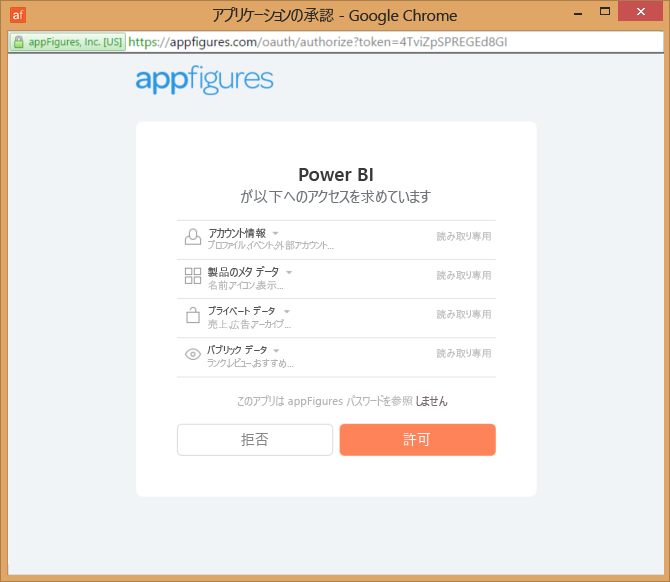
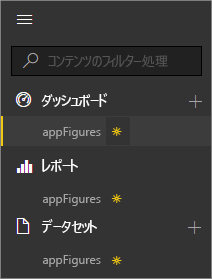
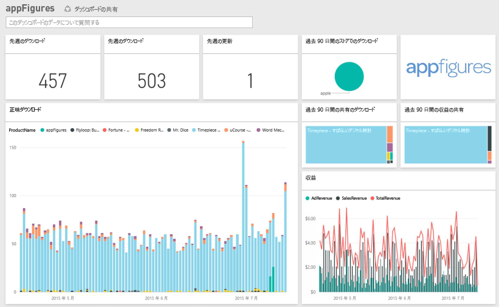
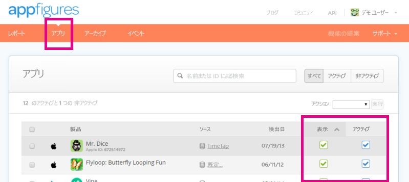

# Power BI で appFigures に接続する
Power BI と appFigures コンテンツ パックを使用すると、アプリに関する重要な統計情報を簡単に追跡できます。 Power BI は、アプリの販売数、ダウンロード数、および広告統計情報を含むデータを取得し、そのデータに基づいて既定のダッシュボードと関連レポートを作成します。

[appFigures コンテンツ パック](https://app.powerbi.com/getdata/services/appfigures)に接続するか、Power BI と [appFigures との統合](https://powerbi.microsoft.com/integrations/appfigures)について詳細をお読みください。

## 接続する方法
1. 左側のナビゲーション ウィンドウの下部にある **[データの取得]** を選択します。
   
   
2. **[サービス]** ボックスで、 **[取得]**を選択します。
   
   
3. **[appFigures]** \> **[取得]** の順に選択します。
   
   
4. **認証方式**として **[oAuth2]** を選択し、**[サインイン]** をクリックします。 プロンプトが表示されたら、appFigures 資格情報を入力し、appFigures 認証プロセスに従います。
   
   初めて接続するときには、アカウントへの読み取り専用アクセスを許可するように求めるメッセージが Power BI から表示されます。 **[許可]** を選択して、インポート プロセスを開始します。 ご使用のアカウントのデータの量によっては、数分かかることもあります。
   
   
5. Power BI によるデータのインポート後、新しいダッシュ ボード、レポート、データセットが左側のナビゲーション ウィンドウに表示されます。 新しい項目には黄色のアスタリスク \* でマークが付けられます。
   
    
6. appFigures ダッシュボードを選択します。 これは、データを表示するために Power BI によって作成される既定のダッシュボードです。 このダッシュボードを変更し、希望する方法でデータを表示できます。
   
    

**実行できる操作**

* ダッシュボード上部にある [Q&A ボックスで質問](power-bi-q-and-a.md)してみてください。
* ダッシュボードで[タイルを変更](service-dashboard-edit-tile.md)できます。
* [タイルを選択](service-dashboard-tiles.md)して基になるレポートを開くことができます。
* データセットは毎日更新されるようにスケジュール設定されますが、更新のスケジュールは変更でき、また **[今すぐ更新]** を使えばいつでも必要なときに更新できます。

## 含まれるもの
Power BI では、次のデータを appFigures から使用できます。

| **テーブル名** | **説明** |
| --- | --- |
| Countries |このテーブルは、国の名前情報を提供します。 |
| Dates |このテーブルには、ご使用の appFigures アカウントでアクティブかつ表示可能なアプリの最も古い公開日から今日までの日付が含まれています。 |
| Events |このテーブルには、各アプリのダウンロード、売上、広告に関する情報が国別で日付ごとに含まれています。 アプリとアプリ内購入情報の両方がすべてこの 1 つのテーブルに入ることにご注意ください。<strong>[型]</strong> 列を使用して両者を区別できます。 |
| Inapps |このテーブルには、ご使用の appFigures アカウントでアクティブかつ表示可能なアプリに関連付けられている、各種のアプリ内購入についてのデータが含まれています。 |
| 製品 |このテーブルには、ご使用の appFigures アカウントでアクティブかつ表示可能な各種のアプリに関するデータが含まれています。 |

## トラブルシューティング
Power BI で一部のアプリのデータが表示されない場合は、それらのアプリ が appFigures サイトの **[アプリ]** タブで表示可能でアクティブになっていることを確認してください。

## 次の手順
* [Power BI の概要](service-get-started.md)
* [Power BI でデータを取得する](service-get-data.md)

