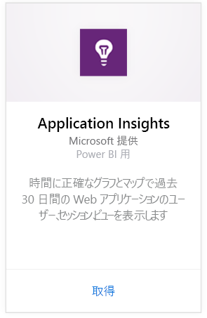
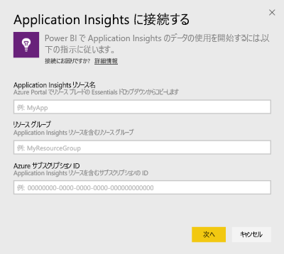
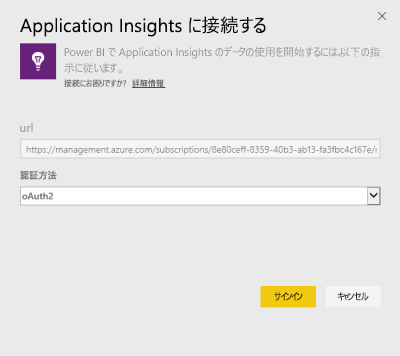
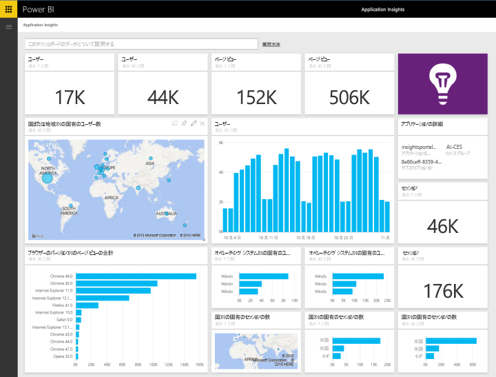
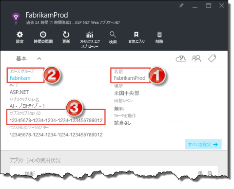
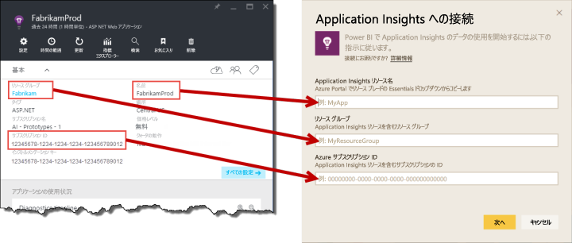

# Power BI で Application Insights に接続する
Power BI を使用して、[Application Insights](https://azure.microsoft.com/documentation/articles/app-insights-overview/) テレメトリから強力なカスタム ダッシュボードを作成できます。 新しい方法でアプリのテレメトリを視覚化します。 複数のアプリまたはコンポーネント サービスからのメトリックを単一のダッシュボードに統合します。 この Application Insights 用 Power BI コンテンツ パックの最初のリリースには、アクティブなユーザー、ページ ビュー、セッション、ブラウザーと OS のバージョン、マップ内でのユーザーの地理的分布など、一般的な使用関連メトリックのためのウィジェットが含まれています。

[Power BI 用 Application Insights コンテンツ パック](https://app.powerbi.com/getdata/services/application-insights)に接続します。

>[!NOTE]
>接続するには、Azure プレビュー ポータルでアプリケーションの Application Insights 概要ブレードにアクセスする必要があります。 要件の詳細については、このあと説明します。

## 接続する方法
1. 左側のナビゲーション ウィンドウの下部にある **[データの取得]** を選択します。
   
    ![[データの取得] ボタン](media/service-connect-to-application-insights/pbi_getdata.png)
2. **[サービス]** ボックスで、 **[取得]**を選択します。
   
    ![[サービスの取得] ボタン](media/service-connect-to-application-insights/pbi_getservices.png)
3. **[Application Insights]** > **[取得]** の順に選択します。
   
    
4. **[Application Insights リソース名]**、 **[リソース グループ]**、 **[サブスクリプション ID]**など、接続するアプリケーションの詳細を入力します。 詳細については、後の「[Application Insights のパラメーター](#FindingAppInsightsParams)」を参照してください。
   
        
5. **[サイン イン]** を選択し、画面の指示に従って接続します。
   
    
6. インポート処理が自動的に開始します。 完了すると、通知が表示され、ナビゲーション ウィンドウにアスタリスク付きで新しいダッシュボード、レポート、データセットが表示されます。  インポートされたデータを表示するダッシュボードを選択します。
   
    

**実行できる操作**

* ダッシュボード上部にある [Q&A ボックスで質問](power-bi-q-and-a.md)してみてください。
* ダッシュボードで[タイルを変更](service-dashboard-edit-tile.md)できます。
* [タイルを選択](service-dashboard-tiles.md)して基になるレポートを開くことができます。
* データセットは毎日更新されるようにスケジュール設定されますが、更新のスケジュールは変更でき、また **[今すぐ更新]** を使えばいつでも必要なときに更新できます。

## 含まれるもの
Application Insights コンテンツ パックには、次のテーブルとメトリックが含まれています。  

    - ApplicationDetails  
    - UniqueUsersLast7Days   
    - UniqueUsersLast30Days   
    - UniqueUsersDailyLast30Days  
    - UniqueUsersByCountryLast7Days  
    - UniqueUsersByCountryLast30Days   
    - PageViewsDailyLast30Days   
    - SessionsLast7Days   
    - SessionsLast30Days  
    - PageViewsByBrowserVersionDailyLast30Days   
    - UniqueUsersByOperatingSystemLast7Days   
    - UniqueUsersByOperatingSystemLast30Days    
    - SessionsDailyLast30Days   
    - SessionsByCountryLast7Days   
    - SessionsByCountryLast30Days   
    - PageViewsByCountryDailyLast30Days   

## パラメーターの見つけ方
リソース名、リソース グループ、サブスクリプション ID はすべて Azure Portal でわかります。 名前を選択すると、詳細ビューが開き、[要点] ドロップダウンを使用して必要なすべての値を知ることができます。

これらの値をコピーして、Power BI に対するフィールドに貼り付けます。

## 次の手順
[Power BI の概要](service-get-started.md)

[Power BI でデータを取得する](service-get-data.md)

