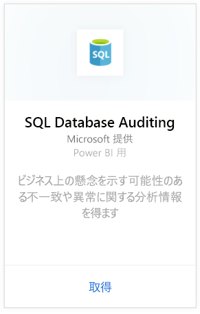
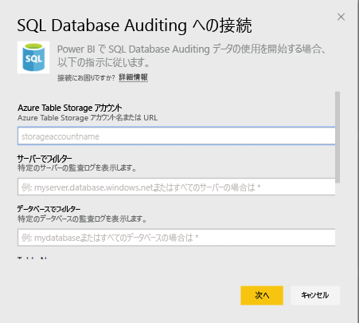
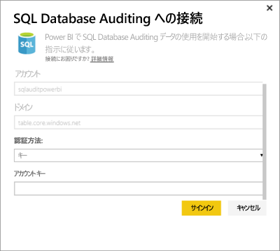
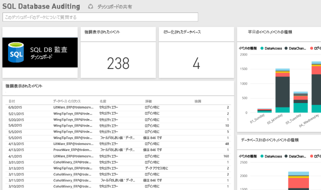

# Power BI 用 SQL Database Auditing コンテンツ パック
Azure [SQL Database Auditing](http://azure.microsoft.com/documentation/articles/sql-database-auditing-get-started/) 用 Power BI コンテンツ パックは、データベース アクティビティを理解し、ビジネスに関する懸念やセキュリティ違反の疑いを示す可能性のある不一致や異常に関する洞察を得るうえで役立ちます。 

Power BI 用 [SQL Database Auditing コンテンツ パック](https://app.powerbi.com/getdata/services/sql-db-auditing)に接続します。

>[!NOTE]
>このコンテンツ パックは、名前に “AuditLogs” が含まれているすべてのテーブルからデータをインポートし、“AuditLogs” という名前の単一データ モデル テーブルにデータを追加します。 最新の 250,000 のイベントが含まれるようになり、データは毎日更新されます。

## 接続する方法
1. 左側のナビゲーション ウィンドウの下部にある **[データの取得]** を選択します。
   
    
2. [サービス] ボックスで、[取得] を選択します。
   
    
3. **[SQL Database Auditing]** \> **[接続]** の順に選択します。
   
   
4. [SQL Database Auditing への接続] ウィンドウで以下の操作を行います。
   
   - Azure テーブル ストレージのアカウント名か、ログを格納する URL を入力します。
   
   - 対象の SQL Server の名前を入力します。 すべてのサーバーの監査ログを読み込む場合には、「\*」と入力します。
   
   - 対象の SQL データベースの名前を入力します。 すべてのデータベースの監査ログを読み込む場合には、「\*」と入力します。
   
   - 対象のログが含まれる Azure テーブルの名前を入力します。 名前に "AuditLogs" が含まれるすべてのテーブルの監査ログを読み込む場合には、「\*」と入力します。
   
   >[!IMPORTANT]
   >パフォーマンス上の理由から、すべての監査ログが 1 つのテーブルに格納されている場合であっても、いつも明示的なテーブル名を指定することをお勧めします。
   
   - 対象の監査ログ開始日を入力します。 開始日時に関する制限を設けることなく監査ログを読み込む場合には「\*」と入力し、最後の日の監査ログを読み込む場合には「1d」と入力します。
   
   - 対象の監査ログ終了日を入力します。 終了日時に関する制限を設けることなく監査ログを読み込む場合には、「\*」と入力します。
   
   
5. [認証方法] で **[キー]** を選択し、**[アカウント キー]** を入力してから **[サインイン]** をクリックします。
   
   
6. Power BI にデータがインポートされると、新しいダッシュボード、レポート、データセットが左側のナビゲーション ウィンドウに表示されます。 新しい項目には黄色のアスタリスク \* でマークが付けられます。
   
   

**実行できる操作**

* ダッシュボード上部にある [Q&A ボックスで質問](power-bi-q-and-a.md)してみてください。
* ダッシュボードで[タイルを変更](service-dashboard-edit-tile.md)できます。
* [タイルを選択](service-dashboard-tiles.md)して基になるレポートを開くことができます。
* データセットは毎日更新されるようにスケジュール設定されますが、更新のスケジュールは変更でき、また **[今すぐ更新]** を使えばいつでも必要なときに更新できます。

## 次の手順
[Power BI のデータの取り出し](service-get-data.md)
[Power BI の概要](service-get-started.md)