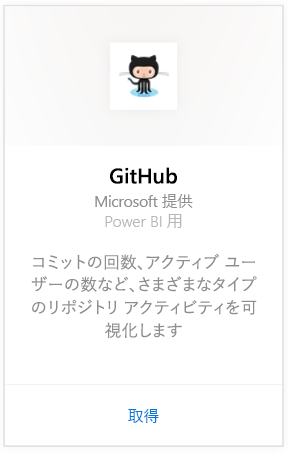
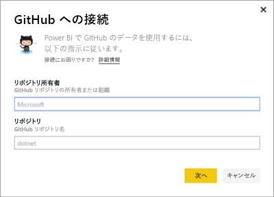
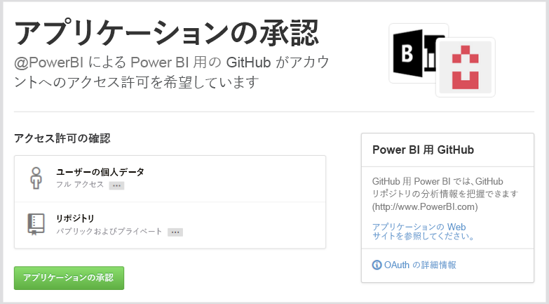

# Power BI で GitHub に接続する
Power BI 用の GitHub コンテンツ パックでは、GitHub リポジトリに関する情報を入手します。これには、投稿、問題、プル要求、アクティブなユーザーなどに関するデータが含まれます。

[GitHub コンテンツ パック](https://app.powerbi.com/getdata/services/github)に接続するか、Power BI と [GitHub との統合](https://powerbi.microsoft.com/integrations/github)について詳細をお読みください。

>[!NOTE]
>コンテンツ パックには、リポジトリにアクセスするための GitHub アカウントが必要です。 要件の詳細については、このあと説明します。

## 接続する方法
1. 左側のナビゲーション ウィンドウの下部にある **[データの取得]** を選択します。
   
    
2. **[サービス]** ボックスで、 **[取得]** を選択します。
   
    
3. **[GitHub]** \> **[取得]** の順に選択します。
   
   
4. リポジトリの名前とリポジトリの所有者を入力します。 [これらのパラメーターの見つけ方](#FindingParams)について詳しくは、後述します。
   
   
5. GitHub の資格情報を入力します (ブラウザーで既にサインインしている場合、この手順は省略される可能性があります)。 
6. **[認証方法]** として **[oAuth2]** を選択し、**[サイン イン]** をクリックします。 
7. Github の認証画面に従ってください。 GitHub データへのアクセス許可を GitHub for Power BI コンテンツ パックに付与します。
   
   
   
   これで Power BI は GitHub と接続し、データに接続できるようになります。  データは、1 日に 1 回更新されます。
8. リポジトリに接続した後、Power BI によりデータがインポートされます。 新しい [GitHub ダッシュボード](https://powerbi.microsoft.com/integrations/github)、レポート、データセットが左側のナビゲーション ウィンドウに表示されます。 新しい項目には黄色のアスタリスク \* でマークが付けられます。
   
   

**実行できる操作**

* ダッシュボード上部にある [Q&A ボックスで質問](power-bi-q-and-a.md)してみてください。
* ダッシュボードで[タイルを変更](service-dashboard-edit-tile.md)できます。
* [タイルを選択](service-dashboard-tiles.md)して基になるレポートを開くことができます。
* データセットは毎日更新されるようにスケジュール設定されますが、更新のスケジュールは変更でき、また **[今すぐ更新]** を使えばいつでも必要なときに更新できます。

## 含まれるもの
Power BI では、次のデータを GitHub から使用できます。     

| テーブル名 | 説明 |
| --- | --- |
| Contributions |投稿物のテーブルは、共同作成者によって作成された追加、削除、コミットの合計を週ごとに集計して示します。 上位 100 人の共同作成者が含まれています。 |
| Issues |選択したリポジトリのすべての問題の一覧を表示します。問題が閉じられるまでの合計時間と平均時間、開かれている問題の合計、閉じられた問題の合計などの計算が含まれます。 リポジトリに問題がない場合、このテーブルは空になります。 |
| Pull requests |このテーブルには、リポジトリのすべてのプル要求と、要求をプルした人が含まれています。 また、開かれているプル要求、閉じられているプル要求、プル要求の合計、要求をプルするまでにかかった時間、プル要求にかかった平均時間などに関する計算も含まれます。 リポジトリに問題がない場合、このテーブルは空になります。 |
| Users |このテーブルは、選択されたリポジトリで投稿を行った、問題をファイリングした、またはプル要求を解決した GitHub ユーザー (共同作成者) の一覧を示します。 |
| Milestones |これは、選択したリポジトリのすべてのマイルス トーンです。 |
| DateTable |このテーブルには本日から過去数年間の日付が含まれており、これによって日付ごとに GitHub のデータを分析できます。 |
| ContributionPunchCard |このテーブルは、選択したリポジトリの投稿物のパンチ カードとして使用できます。 曜日別および時間別のコミット数を示します。 このテーブルは、モデル内の他のテーブルに接続されていません。 |
| RepoDetails |このテーブルは、選択したリポジトリの詳細を説明します。 |

## システム要件
* リポジトリにアクセスできる GitHub アカウント。  
* 初めてログインするときに Power BI for GitHub アプリに与えられるアクセス許可。 アクセスを取り消す方法については、下記の詳細を参照してください。  
* データのプルと更新に使用できる十分な API 呼び出し。  

### Power BI の承認解除
Power BI と GitHub リポジトリとの接続の承認を解除するには、GitHub のアクセスを取り消します。 詳しくは、この [GitHub ヘルプ](https://help.github.com/articles/keeping-your-ssh-keys-and-application-access-tokens-safe/#reviewing-your-authorized-applications-oauth) トピックをご覧ください。

## パラメーターの見つけ方
GitHub 自体のリポジトリを見ることで、所有者とリポジトリを確認できます。

最初の部分の "Azure" が所有者で、2 番目の部分の "azure-sdk-for-php" がリポジトリそのものです。  リポジトリの URL にこれらの同じ 2 つ項目が現れます。

    <https://github.com/Azure/azure-sdk-for-php> .

## トラブルシューティング
必要に応じて、GitHub の資格情報を確認することができます。  

1. 別のブラウザー ウィンドウで、GitHub の web サイトに移動して GitHub にログインします。 GitHub サイトの右上隅でログイン状態を確認できます。    
2. GitHub で、Power BI でアクセスしようとしているリポジトリの URL に移動します。 たとえば、 https://github.com/dotnet/corefx です。  
3. Power BI に戻って GitHub に接続します。 [GitHub の構成] ダイアログ ボックスで、その同じリポジトリの名前と所有者を使用します。  

## 次の手順
* [Power BI とは?](power-bi-overview.md)
* [データの取得](service-get-data.md)
