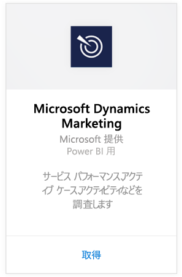
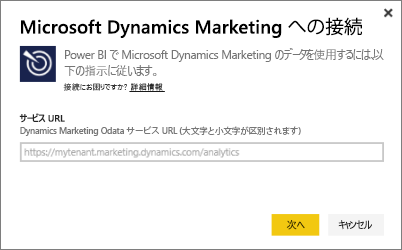
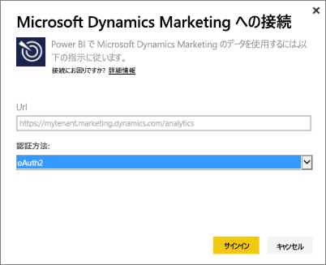
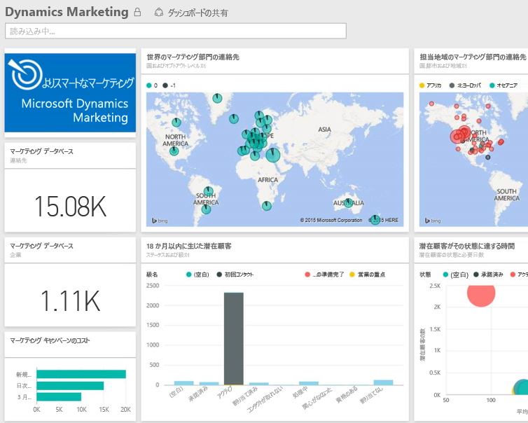

# Power BI で Microsoft Dynamics Marketing に接続する
Power BI 用 Microsoft Dynamics Marketing コンテンツ パックを使用すると、Dynamics Marketing のデータに簡単にアクセスして分析することができます。 コンテンツ パックは、OData フィードに加えて記述モデルを使用します。その際、必要なすべてのエンティティやメジャーを使用します。たとえば、プログラム、キャンペーン、マーケティング取引先担当者およびマーケティング会社、潜在顧客、潜在顧客の相互作用と潜在顧客のスコアリング、電子メール マーケティング メッセージと Web サイト、動作の監視、予算、金融取引、パフォーマンス KPI などです。 

Power BI 用 [Dynamics Marketing コンテンツ パック](https://app.powerbi.com/getdata/services/microsoft-dynamics-marketing)に接続します。

>[!NOTE]
>Dynamics Marketing のインスタンスの有効な OData URL を指定する必要があります (コンテンツ パックは、オンプレミスの CRM バージョンでは機能しません)。 下の追加要件を参照してください。

## 接続する方法
1. 左側のナビゲーション ウィンドウの下部にある [データの取得] を選択します。
   
    
2. **[サービス]** ボックスで、 **[取得]**を選択します。
   
    
3. **[Microsoft Dynamics Marketing]** \> **[取得]** を選択します。
   
   
4. アカウントと関連付けられている OData URL を指定します。  これは次の形式になります: "https://[instance\_name].marketing.dynamics.com/analytics"
   
   
5. メッセージが表示されたら、資格情報を指定します (ブラウザーで既にサインインしている場合、この手順は省略される可能性があります)。 認証方式として、「 **oAuth2** 」と入力し、 **[サインイン]**をクリックします。
   
   
6. 接続すると、独自のデータを示した Dynamics Marketing ダッシュボードが表示されます。 新しい項目は、左側のナビゲーション ウィンドウで黄色のアスタリスク * でマークされます。
   
   

**実行できる操作**

* ダッシュボード上部にある [Q&A ボックスで質問](power-bi-q-and-a.md)してみてください。
* ダッシュボードで[タイルを変更](service-dashboard-edit-tile.md)できます。
* [タイルを選択](service-dashboard-tiles.md)して基になるレポートを開くことができます。
* データセットは毎日更新されるようにスケジュール設定されますが、更新のスケジュールは変更でき、また **[今すぐ更新]** を使えばいつでも必要なときに更新できます。

## システム要件
* Dynamics Marketing のインスタンスの有効な OData URL を指定する必要があります (コンテンツ パックは、オンプレミスの CRM バージョンでは機能しません)。  
* 管理者は、サイトの設定で OData エンドポイントを有効にする必要があります。 OData エンドポイントのアドレスは、**[組織のデータ サービス]** セクションの **[ホーム] \> [設定] \> [サイトの設定]** にあります。  OData URL の形式は次のとおりです: https://[instance\_name].marketing.dynamics.com/analytics  
* Microsoft Dynamics Marketing へのアクセスに使用するユーザー アカウント/ID は、Power BI を使ってサインアップしたものと同じにする必要があります。 Microsoft Dynamics Marketing にログインする際、Power BI で使用しているものと同じ ID で 自動的にサインインします。 別のアカウントで Microsoft Dynamics Marketing にサインインする場合、その別のアカウントを使用する Power BI ユーザーとして登録してください。 今後のリリースでこの問題は解決される予定です。   

## トラブルシューティング
Dynamics CRM アカウントに接続する際に "Login failed" というメッセージが表示される場合、CRM Online OData フィードへのアクセスに使用するものと同じアカウントで Power BI にサインインしていることを確認してください。 ブラウザーでフィードへのログインも試行し、そこでテストを行ってください。

OData URL が正しいこと、および OData エンドポイントが有効であることを確認するよう管理者に依頼してください。

お使いの Dynamics Marketing のバージョンを確認してください。18.0 と 18.1 には追加の修正が行われています。問題が解決せず、前のバージョンをお使いの場合、アップグレードすることを検討してください。

問題が解決されない場合は、サポート チケットを開き、Power BI チームと連絡を取ってください。

* Power BI アプリを使用中の場合は、[?] \> **[サポートへの問い合わせ]** の順に選択します。
* Power BI サポート サイト (現在ご覧になっているこの記事) ページの右側にある、 **[サポートへの問い合わせ]** を選択します。

## 次の手順
[Power BI のデータの取得](service-get-data.md)

[Power BI の概要](service-get-started.md)

