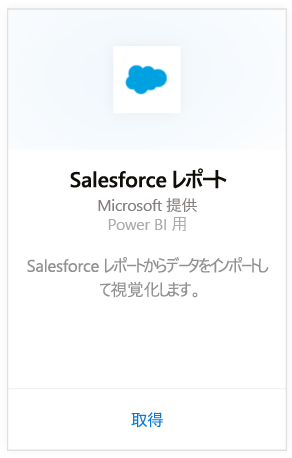
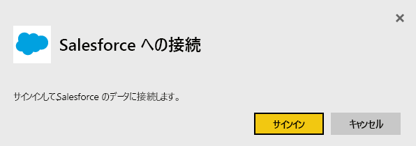
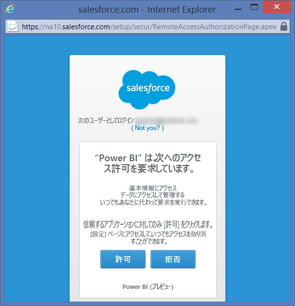
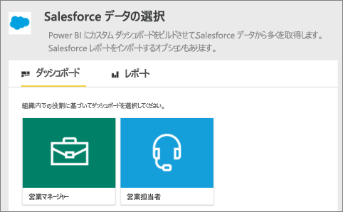
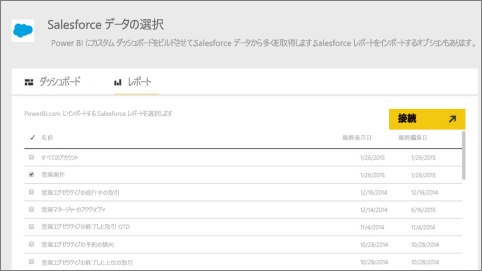
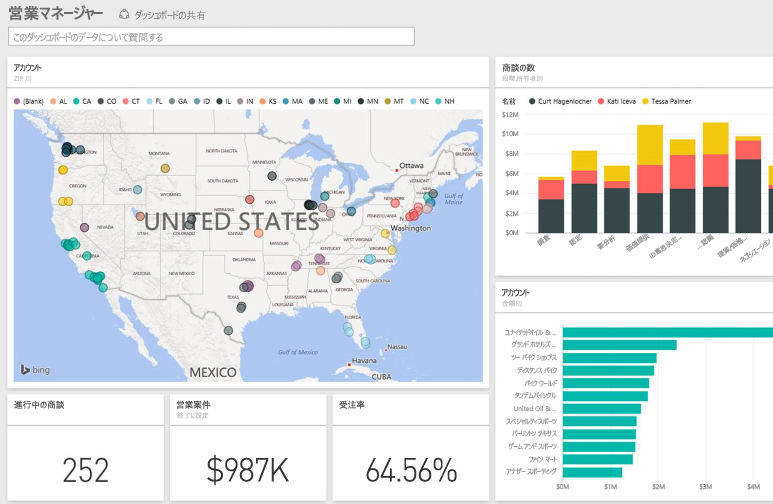

# Power BI で Salesforce に接続する
Power BI を使用すると、簡単に Salesforce.com アカウントに接続できます。 この接続を作成すると、データが取得され、そのデータに基づいて自動的にダッシュボードおよび関連するレポートが提供されます。

Power BI 用の [Salesforce コンテンツ パック](https://app.powerbi.com/getdata/services/salesforce)に接続するか、Power BI と [Salesforce との統合](https://powerbi.microsoft.com/integrations/salesforce)について詳細をお読みください。

## 接続する方法
1. 左側のナビゲーション ウィンドウの下部にある **[データの取得]** を選択します。
   
    
2. **[サービス]** ボックスで、 **[取得]** を選択します。
   
    
3. **[Salesforce]** をクリックし、**[取得]** を選択します。  
   
   
4. **[サインイン]** を選択してログイン フローを開始します。
   
    
5. メッセージが表示されたら、Salesforce の資格情報を入力します。 **[許可]** をクリックして、Power BI が Salesforce の基本的な情報やデータにアクセスできるようにします。
   
   
6. ドロップダウン リストのオプションを使用して、Power BI に何をインポートするかを構成します。
   
   * **ダッシュボード**
     
     ペルソナに基づく定義済みのダッシュボードを選択します ( **営業マネージャー**など)。 これらのダッシュボードには、Salesforce の特定の標準データ セットが含まれ、カスタム フィールドは含まれません。
     
     
   * **レポート**
     
     Salesforce アカウントから 1 つ以上のカスタム レポートを選択します。 これらのレポートは Salesforce のビューと一致し、カスタム フィールドまたはカスタム オブジェクトのデータを含めることができます。
     
     
     
     レポートが表示されない場合、Salesforce にレポートを追加または作成し、接続を再試行してください。
7. **[接続]** をクリックしてインポート プロセスを開始します。 インポート中、インポートが進行中であることを示す通知が表示されます。 インポートが完了すると、Salesforce データのダッシュボード、レポート、およびデータ セットが左側のナビゲーション ウィンドウに一覧表示されます。
   
   

希望する方法でデータを表示するように、このダッシュボードを変更できます。 Q&A で質問したり、ダッシュボードでタイルをクリックすることにより[基になるレポートを開いたり](service-dashboard-tiles.md)、[タイルを変更](service-dashboard-edit-tile.md)したりできます。

**実行できる操作**

* ダッシュボード上部にある [Q&A ボックスで質問](power-bi-q-and-a.md)してみてください。
* ダッシュボードで[タイルを変更](service-dashboard-edit-tile.md)できます。
* [タイルを選択](service-dashboard-tiles.md)して基になるレポートを開くことができます。
* データセットは毎日更新されるようにスケジュール設定されますが、更新のスケジュールは変更でき、また **[今すぐ更新]** を使えばいつでも必要なときに更新できます。

## システム要件と考慮事項
- API アクセスが有効な、Salesforce の正式アカウントに接続している。
- ログイン時に Power BI アプリに対するアクセス許可が付与される。
- データのプルと更新に使用できる十分な API 呼び出しがアカウントにある。
- 最新の情報に更新するには、有効な認証トークンが必要です。 インポートする Salesforce データ セットは 5 個以下にしてください。Salesforce では、1 つのアプリケーションにつき許可される認証トークンが 5 個までだからです。
- Salesforce Reports API でサポートされるデータは、最大 2,000 行に制限されています。

## トラブルシューティング
エラーが発生した場合は、上記の要件を確認してください。 また、現在のところ、カスタム ドメインやサンドボックス ドメインへのログインはサポートされていないことにご注意ください。

### "リモート サーバーに接続できません" メッセージ

Salesforce アカウントに接続しようとしたときに "リモート サーバーに接続できません" というメッセージが表示された場合は、Outsystems フォーラムのこちらの解決策 (「[[Salesforce Connector] Log In Error Message : Unable to connect to the remote server](https://www.outsystems.com/forums/Forum_TopicView.aspx?TopicId=17674&TopicName=log-in-error-message-unable-to-connect-to-the-remote-server&)」 ([Salesforce コネクタ] ログイン エラー メッセージ: リモート サーバーに接続できません)) を参照してください。

## 次の手順
[Power BI の概要](service-get-started.md)

[データの取得](service-get-data.md)

