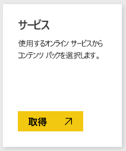
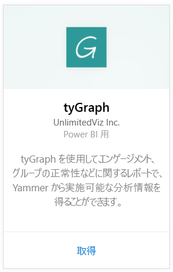
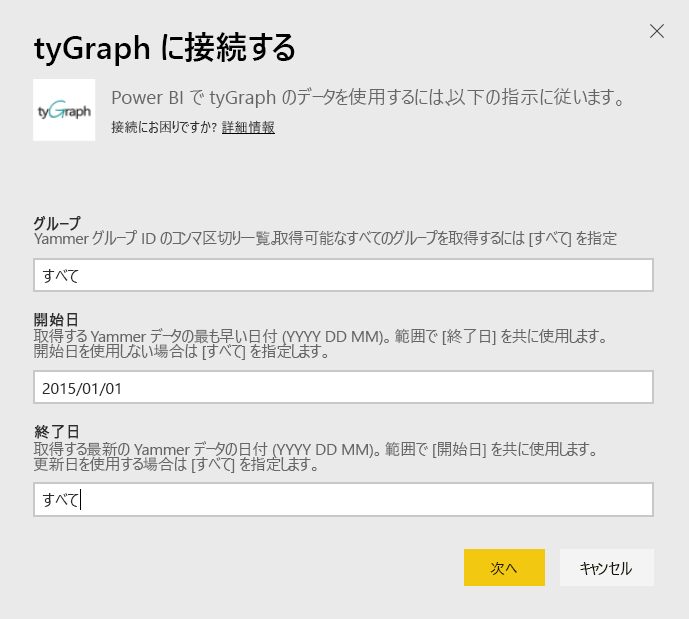
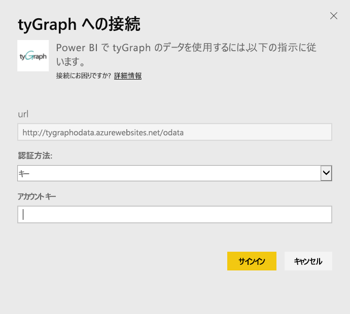

# Power BI で tyGraph に接続する
Power BI コンテンツ パックを使用して、Power BI 内の tyGraph データを視覚化および探索します。 まず tyGraph アカウントに接続し、ダッシュボード、レポート、データセットを読み込みます。 すぐに使えるコンテンツには、Measure of Active Engagement (MAE スコア) や上位投稿者などの情報があります。 最も関心がある情報を強調表示するには、さらにカスタマイズします。  データは、設定したスケジュールに従って自動的に更新されます。

[Power BI 用 tyGraph](https://app.powerbi.com/getdata/services/tygraph) に接続します。

## 接続する方法
1. 左側のナビゲーション ウィンドウの下部にある **[データの取得]** を選択します。
   
   
2. **[サービス]** ボックスで、 **[取得]** を選択します。
   
   
3. **[tyGraph]** \> **[取得]** の順に選択します。
   
   
4. 接続先のグループと時間の範囲を指定します。あるいは、[すべて] を指定してすべてのデータを取り込みます。 日付の形式は YYYY/MM/DD にする必要があることに注意してください。 [パラメーターの検索](#FindingParams)の詳細については、以下をご覧ください。
   
   
5. 接続するには、tyGraph キーを指定します。 この値の検索の詳細については、以下を参照してください。
   
    **ユーザーが Yammer 認証管理者である場合**  
    tyGraph アカウントが正常に作成されると API キーが電子メールで送信されます。 キーが見つからない場合は、support@unlimitedviz.com に電子メールを送信して新しいキーを要求することができます。 tyGraph アカウントがまだない場合は、[http://www.tygraph.com/](http://www.tygraph.com/) で試用版を開始できます。 
   
    **ユーザーが Yammer 認証管理者でない場合**
   
    tyGraph コンテンツ パックには、Yammer 認証管理者が作成した tyGraph アカウントが必要です。 作成されると、補足のキーが同じ組織内のユーザーに発行されます。 認証管理者が tyGraph アカウントをまだ作成していない場合は、作成してもらうように問い合わせてください。 tyGraph アカウントがすでに作成されている場合は、<support@unlimitedviz.com> に電子メールを送信してキーを要求できます。
   
    
6. 認証が成功すると、インポート処理が自動的に開始されます。 完了すると、ナビゲーション ウィンドウに、新しいダッシュ ボード、レポート、モデルが表示されます。 インポートされたデータを表示するダッシュボードを選択します。
   
    

**実行できる操作**

* ダッシュボード上部にある [Q&A ボックスで質問](power-bi-q-and-a.md)してみてください。
* ダッシュボードで[タイルを変更](service-dashboard-edit-tile.md)できます。
* [タイルを選択](service-dashboard-tiles.md)して基になるレポートを開くことができます。
* データセットは毎日更新されるようにスケジュール設定されますが、更新のスケジュールは変更でき、また **[今すぐ更新]** を使えばいつでも必要なときに更新できます。

## パラメーターの見つけ方
アクセスできるすべてのグループにデータを取り込んだり、サブセットを選択して指定したりすることができます。 また、日付によってデータのサブセットを作成することもできます。 特定のグループや日付のセットを監視する複数の tyGraph ダッシュボードを作成できます。 これらのパラメーターの詳細は次のとおりです。

**グループ**

tyGraph API では、特定のグループ ID でデータをフィルター処理できます。 このデータは、コンマ区切りのリストとしてコンテンツ パックに提供されます。 

    Example: 2427647,946595,1154464

グループのフィードに移動し、URL を調べることによって、Yammer の特定のグループのグループの ID を特定できます。

上記の例では、Yammer グループ ID は 4054844 です。

**開始日**

[開始日] を使用すると、返されるデータの最も古い値を制限できます。 この日以降に作成されたデータのみがコンテンツ パックに読み込まれます。 [開始日] の書式は YYYY/MM/DD です。 

    Example: 2013/10/29

上記の例では、2013 年 10 月 29 日以降のすべてのデータがコンテンツ パックに読み込まれます。 

**終了日** [終了日] を使用すると、返されるデータの最も新しい値を制限できます。 日付の範囲からデータを読み込むため、[開始日] と組み合わせて使用します。 この日以前に作成されたデータのみがコンテンツ パックに読み込まれます。 [終了日] の書式は YYYY/MM/DD です。 

    Example: 2014/10/20

上記の例では、2014 年 10 月 20 日以前のすべてのデータがコンテンツ パックに読み込まれます。 

## 次の手順
[Power BI の概要](service-get-started.md)

[Power BI でデータを取得する](service-get-data.md)

