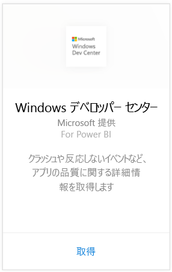
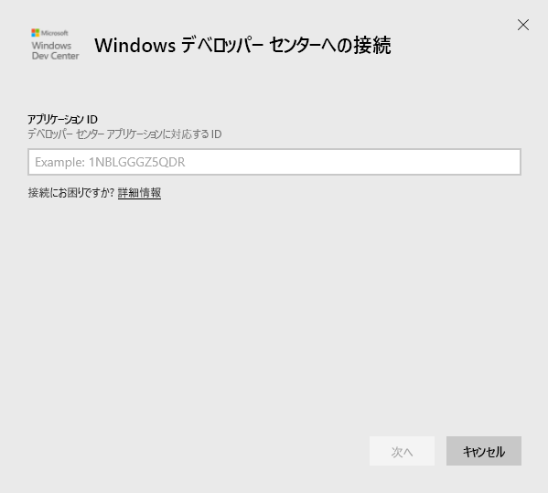
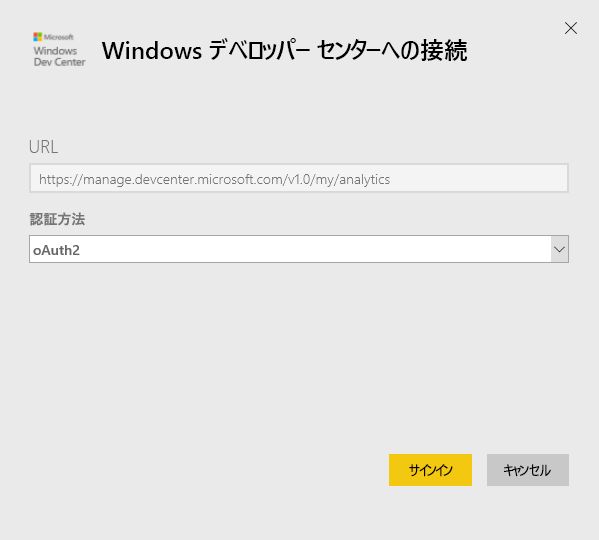
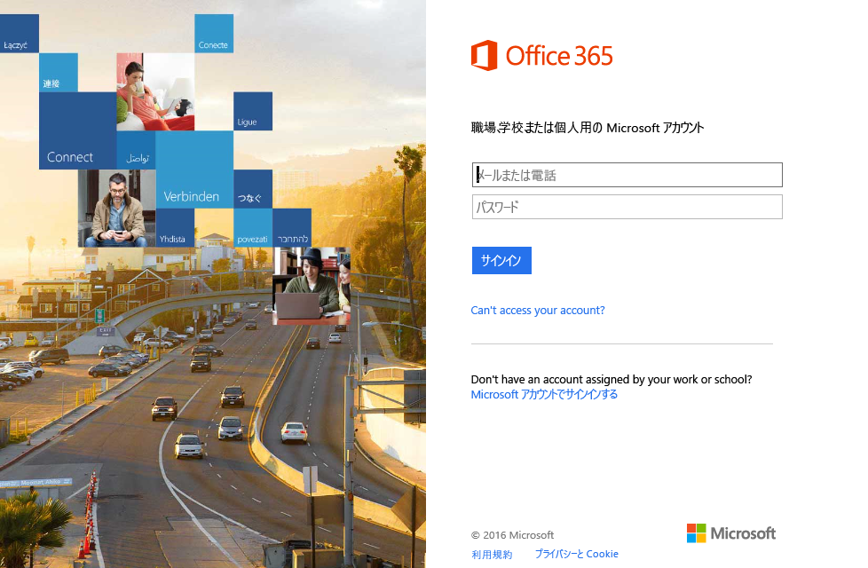
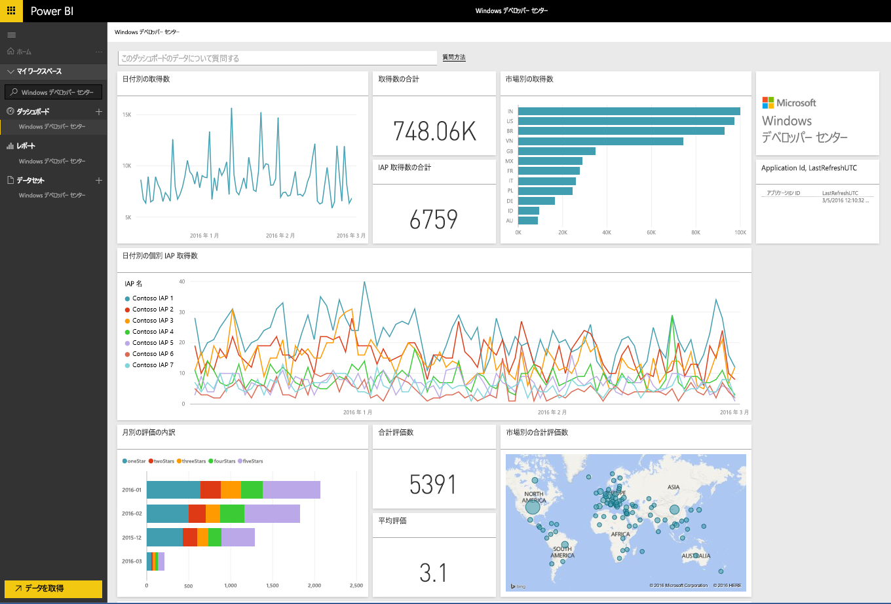
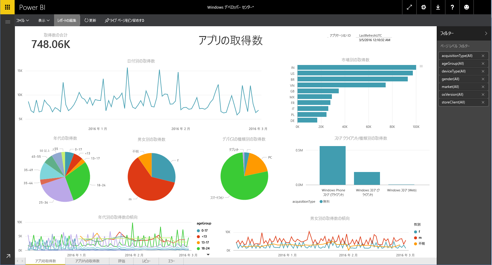

# Power BI で Windows デベロッパー センターに接続する
Power BI コンテンツ パックを使用すると、Power BI で Windows デベロッパー センター アプリの分析データを調べて監視できます。 データは、1 日 1 回自動的に更新されることになります。

Power BI 用 [Windows デベロッパー センター コンテンツ パック](https://app.powerbi.com/getdata/services/devcenter)に接続します。

## 接続する方法
1. 左側のナビゲーション ウィンドウの下部にある **[データの取得]** を選択します。
   
   
2. **[サービス]** ボックスで、 **[取得]** を選択します。
   
   
3. **[Windows デベロッパー センター]** \> **[接続]** を選びます。
   
   
4. 所有するアプリのアプリケーション ID を入力し、[次へ] をクリックします。 [これらのパラメーターの見つけ方](#FindingParams)について詳しくは、後述します。
   
   
5. **[認証方法]** として **[oAuth2]** \> **[サインイン]** の順に選びます。 Windows デベロッパー センター アカウントに関連付けられている Azure Active Directory 資格情報の入力を求められたら、入力します (詳細については、「[システム要件](#Requirements)」をご参照ください)。
   
    
   
    
6. 承諾後、インポート処理が自動的に開始されます。 完了すると、ナビゲーション ウィンドウに、新しいダッシュ ボード、レポート、モデルが表示されます。 ダッシュボードを選択してインポートしたデータを表示し、タイルを選択して基になるレポートに移動します。
   
    
   
    

**実行できる操作**

* ダッシュボード上部にある [Q&A ボックスで質問](power-bi-q-and-a.md)してみてください。
* ダッシュボードで[タイルを変更](service-dashboard-edit-tile.md)できます。
* [タイルを選択](service-dashboard-tiles.md)して基になるレポートを開くことができます。
* データセットは毎日更新されるようにスケジュール設定されますが、更新のスケジュールは変更でき、また **[今すぐ更新]** を使えばいつでも必要なときに更新できます。

## 含まれるもの
デベロッパー センターの Power BI コンテンツ パックには、アプリと IAP 買収、評価、レビューおよびアプリの正常性に関する分析データが含まれています。 データは過去 3 か月に限定されます。 また、この範囲の期間は移動するので、データセットが更新されると、含まれる日付も更新されます。

## システム要件
このコンテンツ パックを使用するには、少なくとも 1 つのアプリが Windows ストアおよび Windows デベロッパー センター アカウントに発行されている必要があります (詳細については、[このページ](https://msdn.microsoft.com/windows/uwp/publish/manage-account-users)をご参照ください)。

## パラメーターの見つけ方
アプリのアプリケーション ID を見つけるには、[アプリ管理] にある [アプリ ID] ページに移動します。

アプリケーション ID は、Windows 10 ストアの URL の末尾にあります (https://www.microsoft.com/store/apps/ **{applicationId}**)。

## 次の手順
[Power BI の概要](service-get-started.md)

[Power BI でデータを取得する](service-get-data.md)

