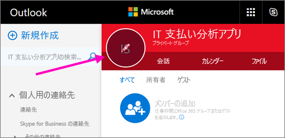
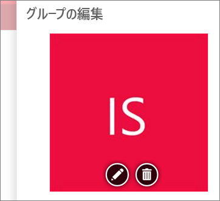
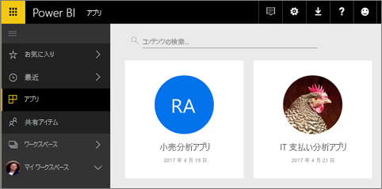

# Power BI でダッシュボードとレポートを含むアプリを作成して発行する

Power BI で、関連のあるダッシュボードやレポートをまとめて 1 つの場所に表示する*アプリ*を作成し、組織内の大きなユーザー グループに発行できます。 Google アナリティクスや Microsoft Dynamics CRM など、[外部サービス用の Power BI アプリ](service-connect-to-services.md)に接続することもできます。

ビジネス ユーザーは、業務のために Power BI の複数のダッシュボードとレポートを必要とすることがよくあります。 アプリではこうした要素がまとまっています。そのため、ダッシュボードの名前やそのダッシュボードの場所を全部記憶する必要がなくなります。  

現在プレビュー中の Power BI アプリを使用すると、ダッシュボードとレポートのコレクションを作成し、こうしたアプリを、組織全体または特定のユーザーやグループに発行できます。 レポートの作成者または管理者の場合は、アプリによって、ダッシュボード コレクションに対するアクセス許可が管理しやすくなります。

ビジネス ユーザーは、いくつかの方法でアプリを取得します。 Power BI 管理者からアクセス許可が与えられている場合は、同僚の Power BI アカウントにアプリを自動的にインストールすることができます。 その他、ビジネス ユーザーはアプリを Microsoft AppSource からインストールすることも、送信された直接リンクを使用することもできます。 すべてが 1 か所にあるため、ビジネス ユーザーは簡単に検索してコンテンツに戻ることができます。 更新プログラムは自動的に取得されます。データの更新頻度は制御することができます。 詳細については、[ビジネス ユーザーのアプリ機能](service-install-use-apps.md)に関するページを参照してください。

### アプリのライセンス
アプリの作成者には、Power BI Pro ライセンスが必要です。 アプリ ユーザーの場合は 2 つのオプションがあります。

* オプション 1: すべてのビジネス ユーザーに、アプリを表示するための **Power BI Pro** ライセンスが必要です。 
* オプション 2: 組織内の無料ユーザーが、Power BI Premium 容量内のアプリのコンテンツを表示できます。 詳しくは、[Power BI Premium](service-premium.md) に関するページをご覧ください。

### アプリと組織のコンテンツ パック
アプリは、組織のコンテンツ パックが進化したものです。 組織のコンテンツ パックが既にある場合は、アプリと並行して使用することになります。

アプリの概要について理解したら、次はアプリを作成する*アプリ ワークスペース*についてご説明します。 

## ビデオ: アプリとアプリ ワークスペース
<iframe width="640" height="360" src="https://www.youtube.com/embed/Ey5pyrr7Lk8?showinfo=0" frameborder="0" allowfullscreen></iframe>

## アプリ ワークスペース
*アプリ ワークスペース*は、アプリを作成する場所です。そのため、アプリを作成するには、最初にアプリのワークスペースを作成する必要があります。 Power BI のグループ ワークスペースで作業したことがあれば、アプリ ワークスペースにもすぐに慣れるでしょう。 アプリ ワークスペースはグループ ワークスペースが進化したもので、アプリのコンテンツのステージング領域とコンテナーが含まれています。 

こうしたワークスペースには、メンバーまたは管理者として、同僚を追加することができます。 すべてのアプリ ワークスペースのメンバーと管理者に、Power BI Pro ライセンスが必要です。 ワークスペースでは、広範な対象ユーザーや、ときには組織全体に発行する予定のダッシュボード、レポート、およびその他の記事で、全員が共同作業を行うことができます。 

コンテンツが用意できたら、公開するダッシュボードやレポートを選択し、アプリを公開します。 その対象ユーザーに直接リンクを送信することも、対象ユーザー自身が **[ストアからアプリを取得するにはクリックします]** を選択して、[アプリ] タブからアプリを検索することもできます。 このユーザーはアプリのコンテンツを変更できませんが、Power BI サービスまたはモバイル アプリのいずれかを使用してコンテンツと対話し、データ自体のフィルター、強調表示、ソートを行うことができます。 

## アプリ ワークスペースを作成する
[!INCLUDE [powerbi-service-create-app-workspace](./includes/powerbi-service-create-app-workspace.md)]

今はワークスペースが空なので、コンテンツを追加します。 最初に作成するとき、場合によっては、ワークスペースが Office 365 に反映されるまで 1 時間程度待つ必要があります。 

コンテンツの追加はマイ ワークスペースにコンテンツを追加する場合と似ていますが、ワークスペース内の他のユーザーが表示だけでなく編集もできる点が異なります。 大きな違いは、作業が完了したら、アプリとしてコンテンツを発行できることです。 一方、アプリ ワークスペースではマイ ワークスペースの場合と同様に、ファイルのアップロードまたは接続を行ったり、サードパーティーのサービスに接続したりできます。 例:

* Microsoft Dynamics CRM、Salesforce、Google アナリティクスなどの[サービスへの接続](service-connect-to-services.md)。
* Excel、CSV、Power BI Desktop (PBIX) ファイルなどの[ファイルからのデータの取得](service-get-data-from-files.md)。

アプリ ワークスペースのコンテンツを表示すると、所有者はアプリ ワークスペースの名前として表示されます。

## アプリに画像を追加する (省略可能)
既定では、Power BI は、アプリの頭文字を使用した色付きの小さな丸をアプリに作成します。 しかし、画像でカスタマイズする必要があるかもしれません。 画像を追加するには、Exchange Online ライセンスが必要です。

1. **[ワークスペース]** を選択し、ワークスペースの名前の横にある省略記号 (...) を選択して、**[メンバー]** を選択します。 
   
     
   
    ワークスペースの Office 365 Outlook アカウントが、新しいブラウザー ウィンドウで開きます。
2. 左上の色付きの丸にマウスを置くと、鉛筆のアイコンに変わります。 その質問を選択します。
   
     
3. 鉛筆のアイコンを再度選択し、使用する画像を検索します。
   
     
4. **[保存]** を選択します。
   
     ![[保存] を選択する](media/service-create-distribute-apps/power-bi-apps-workspace-save-image.png)
   
    Office 365 Outlook のウィンドウで、色付きの丸がその画像に置き換えられます。 
   
     
   
    数分後に、Power BI のアプリでも画像が表示されます。
   
     

## アプリの発行
アプリ ワークスペース内のダッシュボードとレポートの準備が整ったら、それらをアプリとして発行します。 ワークスペース内のすべてのレポートとダッシュボードを発行する必要があるわけではないことを覚えておいてください。 とにかく準備ができているものは発行できます。

1. ワークスペースの一覧表示で、アプリに含めるダッシュボードとレポートを決定します。

     

     レポートを発行しないように選択すると、レポートと、それに関連するダッシュボードの横に警告が表示されます。 アプリは引き続き発行できますが、関連するダッシュボードでは、該当するレポートのタイルが削除されます。

     

2. 右上の **[アプリの発行]** ボタンを選択して、ワークスペースのすべてのコンテンツを共有するプロセスを開始します。
   
     

3. **[詳細]** で、ユーザーがアプリを検索する際に役立つ説明を入力します。 背景色を設定してカスタマイズすることができます。
   
     

4. **[コンテンツ]** で、アプリの一部として発行されるコンテンツが表示されます。これは、そのワークスペースで選択したものすべてです。 ユーザーがアプリに移動したときに最初に表示されるダッシュボードまたはレポートをアプリのランディング ページとして設定することもできます。 **[なし]** を選択することができます。 この場合、アプリのすべてのコンテンツの一覧が表示されます。 
   
     

5. **[アクセス権]** で、アプリにアクセスできるユーザー (組織内のすべてのユーザー、または特定のユーザーあるいは Active Directory セキュリティ グループ) を決定します。 アクセス許可を持っている場合は、受信者に対してアプリを自動的にインストールする決定を行うことができます。 この設定は、[Power BI 管理ポータル](#how-to-enable-pushing-apps)で有効にすることができます。 [アプリのプッシュ](#how-to-enable-pushing-apps)に関する考慮事項をご覧ください。

    

6. **[完了]** を選択すると、発行する準備ができたことを確認するメッセージが表示されます。 成功を示すダイアログ ボックスで、このアプリへの直接リンクである URL をコピーして、共有するユーザーに送信することができます。
   
     

アプリが発行されたビジネス ユーザーは、いくつかの方法でアプリを検索できます。 アプリを自動的にインストールすることができる場合、Power BI アカウントの [アプリ] にそのアプリが表示されます。 アプリに送信された直接リンクを使用するか、アクセス許可のあるアプリがすべて表示される Microsoft AppSource で検索します。 どちらの方法でも、[アプリ] に移動した後には必ずこのアプリが一覧に表示されます。

詳細については、[ビジネス ユーザーのアプリ機能](service-install-use-apps.md)に関するページを参照してください。

## 発行されたアプリを変更する
アプリを発行した後に、アプリを変更したり更新したりできます。 アプリ ワークスペースの管理者またはメンバーであれば、簡単に更新できます。 

1. アプリに対応するアプリ ワークスペースを開きます。 
   
     
2. ダッシュボードまたはレポートを開きます。 これで、必要な変更を実行できるはずです。
   
     アプリ ワークスペースはステージング領域であるため、変更内容は再度アプリが発行されるまでアプリにプッシュされません。 これにより、発行されたアプリに影響を与えずに変更を加えることができます。  
 
3. コンテンツのアプリ ワークスペースの一覧に戻り、**[アプリを更新]** を選択します。
   
     ![[アプリを更新] ボタン](media/service-create-distribute-apps/power-bi-app-update-button.png)

4. 必要に応じて **[詳細]**、**[コンテンツ]**、および **[アクセス権]** を更新して、**[アプリを更新]** を選択します。
   
     ![[アプリを更新] ボタン](media/service-create-distribute-apps/power-bi-app-update-complete.png)

アプリを発行したユーザーには、更新されたバージョンのアプリが自動的に表示されます。 

# エンド ユーザーにアプリを自動的にインストールする
エンド ユーザーにアプリを自動的にインストールでき、適切なユーザーまたはグループに適切なアプリを簡単に配布できます。

アプリは、エンド ユーザーが自分の仕事を行うために必要なデータを提供します。 Microsoft AppSource から検索したり、インストール リンクに従ったりするのではなく、アプリ コンテンツ リストのアプリを自動的にインストールすることができます。 これにより、標準の Power BI コンテンツをユーザーにロールアウトすることが簡単になります。

## エンド ユーザーにアプリを自動的にインストールする方法
管理者が機能を有効にした後、アプリの公開元は新しいオプションを使って**アプリを自動的にインストールする**ことができます。 ボックスが***オン***になっている場合、アプリケーションの公開元が **[完了]** (または、既存のアプリの場合は **[アプリを更新]**) を選ぶと、**[アクセス]** タブのアプリの **[権限]** セクションで定義されているすべてのユーザーまたはグループに、アプリがプッシュされます。

## ユーザーが自分に対してプッシュされたアプリを入手する方法
プッシュしたアプリは、アプリ リストに自動的に表示されます。 組織のユーザーやジョブ ロールが手元に置く必要のあるアプリを選別できます。

### アプリの自動インストールに関する考慮事項
エンド ユーザーにアプリをプッシュするときの注意事項をいくつか次に示します。

* ユーザーにアプリを自動的にインストールすると、時間がかかることがあります。 ほとんどのアプリはユーザーにすぐにインストールされますが、アプリのプッシュには時間がかかる場合があります。  かかる時間は、アプリ内のアイテムの数とアクセスを付与するユーザーの数によって異なります。 ユーザーがアプリを必要とするまでに十分な時間をおいて、勤務時間外にアプリをプッシュすることをお勧めします。 アプリが使えるようになったことを広く知らせる前に、複数のユーザーで確認します。

* ブラウザーを更新します。 ユーザーがブラウザーの表示を更新したり、ブラウザーをいったん閉じて開き直したりしてからでないと、プッシュされたアプリがアプリ リストに表示されないことがあります。

* アプリがアプリ リストにすぐに表示されない場合、ユーザーはブラウザーの表示を更新するか、ブラウザーを閉じて再び開く必要があります。

* ユーザーに負担をかけすぎないようにします。 事前インストールされているアプリが役に立つことをユーザーが認識できるよう、プッシュするアプリが多くなりすぎないように注意します。 タイミングを調整するにはエンド ユーザーにアプリをプッシュできるユーザーを制御するのが最善です。 組織内のアプリをエンド ユーザーにプッシュするための連絡先を確立できます。

* 招待を受け入れなかったゲスト ユーザーに、アプリが自動的にインストールされることはありません。  

## アプリケーションを非公開にする
アプリ ワークスペースのすべてのメンバーは、アプリケーションを非公開にすることができます。

* アプリ ワークスペースで、右上隅にある省略記号 (**...**) を選択し、**[アプリケーションを非公開にする]** を選択します。
  
     

このアクションは、発行したすべてのユーザーのアプリをアンインストールし、ユーザーはアクセスできなくなります。 アプリ ワークスペースまたはその内容は削除されません。

## Power BI アプリに関する FAQ
### アプリ ワークスペースとグループ ワークスペースとの違いは何ですか?
このリリースでは、すべてのグループ ワークスペースの名前をアプリ ワークスペースに変更しています。 これらのどのワークスペースからでも、アプリを発行できます。 機能の大部分は、グループ ワークスペースと変わりません。 今後数か月で、アプリ ワークスペースに対して次の拡張機能を計画しています。 

* アプリ ワークスペースを作成しても、グループ ワークスペースのように Office 365 で対応するエンティティは作成されません。 そのため、背後で別の Office 365 グループが作成することを心配することなく、任意の数のアプリ ワークスペースを作成することができます (引き続きファイルの格納のために Office 365 グループの OneDrive fo Business を使用できます)。 
* 現在のところ、メンバーおよび管理者の一覧に追加できるのは個々のユーザーのみです。 近いうちに、これらの一覧に複数の AD セキュリティ グループまたは最新グループを追加できるようになるため、管理が容易になります。  

### アプリと組織のコンテンツ パックとの違いは何ですか?
アプリはコンテンツ パックが進化し、簡略化されたもので、いくつかの大きな違いがあります。 

* ビジネス ユーザーがコンテンツ パックをインストールすると、グループ化された ID が失われ、他のダッシュボードやレポートと混在した単なるダッシュボードとレポートの一覧になります。 一方、アプリではインストール後もグループ化および ID が維持されます。 このため、ビジネス ユーザーは時間が経っても簡単にアクセスすることができます。
* 任意のワークスペースから複数のコンテンツ パックを作成できますが、アプリとそのワークスペースの間には 1 対 1 の関係があります。 これにより、時間が経過してもアプリの理解と維持が簡単になると思われます。 この領域の改善計画については、Power BI ブログのロードマップのセクションを参照してください。 
* 将来的には、組織のコンテンツ パックは廃止される予定のため、今後はアプリを作成することをお勧めします。  

### グループの読み取り専用メンバーとは何ですか?
グループには、コンテンツの表示のみが可能な読み取り専用メンバーを追加できます。 この手法の主な問題は、メンバーとしてセキュリティ グループを追加できないことでした。 

アプリでは、読み取り専用バージョンのアプリ ワークスペースを、セキュリティ グループを含むより多くの対象ユーザーに発行することができます。 エンド ユーザーに影響を与えることなく、変更内容をアプリのダッシュボードおよびレポートにステージングできます。 今後は、この方法でアプリを使用することをお勧めします。 将来的には、ワークスペースの読み取り専用メンバーも廃止される予定です。  

## 次の手順
* [Power BI にアプリをインストールし、使用する](service-install-use-apps.md)
* [外部サービス用の Power BI アプリ](service-connect-to-services.md)
* [Power BI 管理ポータル](https://docs.microsoft.com/en-us/power-bi/service-admin-portal)
* わからないことがある場合は、 [Power BI コミュニティで質問してみてください](http://community.powerbi.com/)。
