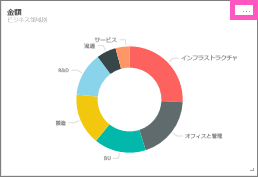
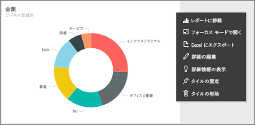

# ダッシュボードのタイルを編集または削除する
ダッシュボードでのタイルの外観や既定の動作を変更することができます。

<iframe width="560" height="315" src="https://www.youtube.com/embed/lJKgWnvl6bQ" frameborder="0" allowfullscreen></iframe>

この記事では以下について説明します。

* [別のダッシュボードにタイルをピン留め](#different)
* [タイル名の変更](#rename)
* [タイルの移動](#move)
* [タイル サイズの変更](#resize)
* [タイルへのハイパーリンクの追加](#hyperlink)
* [タイルの削除](#delete)
  
  > [!TIP]
  > タイル自体に表示される視覚エフェクトを変更するには、タイルを削除し、新しい[ダッシュボード タイル](service-dashboard-tiles.md)を追加します。
  > 
  > 

## 開始する方法
1. 少なくとも 1 つのタイルを含む[ダッシュボード](service-dashboards.md)を開きます。 
   
   
2. ダッシュボードのタイルの上にマウスを移動し、省略記号を選択してオプションを表示します。
   
   

## ダッシュボードにタイルをピン留め
1. **[タイルの固定]** アイコン  を選びます。
2. 既存のダッシュボードと新規のダッシュボードのどちらにピン留めするかを決定します。 
   
   
3. **[Pin]**(ピン留め) を選択します。

- - -

## タイル名の変更とタイルの詳細の編集
タイトルを編集し、最終更新日時を表示するには、[タイルの詳細]  アイコンを選びます。

- - -

## タイルの移動
タイルを選択したまま、ダッシュボード キャンバス上の新しい場所までドラッグします。

- - -

## タイルのサイズ変更
タイルは、1x1 から 5x5 まで、さまざまなサイズに変更できます。 ハンドル (右下隅) を選択してドラッグし、タイトルのサイズを変更します。
    

- - -

## 既定のハイパーリンクの変更
既定では、タイルを選ぶと、タイルが作成されたレポート、または Q&A (タイルが Q&A で作成された場合) に移動します。 Web ページ、別のダッシュボードまたはレポート (同じワークスペース内)、SSRS レポート、またはその他のオンライン コンテンツにリンクするには、カスタム リンクを追加します。

1. タイルを編集するには、**[Edit details]\(詳細の編集\)** アイコン  を選びます。
2. **[カスタム リンクの設定]** をオンにして、リンクの種類を選びます。    
   
   * 外部リンクの場合は、URL を入力します。     
   * 現在のワークスペースのダッシュボードまたはレポートにリンクするには、ドロップダウン メニューから選びます。
   
   

- - -

## タイルの削除
* タイルを削除するには、**[タイルの削除]** アイコン  を選びます。 タイルを削除しても、基になっているレポートまたはビジュアルは削除されません。

- - -
## 次の手順
[Power BI のダッシュボードのタイル](service-dashboard-tiles.md)

[Power BI のダッシュボード](service-dashboards.md)

[Power BI - 基本的な概念](service-basic-concepts.md)

他にわからないことがある場合は、 [Power BI コミュニティを利用してください](http://community.powerbi.com/)。

