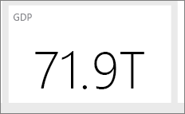

# 優れた Power BI ダッシュボードのデザインに関するヒント
ダッシュボードの作成が完了し、タイルもいくつか追加したので、ダッシュボードの外観をよくすることに加えて、機能的なものにする方法についても考えてみましょう。 通常、この改良は、最も重要な情報を目立つようにしたり、簡潔ですっきりとした外観にしたりすることです。

以下に、ヒントをいくつか示します。

> [!TIP]
> レポートの多くのデザイン原則は、ダッシュボードにも適用されます。  「[Best design principles for reports and visualizations](visuals/power-bi-visualization-best-practices.md)」 (レポートとビジュアルのデザインに関するベスト プラクティス) のホワイトペーパーをご覧ください。
>
>

## [ダッシュボード作り直しウェビナー](https://info.microsoft.com/CO-PowerBI-WBNR-FY16-05May-12-Dashboard-Makeover-Registration.html)を見る
Microsoft Principal Program Manager と Power BI ダッシュボード エキスパート Marc Reguera による[ダッシュボードの改造](https://info.microsoft.com/CO-PowerBI-WBNR-FY16-05May-12-Dashboard-Makeover-Registration.html)をご覧ください。

## 閲覧者をよく考える
閲覧者の意思決定に役立つ重要なメトリックは何でしょうか。 ダッシュボードは、どのように使用されるでしょうか。 学習された (つまり文化的な) どんな前提が、デザインの選択に影響を与える可能性がありますか。 閲覧者が成功するためにどのような情報が必要ですか。

ダッシュボードとは、データの現在の状態を監視するための 1 つの場所、つまり概要であることにご留意ください。 ダッシュボードは、基となるレポートとデータセットに依存しており、それらは大量の詳しい情報を含むことができます。 閲覧者は、ダッシュボードから各種レポートをドリルダウンできます。 このため、閲覧者が監視する必要がある情報でない限り、ダッシュボードには詳しい情報を含めないでください。

ダッシュボードをどのようなデバイスに表示する予定ですか。 大型のモニターの場合、より多くのコンテンツを配置できます。 閲覧者がタブレットに表示する場合は、タイルの数を少なくする方が読みやすくなります。

## ストーリーを持たせ、それを 1 つの画面に収める
ダッシュボードでは、重要な情報をひと目で示す必要があるため、すべてのタイルを 1 つの画面に入れるのがベストです。 スクロール バーがダッシュボードに表示されないようにできますか。

ダッシュボードに情報を詰め込みすぎて雑然としていませんか。  不可欠な情報以外のすべてを削除して、読みやすく、分かりやすいものにします。

## 全画面表示モードの使用
余計なものに気を取られることなく、ダッシュボードを[全画面表示](service-fullscreen-mode.md)で表示します。

## 最も重要な情報を最も大きくする
ダッシュボード上のテキストと視覚化がすべて同じサイズの場合、閲覧者は最も重要なことを見つけるのに苦労します。 たとえば、次のようなカードの視覚化は、重要な数値を目立つように表示するための優れた方法です。  

ただし、必ずその意味を示してください。  

[数値だけのタイルを作成](visuals/power-bi-visualization-card.md)する方法についてご覧ください。

## 最も重要な情報は、上部の隅に配置する
たいていの人は上から下に向かって情報を読むため、概要の情報は上部に配置し、より詳しい情報は閲覧者が読み進む方向 (左から右、または右から左) で下に向かって配置していきます。

## データに適した視覚エフェクトを使用し、見やすく書式設定する
趣向を変えて変化をつけるためだけにさまざまな視覚化を使用することは避けてください。  視覚化は絵を描くように作成し、しかも読みやすく分かりやすいものにしてください。  データや視覚化によっては、シンプルなグラフの視覚化で十分です。 ただし、データの中にはより複雑な視覚化が必要になるものもあります。その場合は、必ずタイトル、ラベル、およびその他のカスタマイズを活用して、閲覧者に理解しやすいようにしてください。  

* [適切なデータ視覚化を選びます](https://www.youtube.com/watch?v=-tdkUYrzrio)。 事実を歪曲するグラフ、つまり 3-D グラフの使用にはご注意ください。 人間の脳は円形のものを解読することが困難であることにご留意ください。 円グラフ、ドーナツ グラフ、ゲージ、およびその他の円形の種類のグラフは見栄えはよいですが、データの視覚化のベスト プラクティスではありません。
* 軸上のグラフの目盛、グラフのディメンションの順序、およびグラフ内のディメンション値に使用する色と調和させます。
* 量的なデータを必ず読みやすくエンコードします。 数値を表示する場合、数字を 3 ～ 4 桁までにしてください。 小数点の左側に 1 桁または 2 桁までの数字と、千または百万の尺度 (つまり、3,400,000 ではなく 3.4 M (日本語の場合は「千」、「万」など)) で測定単位を表示します。
* 有効桁数と時間のレベルを統一します。 期間がよくわかるようにします。  前月のある 1 つのグラフを、その年の特定の 1 つの月からフィルター処理されたグラフの横に配置しないでください。
* 折れ線グラフや横棒グラフなど、同じ尺度に大きい測定単位と小さい測定単位を混在させないでください。  たとえば、1 つの測定単位が数百万単位で、もう一方の測定単位が数千単位のような指定の方法です。  このような大きい縮尺では、数千単位の測定値の違いがわかりにくくなります。  測定単位を混在させる必要がある場合は、2 つ目の軸の使用を可能にする視覚化を選びます。
* グラフを不要なデータ ラベルで雑然とさせないでください。 通常、横棒グラフの値は、実際の数値を示さなくても十分にわかります。
* [グラフの並べ替え](power-bi-report-change-sort.md)方法にご注意ください。  最大数または最小数に注目させる必要がある場合は、測定単位に従って並べ替えます。  閲覧者が他の多くのカテゴリの中の特定のカテゴリをすばやく見つけられるようにするには、軸に従って並べ替えます。  
* 円グラフは、カテゴリが 7 つ以下の場合に最適です。 円グラフ内の各値の比較は、値を並べて比較できないため横棒グラフや縦棒グラフよりも難しくなります。 円グラフは、部分の比較ではなく、全体に対する部分の関係を示すために適しています。 ゲージ グラフは、ある目標に関して現在の状態を示すために適しています。

視覚化について詳しくは、「[Power BI での視覚化の種類](visuals/power-bi-visualization-types-for-reports-and-q-and-a.md)」をご覧ください。  

## ダッシュボード デザインのベスト プラクティスの詳しい情報
優れたダッシュボード デザインの手法を習得するには、視覚認識の基本の Gestalt Principles (ゲシュタルトの法則) と、文脈において実用的な情報を明確に伝える方法についての学習をご検討ください。 幸運なことに、非常に多くのリソースがすでにいろいろなサイトから入手でき、マイクロソフトのさまざまなブログからも入手できます。 役立つ書籍としては、次のものがあります。

* *Information Dashboard Design* Stephen Few 著  
* *Show Me the Numbers* Stephen Few 著  
* *Now You See It* Stephen Few 著  
* *Envisioning Information* Edward Tufte 著  
* *Advanced Presentations* by Design Andrew Abela 著   

## 次の手順
[レポートからダッシュボードを作成する](service-dashboard-create.md)  
[Power BI - 基本的な概念](service-basic-concepts.md)  
他にわからないことがある場合は、 [Power BI コミュニティを利用してください](http://community.powerbi.com/)。
