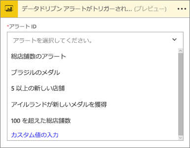
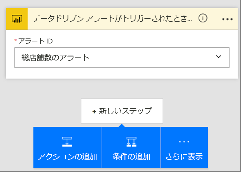
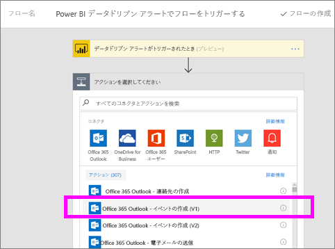

# Microsoft Flow と Power BI

[Microsoft Flow](https://flow.microsoft.com/en-us/documentation/getting-started) は、ビジネス ユーザーが使用するアプリケーションや SaaS サービスが増える中で、全体のワークフローを自動化する機能を提供する SaaS です。 Flow を使用すると、お気に入りのアプリとサービス (Power BI を含む) を統合して、通知の受信、ファイルの同期、データの収集などのタスクを自動化できます。 ワークフローを自動化すると、反復的なタスクが容易になります。

[今すぐ Flow を使い始めましょう。](https://flow.microsoft.com/documentation/getting-started)

Power BI のアラートがトリガーされたときに詳細なメールを同僚に送信するフローを Sirui が作成するところをご覧ください。 その後、ビデオで説明されている手順に従って、ご自分でやってみてください。

<iframe width="560" height="315" src="https://www.youtube.com/embed/YhmNstC39Mw" frameborder="0" allowfullscreen></iframe>

## Power BI データ アラートでトリガーされるフローを作成する
このチュートリアルでは、フローをテンプレートから作成する方法とゼロから作成する方法について説明します。 この手順を実行するには、[Power BI でデータ アラートを作成し](service-set-data-alerts.md)、[Microsoft Flow にサインアップしてください](https://flow.microsoft.com/en-us/#home-signup) (サインアップは無料です)。

## Power BI を使用するフローをテンプレートから作成する
このタスクでは、テンプレートを使用して、Power BI データ アラート (通知) でトリガーされる単純なフローを作成します。

1. Microsoft Flow (flow.microsoft.com) にサインインします。
2. **[自分のフロー]** を選択します。
   
   
3. **[テンプレートから作成]** を選択します。
   
    
4. [検索] ボックスを使用して Power BI テンプレートを検索し、**[Post a message to a Slack channel when a Power BI data alert is triggered]** (Power BI データ アラートがトリガーされた場合にメッセージを Slack チャネルに投稿する) を選択します。
   
    
5. **[このテンプレートを使用]** を選択します。
   
   
6. メッセージが表示されたら **[サインイン]** を選択して Slack と Power BI に接続し、画面の指示に従います。 サインインすると、緑色のチェックマークが表示されます。  接続を確認したら、**[続行]** を選択します。
   
   

### フローを構築する
このテンプレートには、1 つのトリガー (アイルランドが新しいオリンピック メダルを獲得するとトリガーされる Power BI データ アラート) と、1 つのアクション (メッセージを Slack に投稿する) が含まれています。 Flow でフィールドを選択すると、含めることができる動的なコンテンツが表示されます。  この例では、メッセージの本文にタイル値とタイル URL を含めています。

1. トリガーのドロップダウンから Power BI データ アラートを選択します。 **[アイルランドが新しいメダルを獲得]** を選びます。 アラートの作成方法については、「[Data alerts in Power BI](service-set-data-alerts.md)」(Power BI のデータ アラート) を参照してください。
   
   
2. Slack に投稿するには、チャネルの名前とメッセージ テキストを入力します (Flow が作成する既定のメッセージを選ぶこともできます)。 メッセージ テキスト フィールドに追加した動的コンテンツを確認します。
   
   > [!NOTE]
   > チャネル名の先頭に "@" を追加します。  たとえば、Slack チャネルの名前が "channelA" の場合、Flow で「@channelA」と入力します。
   > 
   > 
   
   
3. 終わったら、**[フローの作成]** または **[フローの保存]** を選びます。  フローが作成され、評価されます。  Flow でエラーが検出されると、通知されます。
4. エラーが検出された場合、**[フローの編集]** を選択して修正するか、**[完了]** を選択して新しいフローを実行します。
   
   
5. Slack アカウントを開いてメッセージを確認します。  
   
   

## Power BI を使用するフローを最初 (ゼロ) から作成する
このタスクでは、Power BI データ アラート (通知) でトリガーされる単純なフローをゼロから作成します。

1. Microsoft Flow にサインインします。
2. **[マイ フロー]** > **[一から作成]** の順に選びます。
   
   
3. [検索] ボックスを使って Power BI トリガーを探し、**[Power BI データドリブン アラートでフローをトリガーする]** を選びます。

### フローを構築する
1. ドロップダウンからアラート名を選択します。  アラートの作成方法については、「[Data alerts in Power BI](service-set-data-alerts.md)」(Power BI のデータ アラート) を参照してください。
   
    
2. **[新しいステップ]** > **[アクションの追加]** を選択します。
   
   
3. 「**Outlook**」を検索し、**[Create event]** (イベントの作成) を選択します。
   
   
4. イベント フィールドに入力します。 Flow でフィールドを選択すると、含めることができる動的なコンテンツが表示されます。
   
   
5. 完了したら、**[フローの作成]** を選択します。  フローが保存され、評価されます。 エラーがない場合、**[完了]** を選択してこのフローを実行します。  新しいフローが **[自分のフロー]** ページに追加されます。
   
   
6. Power BI データ アラートでフローがトリガーされると、次のような Outlook イベント通知を受け取ります。
   
    

## 次の手順
* [Microsoft Flow の概要](https://flow.microsoft.com/en-us/documentation/getting-started/)
* [Power BI サービスでのデータ アラートの設定](service-set-data-alerts.md)
* [iPhone でデータ アラートを設定する](mobile-set-data-alerts-in-the-mobile-apps.md)
* [Windows 10 用の Power BI モバイル アプリでデータ アラートを設定する](mobile-set-data-alerts-in-the-mobile-apps.md)
* 他にわからないことがある場合は、 [Power BI コミュニティを利用してください](http://community.powerbi.com/)。

