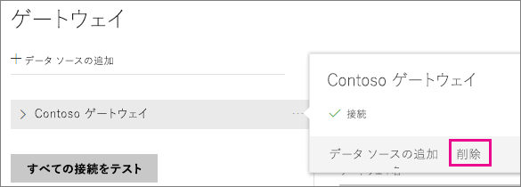
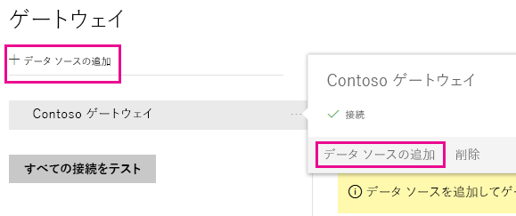
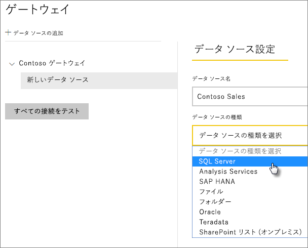
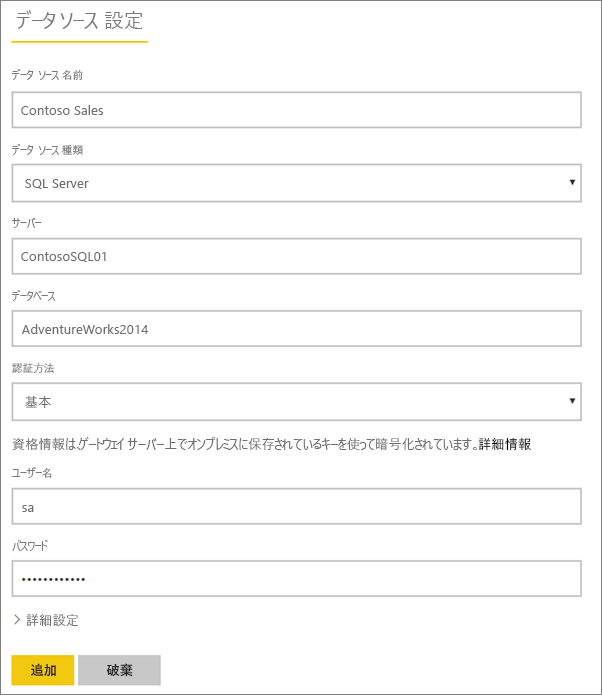
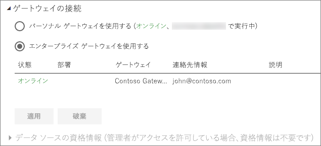

# データ ソースの管理 - SQL Server
オンプレミス データ ゲートウェイをインストールしたら、ゲートウェイで使用できるデータ ソースを追加することができます。 この記事では、ゲートウェイとデータ ソースの操作方法について説明します。 スケジュールされた更新または DirectQuery のどちらに対しても SQL Server データ ソースを使用できます。

## ゲートウェイをダウンロードしてインストールする
ゲートウェイは Power BI サービスからダウンロードできます。 **[ダウンロード]** > **[Data Gateway]** の順に選択するか、[ゲートウェイのダウンロード ページ](https://go.microsoft.com/fwlink/?LinkId=698861)に移動します。

## ゲートウェイの追加
ゲートウェイを追加する場合は、使用している環境のサーバー上にゲートウェイを[ダウンロード](https://go.microsoft.com/fwlink/?LinkId=698861)してインストールするだけです。 インストール済みのゲートウェイは、 **[ゲートウェイの管理]**の下のゲートウェイ一覧に表示されます。

> [!NOTE]
> **[ゲートウェイの管理]** は、少なくとも 1 つのゲートウェイの管理者になるまで表示されません。 これは、管理者としてゲートウェイに追加されたとき、またはゲートウェイを自分でインストールして構成したときに発生します。
> 
> 

## ゲートウェイの削除
ゲートウェイを削除すると、そのゲートウェイの下にあるデータ ソースもすべて削除されます。  それらのデータ ソースに依存するダッシュボードやレポートも中断されます。

1. 画面右上の歯車アイコン  をクリックし、**[ゲートウェイの管理]** を選択します。
2. [ゲートウェイ] > **[削除]** をクリックします。
   
   

## データ ソースの追加
データ ソースを追加するには、ゲートウェイを選択して **[データ ソースの追加]** をクリックするか、または [ゲートウェイ] > **[データ ソースの追加]** をクリックします。

次に、一覧から **[データ ソースの種類]** を選択します。

> [!NOTE]
> DirectQuery を使用する場合、ゲートウェイは **SQL Server 2012 SP1** と後続のバージョンのみに対応しています。
> 
> 

次に、 **[サーバー]** や **[データベース]**など、データ ソースの情報を入力する必要があります。  

また、 **[認証方法]**も選択する必要があります。  **[Windows]** または **[基本]**を選択できます。  Windows 認証ではなく SQL 認証を使用する場合は、 **[基本]** を選択してください。 次に、このデータ ソースで使用される資格情報を入力します。

> [!NOTE]
> データ ソースへのすべてのクエリは、Kerberos シングル サインオン (SSO) が構成され、データ ソースに対して有効な場合を除き、これらの資格情報を使用して実行されます。 SSO を使用すると、インポート データセットは保存された資格情報を使用しますが、DirectQuery データセットは現在の Power BI ユーザーを使用し、SSO を使用してクエリを実行します。 詳細については、[資格情報](service-gateway-onprem.md#credentials)の保存方法に関する主なオンプレミス データ ゲートウェイの記事、または [Power BI からオンプレミス データ ソースの SSO (シングル サインオン) に Kerberos を使用する](service-gateway-kerberos-for-sso-pbi-to-on-premises-data.md)方法を説明している記事を参照してください。
> 
> 

すべての情報を入力したら、 **[追加]** をクリックできます。  このデータ ソースは、オンプレミスの SQL Server サーバーに対するスケジュールされた更新または DirectQuery に使用できるようになりました。 接続に成功すると、「 *接続成功* 」というメッセージが表示されます。

### 詳細設定
データ ソースのプライバシー レベルを構成できます。 データを加工できる方法を制御します。 これは、スケジュールされた更新にのみ使用します。 DirectQuery には適用されません。 [詳細情報](https://support.office.com/article/Privacy-levels-Power-Query-CC3EDE4D-359E-4B28-BC72-9BEE7900B540)

## データ ソースの削除
データ ソースを削除すると、そのデータ ソースに依存するすべてのダッシュボードやレポートが中断されます。  

データ ソースを削除するには、[データ ソース] > **[削除]** をクリックします。

## 管理者の管理
ゲートウェイの [管理者] タブで、ゲートウェイを管理できるユーザー (またはセキュリティ グループ) を追加および削除できます。

## ユーザーの管理
データ ソースの [ユーザー] タブで、このデータ ソースを使用できるユーザーまたはセキュリティ グループを追加および削除できます。

> [!NOTE]
> ユーザー一覧は、だれがレポートを公開できるかを制御します。 レポート所有者は、ダッシュボードやコンテンツ パックを作成し、それらを他のユーザーと共有できます。
> 
> 

## データ ソースの使用
作成したデータ ソースは、DirectQuery 接続かスケジュールされた更新のいずれかによって使用されます。

> [!NOTE]
> Power BI Desktop とオンプレミス データ ゲートウェイ内のデータ ソースとの間で、サーバーとデータベース名が一致している必要があります。
> 
> 

データセットとゲートウェイ内のデータ ソース間のリンクは、サーバー名とデータベース名に基づいています。 このため、これらは一致している必要があります。 たとえば、**Power BI Desktop** 内でサーバー名の IP アドレスを指定する場合は、ゲートウェイ構成内のデータ ソースでもその IP アドレスを使用する必要があります。 Power BI Desktop で *SERVER\INSTANCE* を使用する場合は、ゲートウェイ用に構成されているデータ ソース内でも同じものを使用する必要があります。

これは、DirectQuery とスケジュールされた更新のどちらにも該当します。

### DirectQuery 接続でデータ ソースを使用する
**Power BI Desktop** とゲートウェイ用に構成されているデータ ソースとの間では、サーバーとデータベース名が一致している必要があります。 また、DirectQuery のデータセットを公開するには、自分のアカウントがデータ ソースの **[ユーザー]** タブの一覧に表示されている必要があります。 DirectQuery の選択は、最初にデータをインポートする Power BI Desktop 内で発生します。 [詳細情報](desktop-use-directquery.md)

公開した後は、Power BI Desktop か **[データの取得]** のいずれかから、レポート機能が利用可能になります。 ゲートウェイ内にデータ ソースを作成してから、接続が使用できるようになるまでには、数分ほどかかることがあります。

### スケジュールされた更新でデータ ソースを使用する
ゲートウェイ内に構成されているデータ ソースの **[ユーザー]** タブの一覧に自分のアカウントが表示されていて、さらにサーバーとデータベース名が一致している場合は、スケジュールされた更新で使用するオプションとして、ゲートウェイが表示されます。

## 次の手順
* [オンプレミス データ ゲートウェイ](service-gateway-onprem.md)  
* [オンプレミス データ ゲートウェイの詳細](service-gateway-onprem-indepth.md)  
* [オンプレミス データ ゲートウェイのトラブルシューティング](service-gateway-onprem-tshoot.md)
* [Power BI からオンプレミス データ ソースへの SSO (シングル サインオン) に Kerberos を使用する](service-gateway-kerberos-for-sso-pbi-to-on-premises-data.md) 
* 他にわからないことがある場合は、 [Power BI コミュニティを利用してください](http://community.powerbi.com/)。

