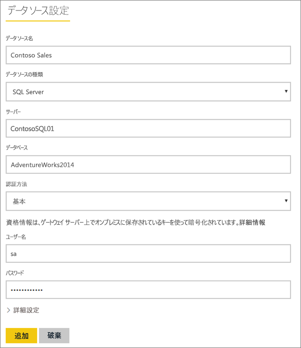
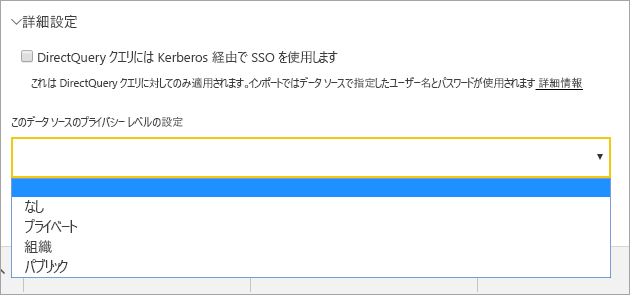
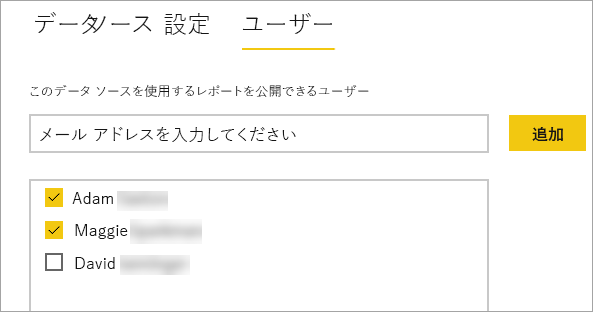
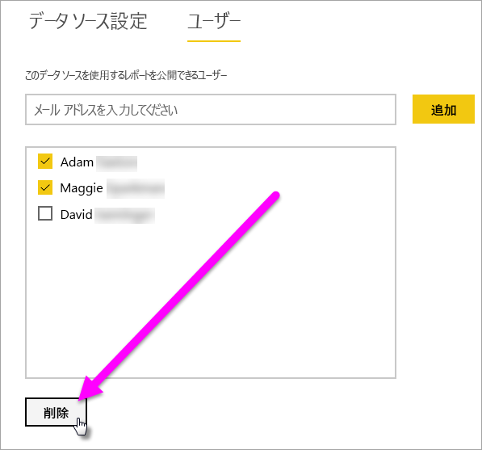
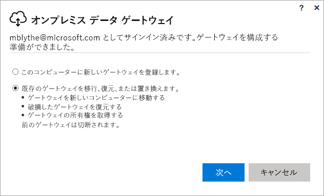
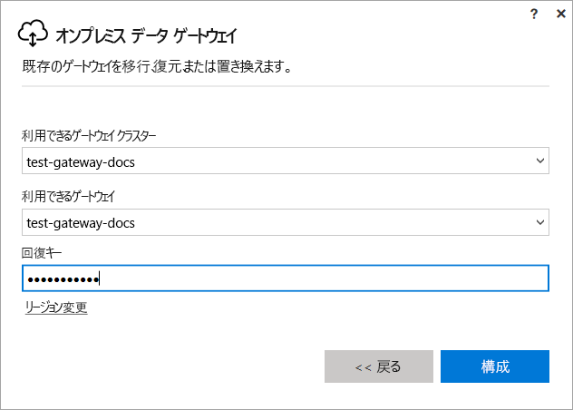

# Power BI ゲートウェイを管理する

[Power BI データ ゲートウェイをインストール](service-gateway-install.md)したら、Power BI サービスの **[ゲートウェイの管理]** 領域を通して、ローカル コンピューター上のゲートウェイ アプリで PowerShell スクリプトを使用してゲートウェイを管理できます。 この記事では、Power BI サービスを中心に説明します。 ゲートウェイをインストールした直後であれば、[データ ソースの追加](#add-a-data-source)と[ユーザーの追加](#add-users-to-a-data-source)を行って、ユーザーがデータ ソースにアクセスできるようにすることをお勧めします。

## データ ソースを管理する

Power BI は、多数のオンプレミス データ ソースをサポートしますが、各データ ソースには独自の要件があります。 この例では、SQL Server をデータ ソースとして 追加する方法を示しますが、他のデータ ソースも手順は類似しています。

### データ ソースの追加

1. Power BI サービスの右上にある歯車アイコン ![[設定] 歯車アイコン](media/service-gateway-manage/icon-gear.png) > **[ゲートウェイの管理]** の順に選択します。

    

2. ゲートウェイを選択し、**[データ ソースの追加]** を選択するか、[ゲートウェイ] > **[データ ソースの追加]** に移動します。

    

3. **データ ソースの種類**を選択します。

    

4. データ ソースの情報を入力します。 この例では、**サーバー**、**データベース**、およびその他の情報です。  

    

5. SQL Server では、**[認証方法]** で **[Windows]** または **[基本]** (SQL 認証) を選択します。  **[基本]** を選択した場合は、データ ソースの資格情報を入力します。

6. **[詳細設定]** で、必要に応じてデータ ソースの[プライバシー レベル](https://support.office.com/article/Privacy-levels-Power-Query-CC3EDE4D-359E-4B28-BC72-9BEE7900B540)を構成します ([DirectQuery](desktop-directquery-about.md) には適用されません)。

    

7. **[追加]** を選択します。 接続に成功すると、「"*接続成功*"」というメッセージが表示されます。

    

これで、このデータ ソースを使用して、Power BI ダッシュボードとレポートに SQL Server のデータを含めることができます。

### データ ソースの削除

データ ソースを使用しなくなった場合は、それを削除できます。 データ ソースを削除すると、そのデータ ソースに依存するすべてのダッシュボードやレポートが壊れることに注意してください。

データ ソースを削除するには、データ ソースに移動し、**[削除]** を選択します。

## ユーザーと管理者を管理する

データ ソースをゲートウェイに追加した後、ユーザーとセキュリティ グループに (ゲートウェイ全体ではなく) 特定のデータ ソースへのアクセス権を与えます。 データ ソースのユーザーの一覧は、データ ソースのデータが含まれるレポートを発行できるユーザーを制御します。 レポートの所有者は、ダッシュボード、コンテンツ パック、およびアプリを作成し、それらを他のユーザーと共有できます。

ゲートウェイへの管理アクセス権をユーザーとセキュリティ グループに与えることもできます。

### データ ソースへのユーザーの追加

1. Power BI サービスの右上隅で、歯車アイコン ![[設定] 歯車アイコン](media/service-gateway-manage/icon-gear.png) > **[ゲートウェイの管理]** を選択します。

2. ユーザーを追加するデータ ソースを選択します。

3. **[ユーザー]** を選択し、選択したデータ ソースへのアクセス権を与える組織のユーザーを入力します。 次の画面では、Maggie と Adam が追加されています。

    ![[ユーザー] タブ](media/service-gateway-manage/users-tab.png)

4. **[追加]** を選択します。追加されたメンバーがボックスに表示されます。

    

これで完了です。 アクセスを与えるデータ ソースごとにユーザーを追加する必要があります。 各データ ソースには、別個のユーザー リストがあります。データ ソースごとにユーザーを追加する必要があります。

### データ ソースからのユーザーの削除

データ ソースの **[ユーザー]** タブで、このデータ ソースを使用できるユーザーまたはセキュリティ グループを削除できます。

### 管理者の追加と削除

ゲートウェイの **[管理者]** タブで、ゲートウェイを管理できるユーザー (またはセキュリティ グループ) の追加と削除を実行できます。

![[管理者] タブ](media/service-gateway-manage/administrators-tab.png)

## ゲートウェイ クラスターを管理する

2 つ以上のゲートウェイがあるクラスターを作成した場合は、すべてのゲートウェイ管理オプション (データ ソースの追加やゲートウェイへの管理アクセス許可の付与など) が、クラスターの一部であるすべてのゲートウェイに適用されます。 

管理者が **Power BI サービス**の歯車アイコンの下にある **[ゲートウェイの管理]** メニュー項目を使用するときに、登録済みクラスターまたは個々のゲートウェイのリストが表示されますが、クラスターのメンバーである個々のゲートウェイ インスタンスは表示されません。

新しい**スケジュールされている更新**要求と DirectQuery 操作はすべて、指定されたゲートウェイ クラスターのプライマリ インスタンスに自動的にルーティングされます。 プライマリ ゲートウェイ インスタンスがオンラインでない場合、要求はクラスターの別のゲートウェイ インスタンスにルーティングされます。

## ゲートウェイの移行、復元、または引き継ぎを行う

ゲートウェイの移行、復元、または引き継ぎを行うコンピューターで、ゲートウェイ インストーラーを実行します。

1. ゲートウェイをダウンロードしてインストールします。

2. Power BI アカウントにサインインした後、ゲートウェイを登録します。 **[Migrate, restore or take over an existing gateway]/(既存のゲートウェイの移行、復元、または引き継ぎ/)** > **[次へ]** を選択します。

    

3. 利用可能なクラスターとゲートウェイから選択し、選択したゲートウェイのリカバリ キーを入力します。 **[構成]** を選択します。

    

## ゲートウェイを再起動する

ゲートウェイは Windows サービスとして実行されます。 他の Windows サービスと同じように、その開始と停止の方法は複数あります。 コマンド プロンプトを使用する方法を次に示します。

1. ゲートウェイが実行されているコンピューターで、管理者権限でコマンド プロンプトを起動します。

2. サービスを停止するには `net stop PBIEgwService` を入力します。

3. サービスを再起動するには `net start PBIEgwService` を入力します。

## ゲートウェイの削除

ゲートウェイを使用しなくなった場合は、それを削除できます。 ただし、ゲートウェイを削除すると、追加されたすべてのデータ ソースも削除されることに注意してください。 これにより、それらのデータ ソースに依存しているダッシュボードとレポートが壊れます。

1. Power BI サービスの右上隅で、歯車アイコン ![[設定] 歯車アイコン](media/service-gateway-manage/icon-gear.png) > **[ゲートウェイの管理]** を選択します。

2. ゲートウェイを選択し、**[削除]** を選択します。
   
   

## 次の手順

[データ ゲートウェイの展開に関するガイダンス](service-gateway-deployment-guidance.md)

他にわからないことがある場合は、 [Power BI コミュニティを利用してください](http://community.powerbi.com/)。
