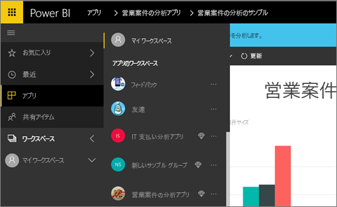
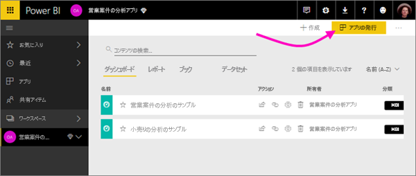
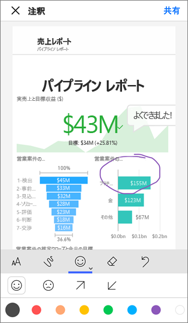

# Power BI で共同作業および共有を行う方法

ダッシュボードとレポートを作成しました。 ダッシュボードやレポートで同僚と共同作業することもあります。 その場合は、他の人に、アクセス許可を与える必要があります。 それらを配布する最善の方法は何でしょう。

この記事では、Power BI で共同作業および共有を行うための以下のオプションについて比較します。 

* 同僚と共同作業を行い、"*アプリ ワークスペース*" で意味のあるレポートやダッシュボードを作成します。
* こうしたダッシュボードとレポートを "*アプリ*" にバンドルし、より大きいグループや組織全体に発行します。
* サービスまたは Power BI モバイル アプリから、数人のユーザーでダッシュボードまたはレポートを共有します。
* 誰でも表示して操作できるように Web に公開します。
* 印刷。 

どのオプションでも、ダッシュボードを共有するには [Power BI Pro](service-free-vs-pro.md) のライセンスが必要です。あるいは、コンテンツを [Premium 容量](service-premium.md)に格納する必要があります。 ライセンスの要件は、選んだオプションに応じて、ダッシュボードを表示する同僚では異なります。 次のセクションでは、詳細を説明します。 

*Power BI サービスでのアプリ*

## 同僚との共同作業でアプリを作成する
同僚と共同で、Power BI の分析情報を組織に発行したいものとします。 そのための最善の方法は、"*アプリ*" を作成することです。 アプリは、組織に主要な指標を提供するために作成されたダッシュボードとレポートの集まりです。 

アプリを作成するには、チームの同僚をメンバーとする "*アプリ ワークスペース*" が必要です。 アプリ ワークスペースは、自分とチーム メンバーが Power BI のダッシュボードとレポートを共同作業できるステージング領域と考えてください。 全員が Power BI Desktop でレポートを作成し、アプリ ワークスペースにそのレポートを公開できます。また、全員に Power BI Pro ライセンスが必要です。

**完成したダッシュボードを同僚と共有したいだけの場合は、同僚をアプリ ワークスペースに追加しないでください。** 代わりに、[アプリ ワークスペースでダッシュボードを作成](service-create-distribute-apps.md)し、アプリを同僚に発行します。 

## 多くの対象ユーザーにアプリを発行する
多くの対象ユーザーにダッシュボードを配布するとします。 チームは "*アプリ ワークスペース*" を作成し、そのアプリ ワークスペースに、ダッシュボード、レポート、およびデータセットを作成して、調整しました。 次に、目的のダッシュボードとレポートを選択し、それらをアプリとして、セキュリティ グループまたは配布リストのメンバーに、あるいは組織全体に発行します。 

アプリは Power BI サービス ([https://powerbi.com](https://powerbi.com)) で簡単に検索してインストールすることができます。 アプリへの直接リンクをビジネス ユーザーに送信したり、ユーザーが AppSource でアプリを検索しりすることができます。 Power BI 管理者からアクセス許可が与えられている場合は、同僚の Power BI アカウントにアプリを自動的にインストールすることができます。 詳細については、[アプリの発行](service-create-distribute-apps.md#publish-your-app)に関するページを参照してください。 

インストールしたアプリは、ブラウザーまたはモバイル デバイスで表示できます。

ユーザーがアプリを表示するには、ユーザーに Power BI Pro ライセンスが付与されているか、アプリを Power BI Premium 容量に格納する必要があります。 詳しくは、[Power BI Premium](service-premium.md) に関するページをご覧ください。

## ダッシュボードとレポートを共有する
マイ ワークスペースまたはアプリ ワークスペースでダッシュボードとレポートの作成が完了し、他のユーザーにアクセス許可を与える場合を考えてみましょう。 アクセス許可を与える方法の 1 つが、 *共有* することです。 

![[共有] アイコン](media/service-how-to-collaborate-distribute-dashboards-reports/power-bi-share-in-situ.png)

コンテンツを共有するには Power BI Pro ライセンスが必要です。また、共有先にも同様のライセンスが必要です。あるいは、コンテンツを [Premium 容量](service-premium.md)に格納する必要があります。 ダッシュボードまたはレポートを共有すると、共有先は、ダッシュボードを表示し、対話操作を行うことができますが、編集はできません。 行レベルのセキュリティ (RLS) が内部のデータセットに適用されない限り、自分のダッシュボードおよびレポートに表示されるものと同じデータが同僚にも表示されます。 共有元のユーザーが許可した場合、共有先のユーザーはそれを同僚と共有できます。 

組織外のユーザーと共有することもできます。 組織外のユーザーは、ダッシュボードを表示し、対話操作を行うことはできますが、共有することはできません。 

Power BI サービスからの[ダッシュボードとレポートの共有](service-share-dashboards.md)について、詳細を確認してください。 リンクにフィルターを追加して、[レポートのフィルター処理されたビューを共有](service-share-reports.md)することもできます。

## Power BI モバイル アプリから注釈を付けて共有する
iOS および Android デバイス用 Power BI モバイル アプリでは、タイル、レポート、またはビジュアルに注釈を付けて、電子メール経由で他のユーザーと共有できます。 

タイル、レポート、ビジュアルのスナップショットが共有され、受信者にはメールで送信したものと同じ内容が表示されます。 メールにはダッシュボードまたはレポートへのリンクも含まれています。 受信者に Power BI Pro ライセンスがある、またはコンテンツが [Premium 容量](service-premium.md)に格納されていて、既にオブジェクトが共有されている場合、その受信者は、オブジェクトを開くことができます。 同じメール ドメインの同僚だけでなく、すべてのユーザーにタイルのスナップショットを送信できます。

iOS および Android モバイル アプリからの、[タイル、レポート、およびビジュアルの共有および注釈付け](mobile-annotate-and-share-a-tile-from-the-mobile-apps.md)の詳細を確認してください。

Windows 10 デバイス用 Power BI アプリから、[タイルのスナップショットを共有する](mobile-windows-10-phone-app-get-started.md)こともできます。

## Web への公開
ブログの投稿、Web サイト、ソーシャル メディア、およびその他オンライン通信に対話的な視覚エフェクトを埋め込むことで、Power BI レポートをインターネット全体に公開することができます。 インターネット上のすべてのユーザーがレポートを表示できるため、公開した内容を閲覧できるユーザーは制御できません。 ユーザーに Power BI ライセンスは必要ありません。 Web に公開できるのは、自分で編集可能なレポートだけです。 他のユーザーから共有されているレポート、またはアプリ内にあるレポートは、Web に公開できません。 [Web への公開について詳しくはこちら](service-publish-to-web.md)。

## PDF または他の静的ファイルとして印刷または保存する
Power BI サービスからダッシュボード全体、ダッシュボードのタイル、レポート ページ、または視覚エフェクトを PDF (または他の静的ファイル形式) として印刷または保存することができます。 レポートは、一度に 1 ページのみを印刷できます。レポート全体を一度に印刷することはできません。 詳しくは、「[Power BI からの印刷](service-print.md)」をご覧ください。

## 次の手順
* ご意見およびご提案がある場合は、 [Power BI コミュニティ サイト](https://community.powerbi.com/)をご利用ください。
* [同僚や他のユーザーとダッシュボードを共有する](service-share-dashboards.md)
* [Power BI でのアプリの作成および発行](service-create-distribute-apps.md)
* 他にわからないことがある場合は、 [Power BI コミュニティを利用してください](http://community.powerbi.com/)。

