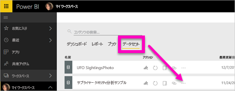

# Power BI を使用してデータ インサイトを自動的に生成する
新しいデータセットがあるが、どこから始めたらよいかわからない場合。  ダッシュボードをすばやく構築する必要がある場合。  不足している情報を探したい場合。

クイック インサイトを実行して、データに基づいて、興味のある対話型の視覚化を生成します。 クイック インサイトは、データセット全体に対して実行することも (クイック インサイト)、特定のダッシュボード タイルに対して実行することもできます (範囲指定のインサイト)。 インサイトに対してインサイトを実行することもできます。

> **注**: インサイトは、DirectQuery では機能しません。Power BI にアップロードされたデータに限り機能します。
> 
> 

インサイトの基となっているのは、Microsoft Research と共同開発して拡大を続けている[高度な分析アルゴリズムのセット](service-insight-types.md)です。引き続きこれを使って、より多くの人が新しい直感的な方法でデータから詳細情報を見つけられるようにしていきます。

## データセットへのクイック インサイトの実行
Amanda がクイック インサイトをデータセットに対して実行し、フォーカス モードでインサイトを開き、インサイトの 1 つをダッシュボード上にタイルとして固定し、ダッシュボード タイルのインサイトを取得する様子をご覧ください。

<iframe width="560" height="315" src="https://www.youtube.com/embed/et_MLSL2sA8" frameborder="0" allowfullscreen></iframe>

次はあなたの番です。 [サプライヤー クオリティ分析サンプル](sample-supplier-quality.md)を使用してインサイトを試してみます。

1. **[データセット]** タブから省略記号 [...] を選び、**[詳細情報の取得]** を選びます。
   
    
   
    
2. Power BI は[さまざまなアルゴリズム](service-insight-types.md)を使用して、データセット内の傾向を検索します。
   
    
3. 数秒で、情報を取得する準備が整います。  **[詳細情報の表示]** を選択して、視覚化を表示します。
   
    
   
   > **注**: データが統計的に有意でないためにインサイトを生成できないデータセットもあります。  詳細については、「[Power BI クイック インサイト用のデータの最適化](service-insights-optimize.md)」を参照してください。
   > 
   > 
1. 視覚化は、最大 32 個の個別のインサイト カードとともに特別な **[クイック分析情報]** キャンバスに表示されます。 各カードには、グラフまたはグラフと簡単な説明が含まれます。
   
    

## インサイト カードとの対話
  

1. ダッシュボードに視覚化を追加するには、カードの上にポインターを移動してピン アイコンを選択します。
2. カードをポイントし、省略記号 (...) を選択し、**[詳細情報の表示]** を選択します。 詳細情報が全画面表示で開きます。
   
    
3. フォーカス モードでは次のことができます。
   
   * 視覚エフェクトをフィルター処理します。  フィルターを表示するには、右上隅の矢印を選択し、[フィルター] ウィンドウを展開します。
        ![[フィルター] メニューが展開された詳細情報](media/service-insights/power-bi-insights-filter-new.png)
   * ピン  アイコンまたは **[ビジュアルをピン留めする]** を選択して、分析情報カードをダッシュボードにピン留めします。
   * カード自体に対してインサイトを実行します。 これは**範囲指定インサイト**と呼ばれることがよくあります。 右上隅にある電球アイコン ![[詳細情報の取得] アイコン](media/service-insights/power-bi-bulb-icon.png) または **[詳細情報の取得]** を選択します。
     
       ![[詳細情報の取得] アイコンが表示されたメニュー バー](media/service-insights/pbi-autoinsights-tile.png)
     
     インサイトが左側に表示され、右側には、その単一の情報に含まれるデータのみに基づく新しいカードが表示されます。
     
       
4. 元のインサイト キャンバスに戻るには、左上隅にある **[フォーカス モードの終了]** を選択します。

## ダッシュボード タイルへのインサイトの実行
データセット全体から情報を検索する代わりに、単一のダッシュボード タイルの作成に使用するデータに検索対象を絞り込みます。 これも**範囲指定インサイト**と呼ばれることがよくあります。

1. ダッシュボードを開きます。
2. タイルの上にマウスを置きます。 省略記号 [...] を選び、**[詳細情報の表示]** を選びます。 タイルが[フォーカス モード](service-focus-mode.md)で開き、インサイト カードが右側に表示されます。    
   
        
4. 興味をそそる情報がありましたか? 詳細に確認するには、その分析情報カードを選択します。 選択した分析情報が左側に表示され、右側には、その単一の分析情報に含まれるデータのみに基づく新しい分析情報カードが表示されます。    
6. 引き続きデータを掘り下げ、興味がある情報が見つかったら、右上隅から **[ビジュアルをピン留めする]** を選んで、それをダッシュボードにピン留めします。

## 次の手順
データセットを所有している場合は、[クイック分析情報用に最適化します](service-insights-optimize.md)。

使用できるクイック分析情報の種類については[こちら](service-insight-types.md)を参照してください。

他にわからないことがある場合は、 [Power BI コミュニティを利用してください](http://community.powerbi.com/)。

