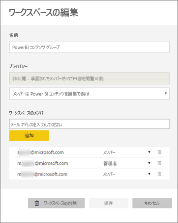
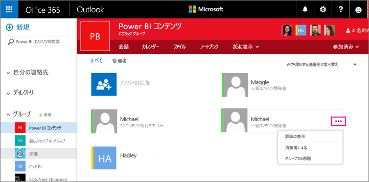
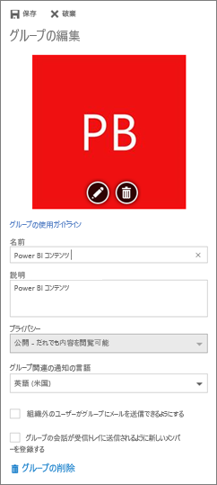

# Power BI と Office 365 でアプリ ワークスペースを管理する
Office 365 または [Power BI でのアプリ ワークスペース](service-install-use-apps.md)の作成者または管理者として、Power BI でワークスペースの一部の側面を管理します。 その他の側面は、Office 365 で管理します。 

**Power BI** では、次のことができます。

* アプリ ワークスペース メンバーを追加または削除します (ワークスペース メンバーを管理者にすることもできます)。
* アプリ ワークスペース名を編集します。
* アプリ ワークスペースを削除します。

**Office 365** では、次のことができます。

* アプリ ワークスペースのグループ メンバーを追加または削除します (メンバーを管理者にする操作も含まれます)。
* グループ名、画像、説明、およびその他の設定を編集します。
* グループの電子メール アドレスを参照します。
* グループを削除します。

アプリ ワークスペースの管理者またはメンバーになるには、[Power BI Pro](service-free-vs-pro.md) ライセンスが必要です。 アプリ ワークスペースが Power BI Premium 容量にない場合は、アプリ ユーザーにも Power BI Pro ライセンスが必要です。 ビジネス ユーザーは、代わりに Power BI 無料ライセンスを使用して、アプリにアクセスできます。 詳しくは、[Power BI Premium](service-premium.md) に関するページをご覧ください。

## Power BI でアプリ ワークスペースを編集する
1. Power BI サービスで、**[ワークスペース]** の横にある矢印を選択し、目的のワークスペース名の横にある省略記号 (**…**) を選択して、**[ワークスペースの編集]** を選択します。 
   
   
   
   > [!NOTE]
   > アプリ ワークスペース管理者の場合は、**[Edit workspace (ワークスペースの編集)]** のみが表示されます。
   > 
   > 
2. ここでは、メンバーの名前を変更したり、メンバーを追加または削除したり、アプリ ワークスペースを削除したりできます。 
   
   
3. **[保存]** または **[キャンセル]** を選びます。

## Office 365 で Power BI アプリ ワークスペースのプロパティを編集する
1. Power BI サービスで、**[ワークスペース]** の横にある矢印を選択し、目的のワークスペース名の横にある省略記号 (**…**) を選択して、**[メンバー]** を選択します。 
   
   
   
   サインインすると、アプリ ワークスペースの Outlook for Office 365 グループ ビューが開きます。
   
   会社のアカウントにサインインする必要があります。
2. メンバーの名前の横にある省略記号 (**[...]**) をタップして、メンバーを管理者にしたり、メンバーをアプリ ワークスペースから削除したりできます。 
   
   

## イメージを追加して Office 365 グループでその他のワークスペースのプロパティを設定する
アプリ ワークスペースからアプリを配布するときに、ここで追加したイメージは、アプリのイメージになります。 「[Power BI でのアプリの作成および配布](service-create-distribute-apps.md)」の「[アプリに画像を追加する](service-create-distribute-apps.md#add-an-image-to-your-app-optional)」を参照してください。

1. アプリ ワークスペースの Outlook for Office 365 ビューで、グループ ワークスペース プロパティを編集するグループ イメージを選択します。
   
   
2. ここで名前、説明、言語を編集し、イメージを追加し、その他のプロパティを設定できます。
   
   
3. **[保存]** または **[破棄]** を選択します。

## 次の手順
* [Power BI のアプリについて](service-install-use-apps.md)
* [Power BI でアプリとアプリ ワークスペースを作成する](service-create-distribute-apps.md)
* 他にわからないことがある場合は、 [Power BI コミュニティを利用してください](http://community.powerbi.com/)。

