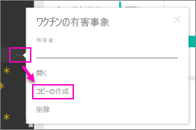

# 組織のコンテンツ パック: コピー、更新、アクセスする

組織のコンテンツ パックが発行されると、すべての受信者は同じダッシュボード、レポート、Excel ブック、データセット、データ (SQL Server Analysis Services (SSAS) データ ソースを除く) を参照します。  コンテンツ パックは、[作成者のみが編集および再発行する](service-organizational-content-pack-manage-update-delete.md)ことができます。  ただし、すべての受信者は、コンテンツ パックのコピーを保存し、オリジナルと共に保持できます。

コンテンツ パックの作成は、ダッシュ ボードを共有すること、またはグループ内でダッシュボードで共同作業を行うこととは異なります。 状況に応じた最適なオプションを決定するには、「[How should I collaborate on and share dashboards and reports?](service-how-to-collaborate-distribute-dashboards-reports.md)」(ダッシュボードとレポートで共同作業と共有を行う方法) を参照してください。

> [!NOTE]
> 新しいワークスペース エクスペリエンス プレビューでは、組織のコンテンツ パックを作成したり、インストールしたりすることはできません。 コンテンツ パックをアプリにまだアップグレードしていない場合は、今がそのよい機会です。 新しいワークスペース エクスペリエンスの詳細については、[こちら](service-create-the-new-workspaces.md)を参照してください。
> 

## 組織のコンテンツ パックのコピーを作成する
他のユーザーは見ることができない、コンテンツ パックの自分専用のコピーを作成します。

1. コンテンツ パック ダッシュボードの横にある省略記号 ([...]) を選択し、[コピーの作成] を選択します。
   
    
2. **[保存]** を選択します。  

これで、変更可能なコピーができました。 他のユーザーが変更を確認することはありません。

## 大変です。  コンテンツ パックにアクセスできなくなりました。
これは、いくつかの理由で発生します。

* **メンバーシップの変更:** コンテンツ パックはメールの配布グループ、セキュリティ グループ、[Office 365 に基づく Power BI グループ](https://support.office.com/article/Create-a-group-in-Office-365-7124dc4c-1de9-40d4-b096-e8add19209e9)に対して発行されます。  ユーザーがグループから削除されると、以降はコンテンツ パックにアクセスできません。
* **配布の変更**: コンテンツ パックの作成者が配布を変更します。 たとえば、元々組織全体に発行されていたコンテンツ パックを、作成者が少数の対象ユーザーに再発行し、その対象からユーザーが除外された場合などです。
* **セキュリティ設定の変更**: ダッシュボードとレポートがオンプレミスの SSAS のデータ ソースに接続している場合に、セキュリティの設定を変更すると、そのサーバーへのアクセス許可が取り消される可能性があります。

## 組織のコンテンツ パックの更新方法
コンテンツ パックの作成時には、更新設定がデータセットと一緒に継承されます。  コンテンツ パックのコピーを作成しても、新しいバージョンでは、元のデータセットへのリンクおよびその更新スケジュールが保持されます。 

「[組織のコンテンツ パックを管理、更新、削除する](service-organizational-content-pack-manage-update-delete.md)」を参照してください。

## 次の手順
* [組織のコンテンツ パックの概要](service-organizational-content-pack-introduction.md)
* [Power BI でのグループの作成](service-create-distribute-apps.md)
* 他にわからないことがある場合は、 [Power BI コミュニティを利用してください](http://community.powerbi.com/)。

