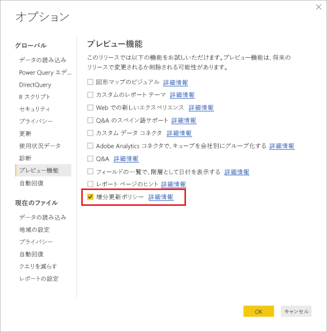
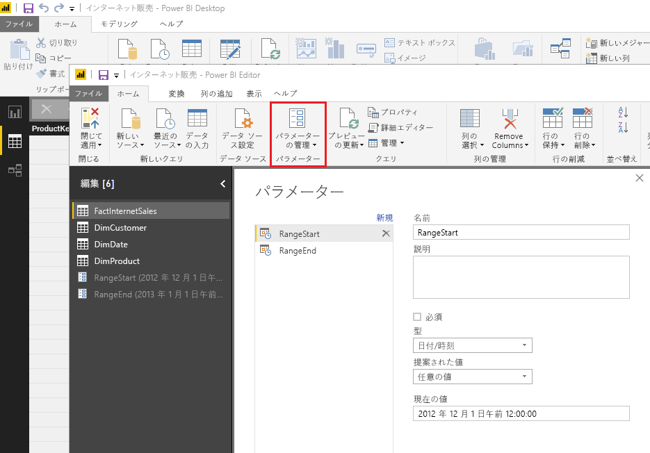
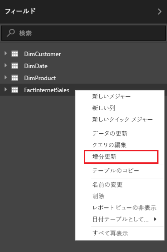
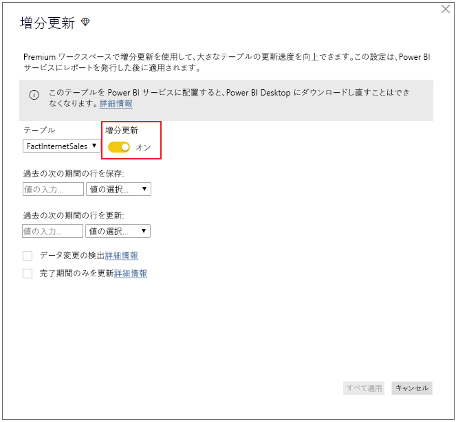
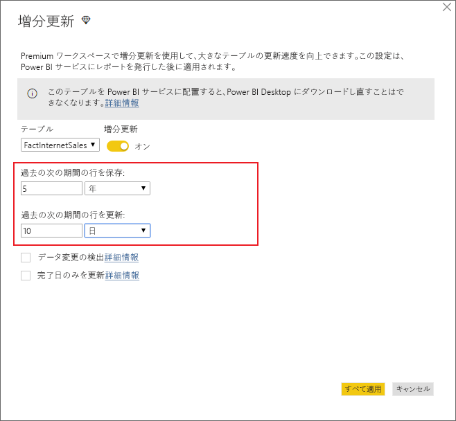
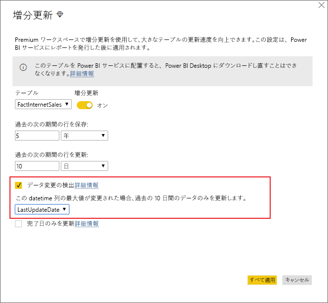
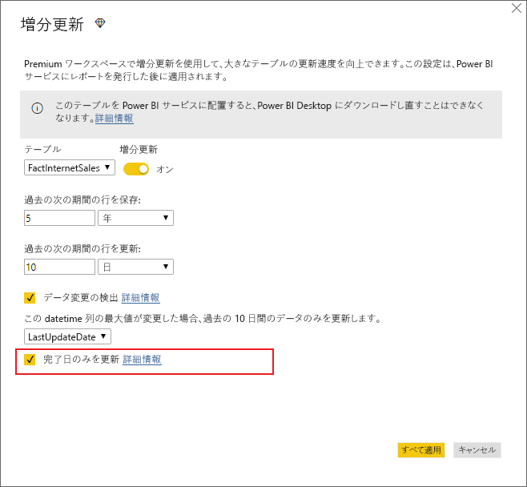
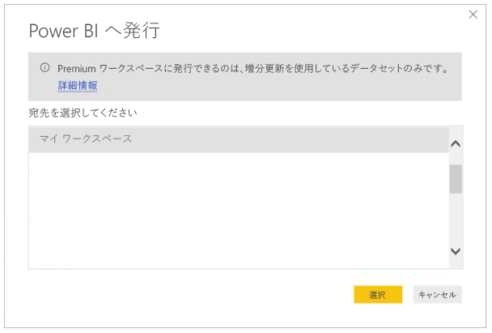

# <a name="incremental-refresh-in-power-bi-premium"></a>Power BI Premium での増分更新

増分更新により Power BI Premium サービスで非常に大きいデータセットを有効にすると次の利点があります。

- **更新が速くなります。** 変更されたデータだけを更新する必要があります。 たとえば、10 年間のデータセットのうち過去 5 日間だけを更新します。

- **更新の信頼性が高くなります。** たとえば、揮発性のソース システムに対して長時間の接続を維持する必要がありません。

- **リソースの消費量が減ります。** 更新するデータが少ないと、メモリや他のリソースの全体的な消費量が減少します。

## <a name="how-to-use-incremental-refresh"></a>増分更新を使用する方法

増分更新ポリシーは、Power BI Desktop で定義され、発行されると Power BI サービスに適用されます。

最初に、プレビュー機能で増分更新を有効にします。



### <a name="filter-large-datasets-in-power-bi-desktop"></a>Power BI Desktop で大きいデータセットをフィルター処理する

通常、Power BI Desktop はユーザーのデスクトップ PC で利用可能なリソースによって制限されるため、数十億行になる可能性のある大きいデータセットは収まらない場合があります。 したがって、そのようなデータセットは、一般に、Power BI Desktop に収まるようにインポート時にフィルター処理されます。 これは、増分更新を使用するかどうかには関係ありません。

#### <a name="rangestart-and-rangeend-parameters"></a>RangeStart パラメーターと RangeEnd パラメーター

Power BI サービスで増分更新を利用するには、予約済みの大文字と小文字が区別される名前 **RangeStart** と **RangeEnd** で、Power Query の日付/時刻パラメーターを使用してフィルター処理を行う必要があります。

発行すると、パラメーター値は Power BI サービスによって自動的にオーバーライドされます。 サービスのデータセットの設定で設定する必要はありません。
 
更新操作のためにクエリが送信されるときに、フィルターがソース システムにプッシュされることが重要です。 つまり、データ ソースが「クエリの折りたたみ」をサポートする必要があります。 各データ ソースにはさまざまなレベルのクエリの折りたたみのサポートが用意されているため、ソースのクエリにフィルター ロジックが含まれていることを確認することをお勧めします。 これが発生しない場合、クエリはソースからすべてのデータを要求します。これは、増分更新のオブジェクトに優先されます。
 
フィルターは、Power BI サービスの範囲にデータをパーティション分割するために使用されます。 フィルター処理されたデータ列の更新をサポートするようには設計されていません。 更新は、(更新ではなく) 挿入と削除 として解釈されます。 削除が増分の範囲でなく、履歴の範囲で発生する場合は、ピックアップされません。

Power Query エディターで **[パラメーターの管理]** を選び、既定値でパラメーターを定義します。



パラメーターを定義すると、列の **[カスタム フィルター]** メニュー オプションを選択してフィルターを適用することができます。


列の値が "**RangeStart***以降で***RangeEnd** *より前*" になるように、行がフィルター処理されることを確認します。


> [!TIP]
> パラメーターのデータ型は日付/時刻でなければなりませんが、データ ソースの要件に合うように変換できます。 たとえば、次の Power Query 関数は、*yyyymmdd* という形式の整数代理キーと同じように日付/時刻値を変換します。これは、データ ウェアハウスの一般的な形式です。 この関数は、フィルター手順から呼び出すことができます。
>
> `(x as datetime) => Date.Year(x)*10000 + Date.Month(x)*100 + Date.Day(x)`

Power Query エディターで **[適用して閉じる]** を選びます。 Power BI Desktop にデータセットのサブセットが存在する必要があります。

### <a name="define-the-refresh-policy"></a>更新ポリシーを定義する

増分更新は、ライブ接続モデルを除く、テーブルのコンテキスト メニューで使用できます。



#### <a name="incremental-refresh-dialog"></a>[増分更新] ダイアログ

[増分更新] ダイアログが表示されます。 トグルを使用してダイアログを有効にします。



> [!NOTE]
> テーブルに対する Power Query の式が予約された名前のパラメーターを参照していない場合は、トグルが無効になっています。

ヘッダー テキストでは次のことが説明されています。

-   増分更新は、Premium 容量のワークスペースについてのみサポートされます。 更新ポリシーは Power BI Desktop で定義され、サービスの更新操作によって適用されます。

-   Power BI サービスから増分更新ポリシーを含む PBIX ファイルをダウンロードできる場合、Power BI Desktop では開きません。 近日中には、まったくダウンロードできなくなります。 これは将来的にはサポートされる可能性がありますが、これらのデータセットは非常に大きくなる可能性があり、標準的なデスクトップ PC 上でダウンロードして開くことは実際的ではないということに注意してください。

#### <a name="refresh-ranges"></a>更新範囲

次の例では、合計で 5 年分のデータを格納し、10 日間のデータを増分更新するように更新ポリシーを定義します。 データセットを毎日更新する場合は、更新操作ごとに次のことが行われます。

-   新しい日のデータが追加されます。

-   現在の日付までの 10 日分が更新されます。

-   現在の日付より 5 年以上前のデータが削除されます。 たとえば、今日の日付が 2019 年 1 月 1 日の場合は、2013 年が削除されます。

Power BI サービスの最初の更新では、5 年間のすべてをインポートするのに長くかかる可能性があります。 その後の更新は、わずかな時間で完了する可能性があります。



**これらの範囲の定義がすべて必要な場合は、後の発行操作にすぐに進むことができます。追加のドロップダウンは高度な機能用です。**

### <a name="advanced-policy-options"></a>高度なポリシーのオプション

#### <a name="detect-data-changes"></a>データ変更の検出

10 日の増分更新は、もちろん 5 年間の完全更新より効率的です。 しかし、それをさらに効率的に実行できる場合があります。 **[データ変更の検出]** チェック ボックスをオンにすると、識別に使用する日付/時刻列を選択して、データが変更された日だけを更新することができます。 この場合、そのような列がソース システムに存在するものとします。一般的にこれは監査目的です。 **RangeStart パラメーターや RangeEnd パラメーターでデータをパーティション分割するために使用される列と同じ列にはしないでください。** この列の最大値が、増分範囲の各期間に対して評価されます。 前回の更新以降変更されていない場合、その期間を更新する必要はありません。 例では、増分更新される日数がさらに 10 日から 2 日に減るはずです。



> [!TIP]
> 現在の設計では、データの変更を検出する列は永続化されてメモリにキャッシュされる必要があります。 次のいずれかの手法を使ってカーディナリティとメモリ消費量を減らすことを検討することが必要な場合があります。
>
> おそらく Power Query 関数を使って、更新時にこの列の最大値のみを保持します。
>
> 更新頻度の要件で許容されるレベルに有効桁数を減らします。
>
> データ変更検出のカスタム クエリを後で定義できるようにする予定です。 これを使うと、列の値をすべて永続化しなくても済みます。

#### <a name="only-refresh-complete-periods"></a>完了期間のみを更新

たとえば、毎朝午前 4 時に更新を実行するようスケジュールされているものとします。 この 4 時間の間にソース システムに追加されたデータは考慮しないようにする必要があります。 石油ガス業界における 1 日あたりバレル数のような一部のビジネス メトリックでは、部分的な日には意味がありません。

別の例としては、前月のデータが 12 日に承認されるような財務システムからのデータ更新があります。 増分の範囲を 1 か月に設定し、12 日に実行するように更新をスケジュールします。 このオプションをオンにすると、たとえば 1 月のデータは 2 月 12 日に更新されます。



> [!NOTE]
> サービスの更新操作は、UTC 時刻で実行されます。 これにより、有効な日付を決定して、完全な期間に影響を与えることができます。 更新操作の有効日をオーバーライドする機能を追加する予定です。

## <a name="publish-to-the-service"></a>サービスへの公開

増分更新は Premium のみの機能であるため、発行ダイアログでは Premium 容量上のワークスペースのみを選択できます。



これで、モデルを更新できるようになりました。 最初の更新は、履歴データをインポートするため長くかかる可能性があります。 その後の更新は、増分更新を使用するため大幅に短縮できます。

## <a name="query-timeouts"></a>クエリのタイムアウト

[更新のトラブルシューティング](https://docs.microsoft.com/power-bi/refresh-troubleshooting-refresh-scenarios)に関する記事では、Power BI サービスでの更新操作がタイムアウトの対象になることが説明されています。 クエリは、データ ソースの既定のタイムアウトによっても制限できます。 ほとんどのリレーショナル ソースでは、M 式でタイムアウトをオーバーライドできます。 たとえば、次の例では、[SQL Server のデータ アクセス関数](https://msdn.microsoft.com/query-bi/m/sql-database)を使って 2 時間に設定しています。 ポリシーの範囲によって定義されている各期間が、コマンド タイムアウトの設定に従ってクエリを送信します。

```
let
    Source = Sql.Database("myserver.database.windows.net", "AdventureWorks", [CommandTimeout=#duration(0, 2, 0, 0)]),
    dbo_Fact = Source{[Schema="dbo",Item="FactInternetSales"]}[Data],
    #"Filtered Rows" = Table.SelectRows(dbo_Fact, each [OrderDate] >= RangeStart and [OrderDate] < RangeEnd)
in
    #"Filtered Rows"
```
