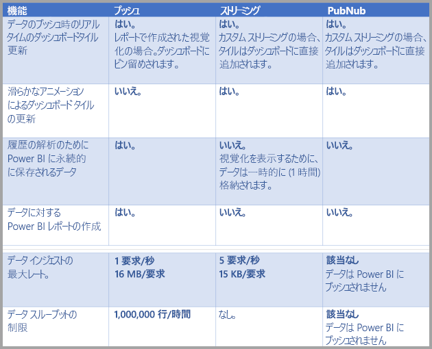
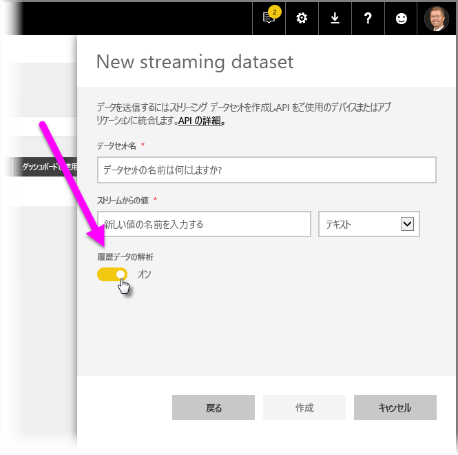
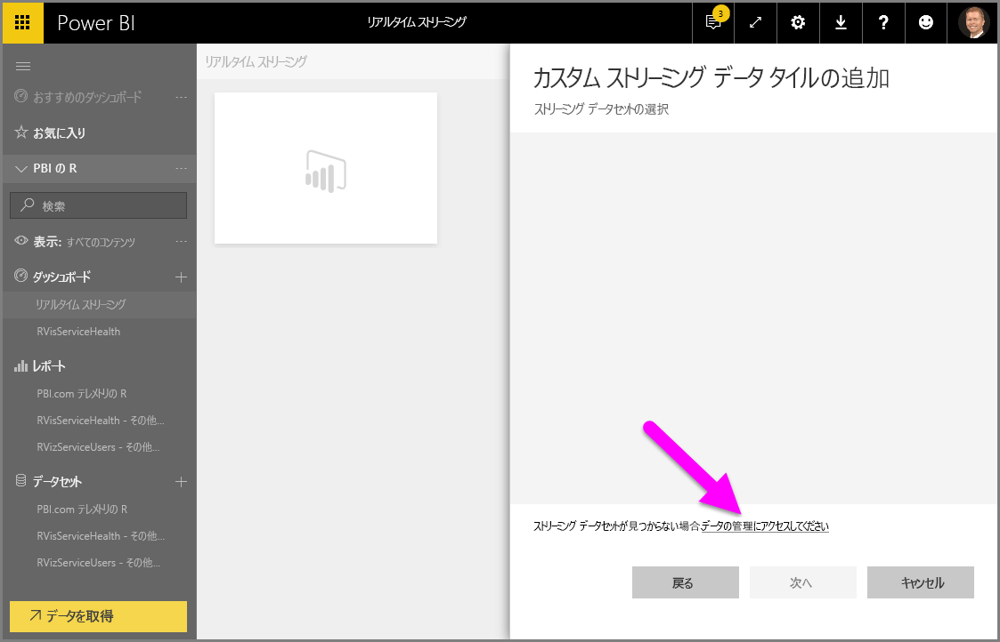
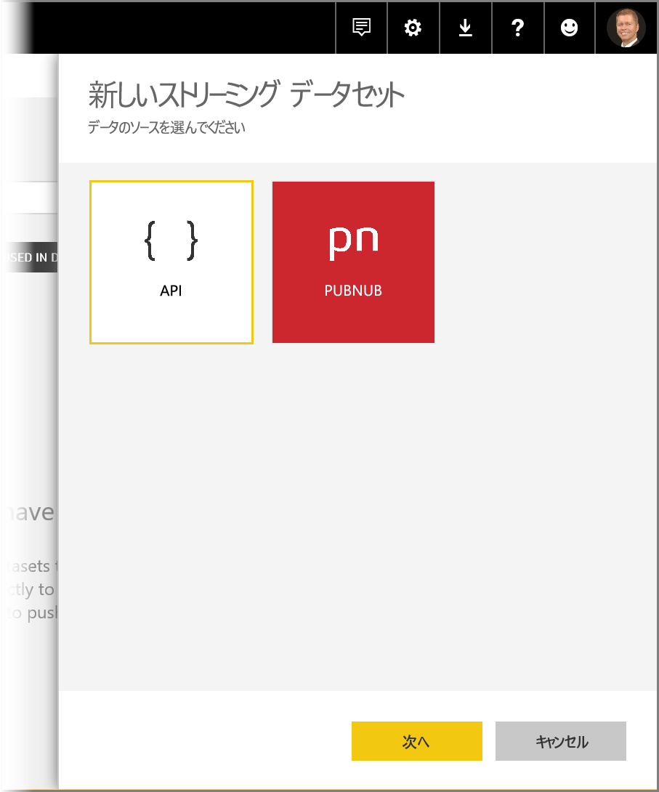
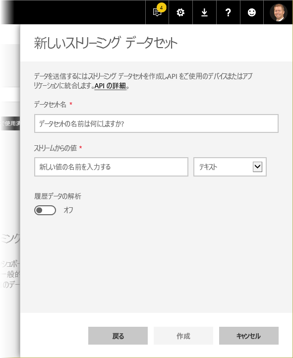
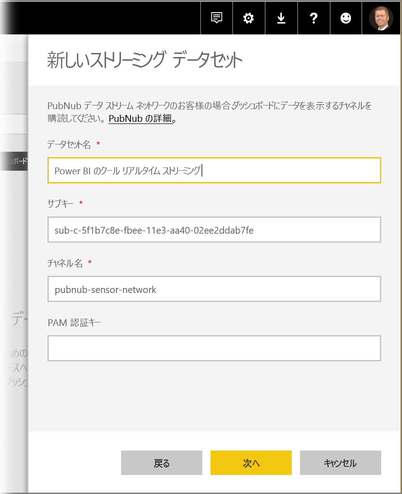
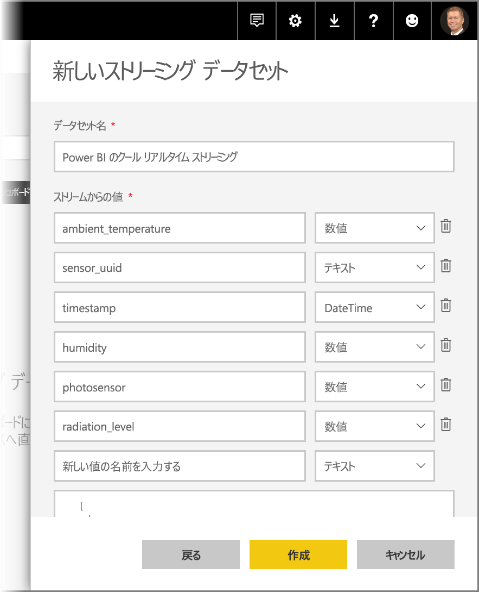

# Power BI のリアルタイム ストリーミング
Power BI のリアルタイム ストリーミングでは、データをストリームし、リアルタイムでダッシュボードを更新できます。 Power BI で作成可能なビジュアルやダッシュボードは、リアルタイムのデータやビジュアルを表示し、更新するためにも作成できます。 工場のセンサー、ソーシャル メディア ソース、サービス利用指標、および時間依存データの回収元または転送元となるあらゆるものがストリーミング データのデバイスとソースになります。

この記事では、Power BI でリアルタイム ストリーミング データセットを設定する方法について説明します。 設定方法に入る前に、タイル (およびダッシュボード) に表示されるように設計されたリアルタイム データセットの種類と、それぞれの違いについて理解しておくことが重要です。

## リアルタイム データセットの種類
リアルタイム ダッシュボードに表示されるように設計されたリアルタイム データセットには、次の 3 種類があります。

* プッシュ データセット
* ストリーミング データセット
* PubNub ストリーミング データセット

まず、各データセットの違いを説明し (このセクションで)、次に、各データセットにデータをプッシュする方法について説明します。

### プッシュ データセット
**プッシュ データセットの場合**、Power BI サービスにデータをプッシュします。 データセットを作成すると、Power BI サービスが、データを格納するための新しいデータベースをサービス内に自動的に作成します。 入力されたデータを継続して保存する基になるデータベースが存在するため、データに関するレポートを作成できます。 これらのレポートとそのビジュアルは、他のレポートのビジュアルとよく似ています。このことは、Power BI のあらゆるレポート作成機能を使用して、カスタム ビジュアル、データ アラート、ピン留めされたダッシュボード タイルなどのビジュアルを作成できることを意味します。

プッシュ データセットを使用してレポートを作成すると、そのビジュアルをどれでもダッシュボードにピン留めすることができます。 ダッシュボード上では、データが更新されるたびにビジュアルにリアルタイムで反映されます。 サービス内では、新しいデータが受信されるたびに、ダッシュボードがタイルの更新をトリガーします。

プッシュ データセットからのピン留めされたタイルについて、次の 2 つの考慮事項に注目してください。

* *[ライブ ページをピン留めする]* オプションを使用してレポート全体をピン留めすると、データは自動的に更新**されません**。
* ビジュアルがダッシュボードにピン留めされたら、**Q&A** を使用して、自然言語でプッシュ データセットに関する質問をすることができます。 **Q&A** クエリを実行したら、結果として生成されたビジュアルをダッシュボードに再びピン留めすることができます。そのダッシュボード *も* リアルタイムで更新されます。

### ストリーミング データセット
**ストリーミング データセットの場合**も、データは Power BI サービスにプッシュされます。ただし、重要な相違点があります。それは、Power BI がデータを一時的なキャッシュ (すぐに有効期限が切れる) に格納するだけであるということです。 一時的なキャッシュは、1 時間の時間枠を持つ折れ線グラフなど、履歴が一時的に意味をなすビジュアルを表示する場合にのみ使用されます。

**ストリーミング データセット**の場合、基になるデータベースは *ありません* ので、ストリームから流れ込むデータを使用してレポートのビジュアルを作成することは *できません* 。 そのため、フィルター処理、カスタム ビジュアル、その他のレポート関数など、レポート機能を利用することはできません。

ストリーミング データセットを視覚化する唯一の方法は、タイルを追加し、ストリーミング データセットを**カスタム ストリーミング データ**のデータ ソースとして使用することです。 **ストリーミング データセット**に基づくカスタム ストリーミング タイルは、リアルタイムのデータをすばやく表示できるように最適化されます。 Power BI サービスにデータがプッシュされてからビジュアルが更新されるまでの待機時間はほとんどありません。これは、データをデータベースに入力したりデータベースから読み取ったりする必要がないからです。

実際には、ストリーミング データセットとそれに付随するストリーミング ビジュアルは、データのプッシュからデータの視覚化までの待機時間を最小限に抑えることが重要な状況で使用するのが最適です。 また、追加の集計を行うことなく、そのまま視覚化することができる形式でデータをプッシュすることをお勧めします。 そのままで視覚化できるデータの例としては、温度や事前に計算された平均値などがあります。

### PubNub ストリーミング データセット
**PubNub** ストリーミング データセットの場合は、Power BI Web クライアントが PubNub SDK を使用して既存の PubNub データ ストリームを読み取ります。Power BI サービスによるデータの保存は行われません。

**ストリーミング データセット**と同様に、**PubNub ストリーミング データセット**の場合も、Power BI に基になるデータベースはありません。よって、流れ込んだデータに対してレポートのビジュアルを作成したり、フィルター処理、カスタム ビジュアルなどのレポート機能を活用したりすることはできません。 そのため、**PubNub ストリーミング データセット**を視覚化するには、ダッシュボードにタイルを追加し、PubNub データ ストリームをソースとして構成するしかありません。

**PubNub ストリーミング データセット**に基づくタイルは、リアルタイムのデータをすばやく表示できるように最適化されます。 Power BI は PubNub データ ストリームに直接的に接続されるため、Power BI サービスにデータがプッシュされてからビジュアルが更新されるまでの待機時間はほとんどありません。

### ストリーミング データセットのマトリックス
次の表 (またはマトリックス) は、リアルタイム ストリーミング用の 3 種類のデータセットを示し、それぞれの機能と制限事項について一覧表示したものです。

> [!NOTE]
> プッシュ可能なデータ量を規定した**プッシュ**制限については、[こちらの MSDN 記事](https://msdn.microsoft.com/library/dn950053.aspx)を参照してください。
> 
> 

## データセットにデータをプッシュする
前のセクションでは、リアルタイム ストリーミングで使用できる主な 3 種類のリアルタイム データセットと、それぞれの相違点について説明しました。 このセクションでは、それらのデータセットを作成し、データをプッシュする方法について説明します。

データセットにデータをプッシュする方法には、次の 3 通りがあります。

* Power BI REST API を使用する
* ストリーミング データセット UI を使用する
* Azure Stream Analytics を使用する

これらの方法を順番に見てみましょう。

### Power BI REST API を使用してデータをプッシュする
**Power BI REST API** を使用すると、**プッシュ** データセットや**ストリーミング** データセットを作成し、データを送信することができます。 Power BI REST API を使用してデータセットを作成する場合は、*defaultMode* フラグによって、データセットの種類をプッシュまたはストリーミングのいずれにするかを指定します。 *defaultMode* フラグが設定されていない場合、データセットは既定では**プッシュ** データセットに設定されます。

*defaultMode* の値が *pushStreaming* に設定されている場合、データセットは、 **プッシュ** *と* **ストリーミング** を併せ持つデータセットとなり、両方のデータセットの種類の利点が得られます。 REST API の[ **[データセットの作成]** に関する記事](https://msdn.microsoft.com/library/mt203562.aspx)では、ストリーミング データセットの作成方法を説明し、*defaultMode* フラグの動作を示します。

> [!NOTE]
> *defaultMode* フラグが *pushStreaming* に設定されたデータセットを使用すると、要求のサイズが**ストリーミング** データセットの 15 KB サイズ制限を超えているが、**プッシュ** データセットの 16 KB サイズ制限内に収まっている場合、要求は成功し、プッシュ データセット内でデータが更新されます。 ただし、ストリーミング タイルは一時的に失敗します。
> 
> 

データセットが作成されたら、[こちらの記事](https://msdn.microsoft.com/library/mt203561.aspx)に説明されているように、REST API の [**[行の追加]** API](https://msdn.microsoft.com/library/mt203561.aspx) を使用してデータをプッシュします。

REST API に対する要求はすべて、**Azure AD OAuth** によってセキュリティが保護されます。

### ストリーミング データセット UI を使用する
Power BI サービスでは、次の図に示すように **API** による方法を選択してデータセットを作成できます。

新しいストリーミング データセットを作成する場合は、下図に示すように **[履歴データの解析]** を有効にするオプションを選択することができます。これは、動作に大きく影響します。

**[履歴データの解析]** が無効になっている場合 (既定では無効)、この記事で前述したように**ストリーミング データセット**を作成します。 **[履歴データの解析]** が *有効* になっている場合、作成されるデータセットは、 **ストリーミング データセット** と **プッシュ データセット** を併せ持つものとなります。 これは、Power BI REST API で、 *defaultMode* を *pushStreaming* に設定してデータセットを作成する方法 (前記参照) と同じです。

> [!NOTE]
> Power BI サービス UI を使用して作成されるストリーミング データセットの場合、前の段落で説明したように Azure AD 認証は必要ありません。 このようなデータセットでは、データセットの所有者に rowkey 付きの URL が送信されます。これにより、Azure AD OAuth ベアラー トークンを使用することなく、データセットへのデータのプッシュを求める要求者が承認されます。 ただし、Azure AD (AAD) による方法を使用してデータセットにデータをプッシュすることもできます。
> 
> 

### Azure Stream Analytics を使用してデータをプッシュする
**Azure Stream Analytics** (ASA) 内に Power BI を出力として追加し、それらのデータ ストリームを Power BI サービスでリアルタイムで視覚化することができます。 このセクションでは、そのプロセスの実行方法について技術的に詳しく説明します。

Azure Stream Analytics では、Power BI REST API を使用し、 *defaultMode* を *pushStreaming* に設定して、Power BI への出力データ ストリームを作成します ( *defaultMode* の詳細については、この記事の前のセクションを参照)。これにより、 **プッシュ** と **ストリーミング** の両方を活用できるデータセットが作成されます。 データセットの作成時に、Azure Stream Analytics はまた、**retentionPolicy* フラグを *basicFIFO* に設定します。この設定の場合、プッシュ データセットをサポートしているデータベースは最大で 200,000 の行を格納します。この行数を超えると、先入れ先出し (FIFO) 方式で行が削除されます。

> [!CAUTION]
> Azure Stream Analytics クエリによって、Power BI への出力が非常に高速で生成される場合 (たとえば、1 秒あたり 1 回または 2 回)、Azure Stream Analytics はそれらの出力を単一の要求にバッチ処理します。 これにより、要求サイズがストリーミング タイルの制限を超える場合があります。 その場合は、前のセクションで説明したように、ストリーミング タイルのレンダリングが失敗します。 このような場合は、Power BI へのデータ出力の速度を遅くすることをお勧めします。たとえば、毎秒の最大値を、10 秒間での最大値に設定します。
> 
> 

## Power BI でリアルタイム ストリーミング データセットを設定する
リアルタイム ストリーミング用の主な 3 種類のデータセットについて、またデータセットにデータをプッシュする主な 3 通りの方法について説明しましたので、Power BI でリアルタイム ストリーミング データセットを操作してみましょう。

リアルタイム ストリーミングを開始するには、ストリーミング データを Power BI で利用する 2 通りの方法のうちの 1 つを選択する必要があります。

* ストリーミング データから作成される**タイル**とビジュアル
* Power BI の残るストリーミング データから作成される**データセット**

いずれを選択した場合でも、Power BI で**ストリーミング データ**を設定する必要があります。 これを設定するには、ダッシュボードで (既存のダッシュボードまたは新しいダッシュボード)、**[タイルを追加]** を選択し、**[カスタム ストリーミング データ]** を選択します。

ストリーミング データをまだ設定していなくても問題ありません。**[データの管理]** を選択して開始できます。

このページでは、ストリーミング データを既に作成している場合、(テキスト ボックスに) そのエンドポイントを入力できます。 ストリーミング データセットをまだ用意していない場合、右上隅のプラス記号アイコン ( **+** ) を選択すると、ストリーミング データセットの作成オプションが表示されます。

**+** アイコンをクリックすると、2 つのオプションが表示されます。

次のセクションでは、この 2 つのオプション、ストリーミング **タイル**の作成方法、ストリーミング データ ソースから (後にレポートの作成に利用できる) **データセット**を作成する方法について説明します。

## 最適なオプションでストリーミング データセットを作成する
Power BI で利用し、視覚化できるリアルタイム ストリーミング データ フィードの作成方法には 2 通りあります。

* リアルタイム ストリーミング エンドポイントを利用する **Power BI REST API**
* **PubNub**

次のセクションでは、この 2 つのオプションについて説明します。

### POWER BI REST API を使用する
**Power BI REST API** - Power BI REST API は機能強化され、開発者にとってリアルタイム ストリーミングが簡単になりました。 **[新しいストリーミング データセット]** ウィンドウで **[API]** を選択すると、ストリーミング データセットを作成し、Power BI を有効にしてエンドポイントを使用できます。

このデータ ストリーム経由で送信されるデータを保存するように Power BI を設定するには、*[履歴データの解析]* を有効にします。集めたデータ ストリームでレポート作成や分析を実行できます。 API に関する説明は[ここ](https://msdn.microsoft.com/library/dn877544.aspx)にあります。

データ ストリームを作成すると、REST API URL エンドポイントが与えられます。これは *POST* 要求を利用し、作成した Power BI **ストリーミング データ** データセットにデータをプッシュすることで呼び出せます。

*POST* 要求を行う際に、要求本文が Power BI ユーザー インターフェイスで提供されるサンプルの JSON と一致していることを確認する必要があります。 たとえば、配列で JSON オブジェクトをラップします。

### PubNub を使用する
**PubNub** ストリーミングと Power BI を統合すると、待機時間の短い **PubNub** データ ストリームを使用し (あるいは新規作成し)、それを Power BI で使用できます。 **[PubNub]** を選択し、**[次へ]** を選択すると、次のウィンドウが表示されます。

> [!WARNING]
> PubNub Access Manager (PAM) の認証キーを使って、PubNub チャネルを保護することができます。 このキーは、ダッシュボードにアクセスできるすべてのユーザーと共有されます。 [PubNub のアクセス制御の詳細に関するページ](https://www.pubnub.com/docs/web-javascript/pam-security)をご覧ください。
> 
> 

多くの場合、**PubNub** データ ストリームは大量であり、元の形式ではストレージや履歴分析に適しているとは限りません。 PubNub データの履歴分析に Power BI を使用するには、生の PubNub ストリームを集計し、Power BI に送信する必要があります。 それを行う 1 つの方法が [Azure Stream Analytics](https://azure.microsoft.com/services/stream-analytics/) の利用です。

## Power BI におけるリアルタイム ストリーミングの使用例
Power BI におけるリアルタイム ストリーミングの動作は、簡単に説明すると次の例のようになります。 このサンプルを通して見ると、リアルタイム ストリーミングの価値がわかります。

このサンプルでは、**PubNub** で一般公開されているストリームを使用しています。 この手順を以下に示します。

1. **[Power BI サービス]** で、ダッシュボードを選択し (または新しく作成し)、**[タイルを追加]** > **[カスタム ストリーミング データ]** を選択し、**[次へ]** ボタンを選択します。
   
   
2. ストリーミング データ ソースをまだ用意していない場合、**[データの管理]** リンク (**[次へ]** ボタンの真上) を選択し、ウィンドウの右上にあるリンクから **[+ Add streaming data]** (+ ストリーミング データの追加) を選択します。 **[PubNub]** を選択し、**[次へ]** を選択します。
3. データセットの名前を作成し、表示されたウィンドウに次の値を貼り付け、**[次へ]** を選択します。
   
   *購読キー:*
   
       sub-c-5f1b7c8e-fbee-11e3-aa40-02ee2ddab7fe
   *チャネル:*
   
       pubnub-sensor-network
   
   
4. 次のウィンドウでは既定値 (自動的に入力されます) を選択し、**[作成]** をクリックします。
   
   
5. Power BI ワークスペースに戻り、新しいダッシュボードを作成し、タイルを追加します (上記の手順を参照してください)。 タイルを作成し、**[カスタム ストリーミング データ]** を選択すると、ストリーミング データが与えられます。 いろいろ試してみてください。 線グラフに *数値* フィールドを追加し、他のタイルを追加すると、次のようなリアルタイム ダッシュボードが完成します。
   
   

サンプルのデータセットでいろいろ試してみてください。 その後は独自のデータセットを作成し、ライブ データを Power BI にストリームしてください。

## 質問と回答
ここでは、Power BI のリアルタイム ストリーミングに関してよく寄せられる質問とその回答をいくつか紹介します。

#### プッシュ データセットに対してフィルターを使用できますか? PubNub ストリーミング データセットについてはどうですか?
残念ながら、ストリーミング データセットでは、フィルター処理をサポートしていません。 プッシュ データセットの場合は、レポートの作成、レポートのフィルター処理、およびダッシュボードへのフィルター済みビジュアルのピン留めを行うことができます。 ただし、ビジュアルがダッシュボード上にある場合、ビジュアルに対するフィルターを変更する方法はありません。

別途、ライブ レポート タイルをダッシュボードにピン留めすることができます。この場合、フィルターを変更することができます。 ただし、ライブ レポート タイルは、データがプッシュされてもリアル タイムでの更新は行われません。**[詳細]** メニューの *[ダッシュボード タイルの更新]* オプションを使用してビジュアルを手動で更新する必要があります。

ミリ秒の精度を持つ *DateTime* フィールドを使用してプッシュ データセットにフィルターを適用する場合、*等価*演算子はサポートされません。 ただし、大なり (>) や小なり (<) などの演算子は適切に動作します。

#### プッシュ データセットの最新の値を表示するにはどうすればよいですか? PubNub ストリーミング データセットについてはどうですか?
ストリーミング データセットは、最新のデータを表示するように設計されています。 **カード** ストリーミング ビジュアルを使用すると、最新の数値を簡単に確認できます。 残念ながら、カードでは、*DateTime* 型または *テキスト* 型のデータをサポートしていません。
プッシュ データセットの場合、スキーマ内にタイムスタンプがあると仮定すると、最後の N フィルターを使用してレポート ビジュアルの作成を試してみることができます。

#### Power BI Desktop でプッシュ データセットまたはストリーミング データセットに接続できますか?
残念ながら、現時点では接続できません。

#### 前の質問を考慮の上、リアルタイム データセットに対してモデリングを行うにはどうすればよいですか?
データが永続的に保存されないため、ストリーミング データセットに対するモデリングは行えません。 プッシュ データセットの場合、[データセット/テーブルの更新] REST API を使用してメジャーとリレーションシップを追加することができます。 詳細については、[テーブル スキーマの更新に関する記事](https://msdn.microsoft.com/library/mt203560.aspx)および[データセットのプロパティに関する記事](https://msdn.microsoft.com/library/mt742155.aspx)を参照してください。

#### プッシュ データセット上のすべての値をクリアするにはどうすればよいですか? PubNub ストリーミング データセットについてはどうですか?
プッシュ データセットに対して、[行の削除] REST API 呼び出しを使用できます。 別途、REST API のラッパーである便利なツールを使用することもできます。 現在、ストリーミング データセットのデータをクリアする方法はありません。ただし、1 時間が経過すると、データは自動的にクリアされます。

#### Power BI に対する Azure Stream Analytics 出力を設定しましたが、Power BI に表示されません。何が悪いのでしょうか?
この問題をトラブルシューティングするためのチェックリストを次に示します。

1. Azure Stream Analytics ジョブを再起動する (ストリーミング GA リリースの前に作成されたジョブは、再起動が必要)。
2. Azure Stream Analytics で Power BI 接続を再度承認してみる。
3. Azure Stream Analytics 出力でどのワークスペースを指定しましたか? Power BI サービスで、その (同じ) ワークスペースにチェックインしていますか?
4. Azure Stream Analytics クエリは明示的に Power BI に出力していますか? (INTO キーワードを使用)
5. Azure Stream Analytics ジョブには、送信対象のデータがありますか? データセットは、送信されるデータがある場合にのみ作成されます。
6. 警告またはエラーの発生を確認するために、Azure Stream Analytics ログを調べることはできますか?

## 次の手順
Power BI でリアルタイム ストリーミングを使用する場合に役に立ついくつかのリンクを次に示します。

* [リアルタイム データを使用する Power BI REST API の概要](https://msdn.microsoft.com/library/dn877544.aspx)
* [Power BI REST API の制限事項](https://msdn.microsoft.com/library/dn950053.aspx)
* [**[データセットの作成]** に関する REST API の記事](https://msdn.microsoft.com/library/mt203562.aspx)
* [**[行の追加]** Power BI REST API](https://msdn.microsoft.com/library/mt203561.aspx)
* [Azure Stream Analytics](https://azure.microsoft.com/services/stream-analytics/)

