# データセットをインポートすることによって新しい Power BI レポートを作成する
[Power BI のレポート](service-reports.md)を読んで、次は自分のレポートを作成しようと思われるでしょう。 レポートを作成するには、さまざまな方法があります。この記事ではまず、Excel データセットからごく基本的なレポートを作成します。 レポート作成の基本を理解した後、その下にある「**次の手順**」で、より高度なレポートに関するトピックを示します。  

> **ヒント**: 既存のレポートをコピーしてレポートを作成するには、「[Copy a report](power-bi-report-copy.md)」 (レポートをコピーする) を参照してください。
> 
> 

## データセットをインポートする
この方法でのレポート作成は、データセットと空白のレポート キャンバスから始まります。 作業を進めるには、[小売の分析のサンプル Excel データセットをダウンロード](http://go.microsoft.com/fwlink/?LinkId=529778)し、OneDrive for Business (推奨) またはローカルに保存します。

1. Power BI サービスのワークスペースでレポートを作成するので、既存のワークスペースを選択するか、新しいワークスペースを作成します。
   
   
2. 左側のナビゲーション バーの下部にある **[データの取得]** を選択します。
   
   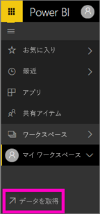
3. **[ファイル]** を選択し、小売りの分析のサンプルを保存した場所に移動します。
   
    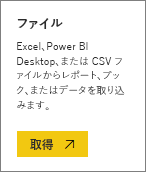
4. この演習では、**[インポート]** を選択します。
   
   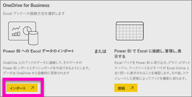
5. データセットをインポートしたら、**[データセットの表示]** を選択します。
   
   
6. データセットを表示すると、実際にはレポート エディターが開きます。  空白のキャンバスとレポート編集ツールが表示されます。
   
   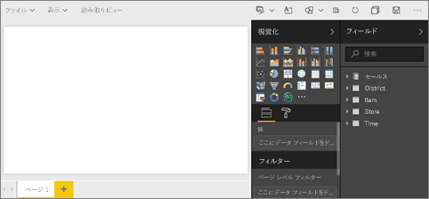

> **ヒント**: レポート編集キャンバスに慣れていない場合や、使い方を思い出す必要がある場合は、作業を進める前に[レポート エディターのツアー](service-the-report-editor-take-a-tour.md)を実行してください。
> 
> 

## レポートに放射状ゲージを追加する
データセットがインポートされたので、質問への回答を始めましょう。  最高マーケティング責任者 (CMO) は、今年の売上目標にどれだけ近づいているかを知りたいと考えています。 ゲージは、このような種類の情報を表示するために[適した視覚化の選択肢](power-bi-report-visualizations.md)です。

1. [フィールド] ウィンドウで、**[Sales (売上)]** > **[This Year Sales (今年の売上)]** > **[値]** を選びます。
   
    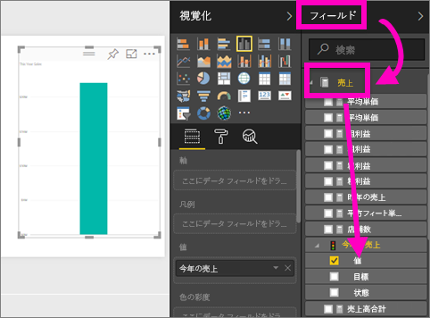
2. ゲージのテンプレート  を **[視覚化]** ウィンドウから選択して、ビジュアルをゲージに変換します。
   
    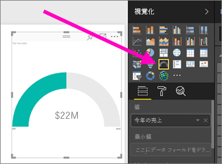
3. **\[Sales] \(売上)** > **\[This Year Sales] \(今年の売上)** > **[目標]** を **[目標値]** にドラッグします。 目標に非常に近づいているようです。
   
    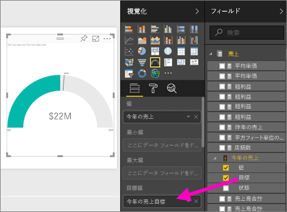
4. このあたりで[レポートを保存](service-report-save.md)するとよいでしょう。
   
   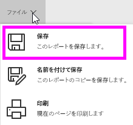

## 面グラフとスライサーをレポートに追加する
CMO に対して、その他いくつかの質問に応える必要があります。 CMO は、昨年と比較して今年の売上がどうであるかを知りたいと考えています。 また、地区ごとの調査結果を見たいと言っています。

1. まず、キャンバスに空き領域を作りましょう。 ゲージを選択し、右上隅に移動します。 次に、四隅のいずれかをつかんでドラッグし、サイズを小さくします。
2. ゲージの選択を解除します。 [フィールド] ウィンドウで、**[Sales (売上)]** > **[This Year Sales (今年の売上)]** > **[値]** を選択し、**[Sales (売上)]** > **[Last Year Sales (昨年の売上)]** を選択します。
   
    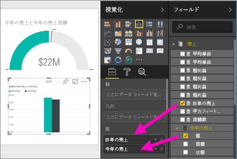
3. 面グラフのテンプレート  を **[視覚化]** ウィンドウから選択し、ビジュアルを面グラフに変換します。
4. **[Time (時間)]** > **[Period (期間)]** を選択して、[Period (期間)] を **[軸]** に追加します。
   
    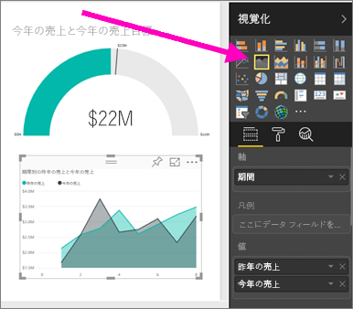
5. 視覚化を並べ替えるには、省略記号を選んで、**[Sort by Period]\(期間別に並べ替え\)** を選びます。
6. 次にスライサーを追加しましょう。 キャンバスの空いている領域を選択して、スライサー  テンプレートを選択します。 これにより、キャンバスに空のスライサーが追加されます。
   
        
7. [フィールド] ウィンドウから **[District (地区)]** > **[District (地区)]** の順に選択します。 スライサーを移動し、サイズを変更します。
   
    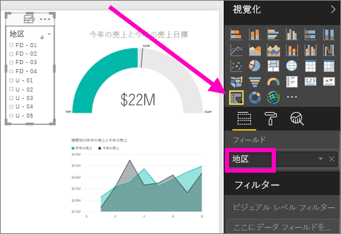  
8. スライサーを使用して地区ごとのパターンや洞察を探します。
   
     
9. 視覚化の追加を続けることもできます。

## 次の手順
* [レポートのコピーを作成](power-bi-report-copy.md)
* [レポートを保存](service-report-save.md)    
* [レポートに新しいページを追加する](power-bi-report-add-page.md)  
* [視覚化をダッシュボードにピン留めする](service-dashboard-pin-tile-from-report.md)方法の詳細    
* 他にわからないことがある場合は、 [Power BI コミュニティを利用してください](http://community.powerbi.com/)。

